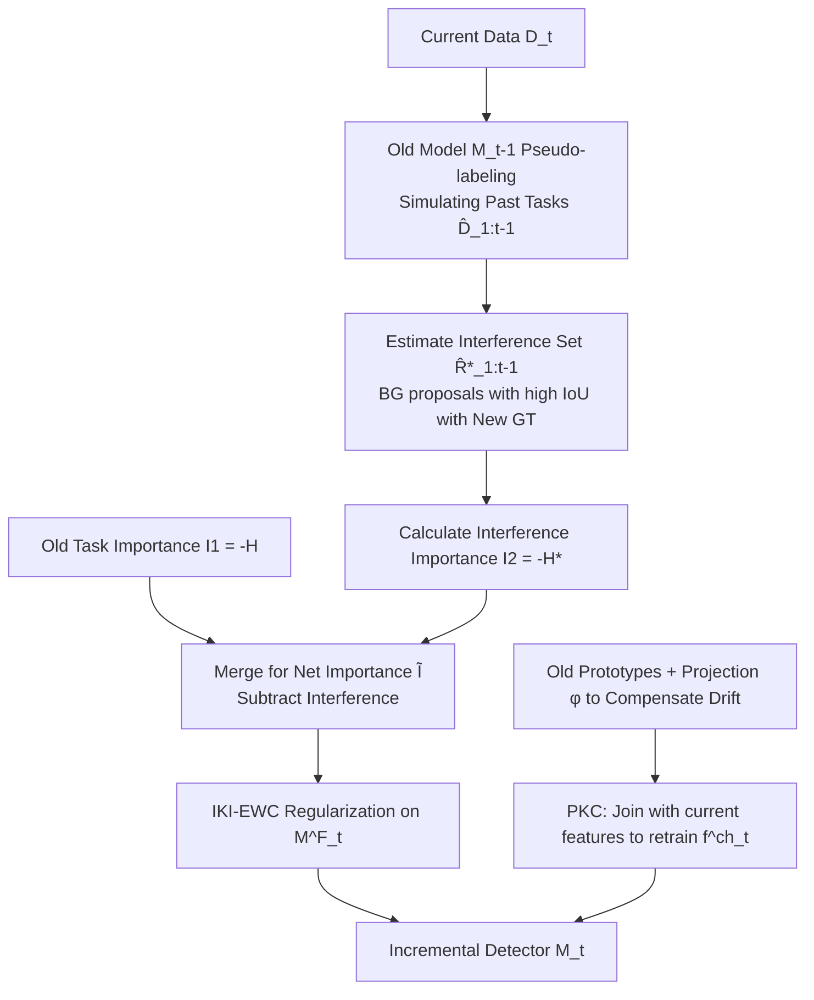

# Interference-Isolated Elastic Weight Consolidation and Knowledge Calibration for Incremental Object Detection

**Conference**: ICLR 2026  
**OpenReview**: [https://openreview.net/forum?id=VrXdmCjni4](https://openreview.net/forum?id=VrXdmCjni4)  
**Code**: TBD  
**Area**: Incremental Object Detection / Continual Learning / Catastrophic Forgetting  
**Keywords**: Incremental Object Detection, Elastic Weight Consolidation, Task Interference, Prototype Calibration, Semantic Drift  

## TL;DR
Addressing the task knowledge conflict caused by "unlabeled past/future targets being treated as background" in Incremental Object Detection (IOD), this paper re-derives the Bayesian posterior of EWC to **explicitly subtract interference knowledge** (IKI-EWC) from parameter importance. It then retrains the classification head using learnable projection layers to compensate for prototype semantic drift (PKC), consistently outperforming SOTA on VOC/COCO.

## Background & Motivation
- **Background**: Incremental Object Detection (IOD) requires detectors to learn new classes continuously without forgetting old ones. Mainstream approaches fall into two categories: knowledge distillation (using old model features/predictions as soft labels) and parameter regularization (constraining important parameters from being overwritten, represented by EWC).
- **Limitations of Prior Work**: Existing methods mostly lack **explicit and quantitative modeling of information conflicts during knowledge preservation**, resulting in blurred task boundaries. IOD is more challenging than standard class-incremental learning because an image may simultaneously contain objects from past, current, and future tasks, where **unlabeled past/future targets are incorrectly learned as background**. Past targets can be mitigated with pseudo-labels from the old model, but **future targets are completely unlabeled and hardest to handle**.
- **Key Challenge**: When applying EWC directly, the old model $M_{t-1}$ has already incorporated the error "future targets = background" into its parameters. EWC faithfully protects these **interference knowledge** points as "important parameters," which exacerbates the conflict between old and new knowledge, leading to more severe forgetting. This fundamentally violates the conditional independence assumption underlying the EWC derivation.
- **Goal**: Without training an additional teacher for the current task (distinguishing from BPF), strip "interference knowledge" from parameter importance through regularization and mitigate semantic drift in the classification head.
- **Core Idea**: **[Isolate Interference]** Estimate task conflict regions using the old detector's misjudgments on new data, re-derive the Bayesian posterior to establish the mathematical relationship between "learned knowledge" and "interference knowledge," and **directionally subtract conflicts** during weight updates. **[Prototype Calibration]** Use a learnable projection layer to compensate for the semantic drift of old class prototypes and retrain the classification head with current features.

## Method

### Overall Architecture
The IIKC framework is built upon Faster R-CNN (ResNet-50 backbone) and consists of two complementary modules: **IKI-EWC** handles parameter regularization for the regional feature extractor $M^F_t$ (backbone + RPN + ROI/FC), while **PKC** independently governs the forgetting in the classification head $f^{ch}_t$. The pipeline first uses the old model $M_{t-1}$ to generate high-confidence pseudo-labels on current data $D_t$ to simulate "past task scenarios." Based on this, it estimates the conflict region set $\hat{R}^*_{1:t-1}$ (where background proposals have high IoU with new class GT) and subtracts it from parameter importance, followed by retraining the classification head with calibrated old prototypes.

### Key Designs

**1. Re-deriving the IOD Posterior: Detaching "False Background."** Standard EWC assumes conditional independence $p(D_t\mid\theta,D_{1:t-1})=p(D_t\mid\theta)$ under sequential learning, simplifying the posterior to $p(\theta\mid D_{1:t})\propto p(D_t\mid\theta)\,p(\theta\mid D_{1:t-1})$. However, this assumption fails in IOD. This paper maps image-level data to proposal-level for fine-grained analysis, defining the **interference set** $R^*_{1:t-1}=\{r\in R^-_{1:t-1}:\exists g\in G_t,\ \mathrm{IoU}(r,g)\ge\gamma\}$, i.e., proposals previously treated as background that actually overlap with new class foreground in stage $t$. After removing them from past data, the data is decomposed as $D_{1:t}=(R_{1:t-1}\setminus R^*_{1:t-1})\cup R_t=R'_{1:t-1}\cup R_t$. Accordingly, the posterior is rewritten as $p(\theta\mid D_{1:t})\propto p(R_t\mid\theta)\,p(\theta\mid R'_{1:t-1})$, ensuring the regularization is based only on **non-conflicting** clean proposals.

**2. Cross-stage Interference Estimation and Analytic Clean Posterior.** The difficulty is that $R'_{1:t-1}$ cannot be calculated in any single stage: $G_t$ is unavailable during stages $1:t-1$, and original $R_{1:t-1}$ is unavailable at stage $t$. The paper approximates it at stage $t$ using $D_t$ and $M_{t-1}$ by generating pseudo-labels to construct a simulated past set $\hat{D}_{1:t-1}$, extracting the background subset $\hat{R}^-_{1:t-1}$, and filtering $\hat{R}^*_{1:t-1}$ via IoU thresholds. Viewing $R_{1:t-1}$ as a mixture of clean and interference subsets, and letting $k=|\hat{R}^*_{1:t-1}|/|\hat{R}'_{1:t-1}|$ measure interference severity, the clean posterior is analytically derived as $p(\theta\mid\hat{R}'_{1:t-1})=(1+k)\,p(\theta\mid R_{1:t-1})-k\,p(\theta\mid\hat{R}^*_{1:t-1})$, without needing to explicitly reconstruct $R'_{1:t-1}$ at the data level.

**3. Parameter Importance Formula with Interference Isolation.** Applying Laplace approximation (Gaussian centered at converged parameters $\theta^*_{t-1}$ with variances defined by Hessians $H, H^*$) to both posteriors, the loss at stage $t$ is $L(\theta)=L^{det}_t(\theta)+\frac{\lambda}{2}\sum_i\tilde{I}_i(\theta_i-\theta^*_{t-1,i})^2$, where the **net importance** is:
$$\tilde{I}_i=\frac{I_{1,i}\,I_{2,i}}{(1+k)^2 I_{2,i}+k^2 I_{1,i}}$$
$I_{1,i}=-H_i$ represents old task importance carrying interference (encourages knowledge retention), and $I_{2,i}=-H^*_i$ represents importance on interference regions (measures parameter sensitivity to conflicting knowledge). This formula relaxes constraints on parameters polluted by interference while strengthening protection for parameters purely carrying old knowledge.

**4. PKC: Projection Layer for Drift Compensation and Head Retraining.** While parameter regularization stabilizes $M^F_t$, it cannot prevent semantic drift in the classification head $f^{ch}_t$. As the feature space changes, old class prototypes become distorted. PKC extracts old class region features from the ROI FC output after the old model finishes training, modeling each class as a Gaussian ($\mu_i, \sigma^2_i$) to obtain prototypes $C$. A linear projection $\phi(f_{t-1})=Wf_{t-1}+b$ is learned to map the old feature space to the new one using $L_{proj}=\sum_{i\in\mathrm{TopK}}\|\phi(f_{t-1,i})-f_{t,i}\|_2^2$, aligning features via the Top-K pairs with minimum L2 distance. After training the projection, old features $f^s$ sampled from Gaussian prototypes are compensated via $\phi$, concatenated with current features $f^t$, and fed into the head for retraining via cross-entropy $L_{ce}$.

## Key Experimental Results

### Main Results: PASCAL VOC 2007 (Two-stage, mAP@0.5)
The gray columns represent the mean AP for all classes (1-20).

| Method | Source | 19-1 | 15-5 | 10-10 | 5-15 |
|------|------|------|------|-------|------|
| Joint Training (Upper Bound) | - | 76.4 | 76.4 | 76.4 | 76.4 |
| ABR* | ICCV'23 | 70.9 | 71.0 | 72.0 | 69.4 |
| GMDP-ABR* | ICLR'25 | 74.6 | 73.2 | 72.7 | 70.7 |
| BPF | ECCV'24 | 74.1 | 72.7 | 72.9 | 73.0 |
| GMDP-ILOD | ICLR'25 | 73.9 | 71.8 | 70.8 | 61.7 |
| **Ours** | - | **75.4** | **73.7** | **75.7** | **75.6** |

\* Indicates the use of exemplar replay. Ours is a **non-replay** method but outperforms BPF by 2.8%/2.6% and replay-based GMDP-ABR by 3.0%/4.9% in the 10-10/5-15 settings.

### Main Results: MS COCO 2017 (COCO-style mAP)

| Method | 40-40 AP / AP50 / AP75 | 70-10 AP / AP50 / AP75 |
|------|----------------------|----------------------|
| BPF (ECCV'24) | 34.4 / 54.3 / 37.3 | 36.2 / 56.8 / 38.9 |
| **Ours** | **35.9 / 55.8 / 38.8** | **37.1 / 57.6 / 40.6** |

In the non-replay setting, average AP is 1.5% (40-40) and 0.9% (70-10) higher than BPF, showing that interference suppression becomes more critical as the number of classes increases.

### Ablation Study (VOC, 1-20 Mean mAP@0.5)

| IKI-EWC | PKC | VOC 10-10 | VOC 10-5 | VOC 5-5 |
|:-------:|:---:|:---------:|:--------:|:-------:|
| – | – | 73.8 | 66.4 | 64.0 |
| ✓ | – | 75.1 | 70.9 | 66.6 |
| – | ✓ | 74.3 | 67.9 | 63.2 |
| ✓ | ✓ | **75.7** | **71.5** | **66.6** |

IKI-EWC is the primary driver (granting +1.3%/+4.5%/+4.0% gains alone). PKC provides additional benefits in long-sequence settings. Hyperparameter ablation shows $\lambda=20, K=32, \gamma=0.5$ are optimal, with $K$ being robust between 2 and 512.

### Key Findings
- Subtracting interference from EWC importance mitigates forgetting significantly compared to naive EWC ($L2$++), which drops to 42.5 on new classes 11-20 in the 10-10 setting.
- In long sequences like 15-1 where "old classes are overwhelmingly dominant," regularization methods tend to assign excessively high importance to old parameters, limiting plasticity. This is the relatively weaker setting for the proposed method.

## Highlights & Insights
- **Mathematizing the "False Background" Problem**: For the first time, the conflict of "unlabeled past/future targets as background" in IOD is mapped to the proposal level and integrated into the Bayesian posterior decomposition, providing a closed-form analytic clean posterior and net importance rather than heuristic weighting.
- **Non-replay and No Extra Teacher**: Compared to BPF which requires training a current task teacher, and ABR/GMDP-ABR which require storing exemplars, the pure parameter regularization approach of this paper is lighter in storage and computation while outperforming replay methods.
- **Divide and Conquer**: The forgetting in the "regional feature extractor" and "classification head" are treated separately via IKI-EWC and PKC, using parameter importance and prototype drift compensation respectively, with clear functional positioning.

## Limitations & Future Work
- **Performance in Single-step Long Sequences (15-1)**: When old classes dominate, regularization suppresses plasticity too strictly, limiting adaptation to new classes, as noted by the authors.
- **Interference Estimation Depends on Pseudo-label Quality**: $\hat{R}^*_{1:t-1}$ relies entirely on the misjudgments of $M_{t-1}$ on $D_t$. If the old model is weak, the interference set estimation will be biased.
- **Future Targets Not Proactively Utilized**: The method focuses on "subtracting errors from parameters" rather than actively exploiting future class information; proactive modeling of unlabeled future classes remains an open problem.
- **Detector Architecture Constraint**: The derivation is based on the two-stage Faster R-CNN; whether proposal-level derivations transfer smoothly to one-stage or query-based detectors like DETR needs verification.

## Related Work & Insights
- **EWC** (Kirkpatrick et al., 2017): Theoretical starting point. The difference lies in explicitly modeling the failure of conditional independence in IOD.
- **BPF** (Mo et al., ECCV'24): Uses dual-teacher distillation to mitigate conflicts; this paper shifts to a parameter regularization perspective, saving teacher overhead.
- **GMDP** (Wang et al., ICLR'25): Uses Gaussian mixture prototypes to align feature distributions; PKC's prototype modeling is similar but used for drift compensation.
- **Insight**: In continual learning, "importance estimation" itself can be polluted by noise or label missing. Explicitly incorporating these conflicts into the importance formula is more fundamental than simply tuning regularization strength.

## Rating
- **Novelty**: ⭐⭐⭐⭐ — Re-writing the "false background conflict" of IOD into the EWC posterior with a closed-form net importance solution is a solid and rare theoretical entry point.
- **Experimental Thoroughness**: ⭐⭐⭐⭐ — Comprehensive VOC two-stage/multi-stage and COCO settings with component and hyperparameter ablations; however, limited to Faster R-CNN without DETR-based validation.
- **Writing Quality**: ⭐⭐⭐⭐ — Clear derivation logic, intuitive figures, and well-connected motivation and formulas.
- **Value**: ⭐⭐⭐⭐ — Achieving SOTA over replay methods without using exemplars or extra teachers is practically valuable for resource-constrained incremental detection.

<!-- RELATED:START -->

## Related Papers

- [\[CVPR 2026\] Parameterized Prompt for Incremental Object Detection](../../CVPR2026/object_detection/parameterized_prompt_for_incremental_object_detection.md)
- [\[AAAI 2026\] YOLO-IOD: Towards Real Time Incremental Object Detection](../../AAAI2026/object_detection/yolo-iod_towards_real_time_incremental_object_detection.md)
- [\[CVPR 2026\] Incremental Object Detection via Future-Aware Decoupled Cross-Head Distillation](../../CVPR2026/object_detection/incremental_object_detection_via_future-aware_decoupled_cross-head_distillation.md)
- [\[CVPR 2026\] RHCNet: Residual-Guided Hierarchical Calibration Network for Robust Underwater Object Detection](../../CVPR2026/object_detection/rhcnet_residual-guided_hierarchical_calibration_network_for_robust_underwater_ob.md)
- [\[ECCV 2024\] On Calibration of Object Detectors: Pitfalls, Evaluation and Baselines](../../ECCV2024/object_detection/on_calibration_of_object_detectors_pitfalls_evaluation_and_baselines.md)

<!-- RELATED:END -->
