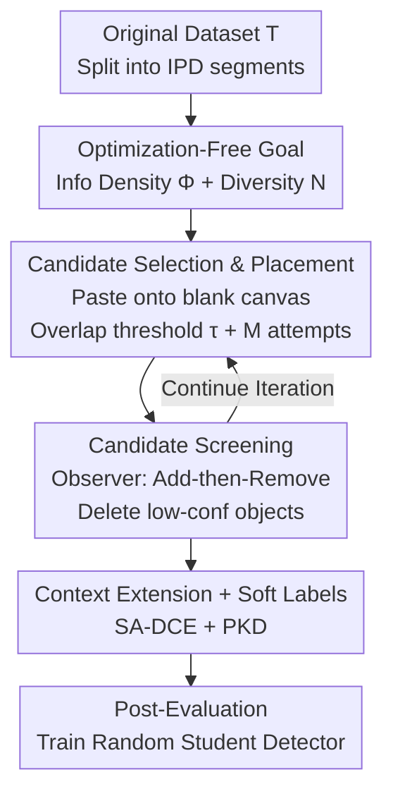

# OD3: Optimization-Free Dataset Distillation for Object Detection

**Conference**: ICLR 2026  
**OpenReview**: [https://openreview.net/forum?id=W6gbWvvovB](https://openreview.net/forum?id=W6gbWvvovB)  
**Code**: https://github.com/VILA-Lab/OD3  
**Area**: Object Detection / Dataset Distillation  
**Keywords**: Dataset Distillation, Object Detection, Optimization-Free Synthesis, Knowledge Distillation, Soft Labels

## TL;DR
OD3 extends dataset distillation from image classification to object detection by proposing a **completely optimization-free** synthesis pipeline. Starting from a blank canvas, it iteratively pastes real objects (candidate selection) and uses a pre-trained observer model to filter out low-confidence objects (candidate screening). Combined with channel-level soft labels to train student detectors, OD3 achieves a mAP50 14.8% higher than the previously sole detection distillation method, DCOD, at a 1% compression rate on COCO.

## Background & Motivation
**Background**: Dataset Distillation (DD) aims to compress a large dataset into a small set of synthetic images such that models trained on these synthetic images approximate the performance of those trained on the full dataset. However, almost all DD works focus on **image classification**, where each image contains one primary subject and one label, requiring only the embedding of high-level semantic information of the category into pixels during synthesis.

**Limitations of Prior Work**: Object detection is significantly more challenging. An image contains multiple instances of different categories, requiring the prediction of both **categories** and **bounding box locations**. Supervision signals are spatial annotations rather than image-level labels. Direct application of classification distillation methods is ineffective. Optimization-based distillation (such as Fetch-and-Forge in DCOD) depends on pixel-wise gradient updates, which are slow and struggle to preserve object geometry and context. Coreset selection methods, while training-free, typically only work at compression rates above 20%, falling short of extreme compression targets.

**Key Challenge**: Detection distillation must simultaneously preserve both **geometry (location)** and **identity (class)** information. Synthesis based on pixel optimization is limited by fixed gradients, making it difficult to maintain spatial relationships of multiple instances while flexibly augmenting context for small objects.

**Goal**: Design a distillation framework specifically for detection that produces usable detectors even at extreme compression rates (0.25%–5%), while completely eliminating the expensive optimization process.

**Key Insight**: The authors redefine distillation as a problem of "collecting as much effective information as possible onto a blank canvas." "Effective" means the objects pasted onto the canvas are **high-confidence, appropriately sized**, and **diverse**. Since synthetic images are created by pasting patches of real objects onto a canvas, gradient optimization is unnecessary; one only needs to decide "which to paste, where to paste, and which to keep."

**Core Idea**: Replace "pixel-wise inversion optimization" with an optimization-free "add-then-remove" tiling strategy (candidate selection + screening), guided by a quantitative metric (information density + diversity).

## Method

### Overall Architecture
OD3 addresses how to create a small batch of high-quality detection training images without optimization. The pipeline consists of two sequential stages: **Candidate Selection and Placement** pastes real objects onto a blank canvas, and **Candidate Screening** uses an observer model to remove poorly placed objects. These two stages iterate for several rounds on the same canvas. Finally, soft labels are generated for the retained objects to train a randomly initialized student detector in the post-evaluation phase.

To ensure each object appears only once and maintain class balance, the original dataset $\mathcal{T}$ is partitioned into IPD (images per dataset) non-overlapping segments. Each segment contributes to one synthetic image, so the size of the synthetic set $\mathcal{S}$ equals IPD.

### Key Designs

**1. Optimization-Free Information Density Goal: Quantifying Placement Quality**

To evaluate the quality of a synthetic image without gradients, a clear objective function is needed. The authors define **Information Density** $\Phi(x)$ to measure the extent to which the canvas is occupied by "valuable objects":

$$\Phi(x) = \frac{\sum_{r=0}^{K} a(o_r)\, q(o_r)}{\sum_{r=0}^{K} a(o_r)}$$

where $K$ is the number of objects, $a(o_r)$ is the area of the $r$-th object, and $q(o_r)$ is the confidence score assigned by a pre-trained detector. This is essentially an **area-weighted average confidence**, encouraging the inclusion of both large and highly recognizable objects. To prevent redundancy, **Information Diversity** $N(x)=N$ (number of distinct objects) is added. The final distillation objective is:

$$S_{\hat{x}} = \arg\max_{x_{T}}\ \Phi(x_T) + N(x_T)$$

Since $\Phi$ and $N$ are coupled and difficult to optimize analytically, the authors use an **overlap threshold $\tau$ found via ablation** to approximate the maximum.

**2. Candidate Selection and Placement: Controlled Random Tiling + Sampling Controller**

To address the need for full coverage without chaotic stacking, the selection stage crops object patches from real images and performs **controlled random placement**. For each candidate, $M$ attempts (default 40) are made to place it on the canvas; it is accepted only if the overlap with existing objects is below threshold $\tau$ (default 0.6).

The **Sampling Controller** ensures a unique mapping: the original dataset is split into IPD segments, with each segment feeding exactly one synthetic image. This naturally maintains **inter-class balance and intra-class diversity**.

**3. Candidate Screening: Observer-Driven "Add-then-Remove" Iteration**

Candidate Screening introduces a **pre-trained observer model** to perform inference on the intermediate canvas. Predicted boxes are matched with ground truth; objects with confidence lower than $\eta$ (default 0.2) or poor consistency are deleted. The synthesis is thus an iterative loop:

$$x_{i+1} = f_{\text{remove}}\big(f_{\text{add}}(x_i)\big),\quad i=0,1,\dots,T-1$$

The authors prove **Theorem 1**: Under a reasonable confidence threshold and sufficient iterations, the objective value $G_2$ of "add-then-remove" is guaranteed to be no less than the value $G_1$ of "add-only" ($G_2 \ge G_1$). Deleting low-confidence objects effectively removes low-quality contributions from the numerator, increasing the expected confidence of the survivors.

**4. SA-DCE Context Extension + Channel-level Soft Labels**

Two detection-specific issues are addressed. First, small cropped objects lack context. The authors propose **Scale-Aware Dynamic Context Extension (SA-DCE)**, which adaptively expands the cropped area based on object size:

$$\ell_{\text{extension}} = \left(1 - \frac{a(o_{ir}) - a_{\min}}{a_{\max} - a_{\min}}\right)\times r$$

Smaller objects receive more context padding. Second, as logit-based soft labels perform poorly in detection, **channel-level soft labels** are used. Based on PKD (Pearson Knowledge Distillation), FPN outputs are normalized across height and width:

$$\frac{f^{\text{fpn}}(f^{\text{backbone}}(x_i)) - \text{mean}(\cdot)}{\text{std}(\cdot) + \epsilon}$$

Student FPN features are then supervised via MSE.

### Loss & Training
In the post-evaluation stage, a detector is trained from scratch using the synthetic set $\mathcal{S}$ and channel-level soft labels via feature-based MSE loss (PKD). On COCO, Faster R-CNN-50 is trained for 96 epochs and RetinaNet-50 for 256 epochs. Synthesis takes approximately 4.7 hours on a single 4090 for COCO.

## Key Experimental Results

### Main Results
On COCO, OD3 significantly outperforms coreset selection and the previous SOTA detection distillation method, DCOD (Observer: Faster R-CNN-101, Student: Faster R-CNN-50):

| Ratio (IPD) | Metric | OD3 | DCOD | Gain |
|--------|------|------|----------|------|
| 0.25% | mAP50 | 24.30 | 17.20 | +7.1 |
| 0.5% | mAP50 | 31.90 | 21.50 | +10.4 |
| 1.0% | mAP | 22.40 | 12.10 | +10.3 |
| 1.0% | mAP50 | 39.50 | 24.70 | +14.8 |

OD3 achieves a mAP50 of 39.50 using only 1% of data (Full data baseline: mAP50 60.10). On PASCAL VOC, it reaches mAP50 58.70 at 2.0% ratio, 8.0 points higher than DCOD.

### Ablation Study
Ablation of components (COCO, Table 5) shows their contributions:

| Configuration | mAP50 (0.25%) | mAP50 (1.0%) | Description |
|------|---------|---------|------|
| Baseline | 2.40 | 14.10 | Random pasting |
| Candidate Selection only | 19.10 | 33.90 | Main gain from controlled placement |
| Selection + Screening (Full) | 24.30 | 39.50 | Observer refinement adds +5~6 pts |

Label ablation reveals that Ex-Bbox (Extended Bbox via SA-DCE) improves results across all ratios, particularly for small objects (mAPs +1.6 at 0.5% ratio).

### Key Findings
- **Selection is the foundation; Screening is the refinement**: Placement alone accounts for the bulk of the gain, while screening consistently adds 5-6 mAP50 points.
- **SA-DCE benefits small objects**: The improvement in mAPs confirms the motivation that small objects lack context.
- **Strong Cross-Architecture Generalization**: Results remain stable whether the observer or student is RetinaNet, Faster R-CNN, or Deformable DETR.
- **High Efficiency**: Synthesis is completed in hours on a single GPU without any backpropagation.

## Highlights & Insights
- **Reframing Distillation as Information Collection**: Using information density $\Phi$ and diversity $N$ as objective scalars bypasses gradient optimization, offering a clean and interpreable approach.
- **Theoretical Guardrails**: Theorem 1 proves the monotonicity of "add-then-remove," providing rare theoretical support for optimization-free synthesis.
- **Transferable Trick**: SA-DCE (adaptive context expansion for smaller objects) can be applied to any copy-paste data augmentation strategy.
- **Channel-Level Soft Labels**: Normalizing FPN features is crucial; standard classification logit distillation does not translate well to detection.

## Limitations & Future Work
- **Dependency on Observer Quality**: If the pre-trained observer is biased toward certain classes, the screening process may systematically preserve or remove the wrong objects.
- **Limited Realism**: Objects are pasted onto random backgrounds, lacking the physical and semantic consistency found in real scenes.
- **Simple Diversity Metric**: $N(x)$ only counts object numbers and does not consider spatial layout or class distribution diversity.
- **Hyperparameter Sensitivity**: Thresholds like $\tau$ and $\eta$ require empirical scanning.

## Related Work & Insights
- **vs DCOD**: DCOD utilizes model inversion and pixel-wise optimization. OD3 is faster, achieves significantly higher mAP50 (+14.8), and incorporates SA-DCE, which is difficult for inversion-based methods.
- **vs Coreset Selection**: Coreset methods select subsets of real images and fail at ratios below 20%. OD3 synthesizes new images, excelling at ratios as low as 0.25%.
- **vs Classification Distillation**: Standard DD techniques rely on logit soft labels; OD3 demonstrates these are ineffective for detection, requiring channel-normalized FPN features.

## Rating
- Novelty: ⭐⭐⭐⭐⭐ First optimization-free detection distillation framework with theoretical guarantees.
- Experimental Thoroughness: ⭐⭐⭐⭐ Extensive ablations and cross-architecture tests, though lacks verification on open-domain datasets.
- Writing Quality: ⭐⭐⭐⭐ Clear motivation and methodology; equations and figures are well-integrated.
- Value: ⭐⭐⭐⭐⭐ Highly practical, enabling high-performance distillation in hours on consumer GPUs.

<!-- RELATED:START -->

## Related Papers

- [\[ICLR 2026\] Dual Distillation for Few-Shot Anomaly Detection](dual_distillation_for_few-shot_anomaly_detection.md)
- [\[CVPR 2026\] Incremental Object Detection via Future-Aware Decoupled Cross-Head Distillation](../../CVPR2026/object_detection/incremental_object_detection_via_future-aware_decoupled_cross-head_distillation.md)
- [\[ICLR 2026\] InfoDet: A Dataset for Infographic Element Detection](infodet_a_dataset_for_infographic_element_detection.md)
- [\[ICLR 2026\] CGSA: Class-Guided Slot-Aware Adaptation for Source-Free Object Detection](cgsa_class-guided_slot-aware_adaptation_for_source-free_object_detection.md)
- [\[ICML 2026\] FOCUS: Forcing In-Context Object Localization through Visual Support Constraints and Policy Optimization](../../ICML2026/object_detection/focus_forcing_in-context_object_localization_through_visual_support_constraints_.md)

<!-- RELATED:END -->
