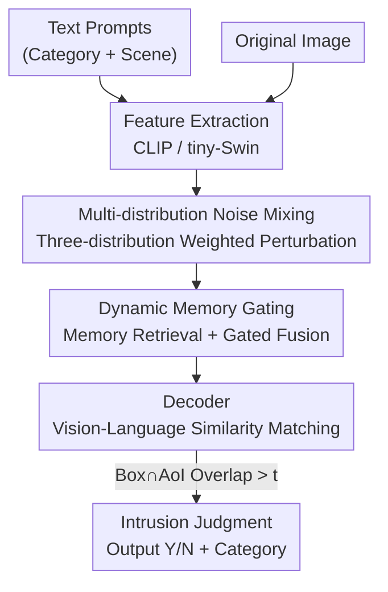

# OVID: Open-Vocabulary Intrusion Detection

**Conference**: ICLR 2026  
**OpenReview**: [https://openreview.net/forum?id=msFFC14G9i](https://openreview.net/forum?id=msFFC14G9i)  
**Code**: TBD  
**Area**: Object Detection / Open-Vocabulary / Visual Intrusion Detection  
**Keywords**: Intrusion Detection, Open-Vocabulary, Multi-modal Alignment, Detection+Segmentation, Memory Gating

## TL;DR
This paper proposes the "Open-Vocabulary Intrusion Detection (OVID)" task for the first time, constructs the Cityintrusion-OpenV dataset with 8 intrusion categories, and designs an end-to-end multi-modal framework, OVIDNet. By leveraging text-image feature alignment to identify intrusion categories unseen during training and incorporating two plug-and-play strategies (multi-distribution noise mixing and dynamic memory gating) to enhance generalization, OVIDNet outperforms strong baselines like OpenSeeD in zero-shot and task transfer settings.

## Background & Motivation

**Background**: Visual intrusion detection determines "whether a target has entered a restricted Area-of-Interest (AoI)," which is widely used in security, intelligent monitoring, and autonomous driving. In static camera scenarios, Background Subtraction (ABS) or Histograms of Oriented Gradients (HOG) were sufficient. In dynamic viewpoints, frameworks like PIDNet and Cross-PIDNet combine detection and segmentation to conclude intrusion by judging the overlapping pixels between targets and the AoI.

**Limitations of Prior Work**: These methods rely on **predefined closed categories**. Early versions like PIDNet could only detect a single category (pedestrian). Subsequent works like MF-ID and MMID-bench expanded this to 4 categories and introduced multi-domain adaptation, but they essentially only recognize categories present in the training set. If an undefined category like a "Car" or "Truck" appears in the real world, the model results in a False Negative, significantly reducing its utility.

**Key Challenge**: The practical requirement for intrusion detection is an **open-world** capability—any object potentially entering a restricted zone should be detected. However, existing boundaries are restricted by training categories. While open-vocabulary detectors (e.g., Grounding DINO, YOLO-World) perform zero-shot detection, they **only handle detection** and lack segmentation and intrusion logic. Conversely, OpenSeeD performs joint detection and segmentation but lacks intrusion judgment capabilities. Furthermore, **no datasets** support open-vocabulary training, as existing intrusion datasets have few categories (≤4) and lack corresponding text labels.

**Goal**: To transition intrusion detection from "closed categories" to "open vocabulary," addressing two problems: (1) constructing a dataset with richer categories and text prompts; (2) designing an end-to-end framework capable of simultaneous detection, segmentation, and intrusion judgment that generalizes to unseen categories.

**Key Insight**: Since OpenSeeD already enables joint detection and segmentation, it serves as a base for modification. Using the successful experience of "aligning visual features with language embeddings" in open-vocabulary tasks allows the model to recognize unseen categories via text prompts.

**Core Idea**: Replace "fixed category heads" with "text prompt ↔ image feature alignment" to identify intruders. Additionally, incorporate two lightweight strategies to address specific weaknesses in intrusion scenarios: inaccurate localization of unseen categories and weak context modeling in complex scenes.

## Method

### Overall Architecture
OVIDNet takes two modalities as input: **Text** (customizable intrusion category names like 'person', 'bus', and scene names like 'street') and **Images**. Text is processed by a CLIP text encoder to obtain text embeddings, while images are processed by a tiny-Swin-Transformer for multi-scale features. Both are fed into a decoder. The decoder embeds two enhancement strategies: **Multi-distribution Noise Mixing** for box regression and **Dynamic Memory Gating** for features, improving localization of unseen categories and context modeling respectively. The decoder outputs detection boxes (intruders) and segmentation masks (AoI) simultaneously. Finally, through **overlapping pixel judgment**, if the overlap between the target box and the AoI mask exceeds a threshold $t$, it is marked as intrusion ('Y'), otherwise non-intrusion ('N'), with the category name appended to the box. The framework is formalized as:

$$Is = J\{\,D(F_T, F_I) \overset{e}{\to} (Box_p, Aoi_p)\,\}$$

Where $F_T=E_T(\text{Text})$, $F_I=E_I(\text{Img})$, $D$ is the decoder, $J$ is the intrusion judgment module, and $Box_p, Aoi_p$ are the predicted boxes and AoI.

### Key Designs

**1. Open-Vocabulary Intrusion Framework via Multi-modal Alignment: Replacing Fixed Heads with Text Prompts**

To address the fundamental pain point of closed categories failing to recognize unseen intruders, OVIDNet discards fixed classification heads. Instead, it performs similarity matching between image features $F_I$ and text embeddings $F_T$, making the definition of "which categories count as intrusion" dynamically determined by user-provided text prompts. This design is built upon the OpenSeeD open-vocabulary base, extending it from "detection + segmentation" to a tripartite task: detection, segmentation, and intrusion judgment. After obtaining detection boxes and AoI masks, intrusion is determined via overlapping pixels and threshold $t$. The setup distinguishes base classes $C_T^d$ and validation classes $C_V^d$; the model trains on base classes but must perform zero-shot on new categories $C_N=C_V^d\setminus C_T^d\neq\emptyset$.

**2. Multi-distribution Noise Mixing Strategy: Adaptive Box Perturbation for Unseen Category Localization**

Standard OpenSeeD denoising training uses a single uniform distribution with fixed-ratio noise to perturb boxes: $B_f=C\{B_e+N_r\odot\Delta\odot\Upsilon,0,1\}$ (where $N_r\sim U(-1,1)$ and $\Upsilon$ is a constant scale). However, target sizes in real scenes vary greatly: small targets require fine-grained perturbations to preserve details, while large targets need large-scale perturbations for global features. This paper replaces the noise with a **weighted mixture of three distributions**:

$$B_f = C\{B_e + (\alpha N_u + \beta N_g + \gamma N_t)\odot\Delta\odot\Theta,\,0,1\}$$

Where $N_u\sim U(-1,1)$, $N_g\sim\mathcal N(0,1)$, and $N_t\sim L(0,1)$ (Laplace distribution), with weights $\alpha+\beta+\gamma=1$. Crucially, the fixed scale $\Upsilon$ is replaced by an **area-adaptive noise ratio** $\Theta=\tau\cdot(1+\log(1+A))$, where $A=w\cdot h$ is the box area. Larger areas receive larger noise magnitudes, making the model more robust to the localization of unseen categories.

**3. Dynamic Memory Gating Module: Long-range Dependency via Memory Networks and Adaptive Context Gating**

Context modeling in complex intrusion scenes is often weak due to the lack of long-range dependencies in single-frame features. This module takes input features $X\in\mathbb R^{B\times C\times H\times W}$, applies Global Average Pooling to get a query $Q=\text{GAP}(X)$, and utilizes **memory retrieval** to extract context from learnable memory units:

$$O_m = \text{softmax}\!\left(\frac{QM_K^T}{\sqrt d}\right)M_V$$

Subsequently, a **dynamic gate** generates adaptive weights $W=\sigma(W_2\,\text{ReLU}(W_1 Q))$, scaling the original features before concatenating them with the memory output for fusion via $1\times1$ convolution: $X_f=\text{Conv}_{1\times1}(\text{Concat}(X\odot W,\,O_m))$. The gate allows the model to dynamically decide how much of the original feature to retain versus how much memory context to inject, enhancing stability in foggy or crowded scenes.

### Loss & Training
The framework follows the multi-task training paradigm of OpenSeeD, optimizing detection and segmentation jointly. Multi-distribution noise mixing is embedded into the box regression process as denoising training. Implementation uses 8 RTX 2080Ti GPUs, with Max Iterations / Batch Size / Checkpoint / Eval cycles set to 15000 / 8 / 15000 / 15000. It uses tiny-Swin as the image encoder and CLIP as the text encoder, with an intrusion threshold $t=20$. Evaluation includes zero-shot and task transfer settings.

## Key Experimental Results

### Main Results

The proposed Cityintrusion-OpenV dataset increases intrusion categories to **8**, with 18.03 cases per image (approx. 2× previous works):

| Dataset | # Intrusion Classes | Y/N Cases | Cases/Img |
|--------|-----------|---------|---------|
| Cityintrusion | 1 | 4599/15084 | 7.3 |
| Cityintrusion-Multicategory | 4 | 5431/22683 | 9.59 |
| Multi-Domain Multi-Category | 4 | 5431/22683† | 9.59 |
| **Ours (Cityintrusion-OpenV)** | **8** | **24750/37899** | **18.03** |

Compared to the strong open-vocabulary baseline OpenSeeD, OVIDNet shows gains in zero-shot Panoptic Segmentation (PQ) and task transfer intrusion accuracy (Acc):

| Test Setting | Metric | OpenSeeD | OVIDNet | Gain |
|---------|------|----------|---------|------|
| Cityscape Zero-shot | PQ(%) | 14.03 | 16.22 | +2.19 |
| Foggy-Cityscape Zero-shot | PQ(%) | 14.28 | 15.40 | +1.12 |
| Normal Intrusion Transfer | Acc(%) | 29.36 | 32.79 | +3.43 |
| Foggy Intrusion Transfer | Acc(%) | 24.38 | 27.83 | +3.45 |

Compared to traditional methods (PIDNet, MF-ID, MMID-bench), OVIDNet is the only framework with an **open architecture + Zero-Shot Detection (ZSD)** capable of evaluating all 8 intrusion categories.

### Ablation Study

Ablation results on COCO training with Cityscape zero-shot and Cityintrusion-OpenV transfer:

| B | DMG | MDNM | PQ(%) | mIOU(%) | mAP@.5(%) | Acc(%) |
|---|-----|------|-------|---------|-----------|--------|
| ✓ | | | 14.03 | 28.34 | 27.58 | 29.36 |
| ✓ | ✓ | | 15.80 | 28.78 | 29.16 | 30.72 |
| ✓ | | ✓ | 15.33 | 29.40 | 28.56 | 31.75 |
| ✓ | ✓ | ✓ | 16.22 | 29.37 | 28.98 | 32.79 |

### Key Findings
- Both strategies are **individually effective and better when combined**: the full model improves Acc by 3.43% and PQ by 2.19% over the baseline.
- For intrusion accuracy, MDNM (+2.39 Acc) contributes more than DMG (+1.36 Acc), suggesting that "localization of unseen categories" is a major bottleneck.
- Performance generally decreases as task difficulty increases (standard intrusion -> domain adaptation -> open-vocabulary), confirming that open-world scenarios demand higher generalization and zero-shot capabilities.

## Highlights & Insights
- **Introduces the "Open-Vocabulary" paradigm to intrusion detection for the first time**: The key insight is that defining "what counts as an intruder" should be dynamically specified by the user's language. Text-vision alignment naturally fits this requirement better than fixed heads.
- **Area-aware noise ratio $\Theta=\tau(1+\log(1+A))$** is a lightweight and universal trick: it couples box size with denoising intensity via a logarithmic term—light perturbation for small targets and heavy for large targets—extensible to any denoising-trained detector.
- **Dynamic Memory Gating combines "retrieval-based memory" with "channel gating"**: It uses softmax attention to retrieve context from memory units and sigmoid gating to determine the fusion ratio, providing long-range dependencies for complex or harsh scenes. This module is reusable for other dense prediction tasks.

## Limitations & Future Work
- Absolute metrics are relatively low (zero-shot PQ only 16.22%, intrusion Acc approx 33%), indicating that open-vocabulary intrusion detection is in its infancy and far from practical accuracy.
- The framework is a modification of OpenSeeD and remains highly dependent on the base architecture; the strategies provide incremental improvements (1~3 points) rather than a paradigm-level breakthrough.
- Cityintrusion-OpenV is based on Cityscape auto-labeling with a fixed threshold of 20 and only 8 categories; there is much room to move toward a truly "open-world" long-tail category distribution.
- Intrusion judgment relies on the hard rule "Box ∩ AoI overlap pixels > threshold," and the threshold sensitivity or robustness in occlusion/perspective scenes is not fully explored.

## Related Work & Insights
- **vs OpenSeeD**: OpenSeeD handles joint detection and segmentation but lacks intrusion logic; this work adds an intrusion module and two generalization strategies.
- **vs Grounding DINO / YOLO-World**: These open-vocabulary detectors only perform detection, failing to meet the multi-task "detection + segmentation + intrusion" requirements of OVID.
- **vs MF-ID / MMID-bench**: While they expanded categories from 1 to 4 and introduced domain adaptation, they remain closed-category systems without zero-shot capabilities.

## Rating
- Novelty: ⭐⭐⭐⭐☆ First to propose the open-vocabulary intrusion task and dataset, though the framework is modified from OpenSeeD.
- Experimental Thoroughness: ⭐⭐⭐⭐☆ Covers COCO/Cityscape/Foggy/Self-built datasets with zero-shot, task transfer, and ablation settings.
- Writing Quality: ⭐⭐⭐☆☆ Motivation and method are clear, but some formulas/notations are slightly unrefined, and absolute metrics need more explanation.
- Value: ⭐⭐⭐⭐☆ Establishes tasks, data, and baselines for open-world intrusion detection in security/autonomous driving.

<!-- RELATED:START -->

## Related Papers

- [\[ICLR 2026\] Fantastic Tractor-Dogs and How Not to Find Them With Open-Vocabulary Detectors](fantastic_tractor-dogs_and_how_not_to_find_them_with_open-vocabulary_detectors.md)
- [\[ICLR 2026\] Retain and Adapt: Auto-Balanced Model Editing for Open-Vocabulary Object Detection under Domain Shifts](retain_and_adapt_auto-balanced_model_editing_for_open-vocabulary_object_detectio.md)
- [\[ICLR 2026\] DeCo-DETR: Decoupled Cognition DETR for efficient Open-Vocabulary Object Detection](deco-detr_decoupled_cognition_detr_for_efficient_open-vocabulary_object_detectio.md)
- [\[CVPR 2026\] WeDetect: Fast Open-Vocabulary Object Detection as Retrieval](../../CVPR2026/object_detection/wedetect_fast_open-vocabulary_object_detection_as_retrieval.md)
- [\[CVPR 2026\] Thermal-Det: Language-Guided Cross-Modal Distillation for Open-Vocabulary Thermal Object Detection](../../CVPR2026/object_detection/thermal-det_language-guided_cross-modal_distillation_for_open-vocabulary_thermal.md)

<!-- RELATED:END -->
