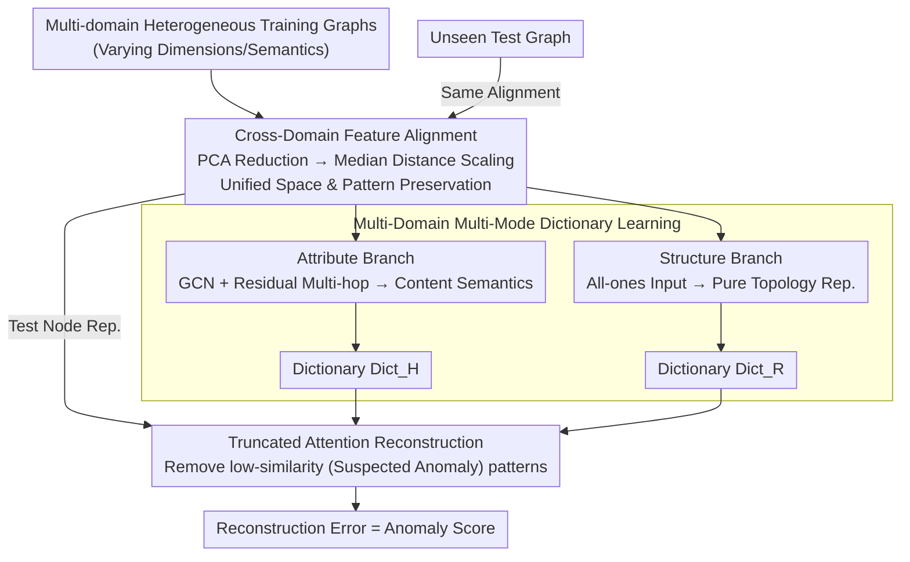

# OwlEye: Zero-Shot Learner for Cross-Domain Graph Data Anomaly Detection

**Conference**: ICLR 2026  
**arXiv**: [2601.19102](https://arxiv.org/abs/2601.19102)  
**Code**: None  
**Area**: Others  
**Keywords**: Graph Anomaly Detection, Zero-Shot Learning, Cross-Domain Feature Alignment, Dictionary Learning, Continual Learning

## TL;DR

Ours proposes the OwlEye framework, which utilizes cross-domain feature alignment based on pairwise distance statistics to map heterogeneous graph embeddings into a shared space. It extracts attribute-level and structure-level normal patterns from multiple graphs into an extensible dictionary and detects anomalous nodes in unseen graphs under strictly zero-shot conditions through a truncated attention reconstruction mechanism. It achieves an average AUPRC of 36.17% across 8 datasets, surpassing the strongest baseline, ARC, by approximately 5.4 percentage points.

## Background & Motivation

**Background**: Graph Anomaly Detection (GAD) is widely applied in financial fraud detection, network intrusion detection, and social network misinformation identification. Traditional methods follow the "one model for one dataset" paradigm, training independently for each graph, with progress made by methods such as DOMINANT, SLGAD, TAM, and CARE. Recently, ARC and UNPrompt pioneered the "one-for-all" generalized detection framework direction, attempting to train a single model that can be directly transferred to unseen graphs.

**Limitations of Prior Work**: Generalized cross-domain detection faces three core challenges. First, graph feature dimensions and semantics across different domains are completely heterogeneous—node features in citation networks are text embeddings, while those in social networks are user profile attributes. Simple dimensionality reduction via PCA/SVD followed by normalization fails to maintain semantic consistency. Second, existing general frameworks are static and do not support incremental integration of new graph knowledge into a pre-trained model; adding a new training graph requires retraining from scratch. Third, methods like ARC assume a small number of labeled nodes for few-shot learning during inference, but in practice, anomaly labeling costs are extremely high and require domain experts.

**Key Challenge**: The authors reveal specific failure modes of existing methods through visualization experiments. Cross-domain processing in ARC tends to separate distributions of different graphs in the feature space rather than aligning them (visible in t-SNE visualizations where clusters of two graphs are pushed apart), which contradicts the goal of cross-domain alignment. Although normalization in UNPrompt can merge the distributions of two graphs, it severely damages critical distance patterns—on the Weibo dataset, the distance density of Normal-Normal pairs in the original feature space is greater than that of Normal-Anomaly pairs (a vital signal for differentiation). After UNPrompt processing, this relationship is reversed, causing the anomaly detection signal to be erased.

**Goal**: (1) How to unify the feature spaces of heterogeneous graphs without destroying semantic patterns? (2) How to design a knowledge accumulation mechanism that supports continual learning and is instantly extensible? (3) How to reliably detect anomalies under a completely unlabeled zero-shot setting?

**Key Insight**: The authors observe that the pairwise distance distribution between node pairs is an invariant that can be preserved during normalization, and normal behavior patterns can be shared across different graphs—provided a suitable alignment strategy is used. This observation leads to the solution of "learning a dictionary of normal patterns + detecting anomalies based on reconstruction error."

**Core Idea**: Use a scaling factor based on median pairwise distance to align features across domains, store normal patterns in attribute/structure dual-branch dictionaries, and implement true zero-shot detection by filtering potential anomaly support nodes via truncated attention.

## Method

### Overall Architecture

The OwlEye pipeline consists of three sequentially cascaded modules. The input is a set of labeled training graphs $\mathcal{T}_{train}$ from multiple domains, and the output is the anomaly score for each node in an unseen test graph. The process is: (1) The cross-domain feature alignment module maps heterogeneous features of all graphs to a shared space of unified dimensionality while keeping pairwise distance patterns unchanged; (2) The multi-domain multi-mode dictionary learning module extracts attribute-level and structure-level normal node patterns for each training graph, storing them in two dictionaries $\text{Dict}_H$ and $\text{Dict}_R$; (3) The truncated attention reconstruction module reconstructs node representations of the test graph using normal patterns from the dictionaries. Normal nodes can be accurately reconstructed while anomalies incur large reconstruction errors, which serve as the anomaly scores. The reconstruction loss + triplet contrastive loss are optimized during training; the inference phase requires only a single forward pass without any labeled data.

### Key Designs

**1. Cross-Domain Feature Alignment: Unifying heterogeneous features in a shared space without erasing normal-anomaly distance signals**

This step addresses the core contradiction—aligning distributions of different domains without reversing critical pairwise distance patterns as UNPrompt does. It involves two steps: first, use PCA to reduce the $d_i$-dimensional features of each graph to a unified $d$ dimensions; then, apply a specifically designed cross-domain normalization. During normalization, the pipeline calculates the average L2 norm $N^i$ of all nodes in the $i$-th graph, along with the average pairwise distances $\text{dist}^i$ and $\text{dist}_N^i$ before and after normalization. Using the median distances $\text{dist}^{\text{med}}$ and $\text{dist}_N^{\text{med}}$ of all training graphs as anchors, it calculates a scaling factor:

$$f = \sqrt{\frac{\text{dist}^{\text{med}} \cdot \text{dist}_N^i}{\text{dist}^i \cdot \text{dist}_N^{\text{med}}}}$$

The features are finally normalized as $\tilde{X}^i \leftarrow \frac{\tilde{X}^i}{N^i} \cdot \max(f, \tau)$, with $\tau=1$ as the lower bound for temperature. Choosing the median over the mean is a critical design choice: nodes in some training graphs may have extremely large distances, which would cause the mean-based scaling factor to be dominated by such extreme graphs, whereas the median provides a robust global reference. 

**2. Multi-Domain Multi-Mode Dictionary Learning: Dual branches for extracting normal patterns and native support for continual learning**

OwlEye does not directly train an end-to-end detector but instead crystallizes "what is normal" into an extensible dictionary. Two GNN branches manage different dimensions: the Attribute branch takes aligned features $\tilde{X}^i$ as input, processes them through multi-layer GCNs to obtain $H_{\text{attr}}^{i,l}$, and captures content semantics via residual concatenation of multi-hop information $H^i = [H_{\text{attr}}^{i,2} - H_{\text{attr}}^{i,1}, \ldots, H_{\text{attr}}^{i,l+1} - H_{\text{attr}}^{i,1}]$. The Structure branch replaces input features with all-ones vectors $\mathbf{1} \in \mathbb{R}^{n_i \times d}$, using a separate set of GNN weights to learn pure topological representations $R^i$, thereby isolating structural information from attributes. Dual-branch representations of $n_{sup}=2000$ randomly sampled nodes from each training graph are stored in dictionaries $\text{Dict}_H^j$ and $\text{Dict}_R^j$. Inter-graph similarity is calculated only using structure-level representations: $\text{sim}(\mathcal{G}^i, \text{Dict}_R^j) = \max(\text{softmax}(R^i W_1 (R^j[\text{idx}])^T))$. The reason for avoiding attributes during matching is that camouflaged anomalies may mimic the attributes of normal nodes; structure-only matching avoids this trap. This dictionary storage also allows new graph patterns to be appended via a single forward pass without updating model parameters, supporting continual learning.

**3. Truncated Attention Reconstruction: Reconstructing test nodes with the dictionary and isolating potential anomaly support points under zero-shot conditions**

The final step uses normal patterns in the dictionary to reconstruct test graph nodes—normal nodes should be reconstructed accurately, while anomalies should yield high errors. Reconstruction utilizes an attention mechanism: calculating attention scores $\alpha = \sqrt{\frac{(W^Q H^i)(W^K (H^j)^T)}{\sqrt{ld}}}$ for the query (test node) and key (dictionary pattern), followed by a truncation operation: setting the scores of the $k$ lowest patterns to $-\infty$ so their contribution becomes zero after softmax. The final reconstruction is:

$$\hat{H}^i = \frac{1}{m} \sum_{j=1}^{m} \text{sim}(\mathcal{G}^i, \text{Dict}_H^j) \odot (\alpha_H^{ij} \text{Dict}_H^j)$$

This is a Hadamard product of truncated attention weights and inter-graph similarity weights applied to dictionary patterns. The structure-level reconstruction follows the same logic. Truncation is tailored for zero-shot: without labels, one might randomly sample support nodes from the test graph as normal references, but sampled sets may contain anomalies. Since low attention scores imply dissimilarity to known normal patterns (likely anomalies), truncating them forms a self-filtering safety net. The temperature is also compressed to $\tau_a = 0.001$ to sharpen the distribution and amplify the gap between normal and anomalous nodes.

### Loss & Training

The total loss is $\mathcal{L} = \mathcal{L}_{\text{triplet}} + \mathcal{L}_{\text{recon}}$:

- **Reconstruction Loss $\mathcal{L}_{\text{recon}}$**: For attribute-level representations, it maximizes the cosine similarity ($\frac{H_{v_j}^i (\hat{H}_{v_j}^i)^T}{|H_{v_j}^i||\hat{H}_{v_j}^i|}$) for normal nodes and minimizes it for anomalies, ensuring normal nodes are precisely reconstructible.
- **Triplet Loss $\mathcal{L}_{\text{triplet}}$**: Considering both attribute and structure dimensions, it calculates $\max(\|\hat{H}_{v_j}^i - H_{v_j}^i\|^{2} - \|\hat{H}_{v_j}^i - \hat{H}_{v_k}^i\|^{2} + \lambda, 0)$ for each pair (anomaly $v_j$, normal node $v_k$), with margin $\lambda = 0.2$ and structure branch weight $\beta = 0.01$. This enhances discriminative power via pairwise contrast.

During inference, the anomaly score is $\mathcal{S}_{v_j} = \|\hat{H}_{v_j}^i - H_{v_j}^i\|^2 + \beta \|\hat{R}_{v_j}^i - R_{v_j}^i\|^2$.

## Key Experimental Results

### Main Results: Zero-Shot AUPRC (%) Comparison

| Dataset | OwlEye | ARC | CARE | UNPrompt | DOMINANT | Note |
|--------|--------|-----|------|----------|----------|------|
| Cora | 43.94±0.46 | **45.20**±1.08 | 35.12±0.23 | 9.84±2.90 | 31.77±0.34 | ARC slightly better |
| Flickr | **37.69**±0.25 | 35.13±0.20 | 25.64±0.16 | 25.21±1.84 | 28.76±1.52 | Significant lead over ARC |
| ACM | 39.75±0.13 | 39.02±0.08 | 37.76±0.35 | 11.18±1.67 | 32.49±4.97 | Methods are close |
| BlogCatalog | **34.99**±0.31 | 33.43±0.15 | 25.06±0.10 | 18.24±13.05 | 29.51±3.44 | Consistently better |
| Facebook | 5.62±1.17 | 4.25±0.47 | 5.52±0.34 | 4.32±0.55 | 3.42±0.86 | All methods perform poorly |
| Weibo | 60.90±0.21 | **64.18**±0.68 | 40.70±0.74 | 20.58±5.62 | 29.63±0.86 | ARC strong on social nets |
| Reddit | 4.25±0.11 | 4.20±0.25 | 3.17±0.17 | 3.77±0.32 | 3.28±0.37 | All low (imbalance) |
| Amazon | **62.20**±3.18 | 20.48±6.89 | 56.76±1.44 | 9.41±2.69 | 36.80±8.37 | ARC fails, Ours leads |
| **8 Dataset Avg** | **36.17**±0.73 | 30.74±1.23 | 28.72±0.44 | 12.82±3.58 | 24.46±3.11 | **+5.43 vs ARC** |

### Ablation Study & Continual Learning Analysis

| Experiment Config | Key Metric | Note |
|---------|---------|------|
| OwlEye (Full Model) | Highest Avg AUPRC | All modules synergy |
| OwlEye-N (w/o Alignment) | Lower Avg AUPRC | Alignment is vital for generalization |
| OwlEye-S (w/o Structure) | Lower Avg AUPRC | Structure & attribute are complementary |
| OwlEye-T (Standard Attention) | Lower Avg AUPRC | Truncation improves zero-shot robustness |
| Dict $n_{sup}$=10 → 200 | 35.46 → 36.01 | +0.55%, larger is better |
| Dict $n_{sup}$=200 → 2000 | 36.01 → 36.17 | Diminishing gains; 200 is near saturation |
| Continual: 0→3 extra graphs (no retraining) | 31.29 → 32.27 | Improvement without gradient updates |
| Continual: 3 extra graphs (retraining) | 31.33 | Worse than no retraining (optimization difficulty) |

### Key Findings

- **Feature alignment is the key to cross-domain generalization**: Ablation of OwlEye-N shows that without cross-domain normalization, the GNN cannot bridge the gap between domains. Thus, pairwise distance statistics alignment is the cornerstone.
- **ARC's collapse on Amazon** (20.48 vs 62.20) highlights its fatal flaw of pushing graphs apart instead of aligning them—when test and training distributions differ significantly, ARC's in-context learning fails.
- **Dictionary-based continual learning outperforms fine-tuning**: Comparing cases shows that adding new patterns directly to the dictionary (params fixed) is more effective than fine-tuning on new graphs, which can struggle to converge.
- **Marginal effects of dictionary size**: Performance rises from 35.46 to 36.01 with 10 to 200 patterns; however, increasing to 2000 patterns only reaches 36.17, indicating a small number of representative patterns can capture the main distribution of normal behavior.
- **Advantages maintained in 10-shot settings**: Even when providing baselines with 10 labeled nodes, the average AUPRC of OwlEye (36.73) remains superior to all 10-shot enabled methods (ARC 31.68, CARE 30.74).

## Highlights & Insights

- **Dictionary-based continual learning** is the primary engineering value. Traditional methods require retraining for new data, whereas OwlEye only requires a GNN forward pass on new graphs to extract patterns and append them to the dictionary. This design can be transferred to any "pattern matching + anomaly detection" scenario.
- **The all-ones input for pure structure features** is ingenious. By eliminating attribute info, it forces the GNN to learn representations solely from the adjacency matrix, resulting in pure structural embeddings. This is more end-to-end than using manual features like degree or clustering coefficients.
- **The self-screening mechanism of truncated attention** solves the problem of "poisoned support sets" in zero-shot scenarios. Setting a low temperature $\tau_a = 0.001$ sharpens the attention distribution, allowing a few high-similarity patterns to dominate while others contribute near zero, effectively isolating potential anomalies.
- **Using the median for pairwise distance statistics** is a subtle but crucial trick. Median provides a stable global reference in cases where some training graphs have high-dimensional nodes leading to extreme average distances.

## Limitations & Future Work

- **Poor performance on Facebook and Reddit** (4-7% AUPRC) suggests room for improvement in specific domains. The authors do not analyze why these datasets are difficult—whether it is the low anomaly ratio or indistinguishable patterns.
- **Random sampling of dictionary patterns** lacks representative guarantees. Clustering methods like k-medoids could be considered to select representative dictionary atoms.
- **Supervised data is still required for training**: Although inference is zero-shot, the training set requires labels to calculate triplet and reconstruction losses. An unsupervised paradigm would expand the application scope.
- **Shared GNN architecture for structure and attribute branches**: Structural info might need deeper aggregation for global topology, while attribute info might suffice with shallow layers.
- **Lack of efficiency analysis for large-scale graphs**: Pairwise distance calculation has $O(n^2)$ complexity, which is infeasible for million-node graphs. Sampling or approximate calculations are needed.

## Related Work & Insights

- **vs ARC**: ARC encodes high-order affinity and heterophily via in-context learning but has crude cross-domain feature handling. OwlEye explicitly fixes this with the alignment module. ARC's fragility under large distribution shifts is exposed on the Amazon dataset.
- **vs UNPrompt**: UNPrompt uses generalized neighborhood prompts to predict attributes as anomaly scores, but its normalization reverses pairwise distance patterns. Its average AUPRC is much lower than OwlEye's.
- **vs CARE**: CARE is the strongest unsupervised method (28.72), focusing on affinity. OwlEye provides a more explicit "normal pattern library" and supports continual learning, which CARE lacks.

## Rating

- Novelty: ⭐⭐⭐⭐ The combination of these three modules is innovative, especially the dictionary-based continual learning and truncated attention, although individual components are not entirely new.
- Experimental Thoroughness: ⭐⭐⭐⭐ Includes 8 datasets, multiple ablations, case studies, and visualization, but lacks large-scale graph efficiency comparisons.
- Writing Quality: ⭐⭐⭐⭐ Strong motivation (Figure 1 visualization is intuitive), and clear formulas.
- Value: ⭐⭐⭐⭐ Zero-shot cross-domain GAD is highly relevant for practical scenarios, and the engineering value of dictionary-based continual learning is high.

<!-- RELATED:START -->

## Related Papers

- [\[CVPR 2026\] Remedying Target-Domain Astigmatism for Cross-Domain Few-Shot Object Detection](../../CVPR2026/object_detection/remedying_target-domain_astigmatism_for_cross-domain_few-shot_object_detection.md)
- [\[ICLR 2026\] FSOD-VFM: Few-Shot Object Detection with Vision Foundation Models and Graph Diffusion](fsod-vfm_few-shot_object_detection_with_vision_foundation_models_and_graph_diffu.md)
- [\[ICLR 2026\] Towards Anomaly-Aware Pre-Training and Fine-Tuning for Graph Anomaly Detection](towards_anomaly-aware_pre-training_and_fine-tuning_for_graph_anomaly_detection.md)
- [\[ICLR 2026\] Dual Distillation for Few-Shot Anomaly Detection](dual_distillation_for_few-shot_anomaly_detection.md)
- [\[CVPR 2025\] T2ICount: Enhancing Cross-modal Understanding for Zero-Shot Counting](../../CVPR2025/object_detection/t2icount_enhancing_cross-modal_understanding_for_zero-shot_counting.md)

<!-- RELATED:END -->
