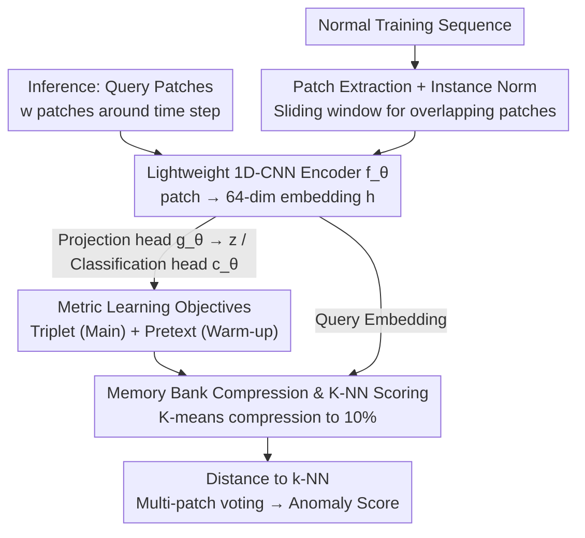

# PAANO: Patch-Based Representation Learning for Time-Series Anomaly Detection

**Conference**: ICLR 2026  
**arXiv**: [2602.01359](https://arxiv.org/abs/2602.01359)  
**Code**: [Yes](https://github.com/jinnnju/PaAno)  
**Area**: Time Series  
**Keywords**: Time-Series Anomaly Detection, Patch Representation Learning, Lightweight CNN, Memory Bank, Metric Learning

## TL;DR

Ours proposes PaAno, a lightweight time-series anomaly detection method based on patch-level representation learning. It utilizes a 1D-CNN encoder with triplet loss and pretext loss to learn a patch embedding space. Anomaly scores are calculated via the distance to normal patches stored in a memory bank. It achieves comprehensive SOTA results on the TSB-AD benchmark with only 0.3M parameters and inference times in seconds.

## Background & Motivation

Time-series anomaly detection is critical in fields such as industrial monitoring, financial transactions, and healthcare. Recently, Transformers and Foundation Models (e.g., AnomalyTransformer, MOMENT, TimesFM) have become dominant, but:

**Limitations of Prior Work**:

**Illusion of progress**: Sarfraz et al. and Liu & Paparrizos revealed that under strict evaluation protocols (removing point adjustment and avoiding threshold tuning), complex large models do not significantly outperform simple methods.

**High computational cost**: Transformers and Foundation Models have large parameter counts (0.5M-210M) and long runtimes (tens to thousands of seconds), making them unsuitable for real-time and resource-constrained scenarios.

**Locality dilution**: Global self-attention mechanisms are insensitive to local context, whereas anomaly detection relies heavily on local temporal patterns within short intervals.

**Goal of PaAno**:

- Adopt a **representation learning** paradigm (rather than prediction or reconstruction), which is relatively underexplored in anomaly detection.
- Introduce a locality inductive bias: leverage the success of patch-based methods like PatchCore from visual anomaly detection.
- **Core Idea**: Normal time series exhibit repeating local patterns; anomalies break these short-range regularities.

## Method

### Overall Architecture

PaAno decomposes anomaly detection into two steps: learning a patch embedding space and performing nearest neighbor comparison via a memory bank. During training, overlapping patches of fixed length are extracted from normal sequences using a sliding window. Each patch undergoes instance normalization before being fed into a lightweight 1D-CNN encoder to be mapped to a vector. Two training-only heads are attached to the encoder: a projection head with triplet loss to pull "similar local patterns" closer and push "heterogeneous patterns" further away, and a classification head with pretext loss to warm up the embedding structure in early iterations. After training, embeddings of all normal patches are stored in a memory bank and compressed to 10% of their original size using K-means. During inference, only the encoder is retained: for each patch around a query time step, the average distance to its $k$-nearest neighbors in the memory bank is calculated as the patch score. Time-step level anomaly scores are then obtained by averaging the scores of multiple patches covering that time step. This process involves neither prediction nor reconstruction, relying solely on the geometric intuition that "normal patches are similar to each other, while anomalies are distant from normal clusters."

### Key Designs

**1. Patch Extraction and Instance Normalization: Decomposing Global Sequences into Comparable Local Units**

Given a training sequence $\mathbf{X} = (\mathbf{x}_1, \ldots, \mathbf{x}_N)$, PaAno extracts a set of overlapping patches $\mathcal{P} = \{\mathbf{p}_t\}_{t=1}^{N-w+1}$ using a sliding window of size $w$ and stride 1. This treats each short interval as an independent comparison unit, providing the local inductive bias necessary for anomaly detection rather than diluting it with global long-range information. Post-extraction, each patch undergoes instance normalization (standardizing all values within a channel to zero mean and unit variance). This strips absolute magnitude information and retains only shape information, making the model robust to distribution shifts and regime shifts.

**2. Lightweight Three-Component Architecture: Specialized Encoder, Projection, and Classification Heads**

The model consists of three small modules. The patch encoder $f_\theta$ is a 4-layer 1D-CNN with global average pooling, compressing each patch into a 64-dimensional embedding $\mathbf{h}$. This is the only component retained during inference. The projection head $g_\theta$ is a two-layer MLP outputting 256 dimensions, mapping $\mathbf{h}$ to a representation $\mathbf{z}$ dedicated to metric learning, allowing triplet loss optimization in a space decoupled from downstream tasks. The classification head $c_\theta$ is a single-layer MLP that determines if two patch embeddings are temporally continuous, serving the auxiliary task. These modules total only 0.3M parameters—two to three orders of magnitude smaller than typical Transformers.

**3. Triplet + Pretext Dual Losses: Shaping the Embedding Space Geometry**

The primary objective is the triplet loss. For an anchor patch $\mathbf{p}_i$, a positive sample $\mathbf{p}_i^+$ is selected as a random (non-zero) shift within $r$ steps—normal patterns shifted slightly should have similar embeddings, teaching the encoder insensitivity to small jitter. The negative sample $\mathbf{p}_i^-$ uses a "farthest negative" strategy from the minibatch. The loss is:

$$\mathcal{L}_{\text{triplet}} = \frac{1}{M} \sum_{i=1}^{M} \max\!\big(0,\ \text{dist}(\mathbf{z}_i, \mathbf{z}_i^+) - \text{dist}(\mathbf{z}_i, \mathbf{z}_i^-) + \delta\big)$$

where $\delta$ is the margin. To stabilize early training, a temporal pretext task is used: determining if two patches are temporally adjacent. Using the preceding patch $\mathbf{p}_i^{\text{pre}}$ as a positive and a random patch $\mathbf{p}_{i,j}^{\text{rand}}$ as a negative:

$$\mathcal{L}_{\text{pretext}} = \frac{1}{M} \sum_{i=1}^{M} \left[ -\log c_\theta(\mathbf{h}_i, \mathbf{h}_i^{\text{pre}}) - \frac{1}{U} \sum_{j=1}^{U} \log\big(1 - c_\theta(\mathbf{h}_i, \mathbf{h}_{i,j}^{\text{rand}})\big) \right]$$

This auxiliary task operates only during the first 20 iterations (with weight linearly decaying to 0), providing a "temporal locality" prior.

**4. Memory Bank Compression and Nearest Neighbor Scoring**

Post-training, all normal patch embeddings are stored in a memory bank $\mathcal{M} = \{f_\theta(\mathbf{p}_t) \mid \mathbf{p}_t \in \mathcal{P}\}$. To reduce storage and search costs, K-means is used to identify $K$ clusters (10% of the original size), keeping only the vector closest to each centroid to form $\hat{\mathcal{M}}$. During inference, for a time step $t_*$, the score for each covering patch is the average cosine distance to the $k$-nearest neighbors in $\hat{\mathcal{M}}$:

$$S(\mathbf{p}_t) = \frac{1}{k} \sum_{i=1}^{k} \text{dist}\big(f_\theta(\mathbf{p}_t),\ \mathbf{m}_t^{(i)}\big)$$

Final time-step scores are the average of all overlapping patch scores.

### Loss & Training

The total loss is a weighted sum:

$$\mathcal{L} = \mathcal{L}_{\text{triplet}} + \lambda \cdot \mathcal{L}_{\text{pretext}}$$

The weight $\lambda$ decays linearly from 1 to 0 over the first 20 iterations. Training uses AdamW (weight decay $10^{-4}$) for 200 iterations with a minibatch size of 512.

## Key Experimental Results

### Main Results

Evaluated on the TSB-AD benchmark, including 530 univariate sequences (TSB-AD-U) and 180 multivariate sequences (TSB-AD-M), compared against 48 baselines.

**Univariate Anomaly Detection (TSB-AD-U)**:

| Method | VUS-PR | VUS-ROC | AUC-PR | AUC-ROC | Params | Runtime |
|------|--------|---------|--------|---------|--------|---------|
| **PaAno** | **0.52** | **0.89** | **0.46** | **0.86** | 0.3M | 6.9s |
| KAN-AD | 0.43 | 0.82 | 0.41 | 0.80 | <0.1M | 12.1s |
| (Sub)-PCA | 0.42 | 0.76 | 0.37 | 0.71 | - | 1.5s |
| MOMENT (FT) | 0.39 | 0.76 | 0.30 | 0.69 | 109.6M | 43.6s |
| TimesFM | 0.30 | 0.74 | 0.28 | 0.67 | 203.5M | 83.8s |
| AnomalyTrans. | 0.12 | 0.56 | 0.08 | 0.50 | 4.8M | 48.9s |

**Multivariate Anomaly Detection (TSB-AD-M)**:

| Method | VUS-PR | VUS-ROC | AUC-PR | AUC-ROC | Params | Runtime |
|------|--------|---------|--------|---------|--------|---------|
| **PaAno** | **0.43** | **0.79** | **0.38** | **0.76** | 0.3M | 12.8s |
| KAN-AD | 0.41 | 0.75 | 0.38 | 0.73 | <0.1M | 31.9s |
| DeepAnT | 0.31 | 0.76 | 0.32 | 0.73 | <0.1M | 9.5s |
| PCA | 0.31 | 0.74 | 0.31 | 0.70 | - | 0.1s |
| CATCH | 0.30 | 0.73 | 0.24 | 0.67 | 210.8M | 40.1s |

### Ablation Study

- Triplet loss is the core contributor; VUS-PR drops significantly without it.
- Early pretext loss accelerates embedding space structuring.
- Memory bank compression (10%) results in almost no performance loss.
- High robustness to hyperparameters, requiring no fine-tuning.

### Key Findings

- PaAno ranks first across all 6 evaluation metrics for both univariate and multivariate data.
- Parameters (0.3M) are significantly fewer than Transformer methods (4.8M-210M).
- Runtimes (6.9-12.8s) are much faster than Foundation Models (42-1221s).
- Traditional PCA and KShapeAD perform surprisingly well under strict evaluation, validating the "illusion of progress."
- Transformer methods like AnomalyTransformer and DCdetector rank extremely low (20+) under strict evaluation.

## Highlights & Insights

1. **Small is Beautiful**: A 1D-CNN with 0.3M parameters outperforms million-to-billion parameter models, questioning the "bigger is better" hypothesis.
2. **Locality Priority**: Anomaly detection requires fine-grained local perception; global attention tends to dilute critical signals.
3. **Successful Vision-to-Time-Series Transfer**: The patch-based representation learning + memory bank paradigm (similar to PatchCore) is highly effective for time series.
4. **Importance of Strict Evaluation**: Rankings change drastically once point adjustment and threshold tuning are removed.

## Limitations & Future Work

- The semi-supervised setup assumes training data is entirely normal, making it unable to handle scenarios with known labeled anomalies.
- Patch size $w$ is a fixed hyperparameter; different anomaly types may require different windows.
- Memory bank storage might be challenging for extremely long training sequences (despite 10% compression).
- Future work could explore the transferability of patch embeddings to tasks like classification or forecasting.

## Related Work & Insights

- Inspired by visual anomaly detection (PaDiM, PatchCore, SPADE), transferring the patch-level representation + memory bank paradigm.
- Complementary to prediction/reconstruction methods: PaAno follows a **representation learning** paradigm.
- Insight: Simple, targeted methods (local patches + metric learning) can be more effective than general Foundation Models for specific tasks.

## Rating

- Novelty: ⭐⭐⭐⭐ (Successful transfer of vision patch learning to time series)
- Experimental Thoroughness: ⭐⭐⭐⭐⭐ (48 baselines, 710 sequences, strict protocols)
- Writing Quality: ⭐⭐⭐⭐ (Strong motivation and deep discussion of evaluation issues)
- Value: ⭐⭐⭐⭐⭐ (Achieves SOTA at minimal cost; highly practical for industry)

<!-- RELATED:START -->

## Related Papers

- [\[ICLR 2026\] Contextual and Seasonal LSTMs for Time Series Anomaly Detection](contextual_and_seasonal_lstms_for_time_series_anomaly_detection.md)
- [\[ICLR 2026\] PGRF-Net: A Prototype-Guided Relational Fusion Network for Diagnostic Multivariate Time-Series Anomaly Detection](pgrf-net_a_prototype-guided_relational_fusion_network_for_diagnostic_multivariat.md)
- [\[ICLR 2026\] Complexity- and Statistics-Guided Anomaly Detection in Time Series Foundation Models](complexity-_and_statistics-guided_anomaly_detection_in_time_series_foundation_mo.md)
- [\[AAAI 2026\] Harnessing Vision-Language Models for Time Series Anomaly Detection](../../AAAI2026/object_detection/harnessing_vision-language_models_for_time_series_anomaly_detection.md)
- [\[ICML 2025\] Causality-Aware Contrastive Learning for Robust Multivariate Time-Series Anomaly Detection](../../ICML2025/object_detection/causality-aware_contrastive_learning_for_robust_multivariate_time-series_anomaly.md)

<!-- RELATED:END -->
