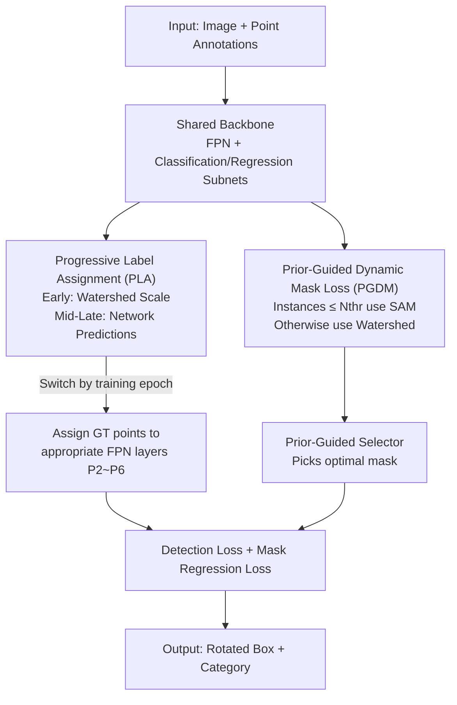

# Point2RBox-v3: Self-Bootstrapping from Point Annotations via Integrated Pseudo-Label Refinement and Utilization

**Conference**: ICLR 2026  
**OpenReview**: [https://openreview.net/forum?id=9vlS8PSGG7](https://openreview.net/forum?id=9vlS8PSGG7)  
**Code**: https://github.com/VisionXLab/Point2RBox-v3  
**Area**: Rotated Object Detection / Weakly Supervised Detection  
**Keywords**: Point-supervised, Rotated Object Detection, Pseudo-label, Label Assignment, SAM, Watershed  

## TL;DR
Aiming at the weakly supervised task of "training rotated object detectors with only a single point annotation," this paper proposes Point2RBox-v3. It utilizes Progressive Label Assignment (PLA) to feed scale information from pseudo-labels into multi-level FPN label assignment and adopts Prior-Guided Dynamic Mask Loss (PGDM-Loss) to use SAM for sparse scenes and Watershed for dense scenes. It achieves a new SOTA on six remote sensing benchmarks including DOTA-v1.0 (66.09% for the two-stage version).

## Background & Motivation

**Background**: Rotated Object Detection (OOD) is in high demand in fields such as remote sensing, autonomous driving, and scene text. However, annotating a rotated box (RBox) is 36.5% more expensive than a horizontal box and 104.8% more expensive than a point. Consequently, "point-supervised learning of rotated boxes" has become a popular alternative. Current point-supervised methods are mainly categorized into four types: Multiple Instance Learning/class probability maps for pseudo-box generation, single-sample knowledge combination, point-prompted segmentation using SAM’s zero-shot capability, and spatial layout-based pseudo-label generation (e.g., Point2RBox-v2).

**Limitations of Prior Work**: The authors identify two common weaknesses in all end-to-end methods: **low utilization efficiency** and **poor quality** of pseudo-labels. Regarding utilization efficiency, end-to-end methods require label assignment for the Feature Pyramid Network (FPN), where different layers should handle targets of different scales. However, methods like Point2RBox-v2 simplify this by assigning all ground truth points to a single layer, wasting the scale information inherent in pseudo-labels. Regarding quality, Point2RBox-v2 relies on "Voronoi Watershed Loss" to generate masks as pseudo-labels, but Watershed is prone to over/under-segmentation in **sparse scenes** (few targets, insufficient spatial clues). Conversely, while SAM is more robust in sparse scenes, it fails in **密集场景** (over-segmentation leading to blurred masks) and incurs high computational costs.

**Key Challenge**: Points themselves contain no scale information, preventing classical FPN multi-level label assignment. Furthermore, single pseudo-label generators (Watershed or SAM) have respective blind spots, with none being reliable in both sparse and dense scenes.

**Goal**: (1) Reuse coarse scale clues from pseudo-labels to restore multi-level FPN label assignment; (2) Ensure pseudo-mask generation is accurate in both sparse and dense scenes.

**Key Insight**: The authors noticed that in Point2RBox-v2, Watershed pseudo-labels were **originally only used for loss constraints (scale learning)**. Could this scale information be reused for the label assignment module? Additionally, since Watershed and SAM fail in complementary scenarios, can they be dynamically routed based on scene sparsity to combine their strengths?

**Core Idea**: Use "pseudo-label self-bootstrapping"—feeding back the model's own pseudo-labels (containing scale) to Progressive Label Assignment (PLA) and dynamically switching mask generation between SAM and Watershed based on scene sparsity (PGDM-Loss).

## Method

### Overall Architecture
Point2RBox-v3 is an end-to-end point-supervised rotated detector. The input consists of image $I$ and center point annotations $P=\{(x_i,y_i)\}$ for each instance, and the output includes rotated boxes $[(x,y),(w,h),\theta]$ and categories. A shared backbone (Backbone+Neck, FPN) is connected to classification and regression subnets. Two main operations center on "pseudo-labels": the **utilization side** uses PLA to assign the scale information of pseudo-labels to appropriate FPN layers; the **quality side** uses PGDM-Loss to dynamically select between SAM or Watershed for mask supervision based on sparsity. Other loss terms follow Point2RBox-v2. The most critical point of the pipeline is that pseudo-labels are not fixed; they **evolve dynamically with the training stages**—using the Watershed region for coarse scales early on and switching to the network's own forward-predicted boxes in middle and late stages. This is "self-bootstrapping."

### Key Designs

**1. Progressive Label Assignment (PLA): Reintroducing Pseudo-label Scale to FPN Multi-level Assignment**

This design addresses the issue where "points lack scale, and all points are fed into the same FPN layer, wasting scale information." In classical detection, target scale determines which FPN layer is responsible, but point supervision lacks scale, leading previous work to abandon multi-level assignment. The authors argue this is a major cause of the performance gap between point-supervised and fully-supervised methods. PLA "borrows" the pseudo-label scale, originally meant for loss, for label assignment and **evolves it in stages**: In the **early** training stage, scales are estimated using Watershed-generated pseudo-labels: $V=\text{Voronoi}(X)$, $S=\text{Watershed}(I,X,V)$, $PL=\text{minAreaRect}(S)$. This involves Voronoi partitioning based on annotation points, and then using Watershed to find the basin region $S$ for each instance, taking the minimum bounding rotated rectangle as the pseudo-box. However, Watershed regions are **static**; a poorly segmented sample will persist throughout training. Thus, in the **mid-late** stage, the network's own forward predictions are used: for each FPN layer, the anchor prediction box closest to the target point is taken as a candidate set $C_g$, and the best is selected by classification confidence, $PL_g=\arg\max_{b\in C_g}\text{score}(b)$. As the network strengthens, pseudo-labels become more accurate, guiding GT points to increasingly appropriate FPN layers (P2~P6). Ablations show that switching at epoch 6 is optimal.

**2. Prior-Guided Dynamic Mask Loss (PGDM-Loss): Task Sharing between SAM and Watershed**

This design targets the quality issue where "Watershed is poor in sparse scenes and SAM is poor and slow in dense scenes," enhancing the Voronoi Watershed Loss of Point2RBox-v2. The core is a hybrid loss with **dynamic routing** based on the number of instances: if the total instance count in an image $\le N_{thr}$, it is treated as a sparse scene and routed to the SAM branch; otherwise, it follows the original Watershed branch. This compensates for accuracy in sparse scenes while maintaining Watershed's efficiency in dense scenes, avoiding the computational explosion of using SAM on all images. A lightweight MobileSAM is used, which **only acts as a supervision source during training and does not participate in inference**, thus not slowing down the model. Ablations show $N_{thr}=4$ achieves the best E2E result of 59.6%. Once the mask $S$ is obtained, the regression target is calculated as $\binom{w_t}{h_t}=2\max R^\top(S-\binom{x_c}{y_c})$. The Gaussian Wasserstein Distance (GWD) loss is then used: $L_{mask}=L_{GWD}(\cdot)$.

**3. Prior-Guided Selector: Picking the Truly Correct SAM Mask with Category-Related Priors**

This addresses the issue that "SAM's native confidence is unreliable in the remote sensing domain." Since SAM is trained on general data, its native score often fails to reflect mask quality for remote sensing instances. For an instance $j$ in the SAM branch, SAM outputs a set of candidate masks $M_j=\{m_1,\dots,m_k\}$. This paper uses a prior-guided scoring function to select the best: $m^*_j=\arg\max_{m_i\in M_j}\sum_k w_{k,c_j}\cdot\phi_k(m_i)$, where $\phi_k(m_i)$ represents five metrics calculated from the mask (center alignment, color consistency, rectangularity, circularity, and aspect ratio reliability), and $w_{k,c_j}$ are category-related weights based on the shape prior of category $c_j$. Ablations (Table 6) show that using only SAM’s native confidence leads to a significant performance drop.

### Loss & Training
The total loss is based on Point2RBox-v2, with the Watershed loss replaced and enhanced by PGDM-Loss. Training uses a ResNet50 backbone with AdamW, an initial learning rate of $5\times10^{-5}$, and a 500-iteration warm-up. All datasets are trained for 12 epochs using only random flip augmentation. The PLA switch epoch is set to 6, and the PGDM sparsity threshold $N_{thr}=4$. The model supports both **end-to-end** and **two-stage** (generating pseudo-labels then training a standard FCOS) usage.

## Key Experimental Results

### Main Results
SOTA results were achieved across six remote sensing/detection benchmarks (DOTA-v1.0/1.5/2.0, DIOR, STAR, RSAR):

| Dataset | Metric | Ours | Prev. SOTA (Point2RBox-v2) | Note |
|--------|------|------|--------------------------|------|
| DOTA-v1.0 (Two-stage) | AP50 | 66.09 | 62.61 | +3.48; also exceeds SAM-based P2RBox (59.04) by 7.05 |
| DOTA-v1.0 (End-to-end) | AP50 | 59.61 | 51.00 | +8.61 |
| DOTA-v1.5 | AP50 | 56.86 | — | One of six benchmarks |
| DOTA-v2.0 | AP50 | 41.28 | — | |
| DIOR | AP50 | 46.40 | — | |
| STAR | AP50 | 19.60 | — | |
| RSAR | AP50 | 45.96 | — | |

Category-level analysis shows that gains mainly come from **large-scale, low-density categories** such as bridges (BR) rising from 8.0% to 41.6% and roundabouts (RA) to 55.4%.

### Ablation Study

| Configuration | DOTA E2E | DOTA FCOS (Two-stage) | Note |
|------|----------|-------------------|------|
| Baseline (No PLA / No PGDM) | 51.0 | 62.6 | Point2RBox-v2 starting point |
| + PLA | 56.6 | 64.6 | Progressive Label Assignment only |
| + PGDM | 54.2 | 63.9 | Dynamic Mask Loss only |
| + PLA + PGDM (Full) | 59.6 | 66.1 | Best combination |
| w/o Priors (SAM native score) | 57.86 | 63.59 | 1.75 / 2.5 drop compared to PGDM-Loss |

### Key Findings
- **PLA and PGDM are complementary**: PLA provides the largest single gain (+5.6 E2E), and its combination with PGDM further improves performance.
- **Stage switching is crucial for PLA**: Using only network predictions or only Watershed is significantly worse than switching mid-training, validating the "coarse early, refined self-bootstrapping later" intuition.
- **SAM requires scene-specific routing and priors**: Blindly using SAM on all images is slow and reduces accuracy; domain priors are necessary to select reliable masks.
- **Method Transferability**: PLA and PGDM modules were integrated into the PWOOD framework (with 10%-30% point labels), resulting in consistent improvements.

## Highlights & Insights
- **"One fish, two eats" for pseudo-labels**: Reusing the scale from pseudo-labels for FPN multi-level assignment—with almost zero extra cost—closes much of the gap between point-supervised and fully-supervised detection.
- **Routing dual weak supervisors by data characteristics**: Watershed and SAM are naturally complementary; using a simple instance count threshold for routing leverages SAM's benefits in sparse scenes while avoiding its computational pitfalls.
- **Correcting Foundation Model confidence**: The prior-guided selector is a transferable trick—when using general models like SAM for domain-specific weak supervision, do not trust native scores; use domain priors to rerank.
- **Training-time SAM**: Restricting heavy models to the training phase as supervision sources preserves inference speed, a practical engineering choice.

## Limitations & Future Work
- **Dependency on manual category priors**: The weights and metrics in PGDM depend on "expected shape" priors, which might require retuning for new domains with unknown or variable shapes.
- **Coarse sparsity estimation**: Using the global instance count for the whole image might be too coarse for images that are locally sparse but globally dense.
- **Future Directions**: Exploring learnable/adaptive routing and prior scores to reduce manual tuning; extending the self-bootstrapping scale idea to horizontal boxes or video tasks.

## Related Work & Insights
- **vs. Point2RBox-v2**: v2 uses Voronoi Watershed and single-layer FPN assignment; v3 enhances this with dynamic routing (SAM/Watershed) and PLA multi-level assignment, gaining +8.61 AP50 in E2E DOTA-v1.0.
- **vs. SAM-based routes (P2RBox/PointSAM)**: These use SAM as a mask generator throughout. Ours uses SAM only for sparse scenes and corrects it with a prior selector, outperforming P2RBox without SAM overhead during inference.
- **vs. PointOBB-v3**: PointOBB variants often use center regions across all FPN layers as positives or gate aggregation, essentially losing the classical multi-level assignment logic. This paper restores it using coarse scale clues.

## Rating
- Novelty: ⭐⭐⭐⭐ First to use dynamic pseudo-labels for multi-level assignment and density-based routing of SAM/Watershed.
- Experimental Thoroughness: ⭐⭐⭐⭐⭐ Covers six benchmarks, category-level analysis, multiple ablations, and PWOOD transfer.
- Writing Quality: ⭐⭐⭐⭐ Clear motivation and methodology; includes strong visual aids.
- Value: ⭐⭐⭐⭐ Cost-effective improvement for weakly supervised rotated detection with transferable modules.

<!-- RELATED:START -->

## Related Papers

- [\[ICLR 2026\] Bootstrapping MLLM for Weakly-Supervised Class-Agnostic Object Counting](bootstrapping_mllm_for_weaklysupervised_classagnostic_object_counting.md)
- [\[ICLR 2026\] Self-Guided Low Light Object Detection Framework](self-guided_low_light_object_detection_framework.md)
- [\[ICLR 2026\] Towards Reliable Detection of Empty Space: Conditional Marked Point Processes for Object Detection](towards_reliable_detection_of_empty_space_conditional_marked_point_processes_for.md)
- [\[CVPR 2026\] Back to Point: Exploring Point-Language Models for Zero-Shot 3D Anomaly Detection](../../CVPR2026/object_detection/back_to_point_exploring_point-language_models_for_zero-shot_3d_anomaly_detection.md)
- [\[CVPR 2026\] FastRef: Fast Prototype Refinement for Few-shot Industrial Anomaly Detection](../../CVPR2026/object_detection/fastref_fast_prototype_refinement_for_few-shot_industrial_anomaly_detection.md)

<!-- RELATED:END -->
