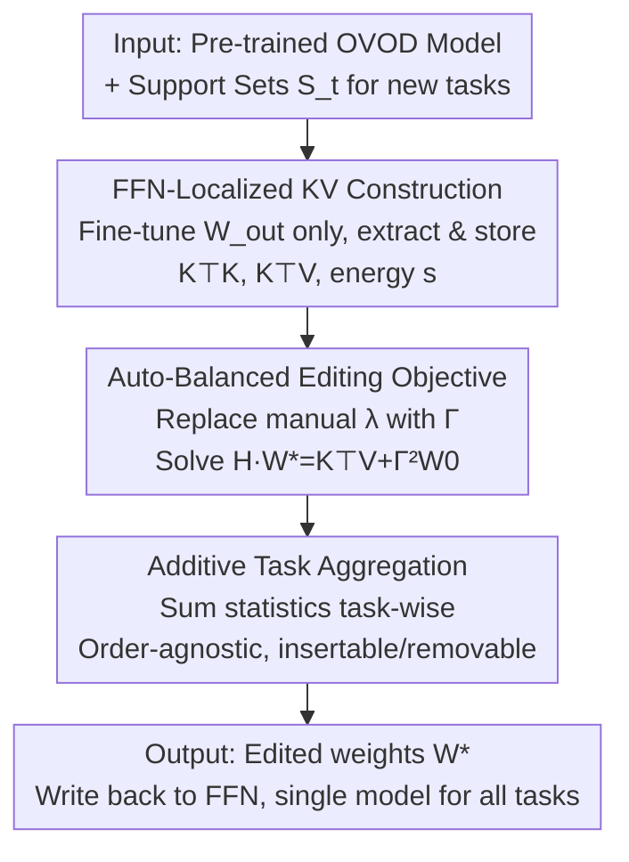

# Retain and Adapt: Auto-Balanced Model Editing for Open-Vocabulary Object Detection under Domain Shifts

**Conference**: ICLR 2026  
**OpenReview**: [https://openreview.net/forum?id=4fOGZWupMM](https://openreview.net/forum?id=4fOGZWupMM)  
**Code**: Project Page (Mentioned in paper, to be confirmed)  
**Area**: Open-Vocabulary Object Detection / Model Editing / Continual Learning  
**Keywords**: Open-Vocabulary Detection, Model Editing, Cross-Domain Few-Shot, Auto-Balanced, Order-Agnostic

## TL;DR
This work introduces "model editing" to Open-Vocabulary Object Detection (OVOD) for the first time. By fine-tuning only the FFN output projection layers and storing compact KV covariance statistics, the method utilizes a data-adaptive diagonal matrix $\Gamma$ to replace the manually tuned hyperparameter $\lambda$. This approach automatically balances "retaining pre-trained capabilities" and "adapting to new domains"—achieving an Adaptation Gain Ratio (AGR) of approximately 95–99% across 19 cross-domain few-shot tasks while retaining 94–98% of original COCO performance. Furthermore, tasks can be added or removed in any order without retraining.

## Background & Motivation

**Background**: OVOD models (e.g., Grounding DINO, GLIP) leverage vision-language pre-training to recognize a vast array of categories without exhaustive labeling, showing strong performance on in-distribution benchmarks. However, accuracy drops significantly when encountering Out-of-Distribution (OOD) shifts—such as changes in image style, acquisition conditions, resolution, or unseen domains/categories. Continuously deploying such models in real-world environments requires the ability to constantly absorb new domain knowledge.

**Limitations of Prior Work**: Traditional approaches rely on continual learning to integrate new tasks sequentially while minimizing forgetting. However, they face three major issues: first, they **do not explicitly consider pre-trained knowledge**, only balancing between new tasks, which often decays the model's inherent capabilities; second, they are **highly dependent on fixed task sequences**, showing extreme sensitivity to ordering (experiments show SD-LoRA has high variance across 20 random task orders); third, they **require retraining**, which limits flexibility and efficiency. Alternatively, few-shot fine-tuning works for single small datasets but is unscalable across domains and often degrades base performance.

**Key Challenge**: The fundamental problem lies in the trade-off between "Reliability (learning new knowledge)" and "Locality (retaining old capabilities)." Existing methods either ignore Locality or rely on a manually tuned hyperparameter $\lambda$ that varies with model/task scale, making it inefficient and non-generalizable.

**Goal**: To design a lightweight and flexible knowledge injection mechanism that achieves an automatic balance between new and old knowledge without retraining or sequence dependency, with storage costs independent of the number of tasks.

**Key Insight**: The authors observe that model editing (originally used in LLMs to inject facts without affecting the whole model) is naturally suited for this scenario. A critical experimental finding reveals that in few-shot OVOD, **fine-tuning only the FFN parameters yields performance close to full-model fine-tuning** (see Table 11), suggesting that FFNs are the primary locations for knowledge storage, making lightweight editing sufficient.

**Core Idea**: The few-shot adaptation of OVOD is reformulated as a "KV editing problem in FFN layers." A diagonal regularization matrix $\Gamma$ is constructed using **data statistics** (energy $s_i$ of each feature dimension) to replace the manual $\lambda$, allowing the balance between new and old knowledge to occur "automatically."

## Method

### Overall Architecture

The ABME (Auto-Balanced Model Editing) process can be summarized as "**compressing each new task into a set of KV statistics and merging them into FFN weights via a closed-form linear equation**." The workflow is as follows: For each new task, fine-tune only the FFN output projection matrix $W_{out}$ to obtain a task-adapted model; pass the support set through this model and record inputs (key $K$) and outputs (value $V$) at the edited FFN layers. **Instead of storing full matrices**, only the compact covariance $K^\top K$, cross-covariance $K^\top V$, and energy statistics $s$ are accumulated (storage is independent of task count). Finally, these statistics are substituted into an auto-balanced objective to solve a symmetric positive definite linear system for the edited weights $W^\star$. Since the statistics are **additive**, multiple tasks (or any subset) can be combined or removed by simply adding/subtracting their respective $K^\top K$, $K^\top V$, and $\Gamma^2$ without retraining.

### Key Designs

**1. FFN-Localized KV Knowledge Construction: Compressing Tasks into Constant-Size Statistics**

OVOD models are massive, so storing complete key/value matrices per task is impractical—the number of rows $n_i$ in $K_i, V_i$ within the visual backbone grows with the number of samples and patches. Borrowing the insight from LLM editing that "FFNs are knowledge storage points," the parameters for editing are locked to the FFN output projection matrix $W_{out}\in\mathbb{R}^{d_0\times d_1}$. The process involves two steps: first, $W_{out}$ is treated as the sole learnable parameter to fine-tune a task-adapted model using standard detection loss $\min_{\theta_i}\mathcal{L}_{det}(\theta_i; S_i)$; second, the support set $S_i$ is passed through this model to extract $K_i\in\mathbb{R}^{n_i\times d_0}$ and $V_i\in\mathbb{R}^{n_i\times d_1}$.

Crucially, **the original matrices are not retained**: the authors prove that subsequent optimization only requires the covariance $K_i^\top K_i$ and cross-covariance $K_i^\top V_i$ (dimensions $d_0\times d_0$ and $d_0\times d_1$, decoupled from sample count $n_i$). This step ensures storage costs remain constant, which is the prerequisite for scalability.

**2. Auto-Balanced Editing Objective: Eliminating Manual Hyperparameters $\lambda$ with Data-Adaptive $\Gamma$**

A naive editing objective uses ridge regression with $\lambda$: $\min_W \|KW-V\|_F^2 + \lambda\|W-W_0\|_F^2$. However, $\lambda$ has no analytical solution and requires heuristic searching; even worse, it is **not generalizable** across different tasks or models.

The proposed approach replaces the scalar $\lambda$ with a **data-driven diagonal matrix** $\Gamma$:

$$\min_W \|KW-V\|_F^2 + \|\Gamma(W-W_0)\|_F^2, \quad \Gamma=\mathrm{diag}\big(s_1^{1/4},\dots,s_d^{1/4}\big),\ s_i=\sum_t k_{ti}^2.$$

Intuitively, the regularization weight applied to the squared norm of the $i$-th row of $(W-W_0)$ is $\Gamma_{ii}^2=s_i^{1/2}$, where $s_i$ is the energy sum of all sample features in the $i$-th key dimension. Specifically: **the more "active" (higher energy) the new data is in a certain feature dimension, the more the weights are allowed to shift toward new knowledge; dimensions with lower energy conservatively adhere to original weights.** Thus, the balance occurs automatically based on data distribution.

**3. Order-Agnostic Editing via Additive Aggregation: Solving a Closed-Form Linear System**

Differentiating the objective with respect to $W$ yields a linear system. Let $H:=K^\top K+\Gamma^2$ (positive definite when $\Gamma$ is strictly positive diagonal). The unique optimal solution is:

$$W^\star = H^{-1}\big(K^\top V + \Gamma^2 W_0\big).$$

In practice, $H W^\star = K^\top V + \Gamma^2 W_0$ is solved numerically. Most importantly, the solution depends only on aggregated statistics: $K^\top K=\sum_t K_t^\top K_t$, $K^\top V=\sum_t K_t^\top V_t$, and $\Gamma^2=\sum_t \Gamma_t^2$ are all **task-wise additive**. This simple summation rule provides two benefits: first, multi-task editing is order-agnostic; second, it supports seamless insertion or removal of tasks without retraining.

### Loss & Training
During the fine-tuning stage, only $W_{out}$ is optimized using the standard detection loss $\mathcal{L}_{det}$ (Eq. 2) while other parameters are frozen. The editing stage is not "training" but rather solving a closed-form linear system for $W^\star$. The exponent in $\Gamma$ is set to $1/4$ based on ablation studies. There are no hyperparameters requiring cross-model or cross-task re-tuning.

## Key Experimental Results

Datasets: CDFSOD (6 cross-domain few-shot detection datasets) + ODinW-13, totaling 19 tasks with significant distribution shifts; shots $K\in\{1,5,10,30,50\}$. Metrics include COCO-style AP and **RR (Retention Ratio)** to measure old capability preservation, and **AGR (Adaptation Gain Ratio)** to measure adaptation relative to full fine-tuning. Models evaluated: Grounding DINO and GLIP.

### Main Results

CDFSOD (Table 2, Avg represents the average of 6 datasets):

| Shots | Method | Avg (New Tasks) | COCO | RR | AGR |
|-------|------|------|------|------|------|
| 1-shot | EWC | 20.0 | 57.6 | 96.5% | 90.9% |
| 1-shot | SD-LoRA | 19.8 | 52.5 | 87.9% | 90.0% |
| 1-shot | **Ours** | **21.7** | 57.5 | 96.3% | **98.6%** |
| 5-shot | Adam-NSCL | 29.1 | 57.8 | 96.8% | 73.5% |
| 5-shot | **Ours** | **38.5** | 57.0 | 95.5% | **97.2%** |
| 10-shot | **Ours** | **41.0** | 56.8 | 95.1% | **95.6%** |
| 30-shot | **Ours** | **46.7** | 55.1 | 92.3% | **95.5%** |
| 50-shot | **Ours** | **48.0** | 54.5 | 91.3% | **95.0%** |

Key observations: The base model Avg is only 17.7 (OOD failure). ABME consistently reaches ~95-99% AGR across shots, significantly higher than EWC/Adam-NSCL/SD-LoRA (whose AGR ranges between 60-90%), while maintaining RR at ~91-96%.

### Ablation Study

| Configuration | Key Observation | Description |
|------|---------|------|
| Manual $\lambda\in\{1,5,10,15,20\}$ | New task mAP is consistently lower than Auto-Balance | Fixed $\lambda$ cannot outperform the adaptive $\Gamma$ (Fig. 2a). |
| Auto-Balance (Ours) | New task mAP leads throughout; COCO remains competitive | Generalizes across task scales without parameter search. |
| Randomized Task Order ×20 (SD-LoRA) | Large error bars | Traditional CL is highly sensitive to sequence (Fig. 2b). |
| Randomized Task Order ×20 (Ours) | Stable performance | Aggregation via Eq. 7 is sequence-independent. |
| EWC+Ours / SD-LoRA+Ours | Significant improvements in both tasks and COCO | Can be stacked with current CL methods to boost performance. |

### Key Findings
- **Auto-Balanced objective is the core contributor**: Replacing manual $\lambda$ with data-adaptive $\Gamma$ not only avoids parameter searching but also consistently outperforms fixed $\lambda$ settings.
- **Order independence stems from additive statistics**: Unlike traditional CL methods that exhibit high variance based on task order, ABME is stable due to the summation logic, making it ideal for real-world deployment.
- **Orthogonality to existing methods**: Using FFN editing as a module on top of EWC/SD-LoRA pushes their AGR from 60-70% to 90%+, showing complementarity between editing and structural regularization.

## Highlights & Insights
- **Transferring KV Editing to Detection**: The core insight that "FFN in OVOD is a knowledge repository" allows the "locate-then-edit" paradigm from LLMs to be successfully migrated to vision tasks.
- **Data Energy as Regularization Weights**: Defining $\Gamma_{ii}$ based on $s_i$ allows the regularization strength to be dimension-wise and data-adaptive, effectively bypassing the tuning of $\lambda$.
- **Storage Decoupled from Task Count**: Storing only the covariance matrices ensures that storage remains constant regardless of the number of tasks or samples encountered.

## Limitations & Future Work
- **FFN Output Projection Focus**: If knowledge is not primarily stored in the FFN, or if a domain shift requires modifying attention/backbone representations, single-point editing might be insufficient.
- **Dependency on Initial Fine-tuning**: Constructing the KV pair requires a preliminary fine-tuning of $W_{out}$, which, while lightweight, is not entirely training-free.
- **RR Decay at High Shots**: 50-shot experiments show RR dropping to ~91%, indicating a modest but present trade-off between knowledge injection and retention.

## Related Work & Insights
- **vs. LLM Model Editing**: While methods like ROME perform locate-then-edit for linguistic facts, this work adapts the KV framework for detection domain knowledge and replaces manual trade-offs with data-driven auto-balancing.
- **vs. Continual Learning**: Unlike EWC or SD-LoRA which use regularization to inhibit forgetting, ABME focuses on preserving pre-trained knowledge explicitly and enables order-agnostic task management.
- **vs. Few-shot OVOD Fine-tuning**: Traditional methods are task-specific and risk harming original capabilities; this work reformulates adaptation as an editing problem to cover multiple tasks with a single model.

## Rating
- Novelty: ⭐⭐⭐⭐⭐ 
- Experimental Thoroughness: ⭐⭐⭐⭐ 
- Writing Quality: ⭐⭐⭐⭐ 
- Value: ⭐⭐⭐⭐⭐ 

<!-- RELATED:START -->

## Related Papers

- [\[ICLR 2026\] OVID: Open-Vocabulary Intrusion Detection](ovid_open-vocabulary_intrusion_detection.md)
- [\[ICLR 2026\] DeCo-DETR: Decoupled Cognition DETR for efficient Open-Vocabulary Object Detection](deco-detr_decoupled_cognition_detr_for_efficient_open-vocabulary_object_detectio.md)
- [\[ICLR 2026\] Fantastic Tractor-Dogs and How Not to Find Them With Open-Vocabulary Detectors](fantastic_tractor-dogs_and_how_not_to_find_them_with_open-vocabulary_detectors.md)
- [\[CVPR 2026\] WeDetect: Fast Open-Vocabulary Object Detection as Retrieval](../../CVPR2026/object_detection/wedetect_fast_open-vocabulary_object_detection_as_retrieval.md)
- [\[ECCV 2024\] LaMI-DETR: Open-Vocabulary Detection with Language Model Instruction](../../ECCV2024/object_detection/lami-detr_open-vocabulary_detection_with_language_model_instruction.md)

<!-- RELATED:END -->
