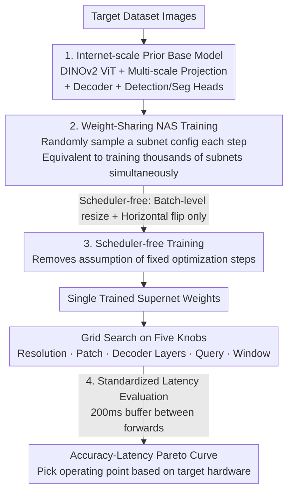

# RF-DETR: Neural Architecture Search for Real-Time Detection Transformers

**Conference**: ICLR 2026  
**OpenReview**: [https://openreview.net/forum?id=qHm5GePxTh](https://openreview.net/forum?id=qHm5GePxTh)  
**Code**: https://github.com/roboflow/rf-detr (Available)  
**Area**: Object Detection  
**Keywords**: Real-Time Detection, DETR, Neural Architecture Search, Weight-Sharing, Accuracy-Latency Trade-off

## TL;DR
RF-DETR utilizes DINOv2 internet-scale pre-training combined with end-to-end weight-sharing NAS to train a "supernet." This approach allows a single training session to export an entire accuracy-latency Pareto curve via grid search without retraining. It is the first real-time detector to exceed 60 AP on COCO and outperforms GroundingDINO on the real-world dataset RF100-VL with a 20x speedup.

## Background & Motivation

**Background**: Current real-time object detection follows two main paradigms. One consists of open-vocabulary detectors (VLM-based methods like GroundingDINO or YOLO-World) that achieve strong zero-shot generalization through internet-scale image-text pre-training. The other consists of closed-vocabulary "expert" detectors (D-FINE, RT-DETR, LW-DETR), which are fast but limited in their accuracy ceilings.

**Limitations of Prior Work**: While VLMs possess strong zero-shot capabilities, they require fine-tuning when encountering out-of-distribution categories or modalities (e.g., industrial, medical, or remote sensing data). This fine-tuning often results in the loss of open-vocabulary generalization and slower inference due to heavy text encoders. Conversely, although expert detectors are fast, the authors found that they **implicitly overfit COCO**. Backbones, learning rate schedulers, and data augmentation strategies tailored for COCO generalize poorly to real-world datasets with significant distribution shifts (e.g., YOLOv8 shows almost no improvement on RF100-VL as the model scale increases).

**Key Challenge**: A trade-off exists between accuracy and latency, and **this trade-off point is highly dependent on target hardware and dataset characteristics** (number of objects per image, number of categories, and data scale). Traditional hardware-aware NAS can find trade-off points, but the cost of re-searching and retraining for every new hardware target is extremely high.

**Goal**: (1) Enable expert detectors to leverage internet-scale priors to restore generalization on real-world data; (2) Obtain a full Pareto curve of optional operating points without retraining for each hardware/dataset; (3) Standardize disorganized latency evaluation metrics.

**Key Insight**: The authors adopt the "weight-sharing NAS" philosophy from OFA (Once-For-All)—optimizing thousands of subnets within the same set of weights during training to decouple "training" from "architecture search." Key observations include: input/architectural parameters like image resolution and patch size can vary randomly during training, while inference configurations like the number of decoder layers and query tokens can be pruned directly during inference without fine-tuning.

**Core Idea**: For the first time, apply end-to-end weight-sharing NAS to detection and segmentation. Train a strong DINOv2-based base model such that its subnets are usable out-of-the-box, then use grid search on the validation set to trace the Pareto curve.

## Method

### Overall Architecture

The input to RF-DETR is the target dataset, and the output is a complete accuracy-latency Pareto curve, allowing users to select an operating point on the curve according to their hardware budget for direct deployment. The process consists of three stages: modernizing LW-DETR into a DINOv2-based base model (including detection and lightweight segmentation heads); training using a "scheduler-free + weight-sharing NAS" approach where a subnet configuration is randomly sampled for gradient updates at each iteration; and finally, performing a grid search on five "knobs" on the validation set **without further training** to find the Pareto curve, using a standardized latency protocol for fair speed measurement.

### Key Designs

**1. Internet-scale Prior Base Model: Modernizing expert detectors to leverage DINOv2 pre-training**

To address the lack of internet-scale priors in expert detectors, RF-DETR introduces three modifications to LW-DETR. Most critically, it replaces the CAEv2 backbone with **DINOv2**. The DINOv2 encoder has 12 layers (compared to CAEv2's 10 layers and patch 16); while more layers make it slower, detection accuracy is significantly higher on small datasets, and the resulting latency is mitigated by subsequent NAS. Structurally, the ViT backbone interleaves **windowed** and **non-windowed** attention blocks to balance accuracy and latency. Backbone outputs are passed through a multi-scale projector to the decoder group, where each decoder layer is connected to a detection head (box and class heads). To enable training via gradient accumulation on consumer GPUs, LayerNorm replaces BatchNorm in the projector. The authors also add a **lightweight instance segmentation head** (RF-DETR-Seg), which performs bilinear upsampling on encoder outputs to obtain pixel embedding maps. Mask generation is achieved by taking the dot product between the pixel embedding map and query token embeddings transformed via an FFN—where pixel embeddings act as segmentation prototypes. Unlike MaskDINO, it **does not introduce multi-scale backbone features** to minimize latency, and the segmentation head reuses the same low-resolution feature map as the detection head to ensure spatial alignment. The segmentation model is pre-trained on Objects-365 using SAM2 pseudo-labeled instance masks.

**2. End-to-End Weight-Sharing NAS: One training session to sweep the full Pareto curve via five knobs**

This is the core contribution, targeting the pain point of re-searching and retraining for each hardware/dataset. The approach involves **uniformly sampling a random subnet configuration at each training iteration** for gradient updates, optimizing thousands of subnets within one set of weights (similar to ensemble learning via dropout). The five adjustable "knobs" are:

- **Patch Size**: Smaller patches provide higher accuracy but require more computation. FlexiViT-style interpolation is used to transition smoothly between different patch sizes during training.
- **Number of Decoder Layers**: Since regression loss is applied to each decoder layer, any (or even all) decoder layers can be discarded during inference. Removing all decoders degrades the model to a single-stage detector.
- **Number of Query Tokens**: Queries are ranked by the maximum sigmoid value of their categorical logits at the encoder output. Low-scoring queries are dropped during inference to control the maximum number of detections and latency.
- **Image Resolution**: Positional embeddings corresponding to the "Max Resolution ÷ Min Patch" are pre-allocated and interpolated for smaller resolutions or larger patches.
- **Number of Windows per Block**: Adjusting the number of windows in windowed attention balances accuracy, global information mixing, and computational cost.

A key property is that **search begins only after the base model is fully trained on the target dataset**. Consequently, all subnets in the search space achieve strong performance without further fine-tuning, reducing the cost of "optimizing for new hardware" to a single grid search. Interestingly, subnets not explicitly seen during training also achieve high accuracy, suggesting that weight-sharing NAS generalizes to unseen architectures and acts as a form of regularization.

**3. Scheduler-free Training: Removing implicit assumptions about dataset characteristics**

To address overfitting caused by COCO-tailored schedulers/augmentations, RF-DETR adopts a scheduler-free approach. For the learning rate, it is noted that **cosine annealing assumes a known fixed number of optimization steps**, which is unrealistic for target datasets like RF100-VL with varying scales. Thus, cosine scheduling is abandoned. Regarding data augmentation, aggressive techniques (VerticalFlip, RandomResize, CachedMixUp) introduce dataset bias—for instance, a pedestrian detector in autonomous driving trained with vertical flips may produce false positives due to puddle reflections. Therefore, only horizontal flips and random cropping are retained. Additionally, while LW-DETR's image-wise random resizing pads each image to the maximum batch size causing compute waste, RF-DETR uses **batch-level resizing** to minimize padding pixels and ensures all positional encoding resolutions are seen with equal probability.

**4. Standardized Latency Evaluation: Eliminating power throttling with inter-forward buffering**

Targeting the issue of conflicting latency figures across papers (e.g., D-FINE reporting LW-DETR latency 25% faster than the original paper), the authors identify **GPU power throttling/overheating during continuous forwards** as the root cause of measurement drift. The solution is simple: **buffer 200ms** between continuous forward passes to prevent power overload, making latency measurements stable and reproducible. The authors also highlight two evaluation pitfalls: YOLO often excludes NMS from latency measurements and reports speed in FP16 while reporting accuracy in FP32 (whereas naive quantization may crash accuracy to 0 AP). Consequently, they advocate that **accuracy and latency must be reported from the same model artifact**. This benchmarking tool is released as an open-source standalone.

### Loss & Training
The detection branch follows the DETR-style set matching loss, with **loss applied to every decoder layer output**, which is the prerequisite for discarding layers during inference. The segmentation branch adds an additional segmentation loss. Compared to LW-DETR, RF-DETR uses larger batches, lower learning rates (to preserve DINOv2 pre-trained knowledge), and LayerNorm instead of BatchNorm, supplemented by Objects-365 pre-training to compensate for slower optimization. On small datasets like RF100-VL, the NAS-derived models can optionally be fine-tuned (>100 epochs to allow architecture-augmentation regularization to converge); on COCO, additional fine-tuning is rarely necessary.

## Key Experimental Results

Evaluations were conducted on COCO and RF100-VL (100 diverse real-world datasets) using NVIDIA T4 + TensorRT 10.4, grouped by latency buckets (N/S/M/L/XL/2XL) rather than parameter count.

### Main Results

COCO Detection (Comparison by latency bucket):

| Bucket | Model | Latency (ms) | AP | Comparison |
|----|------|---------|----|----|
| N | D-FINE | 2.1 | 42.7 | Baseline |
| N | LW-DETR | 1.9 | 42.9 | Baseline |
| N | **RF-DETR** | 2.3 | **48.0** | +5.3 AP over D-FINE(N) |
| M | D-FINE | 5.4 | 55.0 | Baseline |
| M | **RF-DETR** | 4.4 | **54.7** | Faster at similar tier |
| 2XL | **RF-DETR** | 17.2 | **60.1** | First real-time detector > 60 AP |

RF100-VL (Average across 100 datasets): RF-DETR(2XL) outperforms GroundingDINO(tiny) and LLMDet(tiny) by approximately +1.2 AP, with a fraction of the latency (GroundingDINO ~310ms PyTorch, RF-DETR real-time). The nano tier RF-DETR (+fine-tuning) reaches 58.6 AP, comparable to D-FINE(N) at 58.2 but with more stable generalization.

COCO Instance Segmentation: RF-DETR-Seg(nano) achieves 40.3 AP, surpassing all sizes of YOLOv8/v11 and performing 5.4% better than FastInst while being nearly 10x faster. RF-DETR-Seg(medium) reaches 45.3 AP, approaching MaskDINO(R50)'s 46.3 AP while reducing latency from 242ms* to 5.9ms.

### Ablation Study

| Configuration | AP Change vs. LW-DETR | Description |
|------|------------------------|------|
| Milder Hyperparams (Large batch / Low lr / LN replaces BN) | −1.0% | LN dropping performance for consumer hardware compatibility |
| DINOv2 Backbone (Replace CAEv2) | +2% | Internet-scale prior is the primary gain source |
| + Weight-Sharing NAS (Final Model) | Net +2% with no latency increase | NAS compensates for the slower backbone |

Backbone comparison: DINOv2 is optimal, roughly 2% higher than CAEv2. SAM2's Hiera-S, despite fewer parameters, is significantly slower (contrary to Hiera's claim of being "faster than equivalent ViTs," likely due to lack of optimization in TensorRT/Flash Attention).

### Key Findings
- **DINOv2 pre-training is the single largest gain** (+2%); a low learning rate is critical to preserve its knowledge. Weight-sharing NAS adds another +2% without increasing latency, offsetting the cost of DINOv2's deeper backbone.
- A single training session can export an entire **continuous** Pareto curve—all points on the COCO curve come from the same training, a direct dividend of decoupling training from search.
- RT-DETR outperforms D-FINE in AP50 on RF100-VL, suggesting that **D-FINE's hyperparameters indeed overfit COCO**, indirectly supporting the core argument regarding expert detector distribution shift.
- Latency measurements change drastically with a 200ms buffer (e.g., LW-DETR(M) reported 5.6ms vs 26.8ms in FP32 with buffer), indicating that many prior cross-paper latency comparisons were unfair.

## Highlights & Insights
- **First application of OFA-style weight-sharing NAS end-to-end for detection+segmentation**: Previous NAS applications in detection were often limited to "replacing the backbone." This work directly optimizes end-to-end detection accuracy to find the Pareto front, and the subnets are usable without retraining—a major engineering contribution.
- **Dense supervision of every decoder layer → Prunability at inference**: This elegant design transforms dense training-time supervision into "free" inference-time scalability, including graceful degradation to a single-stage detector.
- **The Pareto-optimal number of queries implicitly encodes dataset statistics** (average objects per image), turning "how many queries to set" from a manual hyperparameter into a discovered property of the search.
- **Serious treatment of the "dirty work" of latency reproducibility**: Identifying GPU power throttling and solving it with a 200ms buffer, alongside the call for "same artifact reporting," provides corrective value for the real-time detection community.

## Limitations & Future Work
- **Base model parameter counts are not small** (the nano tier has 30.5M parameters vs D-FINE(N)'s 3.8M). RF-DETR's "lightweight" nature is reflected in latency/GFLOPs rather than parameter count, which may not be optimal for memory-constrained scenarios.
- Architecture-augmentation regularization from weight-sharing NAS **converges slowly** on small datasets (RF100-VL requires >100 epochs for optional fine-tuning). While addressed as "optional fine-tuning," the actual cost for tiny datasets deserves closer evaluation.
- The latency protocol measures **reproducible latency rather than continuous throughput**. For deployments requiring high continuous throughput (e.g., streaming video), numbers from the 200ms buffer protocol will differ from real-world throughput.
- The comparison with VLMs is "fine-tuned closed-vocabulary vs. open-vocabulary." RF-DETR sacrifices open-vocabulary capabilities for speed and accuracy, making it unsuitable for scenarios truly requiring zero-shot open-vocabulary detection.

## Related Work & Insights
- **vs. OFA (Cai et al., 2019)**: OFA proposed weight-sharing NAS for classification with phased training and different schedulers. This work moves it end-to-end to detection/segmentation and adopts a scheduler-free approach for more diverse dataset compatibility.
- **vs. LW-DETR (Chen et al., 2024a)**: RF-DETR modernizes LW-DETR as its base—replacing the backbone with DINOv2, using batch-level resizing, replacing BN with LN, and adding NAS—achieving +2% AP with no latency increase and becoming the first real-time detector to break 60 AP on COCO.
- **vs. D-FINE / RT-DETR**: All are real-time expert detectors, but this work demonstrates their implicit overfitting to COCO. RF-DETR uses internet-scale priors and scheduler-free training to improve generalization on real-world distributions.
- **vs. GroundingDINO / LLMDet (Open-vocabulary VLMs)**: These rely on image-text pre-training for zero-shot generalization but are slow and require fine-tuning for OOD categories. RF-DETR outperforms them (post-fine-tuning) on RF100-VL with ~1/20th the latency.
- **vs. MaskDINO / FastInst (Instance Segmentation)**: RF-DETR-Seg omits multi-scale backbone features and reuses detection head features to minimize latency, approaching MaskDINO's accuracy while being dozens of times faster.

## Rating
- Novelty: ⭐⭐⭐⭐⭐ First end-to-end weight-sharing NAS for detection+segmentation; sweeping the full Pareto curve from one training is a significant paradigm shift.
- Experimental Thoroughness: ⭐⭐⭐⭐⭐ Dual benchmarks (COCO + RF100-VL), dual tasks (Detection + Segmentation), multi-dimensional ablations (Backbone/NAS/Scheduler), plus a new latency protocol.
- Writing Quality: ⭐⭐⭐⭐ Clear motivation and self-consistent design; some missing appendix references (??) slightly affect completeness.
- Value: ⭐⭐⭐⭐⭐ Open-source code and high engineering utility; practically advances both deployment and fair evaluation in real-time detection.

<!-- RELATED:START -->

## Related Papers

- [\[CVPR 2026\] YOLO-Master: MOE-Accelerated with Specialized Transformers for Enhanced Real-time Detection](../../CVPR2026/object_detection/yolo-master_moe-accelerated_with_specialized_transformers_for_enhanced_real-time.md)
- [\[ICLR 2026\] DeCo-DETR: Decoupled Cognition DETR for efficient Open-Vocabulary Object Detection](deco-detr_decoupled_cognition_detr_for_efficient_open-vocabulary_object_detectio.md)
- [\[CVPR 2026\] YOLO-ULM: Ultra-Lightweight Models for Real-Time Object Detection](../../CVPR2026/object_detection/yolo-ulm_ultra-lightweight_models_for_real-time_object_detection.md)
- [\[CVPR 2025\] Mr. DETR++: Instructive Multi-Route Training for Detection Transformers with MoE](../../CVPR2025/object_detection/mr_detr_instructive_multi-route_training_for_detection_transformers.md)
- [\[ICLR 2026\] DiffuDETR: Rethinking Detection Transformers with Denoising Diffusion Process](diffudetr_rethinking_detection_transformers_with_denoising_diffusion_process.md)

<!-- RELATED:END -->
