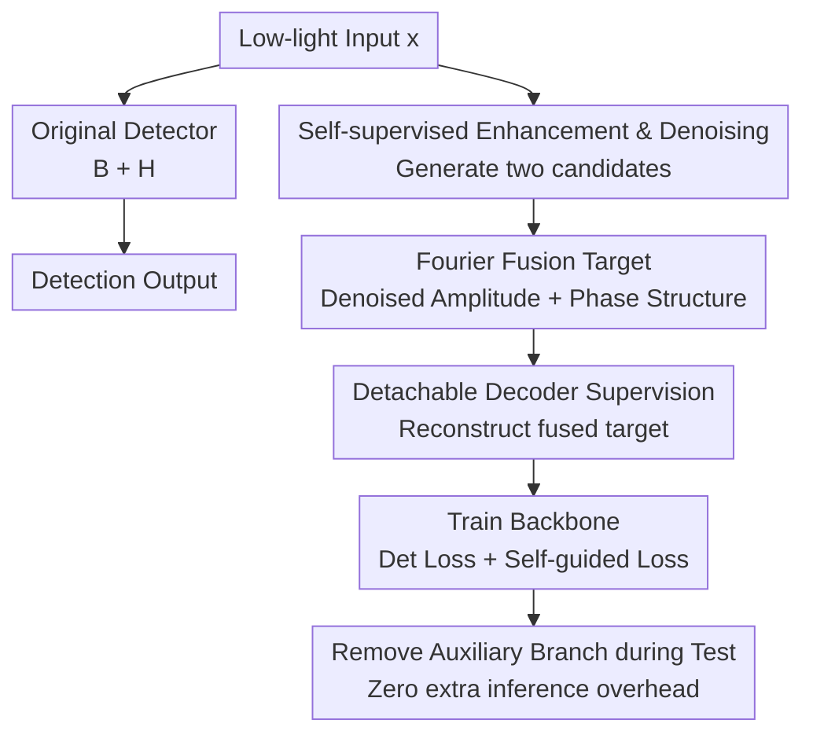

# Self-Guided Low Light Object Detection Framework

**Conference**: ICLR 2026  
**OpenReview**: [https://openreview.net/forum?id=MGgAJ8yy2D](https://openreview.net/forum?id=MGgAJ8yy2D)  
**Code**: https://github.com/gw-shin/SGLDet  
**Area**: Object Detection / Low-Light Object Detection  
**Keywords**: Low-Light Object Detection, Self-Guided Supervision, Image Enhancement, Image Denoising, Fourier Fusion

## TL;DR

This paper proposes SGLDet: during training, a detachable enhancement-denoising-Fourier fusion auxiliary branch is attached to a standard detector. It generates pixel-level supervision from the low-light images themselves to strengthen backbone representations. Since the auxiliary branch is removed during testing, it significantly improves performance on DARK FACE, ExDark, and nuImages night detection without increasing inference overhead.

## Background & Motivation

**Background**: Common approaches for low-light object detection follow three main routes: using low-light image enhancement (LLIE) models to brighten images before detection; modifying the detector architecture to suit dark scenes; or performing domain adaptation from day/normal-light domains to night/low-light domains. These methods all aim to address low contrast, strong noise, and blurred boundaries in low-light camera images, which make it difficult for the detector's backbone to extract stable local structural and semantic features.

**Limitations of Prior Work**: While enhancement pre-processing is intuitive, many LLIE methods are optimized for human perception and do not necessarily benefit detection. Brightening images often amplifies noise, presenting the detector with "brighter but dirtier" inputs. Specialized detectors for dark light can provide gains but usually increase modules, parameters, or latency during inference. Denoising models suppress noise but risk blurring edges and small object details, with unacceptable inference delays. Domain adaptation does not add inference overhead, but when the gap between source and target domains is large (e.g., transferring from daytime driving to real-world night scenes), source domain bias leads to unstable results.

**Key Challenge**: Low-light detection truly requires the backbone to learn "cleaner and more structured low-light representations during training" rather than "running extra image processing modules during testing." However, relying solely on bounding box supervision provides sparse signals, making it difficult for the detector to learn dense boundary, brightness, and noise patterns, especially for small objects, faces, and night driving targets.

**Goal**: The authors aim to introduce the benefits of enhancement and denoising into detection training while avoiding two side effects: first, enhancement/denoising modules must not remain in the inference path to slow it down; second, neither enhancement alone (only brightening) nor denoising alone (only smoothing) serves as an ideal supervision target. The method should rely only on the low-light images themselves, without requiring paired normal-light ground truth or additional source domain data.

**Key Insight**: The observation is that a low-light input can generate its own "better-suited supervision" target through self-supervised enhancement and denoising. Enhancement results better preserve structural and semantic details but amplify noise; the result of denoising after enhancement has lower noise but potentially smoothed boundaries. In the Fourier domain, amplitude tends to capture low-level statistics like brightness, noise, and style, while the phase carries structure and semantics. Thus, one can extract the required components from both.

**Core Idea**: Use a detachable self-guided auxiliary branch during training to fuse the "phase of the enhanced image" and the "amplitude of the denoised enhanced image" into a dense target. Use reconstruction loss to supervise the detector backbone and retain only the original detector during testing.

## Method

### Overall Architecture

During testing, the input and output of SGLDet are identical to a standard detector: the low-light input $x$ is processed by backbone $B$ to extract features, and the detection head $H$ outputs boxes and categories. The new components exist only during training: the low-light image $x$ also enters an auxiliary target construction pipeline, first enhanced to get $x_E$, then denoised on the enhanced image to get $x_{E+D}$, followed by Fourier fusion to construct the supervision target $\hat{x}$. The features from the detector backbone are passed through a detachable decoder $G$ to reconstruct $\tilde{x}$, and a pixel-level self-guided loss is applied between $\hat{x}$ and $\tilde{x}$.

The key to this process is that the auxiliary pipeline does not change the detection input or the model structure during testing. During training, the detection loss $L_{det}$ handles the box-level task, while the reconstruction loss $L_{self}$ supplements the backbone with dense structural and noise-aware supervision. During testing, the enhancement module, denoising module, Fourier fusion, and decoder are all removed, keeping parameters, FLOPs, and inference time identical to the baseline detector.

### Key Designs

**1. Detachable Self-guided Branch: Converting low-light priors into dense backbone supervision**

The difficulty in low-light detection is not that the detector is completely blind, but that box-level supervision is too sparse to tell the backbone which textures and boundaries should be preserved. SGLDet attaches a U-Net style decoder $G$ to the backbone during training, receiving feature maps via skip connections. This assigns an additional task to the backbone layers: reconstruct a target image $\hat{x}$ better suited for detection. Thus, the detector is trained not just by bounding boxes but also constrained by pixel-level targets, forcing features to be more sensitive to boundaries and object-background separation.

**2. Self-supervised Enhancement and Denoising: Constructing candidates using only target domain images**

Instead of using paired normal-light images, the authors use self-supervised modules (SCI for enhancement and SDAP for denoising) that can be trained on the target dataset. The enhancement module $E$ produces $x_E = E(x)$, improving brightness and contrast. The denoising module $D$ is applied to the enhanced image to yield $x_{E+D} = D(x_E)$. This ensures the target estimate comes entirely from the current low-light domain without requiring LOL-like paired data or daytime source domains.

**3. Fourier Fusion Target: Preserving noise levels and structural details via denoised amplitude and enhanced phase**

Fourier Transform maps a single-channel image $x$ to the complex frequency domain $X(u,v)$, where amplitude $A(u,v)$ reflects low-level statistics and phase $P(u,v)$ preserves spatial structure. The paper performs FFT on RGB channels, then takes the phase from the enhanced image $x_E$ and the amplitude from the denoised image $x_{E+D}$, constructing the fused target via inverse FFT: $\hat{x} = iFFT(A(x_{E+D}) \cdot e^{jP(x_E)})$. This provides the backbone with enhanced boundaries from the phase and suppressed noise from the amplitude.

**4. Multi-task Loss Balancing: Helping detection rather than overshadowing it**

The total loss is $L_{total}=L_{det}+\lambda \cdot L_{self}$, where $L_{self}=\|\tilde{x}-\hat{x}\|_2^2$. Sensitivity analysis on DARK FACE shows $\lambda=0.01$ is optimal. If $\lambda$ is too small, the guidance is weak; if too large, the reconstruction task dominates, pulling features away from object localization and degrading mAP.

## Key Experimental Results

### Main Results

| Dataset / Setting | Baseline | Ours | Prev. SOTA | Gain |
|--------|------|------|----------|------|
| DARK FACE / DSFD | 59.7 mAP | 76.6 mAP | DAI-Net 68.5 mAP / Retinexformer 68.1 mAP | +16.9 over baseline |
| ExDark / YOLOv3-608 | 76.4 mAP | 78.6 mAP | DAI-Net 78.3 mAP | +2.2 over baseline |
| nuImages Night / YOLOv8-m scratch | 52.4 mAP | 55.3 mAP | SCI 53.5 mAP | +2.9 over baseline |
| nuImages Day→Night finetune | 56.4 mAP | 58.0 mAP | DAI-Net 54.4 mAP | +1.6 over baseline |

| Method Category | Method | DARK FACE mAP | Extra Inference Cost |
|------|------|------|------|
| Baseline Detector | DSFD | 59.7 | None |
| Supervised LLIE | Retinexformer | 68.1 | 43.73 ms |
| Domain Adaptation | DAI-Net | 68.5 | None, but needs source domain |
| Self-Guided Framework | Ours | 76.6 | None |

### Ablation Study

| Configuration | DARK FACE mAP | Notes |
|------|---------|------|
| DSFD baseline | 59.7 | Detection loss only |
| Enhancement target $E$ only | 72.9 | Brightness improved but noise amplified |
| $E + D$ (no fusion) | 72.2 | Noise suppressed but edges blurred |
| $E + D$ + Fourier fusion | 76.6 | Best: preserved structure + lower noise |

### Key Findings

- **Fourier fusion is critical**: Using the denoised image directly causes a drop (72.2) compared to the enhanced image (72.9), but fusion achieves 76.6.
- **Robustness to module choice**: Even using simple Gamma correction and Gaussian blur yields 70.9 mAP, significantly above the baseline.
- **Superior to Domain Adaptation**: On nuImages, DA methods (MAET/DAI-Net) performed worse than the baseline, while SGLDet achieved 58.0, showing better robustness to large domain gaps.
- **Zero Inference Overhead**: SGLDet maintains the same inference speed as the baseline (e.g., 170.1 FPS for YOLOv8-m), whereas LLIE methods like GLARE drop to 0.2 FPS.

## Highlights & Insights

- The "train-time auxiliary, test-time removal" paradigm is ideal for real-time perception, providing representation migration rather than visual pre-processing benefits at test time.
- Fourier fusion accurately addresses the trade-off between enhancement and denoising by separating "clean statistics" from "clear layout."
- The method shifts the focus from making images "look better" to making features "easier to learn" for the detector.
- It is detector-agnostic, as demonstrated by gains across DSFD, YOLOv3, and YOLOv8-m.

## Limitations & Future Work

- **Training Complexity**: While inference cost is zero, the auxiliary branch increases training complexity and time.
- **Dependency on Target Quality**: The effectiveness depends on the quality of $\hat{x}$; specialized degradations (rainy nights, motion blur) may require different module combinations.
- **Fourier Assumptions**: Amplitude and phase do not always separate style and structure perfectly, particularly under strong glare or overexposed highlights.

## Related Work & Insights

- **vs LLIE**: SGLDet avoids the extra computation of LLIE modules at test time.
- **vs Specialized Detectors**: Unlike T2, SGLDet does not modify the inference architecture, making it easier to integrate into existing frameworks.
- **vs Domain Adaptation**: Unlike DAI-Net, SGLDet does not rely on daytime source domains, making it more stable for real-world night transitions.

## Rating

- Novelty: ⭐⭐⭐⭐☆
- Experimental Thoroughness: ⭐⭐⭐⭐⭐
- Writing Quality: ⭐⭐⭐⭐☆
- Value: ⭐⭐⭐⭐⭐

<!-- RELATED:START -->

## Related Papers

- [\[AAAI 2026\] LoReTTA: A Low Resource Framework To Poison Continuous Time Dynamic Graphs](../../AAAI2026/object_detection/loretta_a_low_resource_framework_to_poison_continuous_time_dynamic_graphs.md)
- [\[ICLR 2026\] PGRF-Net: A Prototype-Guided Relational Fusion Network for Diagnostic Multivariate Time-Series Anomaly Detection](pgrf-net_a_prototype-guided_relational_fusion_network_for_diagnostic_multivariat.md)
- [\[ICLR 2026\] CGSA: Class-Guided Slot-Aware Adaptation for Source-Free Object Detection](cgsa_class-guided_slot-aware_adaptation_for_source-free_object_detection.md)
- [\[ICLR 2026\] Complexity- and Statistics-Guided Anomaly Detection in Time Series Foundation Models](complexity-_and_statistics-guided_anomaly_detection_in_time_series_foundation_mo.md)
- [\[ICML 2026\] EARL: Towards a Unified Analysis-Guided Reinforcement Learning Framework for Egocentric Interaction Reasoning and Pixel Grounding](../../ICML2026/object_detection/earl_towards_a_unified_analysis-guided_reinforcement_learning_framework_for_egoc.md)

<!-- RELATED:END -->
