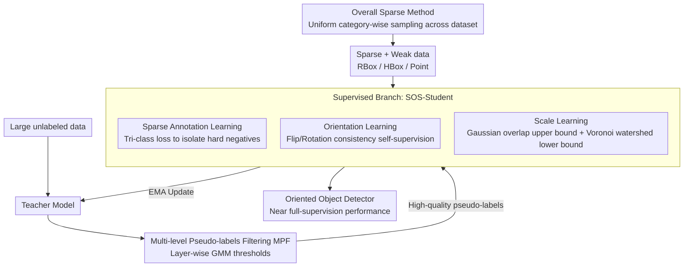

# SPWOOD: Sparse Partial Weakly-Supervised Oriented Object Detection

**Conference**: ICLR 2026  
**arXiv**: [2602.03634](https://arxiv.org/abs/2602.03634)  
**Code**: None  
**Area**: Object Detection / Remote Sensing  
**Keywords**: Oriented Object Detection, Weakly-Supervised, Sparse Annotation, Semi-Supervised, Remote Sensing

## TL;DR
The first unified framework for oriented object detection, SPWOOD, is proposed to handle "sparse annotation + weak annotation (HBox/Point)". It utilizes SOS-Student to parallelize three learning signals—unlabeled, missing angle, and missing scale—within a single student model, then incorporates Multi-level Pseudo-labels Filtering (MPF) for self-training from unlabeled data. It achieves performance close to full supervision on DOTA-v1.0/v1.5 and DIOR using mixed annotations (RBox:HBox:Point=1:1:1).

## Background & Motivation

**Background**: Oriented Object Detection (OOD) is critical in fields such as remote sensing, but precise Rotated Box (RBox) annotations are extremely costly, requiring the labeling of center points, width/height, and rotation angles.

**Limitations of Prior Work**: Existing methods for reducing annotation costs either address only weak labels (e.g., using Horizontal Box HBox or Point instead of RBox) or only sparse labels (labeling only a subset of instances). In practical scenarios, both issues often coexist.

**Key Challenge**: Both sparse annotation (not all instances are labeled) and weak annotation (labels are imprecise) cause a significant loss of training signals. Their combination exacerbates the problem: unlabeled instances may be treated as negative samples, and weak labels may lead to erroneous angle learning.

**Goal**: How to train a high-quality oriented object detector under extreme low-cost settings where both sparse and weak annotations are present?

**Key Insight**: Design a unified framework to learn from three different quality levels of annotation (RBox, HBox, Point) and mine unlabeled instances through self-training.

**Core Idea**: Unified processing of precise, weak, and unlabeled signals using an adaptive oriented detector, combined with spatial layout learning and angle consistency constraints to recover rotation information.

## Method

### Overall Architecture
SPWOOD addresses the extreme low-cost setting of "sparse + weak": only a small fraction of instances in a training image are labeled (sparse), and these annotations may only be HBox or Point (weak), alongside a large amount of completely unlabeled data. It decomposes this setting into two branches and two stages, following the teacher-student semi-supervised detection paradigm. The **supervised branch** features the SOS-Student (Sparse-annotation-Orientation-and-Scale-aware Student), which parallelizes three learning tasks: sparse annotation learning to distinguish "unlabeled targets" from background, orientation learning to self-supervise rotation angles from weak labels, and scale learning to regress width/height from points. The **unsupervised branch** uses Multi-level Pseudo-labels Filtering (MPF) to select reliable pseudo-labels from the teacher's predictions on unlabeled images. Training consists of two phases: a burn-in phase where the student is trained on sparse weak labels (with augmented views) while weights are mirrored to the teacher via Exponential Moving Average (EMA), followed by a self-training phase where the teacher generates pseudo-labels for unlabeled data, which are filtered by MPF to supervise the student, creating a positive feedback loop. Additionally, SPWOOD employs the Overall Sparse Method for dataset construction, sampling each category at a uniform ratio across the whole dataset instead of per image, preventing the over-retention of rare classes.

### Key Designs

**1. SOS-Student Sparse Annotation Learning: Distinguishing "Unlabeled Targets" from Background**

In sparse settings, unlabeled ground-truth targets share the same "background" label as the actual background, causing them to be incorrectly penalized as negatives. SOS-Student adapts Focal Loss by partitioning predictions into three groups based on confidence and GT matching: high-confidence samples matching GT classes are labeled positives, low-confidence samples matching background are true background, and **high-confidence samples matching background** are identified as "unlabeled targets (hard negatives)." Standard Focal Loss is applied to the first two groups, while an adaptive factor $\omega$ suppresses the loss for the third group to prevent these targets from being driven toward the background. The classification loss is defined as:

$$\mathcal{L}_{cls}^{s}=\begin{cases}-\alpha_t(1-p_t)^{\gamma}\log(p_t) & \text{正样本}\\ -(1-\alpha_t)p_t^{\gamma}\log(1-p_t) & \text{负样本},\ p_t\le thr\\ -(1-\alpha_t)p_t^{\gamma}\log(1-p_t)\,\omega & \text{硬负样本},\ p_t> thr\end{cases}$$

where $p_t$ is confidence, $thr$ is the threshold, and $\omega$ is the adaptive factor. This maintains Focal Loss properties while specifically decoupling false negatives in sparse scenarios.

**2. Orientation Learning: Self-supervising Missing Angles via Geometric Consistency**

HBox and Point lack directional information, making the rotation angle the most difficult attribute to recover. SOS-Student utilizes a robust prior: when an image undergoes a flip or rotation augmentation, the orientation of an object changes by a known transformation. A random augmentation (flip or rotation by angle $\mathcal{R}$) is applied to each image, and the student is required to produce consistent angle predictions between the original and augmented versions. The supervision is formulated as:

$$\mathcal{L}_{Ang}^{s}=\begin{cases} L_{Ang}^{s}(\theta_{flp}+\theta,\,0) & \text{翻转增强}\\ L_{Ang}^{s}(\theta_{rot}-\theta,\,\mathcal{R}) & \text{旋转 }\mathcal{R}\end{cases}$$

Using Smooth-L1 for $L_{Ang}^s$, gradients for angle regression are provided without any angle annotations.

**3. Scale Learning: Constraining Dimensions via Spatial Layout Upper and Lower Bounds**

Since Point annotations only provide center locations, dimensions must be inferred. The paper adopts spatial layout learning to "sandwich" the scale between an upper and lower bound. The upper bound is enforced by a **Gaussian Overlap Loss** $\mathcal{L}_O^s$, modeling predictions as 2D Gaussian distributions and minimizing their Bhattacharyya distance, $\mathcal{L}_O^s=\frac{1}{N}\sum_{i\ne j}B(\mathcal{N}_i,\mathcal{N}_j)$, to prevent boxes from expanding indefinitely. The lower bound is enforced by a **Voronoi Watershed Loss** $\mathcal{L}_W^s$: a Voronoi diagram is constructed from all point labels to isolate instances, followed by a watershed algorithm for foreground classification to obtain contours. These contours are used to regress width and height via Gaussian Wasserstein Distance $\mathcal{L}_W^s=L_{GWD}\!\left((w/2,h/2)^2,(w_t/2,h_t/2)^2\right)$.

**4. Multi-level Pseudo-labels Filtering (MPF): Layer-specific Thresholds for FPN**

The quality of pseudo-labels in self-training is critical. Traditional fixed-threshold methods ignore the fact that different Feature Pyramid Network (FPN) layers (P3–P7) handle different scales, leading to inconsistent confidence distributions. MPF models the confidence of predictions for each layer $i$ using a two-component Gaussian Mixture Model (GMM):

$$\mathcal{P}^{i}(c^{i})=w_p^i\mathcal{N}_p^i(\mu_p^i,(\sigma_p^i)^2)+w_n^i\mathcal{N}_n^i(\mu_n^i,(\sigma_n^i)^2)$$

After solving via Expectation-Maximization (EM), the optimal point of the positive component is taken as the layer threshold $\tau^i=\arg\max_{c^i}\mathcal{P}^i(c^i,\mu_p^i,(\sigma_p^i)^2)$. This adaptive filtering is more robust than a global threshold.

### Loss & Training
The total supervised loss is a weighted sum: $\mathcal{L}^s=w_{cls}\mathcal{L}_{cls}^s+w_{cen}\mathcal{L}_{cen}^s+w_{box}\mathcal{L}_{box}^s+w_{Ang}\mathcal{L}_{Ang}^s+w_O\mathcal{L}_O^s+w_W\mathcal{L}_W^s$, with classification/centerness/box weights set to 1, and $(w_{Ang},w_O,w_W)$ default to $(0.2,10,5)$. The unsupervised branch calculates consistency losses $\mathcal{L}^u$ for classification, centerness, and box matching. The final loss is $\mathcal{L}=\mathcal{L}^s+\mathcal{L}^u$.

## Key Experimental Results

### Main Results

| Method | Type | 10% Sparse·10% Partial | 20%·20% | 30%·20% |
|------|------|-----------------|---------|---------|
| H2RBox-v2 | Weak (HBox) | 30.6 | 42.7 | 49.2 |
| MCL | Semi (RBox) | 31.7 | 44.5 | 47.8 |
| PWOOD | Partial Weak (RBox) | 38.0 | 51.9 | 55.2 |
| RSST | Sparse (RBox) | 43.4 | 52.3 | 56.6 |
| **SPWOOD (RBox)** | **Sparse+Weak** | **48.5** | **57.8** | **60.3** |
| SPWOOD (HBox) | Sparse+Weak | 45.5 | 54.0 | 56.5 |
| SPWOOD (R:H:P=1:1:1) | Mixed | 42.4 | 53.0 | 54.8 |

### Ablation Study

| Config | mAP (10%·10%) | Description |
|------|--------------|------|
| Full SPWOOD | 48.5 | All components |
| W/o Orientation Learning | ~43 | Weak label angles inaccurate |
| W/o Spatial Layout | ~44 | Poor scale recovery for point labels |
| W/o Teacher-Student | ~40 | Unlabeled instances wasted |

### Key Findings
- SPWOOD (RBox) significantly outperforms existing methods across all sparse-partial ratios, with a maximum gain of 5+ mAP.
- Mixed annotations (R:H:P=1:1:1) still achieve performance close to full RBox sparse supervision.
- Orientation learning contributes the most in weak annotation scenarios.
- Spatial layout learning is particularly critical in extremely sparse settings.

## Highlights & Insights
- **Unified framework for multiple annotation types**: Different annotations provide varying quality of information; SPWOOD elegantly integrates three signal sources.
- **Clever use of geometric consistency**: Self-supervised angle learning via image augmentation avoids the need for explicit angle annotations.

## Limitations & Future Work
- Voronoi watershed may lose effectiveness in dense object scenarios.
- Orientation learning assumes known augmentation transforms, which may not generalize to unknown viewpoint changes in natural scenes.
- Evaluations are limited to remote sensing datasets (DOTA, DIOR); performance on natural images remains unknown.

## Related Work & Insights
- **vs Point2RBox**: Recovers RBox only from point labels; does not address sparse annotation.
- **vs PWOOD**: Handles partial weak supervision but assumes all instances have at least a weak label (does not handle sparsity).

## Rating
- Novelty: ⭐⭐⭐⭐ First unification of sparse and weak supervision for oriented detection.
- Experimental Thoroughness: ⭐⭐⭐⭐ Multiple annotation ratios and comparative methods.
- Writing Quality: ⭐⭐⭐ Methodology is clear but formulas are dense.
- Value: ⭐⭐⭐⭐ Direct practical value for low-cost remote sensing detection.

<!-- RELATED:START -->

## Related Papers

- [\[CVPR 2026\] Partial Weakly-Supervised Oriented Object Detection](../../CVPR2026/object_detection/partial_weakly-supervised_oriented_object_detection.md)
- [\[ICLR 2026\] Bootstrapping MLLM for Weakly-Supervised Class-Agnostic Object Counting](bootstrapping_mllm_for_weaklysupervised_classagnostic_object_counting.md)
- [\[CVPR 2026\] Fourier Angle Alignment for Oriented Object Detection in Remote Sensing](../../CVPR2026/object_detection/fourier_angle_alignment_for_oriented_object_detection_in_remote_sensing.md)
- [\[ICLR 2026\] Long-Context Generalization with Sparse Attention](long-context_generalization_with_sparse_attention.md)
- [\[ICLR 2026\] PGRF-Net: A Prototype-Guided Relational Fusion Network for Diagnostic Multivariate Time-Series Anomaly Detection](pgrf-net_a_prototype-guided_relational_fusion_network_for_diagnostic_multivariat.md)

<!-- RELATED:END -->
