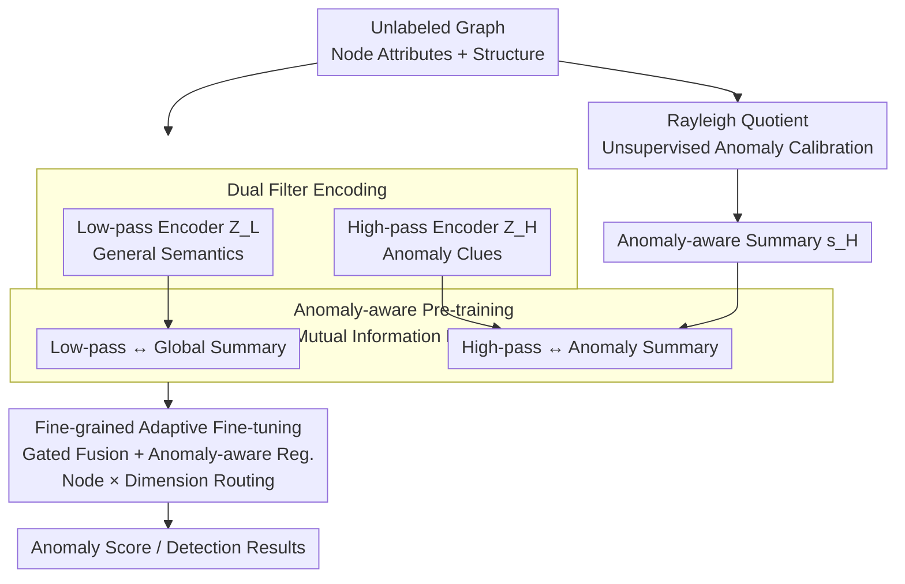

# Towards Anomaly-Aware Pre-Training and Fine-Tuning for Graph Anomaly Detection

## Paper Information
- **Conference**: ICLR 2026
- **arXiv**: [2504.14250](https://arxiv.org/abs/2504.14250)
- **Code**: [https://github.com/Cloudy1225/APF](https://github.com/Cloudy1225/APF)
- **Area**: LLM Evaluation
- **Keywords**: GAD, Pre-training and Fine-tuning, Rayleigh Quotient, Homophily Variation, Dual Filters, Gated Fusion

## TL;DR
The APF framework is proposed to address the dual challenges of label scarcity and homophily variation in graph anomaly detection through Rayleigh quotient-guided anomaly-aware pre-training and fine-grained adaptive fine-tuning.

## Background & Motivation

### Core Problem
Graph Anomaly Detection (GAD) faces two critical challenges:

**Label Scarcity**: Annotation costs are high, and annotated nodes are extremely rare in real-world scenarios.

**Homophily Variation**: This is divided into node-level variation (large local homophily changes for individual nodes) and class-level variation (anomalous nodes generally exhibit lower local homophily).

### Limitations of Prior Work
- General graph pre-training strategies (e.g., DGI, GraphMAE) only extract task-agnostic semantics and fail to capture anomaly clues.
- Methods based on pseudo-labels and synthetic samples are unstable under label scarcity.
- Global unified solutions (e.g., edge reweighting, spectral filtering) lack node-adaptive mechanisms.

### Key Insight
Local homophily $h_i = \frac{|v_j \in \mathcal{N}_i: y_i = y_j|}{|\mathcal{N}_i|}$ varies drastically across nodes, and the average local homophily of anomalous nodes $h^a$ is consistently lower than that of normal nodes $h^n$. Existing methods show inconsistent performance across different local homophily groups.

## Method

### Overall Architecture

APF (Anomaly-aware Pre-training and Fine-tuning) addresses the dilemma where GAD lacks labels while suffering from high homophily variation (anomalous nodes have lower neighbor consistency). The process is decoupled into two stages: first, **anomaly-aware pre-training** is performed on unlabeled data to enable the model to separately encode "semantics" and "anomaly clues" without supervision; second, **fine-grained adaptive fine-tuning** is conducted with a small number of labels to decide which encoding path to trust for each node. The workflow involves: unsupervised calibration of potential anomalies using the Rayleigh quotient → encoding semantics and anomalies via low-pass/high-pass dual filters → injecting anomaly signals into the mutual information objective during pre-training → fusing representations via a gated network at node and dimension levels during fine-tuning, supplemented by anomaly-aware regularization.

### Key Designs

**1. Rayleigh Quotient: Label-free Anomaly Calibration**

Without labels during pre-training, how does the model identify "abnormalities"? APF utilizes the Rayleigh Quotient from graph signal processing:

$$RQ(\boldsymbol{x}, \boldsymbol{L}) = \frac{\boldsymbol{x}^T \boldsymbol{L} \boldsymbol{x}}{\boldsymbol{x}^T \boldsymbol{x}} = \frac{\sum_{i,j} A_{ij}(x_j - x_i)^2}{\sum_{i=1}^n x_i^2}$$

This essentially measures the inconsistency between node attributes and local graph structure—higher attribute conflict with neighbors results in a larger numerator and a higher quotient. The paper observes that anomalous nodes generally exhibit "spectral energy right-shift" (higher Rayleigh Quotient), making this unsupervised metric a natural anomaly signal. An MRQSampler is used to extract a 2-hop subgraph $\mathcal{G}_i^{RQ}$ for each node $v_i$, selecting neighbors that maximize the subgraph's Rayleigh Quotient to highlight local structures most indicative of anomalies.

**2. Dual Filter Encoding: Low-pass for Semantics, High-pass for Anomalies**

To handle homophily variation, APF employs parallel learnable Chebyshev polynomial spectral filters instead of a single fixed filter:

$$g_L(\hat{\boldsymbol{L}}) = \sum_{k=0}^{K} w_k^L T_k(\hat{\boldsymbol{L}}), \quad g_H(\hat{\boldsymbol{L}}) = \sum_{k=0}^{K} w_k^H T_k(\hat{\boldsymbol{L}})$$

The low-pass encoder $\boldsymbol{Z}_L = f_{\theta_L}(g_L(\hat{\boldsymbol{L}})\boldsymbol{X})$ smooths neighborhoods to capture general patterns, while the high-pass encoder $\boldsymbol{Z}_H = f_{\theta_H}(g_H(\hat{\boldsymbol{L}})\boldsymbol{X})$ amplifies neighborhood differences to capture subtle anomaly clues. Theorem 1 proves that under the Anomaly Stochastic Block Model (ASBM), applying low-pass and high-pass filters to homophilous and heterophilous nodes respectively allows for linear separability with probability $1-o_d(1)$, justifying the gated "node-level routing."

**3. Anomaly-aware Pre-training Objective: Injecting Anomaly Summaries into MIM**

Following the DGI framework for Mutual Information Maximization (MIM), the high-pass branch is modified:

$$\mathcal{L}_{pt} = -\frac{1}{n}\sum_i \left[\log\mathcal{D}(\boldsymbol{Z}_i^L, \boldsymbol{s}^L) + \log(1-\mathcal{D}(\tilde{\boldsymbol{Z}}_i^L, \boldsymbol{s}^L))\right] - \frac{1}{n}\sum_i \left[\log\mathcal{D}(\boldsymbol{Z}_i^H, \boldsymbol{s}_i^H) + \log(1-\mathcal{D}(\tilde{\boldsymbol{Z}}_i^H, \boldsymbol{s}_i^H))\right]$$

While the low-pass branch uses a standard global summary $\boldsymbol{s}^L$, the high-pass branch utilizes an **anomaly-aware summary** $\boldsymbol{s}_i^H$ calculated from the Rayleigh quotient subgraphs. This forces the high-pass encoder to align with anomaly patterns during pre-training.

**4. Gated Fusion + Anomaly-aware Regularization: Adaptive Routing**

In fine-tuning, APF determines whether to trust low-pass or high-pass signals via a per-node, per-dimension gating matrix $\boldsymbol{C}$:

$$\boldsymbol{Z} = \boldsymbol{C} \odot \boldsymbol{Z}_L + (1-\boldsymbol{C}) \odot \boldsymbol{Z}_H$$

The coefficients are generated by a lightweight gating network $\boldsymbol{C} = \sigma(\boldsymbol{X}\boldsymbol{W}_c + \boldsymbol{b}_c)$. Mapping attributes to coefficients reduces parameter complexity from $\mathcal{O}(n \times e)$ to $\mathcal{O}((d+1) \times e)$, ensuring stability under label scarcity.

To prevent the gating network from biasing under limited labels, an anomaly-aware regularization term is added:

$$\mathcal{L}_{reg} = -\frac{1}{|\mathcal{V}^L|}\sum_{v_i, y_i=1}\left(p^a\log c_i + (1-p^a)\log(1-c_i)\right) - \frac{1}{|\mathcal{V}^L|}\sum_{v_i, y_i=0}\left(p^n\log c_i + (1-p^n)\log(1-c_i)\right)$$

This term guides annotated anomalous nodes ($y_i=1$) towards target ratio $p^a$ and normal nodes towards $p^n$, where $p^a \leq p^n$. This explicitly requires anomalous nodes to rely more on high-pass representations.

## Key Experimental Results

### Experimental Setup
- **10 GADBench Datasets**: Reddit, Weibo, Amazon, Yelp, T-Finance, Elliptic, etc.
- **Semi-supervised Setting**: Only 100 labeled nodes (20 anomalous + 80 normal).
- **Metrics**: AUPRC, AUROC, Rec@K.

### Main Results (AUPRC)

| Model | Reddit | Weibo | Amazon | T-Fin | Average |
|------|--------|-------|--------|-------|------|
| GCN | 4.2 | 86.0 | 32.8 | 60.5 | 29.3 |
| BWGNN | 4.2 | 80.6 | 81.7 | 60.9 | - |
| BernNet | 4.9 | 66.6 | 81.2 | 51.8 | 31.1 |
| **Ours (APF)** | **Best/2nd** | **Best/2nd** | **Best/2nd** | **Best/2nd** | **Highest** |

### Ablation Study Key Findings
1. Rayleigh quotient-guided subgraph selection significantly improves anomaly awareness.
2. Dual filters outperform single filters.
3. Gated fusion networks are superior to direct parameter optimization.
4. Anomaly-aware regularization is more effective on datasets with high class-level variation.

## Highlights & Insights
1. **Innovative Unlabeled Anomaly Metric**: Using Rayleigh Quotient as an anomaly signal during pre-training.
2. **Dual-Granularity Design**: Adapting from node-level in pre-training to node+dimension level in fine-tuning.
3. **Theoretical Support**: Proven linear separability under the ASBM model.
4. **Comprehensive Validation**: Tested across 10 diverse datasets.

## Limitations & Future Work
1. Pre-training relies on the DGI framework, which may not be optimal for all scenarios.
2. Rayleigh Quotient assumes anomalies exhibit spectral energy right-shift, which may not hold for all anomaly types.
3. Requires manual setting of $p^a$ and $p^n$ values.
4. Optimization of the regularization loss may be unstable with extremely few labels.

## Related Work & Insights
- **Graph Anomaly Detection**: PCGNN, AMNet, BWGNN — focus on global homophily.
- **Graph Pre-training**: DGI, GraphMAE, BGRL — task-agnostic semantics.
- **Spectral Methods**: BernNet, ChebNet — learnable spectral filters.

## Rating
- **Novelty**: ⭐⭐⭐⭐ — The combination of Rayleigh Quotient and dual-filter pre-training is insightful.
- **Experimental Thoroughness**: ⭐⭐⭐⭐⭐ — Comprehensive evaluation on 10 datasets.
- **Writing Quality**: ⭐⭐⭐⭐ — Strong link between theory and practice.
- **Value**: ⭐⭐⭐⭐ — Highly practical for label-scarce scenarios.

<!-- RELATED:START -->

## Related Papers

- [\[CVPR 2025\] Multi-Sensor Object Anomaly Detection: Unifying Appearance, Geometry, and Internal Properties](../../CVPR2025/object_detection/multi-sensor_object_anomaly_detection_unifying_appearance_geometry_and_internal_.md)
- [\[CVPR 2026\] Anomaly as Non-Conformity via Training-Free Graph Laplacian Energy Minimization](../../CVPR2026/object_detection/anomaly_as_non-conformity_via_training-free_graph_laplacian_energy_minimization.md)
- [\[ICLR 2026\] APT: Towards Universal Scene Graph Generation via Plug-in Adaptive Prompt Tuning](apt_towards_universal_scene_graph_generation_via_plug-in_adaptive_prompt_tuning.md)
- [\[ICLR 2026\] OwlEye: Zero-Shot Learner for Cross-Domain Graph Data Anomaly Detection](owleye_zero-shot_learner_for_cross-domain_graph_data_anomaly_detection.md)
- [\[CVPR 2026\] Bidirectional Multimodal Prompt Learning with Scale-Aware Training for Few-Shot Multi-Class Anomaly Detection](../../CVPR2026/object_detection/bidirectional_multimodal_prompt_learning_with_scale-aware_training_for_few-shot_.md)

<!-- RELATED:END -->
