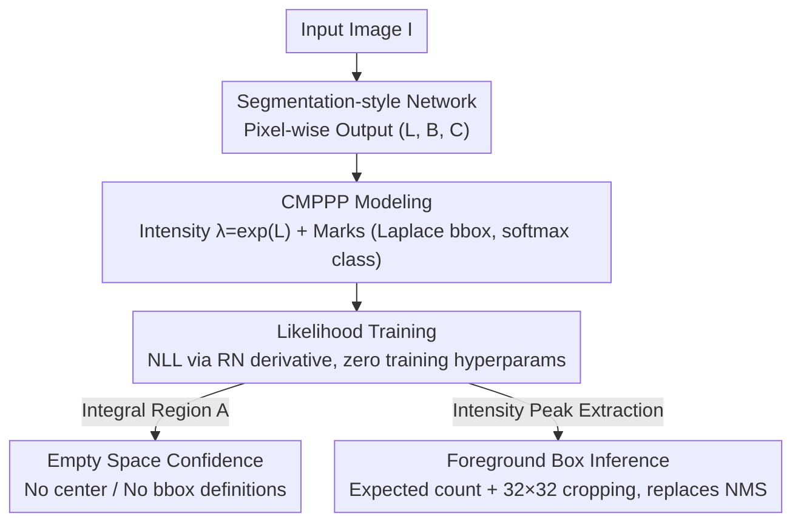

# Towards Reliable Detection of Empty Space: Conditional Marked Point Processes for Object Detection

**Conference**: ICLR 2026  
**OpenReview**: [https://openreview.net/forum?id=M2KLWLHzX0](https://openreview.net/forum?id=M2KLWLHzX0)  
**Code**: https://github.com/CMPPP-CV/cmpppnet  
**Area**: Object Detection / Uncertainty Estimation / Autonomous Driving Perception  
**Keywords**: Marked Point Processes, Spatial Statistics, Confidence Calibration, Empty Space Detection, Likelihood Training

## TL;DR
Object detection is reformulated as a "Conditional Marked Poisson Point Process" (CMPPP), where object centers are points and dimensions/classes are marks. Trained end-to-end via maximum likelihood, the model provides well-calibrated probability estimates for "whether a specific region is truly free of obstacles (passable)" while maintaining detection accuracy comparable to standard detectors.

## Background & Motivation

**Background**: Object detectors (YOLO, FCOS, CenterNet, R-CNN families) output an objectness/confidence score for each predicted box, while semantic segmentation outputs softmax probabilities for each pixel. These scores are commonly used to represent the model's uncertainty regarding the correctness of a prediction.

**Limitations of Prior Work**: These confidence scores are often severely miscalibrated. Architectures and loss functions (FPN, anchors, one-hot cross-entropy) are optimized for accuracy rather than probabilistic foundations, leading to overconfident models. Crucially, detectors **only provide confidence for detected boxes and remain silent about regions outside these boxes**; they possess no mechanism to answer whether an area without detections is truly safe and obstacle-free.

**Key Challenge**: Models trained under cross-entropy and assumptions of conditional independence between pixels/super-pixels default to "no detection equals safety." However, in trajectory planning for autonomous driving or robotics, the essential requirement is quantifying the collision risk along a **continuous trajectory**. Providing a well-defined, calibrated risk for **arbitrary empty regions** is a research gap neglected in safe autonomous driving.

**Goal**: Construct a probabilistic detection model that performs standard detection while outputting well-calibrated confidence for "whether any test region is empty (traversable)."

**Key Insight**: Ground truth detection data (a set of center points with sizes and classes) is naturally a realization of a **marked point process** in spatial statistics—a framework designed to describe the probabilistic occurrence of spatial point events (used in astronomy, epidemiology, and geostatistics). By applying this to detection, "empty region" receives a natural probabilistic definition.

**Core Idea**: Model the intensity function of bounding box centers using a marked Poisson point process trained via negative log-likelihood (NLL). The probability of a region being empty is the Poisson probability of the count of points being zero, transforming "empty space confidence" into a well-defined, computable, and calibrated quantity.

## Method

### Overall Architecture
The objective is to input an RGB image $I$ and output (a) standard bounding box detections and (b) calibrated probabilities for whether an arbitrary test region $A$ is "object-free/passable." The pipeline reformulates detection as a spatial statistics problem—using a segmentation-like network to predict the intensity of the point process and training it with a likelihood loss derived from point process theory. Inference involves extracting peaks for boxes and integrating intensity for empty space confidence.

Specifically, the network outputs a triplet $(L_\xi, B_\xi, C_\xi)$ for each pixel $\xi$: $L$ is exponentiated to obtain the center point intensity $\lambda(\xi)=\exp(L_\xi)$, $B$ provides parameters for the Laplace distribution of box dimensions, and $C$ provides the class softmax. Training uses the CMPPP likelihood loss (derived via the Radon–Nikodym derivative). Inference replaces NMS: the expected number of objects is estimated by integrating intensity, and a corresponding number of peaks are extracted. Empty space confidence is obtained by integrating the intensity over the target region.

### Key Designs

**1. Modeling Detection as a Conditional Marked Poisson Point Process (CMPPP)**

Standard detectors fail to define probabilities for regions outside boxes. This work denotes each object instance as a tuple $z=(\xi, m)$, where $\xi=(\xi_x, \xi_y) \in [0, 1]^2$ is the center location and $m=(h, w, \kappa)$ represents marks (dimensions and class). The ground truth of an image is a set $\{z_1, \dots, z_n\}$, a realization of a marked point process. Using a Poisson Point Process (PPP), the probability of $n$ instances occurring in region $A_M$ under mark measure $\Lambda$ follows $P(N_M(A_M)=n)=\frac{1}{n!}\Lambda(A_M)^n e^{-\Lambda(A_M)}$.

Intensity is decomposed into the product of center intensity and the conditional distribution of marks:

$$\Lambda(z\mid I) = \lambda(\xi\mid I)\cdot p(m\mid \xi, I),\qquad \lambda(\xi\mid I_d)=\exp(L_\xi(I_d)),\quad p(m\mid\xi,I_d)=p_{w,h}(B_\xi)\cdot p_\kappa(C_\xi).$$

Exponential parameterization ensures non-negative intensity. Dimensions use an isotropic bivariate Laplace distribution, and classes use softmax. $L, B, C$ are generated by a pixel-level output network. Unlike objectness, the intensity is "cumulative" (integrated over regions), and pixels are naturally coupled through the point process loss, addressing the root cause of miscalibration.

**2. NLL Loss via Radon–Nikodym Derivative: Zero Training Hyperparameters**

Since point processes exist on an infinite-dimensional configuration space $\Gamma$ lacking a Lebesgue measure, standard NLL cannot be defined directly. The authors use a homogeneous PPP distribution $\mu$ with intensity 1 as the reference measure. The Radon–Nikodym derivative of the model distribution $\mu_\theta$ with respect to $\mu$ is:

$$\frac{d\mu_\theta}{d\mu}(x)=\exp\Big(-\!\int_{[0,1]^2}(\lambda_\theta(\xi)-1)\,d\xi\Big)\cdot\prod_{l=1}^n\lambda_\theta(\xi_l).$$

Training with the negative log RN derivative is equivalent to NLL training. The resulting CMPPP loss is:

$$\ell(x,\theta)=\int_{[0,1]^2}\! e^{L_\xi}\,d\xi-\sum_{i=1}^n L_{\xi_i}-\sum_{i=1}^n\big[\log p_{w,h}(B_{\xi_i})+\log p_\kappa(C_{\xi_i})\big].$$

The first two terms represent center intensity loss (distributed objectness); the Laplace term $p_{w,h}$ corresponds to standard L1 regression, and $p_\kappa$ to cross-entropy. Crucially, the Laplace scale $\sigma$ is not learned by the network but solved in closed-form as $\hat\sigma=\frac1n\sum_i\|(w_i,h_i)-B_{\xi_i}\|_1$. Thus, there are **zero training hyperparameters** for loss weighting.

**3. Empty Space Confidence: Well-defined Probabilities for "No Object"**

With trained $(\hat\theta, \hat\sigma)$, the model answers if an arbitrary region $A$ is empty. Two semantics are defined. First, "$A$ contains no object centers" ($N(A)=0$):

$$P_{\hat\theta}(N(A)=0\mid I)=\exp\Big(-\!\int_A\lambda_{\hat\theta}(\xi\mid I)\,d\xi\Big)\approx\exp\Big(-\tfrac{1}{HW}\!\sum_{\xi\in A\cap\Pi}e^{L_\xi}\Big).$$

Second, more relevant to collision avoidance, "$A$ does not intersect any bounding box." This uses the critical set $D_c(A)$ consisting of all instances $z'$ whose boxes cover any point in $A$. For rectangular $A$, the inner integral over marks can be calculated analytically using the Laplace CDF.

**4. Inference via Count Statistics: Replacing NMS**

The expected number of centers is estimated as $E[N]=\int_{[0,1]^2}\lambda_{\hat\theta}(\xi)\,d\xi$. The model extracts that many peaks from the intensity map as predicted centers. To handle peak dispersion, a $32\times32$ square patch is cropped around each extracted maximum before finding the next. This cropping size is the **only inference hyperparameter**.

## Key Experimental Results

### Main Results
Calibration error (ECE) comparison for "passable region" prediction on Cityscapes between PPP intensity and semantic segmentation:

| Architecture | $s$ | Segmentation ECE$_S$ | Ours PPP ECE$_P$ |
|------|-----|------------------|-------------------|
| DeepLabv3+ | 1,000 | 0.2245 | **0.0029** |
| HRNet | 1,000 | 0.1443 | **0.0019** |
| SegFormer | 1,000 | 0.0593 | **0.0018** |
| DeepLabv3+ | 2,500 | 0.2667 | **0.0062** |

The PPP method is **over an order of magnitude lower** in ECE than semantic segmentation. Detection accuracy (mAP on Cityscapes relative to standard detectors):

| Model | mAP | Empty Space ECE ($s$=1,000) |
|------|-----|------------------------------|
| Ours HRNet CMPPP | 55.49% | Low |
| Ours SegFormer CMPPP | 51.04% | Low |
| Ours DeepLabv3+ CMPPP | 49.43% | Low |
| Faster R-CNN | 59.32% | 0.9915 |
| CenterNet | 57.08% | 0.9915 |

Standard detectors show an ECE of 0.9915 for empty regions, confirming they are almost completely miscalibrated for this task.

### Ablation Study

| Configuration | Key Metric | Note |
|------|---------|------|
| PPP (Center only) ECE$_P$ | 0.0029 (Cityscapes DeepLabv3+, $s$=1,000) | Best calibration |
| CMPPP (With bboxes) ECE$_{BB}$ | 0.0842 | Calibration becomes harder with dimensions |
| Inference Hyperparameter | Robust over large range | 32×32 is insensitive to small variations |
| DeepLabv3+ Runtime | 43.6M params, 16.2 FPS | Comparable to Faster R-CNN (41.4M, 29.4 FPS) |

### Key Findings
- **Ranking**: PPP > CMPPP > Segmentation/Standard Detectors. Calibrating only center points (PPP) is easiest; adding dimension marks (CMPPP) increases ECE to ~0.08, but still outperforms regular detectors by an order of magnitude.
- SegFormer consistently provides better calibration than CNNs (DeepLabv3+/HRNet).
- Residual miscalibration occurs primarily in middle confidence intervals, likely due to model capacity limits and fixed patch size conflicts with large objects.

## Highlights & Insights
- **Quantifying "No Detection $\neq$ Safety"**: Addresses a critical safety gap by providing well-calibrated occupancy probabilities for any region, directly serving collision-free trajectory planning.
- **Derived Loss**: The CMPPP loss is derived mathematically from the Radon–Nikodym derivative rather than being intuitively designed, unifying objectness, regression, and classification under a single likelihood framework.
- **Zero Training Hyperparameters**: The closed-form estimation of $\sigma$ and the unified loss eliminate the need for tuning loss weights.
- **Transferability**: The framework can be extended to LiDAR occupancy grids or reachability estimation in robotics.

## Limitations & Future Work
- **Calibration Residue**: Miscalibration still exists in middle-range probabilities.
- **Modeling Assumption**: The model assumes "independent" points, missing interaction potentials (e.g., physical objects cannot overlap).
- **Accuracy Gap**: mAP lags behind SOTA (Faster R-CNN/CenterNet) by 4–10 points, suggesting further architectural optimization is needed for pure performance.

## Related Work & Insights
- **vs. Drivable Area Detection**: Segmentation focuses on pixel-wise classification; this work provides calibrated occupancy confidence for **arbitrary test regions**.
- **vs. CenterNet/FCOS**: While architecturally similar, CenterNet's "centerness" is a form of objectness with pixel-independence assumptions; this work's cumulative intensity allows for calibration.
- **vs. PDQ Evaluation**: While PDQ uses Gaussians for localization uncertainty post-hoc, this work derives the correspondence between regression losses (L1) and probabilistic models (Laplace) for self-consistent training.

## Rating
- Novelty: ⭐⭐⭐⭐⭐ 
- Experimental Thoroughness: ⭐⭐⭐⭐ 
- Writing Quality: ⭐⭐⭐⭐ 
- Value: ⭐⭐⭐⭐⭐ 

<!-- RELATED:START -->

<!-- RELATED:END -->

## Related Papers

- [\[CVPR 2026\] AKCMamba-YOLO: Selective State Space Models For Real-Time Object Detection](../../CVPR2026/object_detection/akcmamba-yolo_selective_state_space_models_for_real-time_object_detection.md)
- [\[CVPR 2026\] Foundation Model Priors Enhance Object Focus in Feature Space for Source-Free Object Detection](../../CVPR2026/object_detection/foundation_model_priors_enhance_object_focus_in_feature_space_for_source-free_ob.md)
- [\[CVPR 2026\] Back to Point: Exploring Point-Language Models for Zero-Shot 3D Anomaly Detection](../../CVPR2026/object_detection/back_to_point_exploring_point-language_models_for_zero-shot_3d_anomaly_detection.md)
- [\[CVPR 2025\] PO3AD: Predicting Point Offsets toward Better 3D Point Cloud Anomaly Detection](../../CVPR2025/object_detection/po3ad_predicting_point_offsets_toward_better_3d_point_cloud_anomaly_detection.md)
- [\[ICLR 2026\] Point2RBox-v3: Self-Bootstrapping from Point Annotations via Integrated Pseudo-Label Refinement and Utilization](point2rbox-v3_self-bootstrapping_from_point_annotations_via_integrated_pseudo-la.md)

<!-- RELATED:END -->
