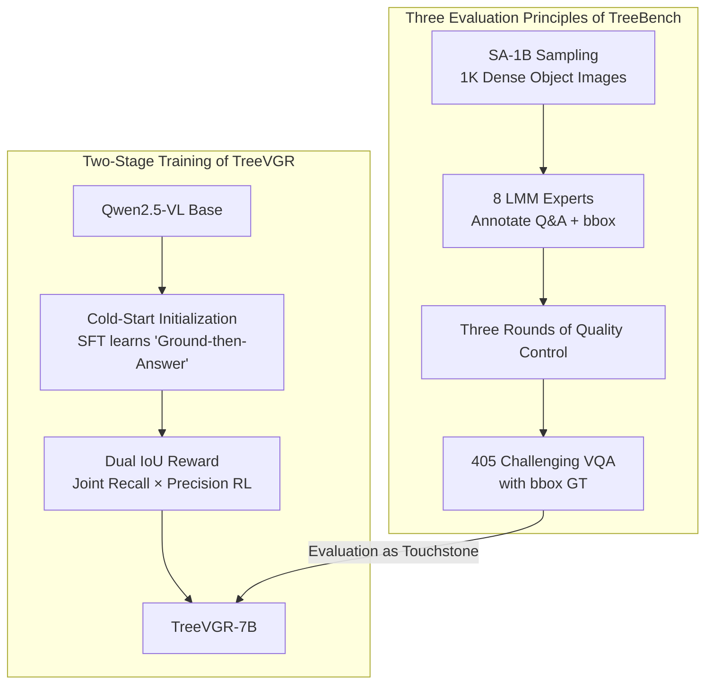

# Traceable Evidence Enhanced Visual Grounded Reasoning: Evaluation and Method

**Conference**: ICLR 2026  
**arXiv**: [2507.07999](https://arxiv.org/abs/2507.07999)  
**Code**: [GitHub](https://github.com/Haochen-Wang409/TreeVGR)  
**Area**: Object Detection  
**Keywords**: Visual Grounded Reasoning, Traceable Evidence, Second-Order Reasoning, TreeBench, Reinforcement Learning, Dual IoU

## TL;DR

This paper proposes TreeBench (the first traceable visual reasoning benchmark, consisting of 405 highly challenging VQA tasks where OpenAI-o3 achieves only 54.87%) and TreeVGR (a training paradigm that jointly supervises grounding and reasoning via reinforcement learning with Dual IoU rewards). The TreeVGR-7B model achieves gains of +16.8 on V\*Bench, +12.6 on MME-RealWorld, and +13.4 on TreeBench, demonstrating that traceability is crucial for advancing visual reasoning.

## Background & Motivation

**Background**: OpenAI-o3 pioneered the "thinking with images" paradigm—dynamically referencing and zooming into task-relevant visual regions during reasoning, which has shown potential to surpass pure text-based reasoning. However, no existing benchmark comprehensively evaluates this capability.

**Limitations of Prior Work**:
1. Classic benchmarks such as POPE, MMBench, and SEED-Bench ignore fine-grained grounding and verifiable reasoning chains.
2. V\*Bench only supports simple spatial queries (e.g., "Is A to the left of B?") and faces data leakage risks as it is based on COCO images.
3. MME-RealWorld and HR-Bench support high-resolution inputs but lack traceable evidence and complex reasoning.
4. Existing RL training methods (e.g., DeepEyes, Pixel-Reasoner) only supervise the final answer and fail to supervise the intermediate grounding process.

**Key Challenge**: No benchmark simultaneously satisfies three critical requirements: fine visual perception (identifying subtle targets in dense scenes), traceable evidence (evaluating the grounding quality of each step in the reasoning chain), and second-order reasoning (object interactions and spatial hierarchical reasoning beyond simple localization). Regarding training, existing methods cannot quantify the actual contribution of grounding within the "ground-then-answer" framework.

**Goal**: This work adopts a dual approach—TreeBench establishes evaluation standards and TreeVGR establishes training methods, together advancing the assessment and enhancement of "thinking with images" capabilities.

## Method

### Overall Architecture

The paper follows a dual-track design for evaluation and training. The evaluation track is TreeBench: 1,000 dense object scene images are sampled from SA-1B, then 8 LMM experts manually annotate questions, options, answers, and target bounding boxes. These are refined through three rounds of quality control into 405 challenging VQA tasks with ground-truth boxes to test if models can "see accurately, explain clearly, and reason correctly." The training track is TreeVGR: using Qwen2.5-VL as the backbone, it starts with a cold-start phase using SFT data with grounded reasoning trajectories to teach the model to "ground then answer." This is followed by reinforcement learning with traceable evidence, using Dual IoU rewards to simultaneously enhance both grounding and reasoning. The two tracks converge at evaluation—TreeBench serves as the touchstone to verify if the grounding capability learned by TreeVGR translates into stronger visual reasoning.

### Key Designs

**1. Three Evaluation Principles of TreeBench: Quantifying and Diagnosing "Thinking with Images"**

TreeBench aims to measure the entire process rather than just VQA accuracy. The first principle is Fine Visual Perception: all questions target minuscule objects in complex real-world scenes, where targets occupy an average of only **3.05%** of the image area. This forces the model to provide detailed, precise, and unique textual descriptions rather than relying on common sense. The second is Traceable Evidence: evaluation considers both the final answer and the mIoU of generated bounding boxes against ground-truth boxes. This allows "wrong answers" to be diagnosed as either "misunderstanding" or "grounding failure." The third is Second-Order Reasoning: tasks go beyond "what/where" to cover 5 perception categories (Attribute/Material/Physical State/Object Retrieval/OCR) and 5 reasoning categories (Perspective Transformation/Sorting/Contact & Occlusion/Spatial Inclusion/Comparison). Perspective transformation (e.g., "From person A's perspective, which direction is object B?") is the most difficult category. These principles ensure the benchmark's difficulty—even the powerful o3 achieved only 54.87%.

**2. Cold-Start Initialization: SFT before RL to Reduce Computational Overhead**

Applying RL to a model that cannot ground is extremely costly. DeepEyes' pure RL approach required 32 H100s for 48 hours because the model rarely sampled trajectories with correct boxes early on, leading to sparse rewards. This paper utilizes carefully constructed SFT data (based on VGR-158K with pseudo-reasoning chains and bbox annotations) for cold-starting. Each sample contains an image, question, full reasoning trajectory with bounding boxes, and the final answer. This ensures the model possesses basic "grounding-reasoning" capabilities before RL. With this starting point, RL exploration begins near a reasonable policy, providing denser rewards and faster convergence, which significantly reduces computational costs. This step is also a prerequisite for the Dual IoU reward to take effect stably.

**3. Dual IoU Reward: Rewarding "Recall" while Penalizing "Redundancy"**

In the RL stage following cold-start, the total reward includes accuracy, format, and grounding components: $R = R_{\text{acc}} + R_{\text{format}} + R_{\text{IoU}}$. The grounding reward $R_{\text{IoU}}$ is the core innovation of TreeVGR. If only a unidirectional recall reward is used, models may perform "reward hacking" by covering the image with candidate boxes to ensure GT coverage. This paper uses Dual IoU to prevent this. The Recall term requires each GT box $b_k$ to be matched by at least one predicted box: $R_{\text{IoU}}^{\text{R}} = \frac{1}{M} \sum_{k=1}^{M} \max_i \text{IoU}(\hat{b}_i, b_k)$. The Precision term requires each predicted box $\hat{b}_i$ to correspond to a GT box: $R_{\text{IoU}}^{\text{P}} = \frac{1}{N} \sum_{i=1}^{N} \max_k \text{IoU}(b_k, \hat{b}_i)$; redundant boxes will penalize this term. The final reward is the average: $R_{\text{IoU}} = \frac{1}{2}(R_{\text{IoU}}^{\text{R}} + R_{\text{IoU}}^{\text{P}})$. This ensures grounding quality is effectively optimized by requiring the model to be both comprehensive and precise.

## Key Experimental Results

### Main Results: Performance by Category on TreeBench

| Model | Overall | Attribute | Phys. State | Obj. Retr. | OCR | Persp. Trans. | Sorting | Contact/Occ. | Inclusion | Comparison | mIoU |
|------|---------|------|----------|----------|-----|----------|------|----------|----------|------|------|
| o3-0416 | 54.8 | 69.0 | 69.2 | 65.2 | 68.8 | 79.4 | 22.4 | 38.6 | 61.0 | 86.2 | –† |
| Gemini-2.5-Pro | 54.1 | 51.7 | 61.5 | 56.5 | 75.0 | 83.8 | 20.0 | 36.8 | 65.9 | 86.2 | – |
| Qwen2.5-VL-72B | 42.2 | 65.5 | 69.2 | 56.5 | 56.3 | 48.5 | 11.8 | 33.3 | 51.2 | 72.4 | – |
| Qwen2.5-VL-7B | 37.0 | 55.2 | 53.8 | 56.5 | 62.5 | 27.9 | 20.0 | 35.1 | 39.0 | 44.8 | – |
| DeepEyes-7B | 37.5 | 62.1 | 53.8 | 65.2 | 68.8 | 51.5 | 11.8 | 24.6 | 36.6 | 51.7 | 30.0 |
| Pixel-Reasoner-7B | 39.0 | 58.6 | 61.5 | 65.2 | 50.0 | 48.5 | 14.1 | 31.6 | 39.0 | 44.8 | 35.7 |
| **TreeVGR-7B** | **50.4** | 65.5 | 53.8 | **82.6** | 68.8 | **63.3** | **22.4** | 36.8 | **61.0** | 69.0 | **44.0** |

### Ablation Study: Comparison of Gains Across Benchmarks

| Benchmark | Qwen2.5-VL-7B (Baseline) | TreeVGR-7B | Gain |
|------|----------------------|------------|----------|
| TreeBench Overall | 37.0 | 50.4 | **+13.4** |
| V\*Bench Overall | 74.3 | 91.1 | **+16.8** |
| V\*Bench Attr. | 77.4 | 94.0 | +16.6 |
| V\*Bench Spatial | 69.7 | 87.0 | +17.3 |
| MME-RealWorld-Lite | 42.3 | 54.9 | **+12.6** |
| HR-Bench-4K | 72.1 | 77.1 | +5.0 |
| HR-Bench-8K | 68.8 | 73.1 | +4.3 |

### Key Findings

- **No model exceeds 60% on TreeBench**: Even the strongest o3 reaches only 54.87%, proving the benchmark's difficulty.
- **TreeVGR-7B rivals InternVL3-78B**: The 7B model reaches the level of a 78B general model through joint grounding-reasoning training.
- **mIoU strongly correlates with final accuracy**: TreeVGR’s mIoU (44.0) is significantly better than DeepEyes (30.0) and Pixel-Reasoner (35.7), validating that precise grounding promotes reasoning.
- **Contact/Occlusion and Sorting are the hardest categories**: All models perform worst here (<25%), reflecting fundamental difficulties in second-order reasoning.

## Highlights & Insights

- **The "o3 < 55%" Shock**: Current top multimodal models remain weak at fine-grained visual reasoning; TreeBench exposes a real capability gap.
- **Traceability = Verifiability**: Evaluating grounding evidence for each reasoning step makes evaluation more reliable and diagnostic.
- **Elegant Dual IoU Reward**: Constraining both recall and precision prevents "brute-force boxing" reward hacking strategies.
- **Efficient Cold-Start + RL Paradigm**: Compared to pure RL solutions like DeepEyes, cold-starting drastically lowers computational costs.

## Limitations & Future Work

- TreeBench is relatively small (only 405 questions), limiting its statistical significance.
- TreeVGR does not perform actual visual cropping or re-observation (using text-space grounding only), which may miss visual details.
- The quality of cold-start SFT data directly limits the RL ceiling, and data construction involves manual costs.
- Training samples for second-order reasoning (perspective transformation, spatial inclusion) are scarce, potentially leading to insufficient RL training.
- Multi-turn interactive grounded reasoning has not yet been explored.

## Rating

- Novelty: ⭐⭐⭐⭐⭐
- Experimental Thoroughness: ⭐⭐⭐⭐⭐
- Writing Quality: ⭐⭐⭐⭐⭐
- Value: ⭐⭐⭐⭐⭐

<!-- RELATED:START -->

- **Pixel-Reasoner**: Cross-modal reasoning via RL for visual grounding.
- **DeepEyes**: Direct RL for visual reasoning without intermediate SFT.
- **V\*Bench**: A benchmark for fine-grained visual perception.

<!-- RELATED:END -->

## Related Papers

- [\[ICCV 2025\] VisRL: Intention-Driven Visual Perception via Reinforced Reasoning](../../ICCV2025/object_detection/visrl_intention-driven_visual_perception_via_reinforced_reasoning.md)
- [\[AAAI 2026\] Connecting the Dots: Training-Free Visual Grounding via Agentic Reasoning](../../AAAI2026/object_detection/connecting_the_dots_training-free_visual_grounding_via_agent.md)
- [\[CVPR 2026\] Reasoning-Driven Anomaly Detection and Localization with Image-Level Supervision](../../CVPR2026/object_detection/reasoning-driven_anomaly_detection_and_localization_with_image-level_supervision.md)
- [\[ICCV 2025\] Large-scale Pre-training for Grounded Video Caption Generation](../../ICCV2025/object_detection/large-scale_pre-training_for_grounded_video_caption_generation.md)
- [\[CVPR 2026\] YOLO-Master: MOE-Accelerated with Specialized Transformers for Enhanced Real-time Detection](../../CVPR2026/object_detection/yolo-master_moe-accelerated_with_specialized_transformers_for_enhanced_real-time.md)

<!-- RELATED:END -->
