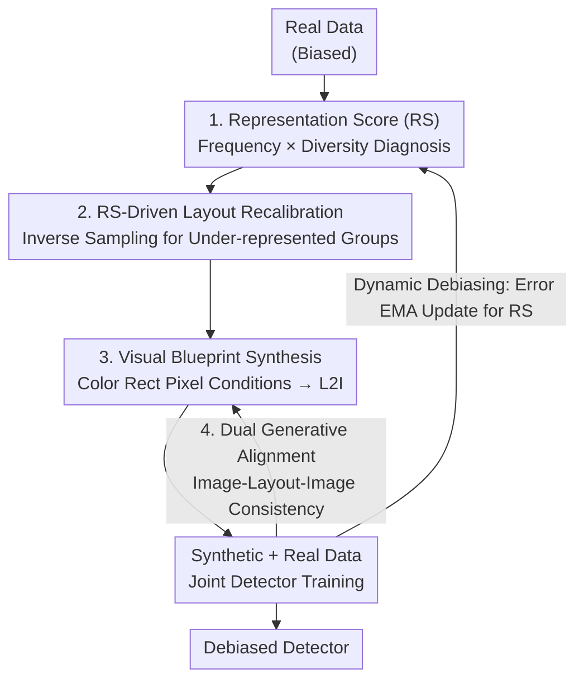

# Unbiased Object Detection Beyond Frequency with Visually Prompted Image Synthesis

**Conference**: ICLR 2026  
**OpenReview**: [https://openreview.net/forum?id=SGSF9t9Vq2](https://openreview.net/forum?id=SGSF9t9Vq2)  
**Code**: https://github.com/NUST-Machine-Intelligence-Laboratory/Beyond_Freq  
**Area**: Object Detection / Data Augmentation / Controllable Diffusion Generation  
**Keywords**: Detection Debiasing, Layout-to-Image Synthesis, Representation Score, Visual Blueprint, Generative Alignment  

## TL;DR
To address category, size, and location biases in object detection training data, this paper proposes a "Diagnosis-Synthesis" debiasing framework. It identifies truly under-represented data groups using a **Representation Score (RS)** that goes beyond frequency. It recalibrates layouts based on RS and synthesizes high-fidelity samples using a **Visual Blueprint** (color rectangle pixel conditions) combined with **Dual Generative Alignment**. This approach improves rare classes by 3.6 mAP and large objects by 4.4 mAP, achieving a layout accuracy 15.9 mAP higher than the previous L2I SOTA.

## Background & Motivation
**Background**: The reliability of object detection is constrained by training data biases—long-tail categories, size bias toward medium/large objects, and spatial clumping at the image center. Traditional debiasing relies on **resampling / reweighting** to adjust the influence of rare samples based on instance frequency. Recently, **generative data augmentation** has emerged, aiming to supplement data by synthesizing new samples using diffusion models, typically following a layout-to-image (L2I) approach where training set layouts serve as conditions.

**Limitations of Prior Work**: Resampling is confined to the original "visual vocabulary" of the dataset; it can amplify weights but cannot create new appearances or scenes. Naive L2I augmentation directly reuses training set layouts, meaning **the synthesis process preserves the very biases it intends to eliminate**.

**Key Challenge**: In §2, the authors conducted controlled experiments with Faster R-CNN + ResNet-50, revealing two deeper issues. First, **frequency is an incomplete and even misleading proxy**: some high-performing and well-sampled groups (e.g., large objects) are actually more "data-hungry"—the benefit of supplementing them (Bias-Agnostic Gen +9.8 mAP) is greater than focusing only on low-frequency groups (Freq-Aware Gen +8.1 mAP). Relying solely on frequency leads to suboptimal interventions. Second, there is a **fidelity gap**: given the same biased and controlled distribution, augmenting with real samples yields higher gains than with synthesized samples, indicating that current L2I synthesis quality is inferior to real images. Furthermore, serializing 2D layouts into 1D text tokens introduces ambiguity, failing to control object relations and occlusions in complex scenes.

**Goal**: (1) Find a diagnostic tool more reliable than frequency to locate truly under-represented data groups; (2) Enable L2I synthesis to precisely execute debiased layouts while producing high-fidelity images.

**Key Insight**: Quantify representation quality as "Frequency + Diversity" rather than just counting instances. Simultaneously, replace vague text layout conditions with pixel-level visual signals and leverage the **dual task** nature of "Detection ↔ Generation" to calibrate them against each other.

**Core Idea**: Use the **Representation Score (RS)** to diagnose representation gaps "beyond frequency" and recalibrate layouts accordingly. Then, use **Visual Blueprints + Dual Generative Alignment** to precisely synthesize high-fidelity samples for under-represented groups.

## Method

### Overall Architecture
The framework is a closed-loop pipeline: "Diagnosis → Recalibration → Synthesis → Feedback". The input is biased real data, and the output is a debiased detector. Specifically: the detector generates predictions on real data; the **Bias Diagnosis Engine** calculates the RS for each data group by combining frequency and diversity; the **Layout Planner** performs inverse-RS sampling to recalibrate seed layouts into new layouts that fill gaps; the **Layout Renderer** converts these layouts into Visual Blueprints (colored rectangle canvases) as pixel-level conditions for the L2I generator; finally, synthetic and real data are combined to train the detector. The pipeline is constrained by two mechanisms: **Dual Generative Alignment** enforces feature consistency in the "Image-Layout-Image" loop, and **Dynamic Error-Driven Debiasing** continuously refreshes RS using detection errors via EMA, ensuring the system targets emerging biases during training.

### Key Designs

**1. Representation Score (RS): Replacing Pure Frequency with "Frequency × Diversity"**  

To address the "frequency as an incomplete proxy" issue, RS no longer just counts instances. It decomposes how well a data group $G=(c,s,u)$ (category $c$, size $s$, horizontal position $u$) is represented into three parts. The first is sample frequency $D_{freq}(G)=N(G)/N_{all}$. The last two represent **Representation Diversity**: Visual Diversity $D_{vis}(G)$ is the average pairwise distance of ROI features within the group, characterizing appearance variance; Contextual Diversity $D_{ctx}(G)$ measures the co-occurrence of category $c$ with other categories. These are combined as:  

$$RS(G) = D_{freq}(G)\cdot\big(D_{vis}(G) + \beta\cdot D_{ctx}(G)\big)$$  

Groups with low RS are "truly under-represented" and prioritized for debiased generation. Thus, even high-frequency groups can be identified for augmentation if they lack visual or contextual diversity—aligning with the observation in §2 that large objects are "data-hungry" despite being frequent.

**2. RS-Driven Layout Recalibration + Dynamic Debiasing: Translating Gaps into Rational Layouts**  

RS alone is insufficient; one must transform "what is missing" into layouts that are both diverse and physically plausible. The paper takes seed layouts from real images and perturbs them guided by RS. For objects in a seed belonging to group $G=(c,s,u)$, they are migrated to a new group $G'=(c,s',u')$, where new size-position pairs are sampled inversely to RS: $\pi(s',u'\mid c)\propto (RS(c,s',u')+\varepsilon)^{-\tau}$ (coupled sampling). To maintain natural vertical layering (sky above, cars on the road), the vertical center only receives small Gaussian jitter $v'=v+\epsilon,\ \epsilon\sim\mathcal{N}(0,\sigma_y^2)$. When supplementing rare categories, the target class is selected via a "context-aware + RS-guided" strategy: $\pi_c(c'\mid K)\propto(\kappa\cdot\mathbb{1}[c'\in K]+\mathbb{1}[c'\notin K])\cdot(RS(c')+\varepsilon)^{-\tau}$, where $\kappa>1$ encourages adding instances near existing classes in the scene.  

Since RS is initially static, **Dynamic Error-Driven Debiasing** is introduced to account for distribution shifts during training. The consistency loss $L_{layout}$ between predicted layouts $l_{pred}=D_\Phi(x_{syn})$ and recalibrated layouts is used to refresh RS via EMA with momentum $\mu=0.99$:  

$$RS'(G_i)=\mu\cdot RS(G_i)+(1-\mu)\cdot L_{layout}(i)$$  

Hard-to-learn groups (high error) have their RS increased, ensuring adaptive focus throughout training.

**3. Visual Blueprint: Using Pixel-Space Color Rectangles instead of Vague Text Layouts**  

To solve the ambiguity of serializing 2D layouts into 1D text, the layout $l$ is rendered as a Visual Blueprint $I_{cond}=R(l;P)$—a canvas where each box is a colored rectangle. To maximize category discriminability, colors are chosen as equidistant hues on the HSV unit circle: $p_i=\text{RGB}((i-1)\varphi,S_0,V_0)$. The renderer $R$ follows three principles: HSV value (brightness) of different instances of the same class decreases by step $\alpha$ to distinguish individuals; objects are rendered in descending order of box area to prevent small targets from being obscured; background objects are rendered with semi-transparency to provide visual cues for occlusion. The blueprint is then projected via a lightweight encoder into multi-scale features $u=g_\phi(I_{cond})$ and injected into a frozen U-Net via zero-initialized adapters. Compared to ControlNet using adjacent integers for classes (where variance is minimal), equidistant hues provide high-variance signals that are easier for the encoder to distinguish.

**4. Dual Generative Alignment: Calibrating via the Detection ↔ Generation Duality**  

Existing frameworks treat the L2I generator and detector as isolated modules, leading to synthetic images that may look reasonable but are misaligned with the detector's feature space. This paper leverages the structure where the detector learns $D_\Phi:x\to l$ and the generator learns the inverse $G_\Phi:l\to x$. An image alignment loss is defined to penalize the noise difference between "generating with predicted layout" and "generating with ground truth layout":  

$$L^{IA}_{image}=\big\lVert\epsilon_\theta(x_t,t,f_\psi(y),u)-\epsilon_\theta(x_t,t,f_\psi(y),u_{pred})\big\rVert_2^2$$  

This forces the detector to produce layouts faithful enough for image reconstruction while making it more robust to synthetic features.

### Loss & Training
- L2I Generator: Denoising loss $L_{visual\,L2I}$ conditioned on Visual Blueprints.
- Detector: Standard detection loss + Dual Image Alignment loss, $L_{OD}=L_{det}+\lambda L^{IA}_{image}$; uses $L_{layout}$ for dynamic RS updates.
- Key Hyperparameters: EMA momentum $\mu=0.99$; Faster R-CNN + ResNet-50 backbone; Evaluated on MS COCO and NuImages.

## Key Experimental Results

### Main Results

Synthesis Fidelity (MS COCO, 512² resolution):

| Model | FID ↓ | mAP ↑ | AP50 ↑ | AP75 ↑ |
|------|-------|-------|--------|--------|
| ControlNet | 28.14 | 25.2 | 46.7 | 22.7 |
| GeoDiffusion | 18.89 | 30.6 | 41.7 | 35.6 |
| GDCC | 17.15 | 32.6 | 43.6 | 38.0 |
| **Ours** | **15.24** | **46.5** | **61.4** | **51.6** |

Layout accuracy (mAP) is **15.9** higher than the previous SOTA (GeoDiffusion), with significantly lower FID.

Debiasing Performance (MS COCO, Faster R-CNN baseline):

| Model | mAP | outer | rare | large | small |
|------|-----|-------|------|-------|-------|
| Faster R-CNN (Baseline) | 37.4 | 28.3 | 43.2 | 48.1 | 21.2 |
| GeoDiffusion (Bias-agnostic) | 38.4 | 29.5 | 44.3 | 50.3 | 19.7 |
| GeoDiffusion + Resampling (Freq-aware) | 38.5 | 30.0 | 44.5 | 49.9 | 20.0 |
| **Ours** | **40.3** | **31.5** | **46.8** | **52.5** | **23.1** |

Relative to baseline: Rare classes +3.6, Outer edges +3.2, Large +4.4, Small +1.9 mAP. Total mAP reaches 40.3/40.0 on MS COCO/NuImages, setting a new SOTA.

### Ablation Study

Incremental Component Analysis (MS COCO, Debiasing setting):

| Configuration | mAP | outer | rare | large | small |
|------|-----|-------|------|-------|-------|
| Baseline (Text Layout) | 37.0 | 27.8 | 43.0 | 47.9 | 20.5 |
| + Visual Blueprint | 38.9 | 29.6 | 45.0 | 51.1 | 21.9 |
| + Generative Alignment | 39.1 | 29.9 | 45.2 | 51.3 | 22.1 |
| + RS Recalibration | 39.9 | 31.0 | 46.4 | 52.3 | 22.8 |
| + Dynamic Debiasing | 40.3 | 31.5 | 46.8 | 52.5 | 23.1 |

### Key Findings
- **Visual Blueprint is the main performance driver**: Switching from text to pixel canvases improves debiasing mAP from 37.0 to 38.9 and fidelity mAP from 25.2 to 40.8.
- **Generative alignment primarily improves fidelity**: It contributes a modest +0.2 mAP to detection, aligning with its role as a consistency constraint.
- **RS and Dynamic Debiasing target under-represented groups**: These components yield significantly higher gains for outer/rare/small groups compared to the overall average.
- **Frequency resampling can be counterproductive**: Freq-aware ControlNet shows degradation in several attributes, supporting the "frequency as an incomplete proxy" argument.

## Highlights & Insights
- **Redefining data demand from frequency to representation quality**: RS uses Frequency × (Visual + Contextual Diversity) to quantify representation adequacy, proving that "frequent ≠ well-represented".
- **Color encoding as high-variance visual signals**: Equidistant HSV hues, brightness decay for instances, and area-based rendering solve category ambiguity, instance differentiation, and occlusion—simple yet effective engineering tricks.
- **Dual task loop as regularization**: Using the inverse task to calibrate the primary task (Image-Layout-Image consistency) is a powerful conceptual framework.
- **Closed-loop Diagnosis-Synthesis + EMA Adaptation**: Unlike one-off augmentations, dynamic debiasing adjusts to the detector's evolving weaknesses during training.

## Limitations & Future Work
- **Dependency on seed layouts**: Recalibration starts from real layouts to ensure plausibility, which may limit scalability for entirely new scene structures.
- **Classic backbone**: Experiments primarily use Faster R-CNN; performance on DETR-like models or larger backbones remains to be seen.
- **Training overhead**: Jointly running generation and detection with additional alignment losses increases computational cost.
- **Hyperparameter sensitivity**: Parameters like $\tau$ and $\lambda$ require tuning and their robustness across diverse datasets needs further analysis.

## Related Work & Insights
- **vs Resampling / Reweighting**: Traditional methods stay within the visual vocabulary; Ours synthesizes new appearances for under-represented groups.
- **vs Naive L2I (GeoDiffusion, DetDiffusion)**: Prior works preserve training biases and suffer from text-layout ambiguity; Ours recalibrates layouts and uses Visual Blueprints (+15.9 mAP fidelity gain).
- **vs ControlNet**: ControlNet uses integer masks (low variance); Ours uses equidistant hues for higher discriminability and lower FID.

## Rating
- Novelty: ⭐⭐⭐⭐⭐ Reframes "frequency debiasing" as "representation quality diagnosis + high-fidelity synthesis."
- Experimental Thoroughness: ⭐⭐⭐⭐ Extensive ablations; however, backbone and efficiency comparisons are somewhat limited.
- Writing Quality: ⭐⭐⭐⭐⭐ Clear logical chain from motivation study to design.
- Value: ⭐⭐⭐⭐⭐ High utility for long-tail detection and generative data augmentation.

<!-- RELATED:START -->

## Related Papers

- [\[CVPR 2026\] Beyond Semantic Search: Towards Referential Anchoring in Composed Image Retrieval](../../CVPR2026/object_detection/beyond_semantic_search_towards_referential_anchoring_in_composed_image_retrieval.md)
- [\[CVPR 2026\] DyFCLT: Dynamic Frequency-Decoupled Cross-Modal Learning Transformer for Multimodal Tiny Object Detection](../../CVPR2026/object_detection/dyfclt_dynamic_frequency-decoupled_cross-modal_learning_transformer_for_multimod.md)
- [\[AAAI 2026\] Beyond Boundaries: Leveraging Vision Foundation Models for Source-Free Object Detection](../../AAAI2026/object_detection/beyond_boundaries_leveraging_vision_foundation_models_for_so.md)
- [\[AAAI 2026\] PromptMoE: Generalizable Zero-Shot Anomaly Detection via Visually-Guided Prompt Mixing of Experts](../../AAAI2026/object_detection/promptmoe_generalizable_zero-shot_anomaly_detection_via_visually-guided_prompt_m.md)
- [\[CVPR 2026\] Beyond Prompt Degradation: Prototype-Guided Dual-Pool Prompting for Incremental Object Detection](../../CVPR2026/object_detection/beyond_prompt_degradation_prototype-guided_dual-pool_prompting_for_incremental_o.md)

<!-- RELATED:END -->
