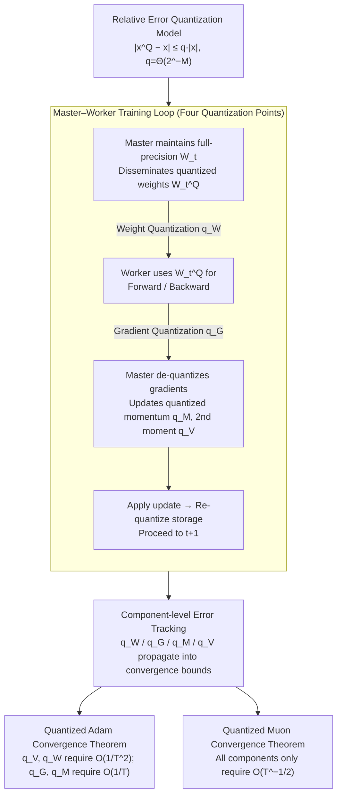

# A Convergence Analysis of Adaptive Optimizers under Floating-Point Quantization

**Conference**: ICLR 2026  
**arXiv**: [2510.21314](https://arxiv.org/abs/2510.21314)  
**Code**: None  
**Area**: Optimization  
**Keywords**: Low-precision training, Adam, Muon, Floating-point quantization, Convergence analysis

## TL;DR
This paper establishes the first theoretical framework for analyzing the convergence of adaptive optimizers under floating-point quantization. By applying a relative error quantization model simultaneously to gradients, weights, and optimizer states (momentum and second moments), it proves that quantized Adam and Muon maintain the same $\tilde{O}(T^{-1/4})$ convergence rate as full-precision versions when the mantissa length grows only logarithmically with the number of iterations. It further reveals the theoretical mechanism explaining why Adam is highly sensitive to weight and second-moment quantization while Muon is more robust.

## Background & Motivation
The rapid scaling of Large Language Models (LLMs) has made low-precision training a key technology for reducing memory overhead and improving efficiency. Low-precision formats such as BF16 and FP8 have been widely adopted in practical trillion-token training (e.g., DeepSeek-V3, FP8-LM), with no significant loss in precision observed empirically.

However, **theoretical understanding lags significantly behind practice**. Existing convergence theories for quantized optimizers suffer from several critical gaps:

**Analyzing only gradient quantization**: Most theoretical works consider only the quantization of gradients in Stochastic Gradient Descent (SGD), whereas modern low-precision training simultaneously quantizes weights, gradients, and optimizer states.

**Unrealistic assumptions**: Existing analyses either assume unbiased quantization or rely on error feedback mechanisms—the former does not align with the characteristics of floating-point quantization, and the latter is impractical in large-scale LLM training due to memory overhead.

**Ignoring optimizer state quantization**: Both the first and second moments of Adam are quantized in practice to save memory (e.g., 8-bit Adam), yet this aspect is completely ignored in theoretical analyses.

**Excluding new optimizers**: Theoretical guarantees for emerging matrix-based optimizers like Muon under low precision are non-existent.

**Core Problem**: Why do adaptive optimizers still effectively converge even when all components are aggressively quantized?

## Method

### Overall Architecture
This paper constructs an analytical low-precision training framework that decomposes a single master-worker training round into four quantization points: the master maintains the full-precision weights $\mathbf{W}_t$ but transmits only the quantized version $\mathbf{W}_t^Q$ to the worker; the worker performs forward and backward passes using $\mathbf{W}_t^Q$ and sends back quantized gradients; the master de-quantizes the gradients, updates the quantized momentum and second moments, and re-quantizes the storage after applying the optimizer update. The crux of the analysis is the replacement of the traditional unbiased quantization assumption with a **relative error model**, enabling the characterization of the impact of quantization on convergence rates for each component without introducing error feedback. The error coefficients for the four quantization points—$q_W, q_G, q_M, q_V$—are tracked separately and integrated into the convergence theorems for Adam and Muon.

### Key Designs

**1. Relative Error Quantization Model: Analytical Form for Floating-Point Truncation**
Prior quantization theories often assumed unbiased quantization or relied on error feedback to cancel bias, but floating-point quantization satisfies neither—operations like FP32→BF16 truncate the mantissa while preserving the sign and exponent bits, making the error naturally proportional to the magnitude. This paper proposes a relative error assumption: for any scalar $x$, the quantized value satisfies $|x^Q - x| \leq q|x|$, where $q = \Theta(2^{-M})$ and $M$ is the mantissa length of the target format. This formulation aligns with the behavior of per-tensor/per-channel scaling in practice and allows the quantization error to propagate through inequalities alongside the norms of weights and gradients.

**2. Component-level Error Tracking: Decomposing Sensitivity**
The framework does not merge quantization errors into a single constant; instead, it introduces separate error coefficients for four components: weights $q_W$, gradients $q_G$, first moments $q_M$, and second moments $q_V$. Retaining these paths in the convergence proof allows the paper to answer "which component requires higher precision." The final convergence bounds explicitly link each $q$ to different polynomials of $T$, translating theoretical findings into bit-width allocation strategies for mixed-precision training.

**3. Adam Convergence Theorem: Exposing Bottlenecks in Second Moments and Weights**
Under standard assumptions (unbiased stochastic gradients, $\ell_\infty$-bounded gradients, $L$-smoothness), with $\eta = \Theta(1/\sqrt{T})$ and $1-\beta_2 = \Theta(1/T)$, the theorem shows that quantized Adam achieves $\tilde{O}(T^{-1/4})$—matching the optimal rate of full-precision Adam—provided that $q_G, q_M = O(1/T)$ and $q_W, q_V = O(1/T^2)$. The key lies in the asymmetry: second moments $q_V$ and weights $q_W$ require a stringent $O(1/T^2)$, while gradients and first moments only require $O(1/T)$. This is due to Adam's inverse square root structure—as $\beta_2 \to 1$, the second moment barely decays, and its quantization error is non-linearly amplified by the $1/\sqrt{v}$ term.

**4. Muon Convergence Theorem: Explaining Robustness to Low Precision**
For Muon, the theorem requires all components to uniformly satisfy $q_G = q_W = q_M = O(T^{-1/2})$ to maintain the $O(T^{-1/4})$ convergence rate. This is significantly more relaxed than Adam's requirements. The mechanical difference is that Muon replaces element-wise second-moment normalization with SVD-based sign updates. Without the inverse square root amplification step, quantization errors are not non-linearly expanded, theoretically validating the observed empirical robustness of Muon in low-precision settings.

### Loss & Training
Both theorems share a set of standard assumptions: unbiased stochastic gradients, bounded gradients ($\ell_\infty$-bounded for Adam, variance-bounded for Muon), $L$-smooth objectives, and bounded initialization. Quantization is implemented via simulation—fixing sign and exponent bits and truncating the mantissa to $M$ bits with stochastic rounding, consistent with the relative error model.

## Key Experimental Results

### Main Results (Synthetic Experiment - Rosenbrock Function)

| Optimizer | Mantissa Length M | Convergence Behavior | Gradient Norm |
|-----------|------------------|----------------------|---------------|
| Adam      | M=23 (FP32)       | Baseline, Best       | Minimum       |
| Adam      | M=10             | Close to full precision| Slightly larger|
| Adam      | M=7 (BF16)        | Close to full precision| Slightly larger|
| Adam      | M=3              | Slower convergence   | Significantly larger|
| Adam      | M=1              | Severe degradation   | Diverges      |
| Muon      | M=7 (BF16)        | Close to full precision| Slightly larger|
| Muon      | M=3              | Still converges      | Slight degradation|
| Muon      | M=2              | Starts to degrade    | Significantly larger|

### Real Data Experiment (CIFAR-10, 4-layer MLP)

| Optimizer | Mantissa Length M | Gradient Norm Conv. | Comparison with FP |
|-----------|------------------|----------------------|--------------------|
| Adam      | M≥7              | Close to full precision| Minimal gap        |
| Adam      | M=3              | Degradation          | Visible gap        |
| Adam      | M=1-2            | Severe degradation   | Fails to match     |
| Muon      | M≥3              | Close to full precision| Minimal gap        |
| Muon      | M=2              | Slight degradation   | Small gap          |

### Ablation Study

| Configuration | Key Metric | Description |
|---------------|------------|-------------|
| Gradients only quantized | Smallest impact | Gradients are most robust to quantization |
| Weights only quantized | Adam sensitive, Muon robust | Validates the differential impact of $q_W$ |
| 2nd moments only quantized | Adam most sensitive | $\beta_2 \to 1$ causes error amplification |
| 1st moments only quantized | Moderate impact | Decay mechanism provides some protection |
| Adam vs Muon Robustness | Muon more robust | Validates $O(T^{-1/2})$ vs $O(T^{-2})$ prediction |

### Key Findings
- **Logarithmic Mantissa Growth**: $M = \Omega(\log T)$ is sufficient to guarantee full-precision convergence rates, which is consistent with current hardware precisions (BF16 with $M=7$, FP8 with $M=3$).
- **Adam's Bottlenecks**: Second moments and weights are the bottlenecks, requiring $O(1/T^2)$ precision, while $q_G, q_M$ only need $O(1/T)$—explaining empirical observations in FP8-LM that second moments require higher precision.
- **Muon's Lower Requirements**: All components require only $O(T^{-1/2})$, theoretically explaining why Muon outperforms Adam in low-precision settings as observed by Liu et al. (2025).
- **Reasonableness of Relative Error model**: Floating-point quantization naturally satisfies relative error properties, obviating the need for additional error feedback mechanisms.

## Highlights & Insights
- **Filling a Critical Theoretical Gap**: Provides the first convergence guarantees for adaptive optimizers (including Adam and the emerging Muon) under practical floating-point quantization models.
- **Explainable Component Sensitivity**: Quantifies the differing impacts of various components on convergence, guiding the design of mixed-precision training strategies (e.g., higher precision for second moments and weights).
- **Quantitative Adam vs. Muon Comparison**: Clearly explains Muon's robustness ($O(T^{-1/2})$ vs $O(T^{-2})$), providing a theoretical basis for optimizer selection.
- **Significant Practical Implications**: Directly proves the theoretical validity of BF16 and FP8 training, providing theoretical backing for industrial low-precision practices.
- **Independence from Error Feedback**: Unlike previous theories requiring per-parameter error feedback, this framework is more aligned with actual large-scale training pipelines.

## Limitations & Future Work
- **Standard Smoothness Assumption**: Assumes $L$-smoothness, whereas actual deep learning objectives may only satisfy weaker $(L_0, L_1)$-smoothness conditions.
- **Exact Arithmetic Assumption**: Assumes operations on quantized states are performed in exact arithmetic, ignoring additional errors from low-precision operations like FP8 matmuls.
- **No Communication Efficiency Analysis**: Does not address communication compression, another major motivation for low-precision training.
- **Small Experimental Scale**: Validated only on Rosenbrock and small networks on CIFAR-10; not yet tested on large-scale Transformer/LLM training.
- **Strict $q_W = O(1/T^2)$ Condition**: This condition arises from worst-case treatment of unbounded weight growth; it might be relaxed to $O(1/T)$ in practical scenarios with bounded weights.

## Related Work & Insights
- **Adaptive Optimization Theory**: The full-precision Adam analysis by Défossez et al. (2022) provides the skeleton for this work.
- **Quantized SGD/SGDM**: QSGD by Alistarh et al. (2017) and subsequent error feedback methods (Karimireddy et al., 2019) only addressed the SGD case.
- **Previous Quantized Adam Work**: Chen et al. (2021) required error feedback; MicroAdam (Modoranu et al., 2024) ignored optimizer state quantization.
- **Low-Precision Training Practice**: DeepSeek-V3 (FP8), FP8-LM, and COAT demonstrate the practical feasibility of low-precision training.
- **Muon Optimizer**: The matrix SVD-based optimizer proposed by Jordan et al. (2024), with full-precision convergence guarantees by Shen et al. (2025).
- **Insight**: The "relative error" characteristic of floating-point quantization is a natural advantage over the "absolute error" of integer quantization. When designing Adam quantization, one must account for $\beta_2 \to 1$ amplifying errors, suggesting higher precision for second moments.

## Rating
- Novelty: ⭐⭐⭐⭐
- Experimental Thoroughness: ⭐⭐⭐
- Writing Quality: ⭐⭐⭐⭐⭐
- Value: ⭐⭐⭐⭐

<!-- RELATED:START -->

## Related Papers

- [\[ICLR 2026\] A Tale of Two Geometries: Adaptive Optimizers and Non-Euclidean Descent](a_tale_of_two_geometries_adaptive_optimizers_and_non-euclidean_descent.md)
- [\[ICLR 2026\] SGD with Adaptive Preconditioning: Unified Analysis and Momentum Acceleration](sgd_with_adaptive_preconditioning_unified_analysis_and_momentum_acceleration.md)
- [\[ICLR 2026\] MT-DAO: Multi-Timescale Distributed Adaptive Optimizers with Local Updates](mt-dao_multi-timescale_distributed_adaptive_optimizers_with_local_updates.md)
- [\[ICLR 2026\] New Hybrid Fine-Tuning Paradigm for LLMs: Algorithm Design and Convergence Analysis Framework](new_hybrid_fine-tuning_paradigm_for_llms_algorithm_design_and_convergence_analys.md)
- [\[ICLR 2026\] Towards Dynamic Interleaving Optimizers](towards_dynamic_interleaving_optimizers.md)

<!-- RELATED:END -->
