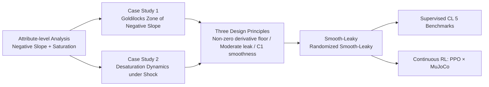

# Activation Function Design Sustains Plasticity in Continual Learning

**Conference**: ICLR 2026  
**OpenReview**: [https://openreview.net/forum?id=XZf6wObHX4](https://openreview.net/forum?id=XZf6wObHX4)  
**Code**: [https://github.com/lute47lillo/activations_plasticity](https://github.com/lute47lillo/activations_plasticity)  
**Area**: Continual Learning / Plasticity / Optimization Training Dynamics  
**Keywords**: Loss of Plasticity, Activation Functions, Continual Learning, Dead Neurons, Reinforcement Learning  

## TL;DR
This paper repositions "activation functions" as the primary, architecture-agnostic lever for mitigating **loss of plasticity** in continual learning. Through an attribute-level analysis of negative slope and saturation behavior, three design principles are refined. Based on these, two plug-and-play non-linearities, Smooth-Leaky and Randomized Smooth-Leaky, are proposed, which consistently improve late-stage adaptation in supervised continual classification and non-stationary MuJoCo reinforcement learning.

## Background & Motivation
**Background**: Continual learning (CL) requires networks to absorb new knowledge as data distributions shift. In addition to the well-known "catastrophic forgetting" (collapse of performance on old tasks), there is an under-recognized failure mode—**loss of plasticity**: while the network may remember old skills, it gradually loses the ability to learn new ones. This phenomenon is particularly insidious in reinforcement learning, as the agent's changing policy itself alters the encountered data distribution.

**Limitations of Prior Work**: Previous work has listed various "symptoms" of plasticity loss—gradient decay, parameter norm expansion, rank deficiency of curvature, and decreased representation diversity—but no single factor explains its cause across scenarios (Lyle et al. described this as a "Swiss cheese" superposition of multiple mechanisms). Corresponding mitigation measures are fragmented: either periodically replacing low-utility neurons (Continual Backprop), adding plasticity-specific regularization terms, increasing capacity, or requiring task-specific hyperparameter tuning.

**Key Challenge**: Plasticity requires a balance between **stability (retaining old knowledge)** and **plasticity (adapting to new data)**. The primary gate determining "how much learning signal passes through backpropagation"—the activation function—has long been treated as a "solved" design point. While the performance gap between activation functions is small in i.i.d. training, this study finds that the gap widens significantly under continual, non-stationary data.

**Goal**: To treat activation functions as a lightweight, domain-general lever that maintains plasticity without increasing capacity or requiring task-specific tuning, systematically characterizing "what shape of nonlinearity maintains plasticity" and providing directly replaceable implementations.

**Key Insight**: **[Attribute-level Analysis + Design Principles]** Rather than inventing a complex activation function, the authors decompose activation functions into two quantifiable attributes: "negative responsiveness" and "saturation behavior." They identify causal relationships between these and plasticity (Goldilocks zones and dead band widths), translating these principles into two minimally modified Leaky-ReLU variants.

## Method

### Overall Architecture
The paper follows a "Diagnosis → Principles → Design → Verification" pipeline: first, using a unified 4-layer CNN + Adam + fixed budget, it compares 11 activation functions under i.i.d. and class-incremental (C-IL) settings to establish that "CL amplifies differences"; second, two case studies isolate the mechanisms of **steady-state negative slope responsiveness** and **desaturation speed after shocks** to extract three design principles; finally, Smooth-Leaky and Randomized Smooth-Leaky are constructed and neutralized on 5 supervised CL benchmarks and continuous RL (PPO × MuJoCo 4 tasks in 3 cycles).

### Key Designs

**1. The "Goldilocks Zone" of Negative Slope: Responsiveness too small starves gradients, while too large causes instability.** The first diagnosis treats the negative slope as a scannable knob, projecting three families—piecewise linear (Leaky-ReLU, RReLU), smooth tail (Swish, GeLU, ELU), and adaptive (PReLU)—onto a common axis: **effective slope** $\bar{s}=\mathbb{E}_{x<0}[\varphi'(x)]$. The conclusion is that performance peaks stably at a moderate leakage of $0.6\lesssim\bar{s}\lesssim0.9$, with degradation beyond these bounds due to two opposing failure mechanisms: when $\bar{s}\to0$, the network enters a **dead neuron zone** (approx. 45% units inactive, where inactivity correlates negatively with accuracy, $r=-0.51$); when $\bar{s}\to1$, although there are few dead units, it triggers **optimization instability**—spikes in the main curvature $\lambda_{\max}$ and effective rank. Maintaining plasticity is essentially a compromise: "neither starving the gradient nor stiffening the loss surface." Notably, unconstrained adaptive slopes (PReLU) drift out of this zone during training (per-neuron drift to 0.3–0.6), suggesting that adaptivity is useful but requires constraints to remain within the band.

**2. Desaturation Dynamics and "Dead Band Width": Determining how fast gradients reopen after shocks.** A non-zero negative slope is insufficient; a distribution shift can push many pre-activations into the tail, effectively zeroing out gradients. The second diagnosis applies a "scaling shock" every 10 epochs (multiplying pre-activations by $\gamma\in\{0.25,0.5,1.5,2.0\}$ and then restoring them), quantifying recovery with three metrics: peak saturation ratio, Area Under the Saturation Curve (AUSC), and steps needed to recover 95% of pre-shock performance $\tau_{95}$. Two patterns emerge: (i) **Derivative floor rule**: Activations with a strictly non-zero derivative floor (Leaky-ReLU/RReLU/PReLU) have the lowest AUSC and almost never fail to recover (<5%), whereas zero-floor ones (ReLU/Sigmoid/Tanh) frequently fail to recover. (ii) **Bilateral saturation penalty**: Approximately half of the runs for Sigmoid/Tanh (saturated on both sides) fail to desaturate. Based on this, the authors define **Dead Band Width (DBW)**—the proportion of the typical input interval where $|\varphi'(x)|<10^{-3}$. It correlates strongly with AUSC ($r=0.81$) and non-recovery rate ($r=0.84$), but not with recovery speed—meaning DBW predicts "if and how severely saturation occurs," not "how fast it recovers."

**3. Smooth-Leaky / Randomized Smooth-Leaky: Compressing three principles into minimal modifications.** The three principles—(i) maintaining a strictly non-zero derivative floor, (ii) keeping negative responsiveness in the Goldilocks zone, and (iii) prioritizing $C^1$ smooth transitions (first-order continuous at the origin) when the first two are met—point to the same family: retaining the floor and linear leak of Leaky-ReLU while replacing the "kink" at the origin with a smooth curve. Smooth-Leaky is defined as:

$$f(x)=\alpha x+(1-\alpha)\,x\,\sigma\!\left(\frac{cx}{p}\right)$$

where $\alpha$ locks the negative floor and $(p,c)$ control the width and steepness of the transition. Asymptotically, $f(x)\approx\alpha x\,(x\ll0)$ and $f(x)\approx x\,(x\gg0)$, removing the kink without changing capacity. The Randomized variant replaces the fixed $\alpha$ with a random slope $r$ sampled uniformly from $[l,u]$ for each forward pass, using the mean $r_{\text{test}}=(l+u)/2$ during inference:

$$f(x)=r x+(1-r)\,x\,\sigma\!\left(\frac{cx}{p}\right),\quad r\sim U(l,u)$$

Randomization introduces robustness to small perturbations in negative responsiveness while maintaining a strict floor and $C^1$ transition—effectively performing lightweight exploration near the Goldilocks zone. The authors specify that when "recovery success" and "recovery speed" conflict, the former is prioritized as non-recovery dominates downstream performance; thus, linear leak with a floor is retained, and smoothness is treated as an added benefit.

## Key Experimental Results

### Main Results Table (Supervised CL, Average Online Accuracy % across 5 benchmarks, 5 runs)

| Activation | Permuted MNIST | RandLabel MNIST | RandLabel CIFAR | CIFAR 5+1 | Continual ImageNet |
|---|---|---|---|---|---|
| ReLU | 78.85 | 20.03 | 25.79 | 4.76 | 73.71 |
| Leaky-ReLU | 84.14 | 91.53 | 98.34 | 48.86 | 85.28 |
| RReLU | 83.95 | 93.10 | 98.02 | 53.60 | 84.97 |
| PReLU | 82.62 | 92.67 | 96.86 | 43.30 | 82.37 |
| Swish (SiLU) | 83.41 | 67.73 | 87.40 | 35.31 | 82.64 |
| CReLU | 82.66 | 89.47 | 92.90 | 20.56 | 84.85 |
| Deep Fourier | 83.69 | 92.61 | 96.24 | **72.29** | 76.03 |
| **Smooth-Leaky** | 84.03 | 91.69 | 98.36 | 49.87 | 85.38 |
| **Rand. Smooth-Leaky** | **84.26** | **93.33** | **98.42** | 57.01 | **86.23** |

Rand. Smooth-Leaky achieves statistical significance ($p<0.05$ via Welch’s t-test) in multiple columns compared to the runner-up (Smooth-Leaky). ReLU almost completely loses plasticity in difficult settings (4.76 on CIFAR 5+1).

### Ablation Study (Continuous RL, PPO Single Agent Cycle HalfCheetah→Hopper→Walker2d→Ant for 3 rounds 12M steps)

| Metric | Swish | PReLU | Sigmoid | **Rand. Smooth-Leaky** | Smooth-Leaky |
|---|---|---|---|---|---|
| Plasticity Score (IQM ± 95% CI) | 0.315 ± 0.071 | 0.272 ± 0.038 | 0.333 ± 0.059 | **0.388 ± 0.038** | 0.331 ± 0.037 |

The Plasticity Score uses Min-Max normalization + IQM aggregation of final-round steady-state rewards across environments; Rand. Smooth-Leaky achieves the highest score.

### Key Findings
- **i.i.d. converges, C-IL diverges**: The gap between activations is minimal in i.i.d. joint training on Split-CIFAR-100 (58.78~73.71) but widens drastically under C-IL (20.91~32.95), proving that "continual learning is the true stage that amplifies activation differences."
- **Dominance of the Leakage Family**: Leaky-ReLU/RReLU/PReLU/Smooth-Leaky variants with learnable or random negative slopes consistently outperform ReLU, especially in difficult settings.
- **Plasticity does not come at the cost of generalization**: While achieving high Plasticity Scores in stable environments (Ant/Cheetah), Rand. Smooth-Leaky also shows a lower incremental generalization gap $\Delta\text{GAP}$, suggesting it favors "transferable" solutions over memorizing the latest data.

## Highlights & Insights
- **Redefining the Problem Perspective**: The paper moves "loss of plasticity" from an engineering fix (regularization/neuron replacement) back to the most fundamental, architecture-agnostic design variable—activation function shape—providing falsifiable attribute-level explanations.
- **Two Quantifiable Diagnostic Metrics**: The effective slope $\bar{s}$ allows for a comparison between linear leaks and smooth tails on the same axis; Dead Band Width (DBW) is a purely analytical quantity that strongly predicts experimental saturation severity. These proxies are valuable for future activation function design.
- **Transferable Design Principles**: The three principles (non-zero floor / moderate leak / $C^1$ smoothness) are task-independent, as supervised CL and RL share consistent conclusions, fulfilling the promise of "domain-general" applicability.

## Limitations & Future Work
- **Hyperparameters and Fairness**: Smooth-Leaky introduces three hyperparameters $(\alpha, p, c)$. The authors discuss the trade-off between multi-parameter design and computational budget fairness in the appendix, but the tuning cost is not entirely eliminated.
- **RL Stability Shortcomings**: Rand. Smooth-Leaky can fail (zero reward) in environments like Humanoid that are prone to instability, suggesting that randomization still carries risks under high-variance dynamics.
- **Non-unique Mechanisms**: The paper adheres to the "Swiss cheese" view of multiple mechanisms, treating activation functions as one lever rather than claiming they explain all plasticity loss. Interactions with parameter norm expansion or value target scaling are left for future work.
- **Trainability vs. Generalizability**: The authors distinguish between the two and note that their relationship remains inconclusive; the current metrics (Plasticity Score + ΔGAP) are only stage-specific measures.

## Related Work & Insights
- **Taxonomy of Plasticity Loss**: Continual Backprop (generate-and-test replacement of low-utility units), plasticity-oriented regularization, and alternative activations like CReLU/Rational/Deep Fourier serve as the comparison group. This paper argues most of these methods are inferior to a "tuned leakage family + the proposed variants."
- **Activation Function Research**: From negative slope designs (Leaky-ReLU/PReLU/RReLU) to smooth non-monotonicity (Swish/GeLU) and self-normalizing exponential branches (ELU/CELU/SELU)—this paper re-evaluates them under the dual axes of "negative responsiveness + saturation."
- **Inspiration**: For researchers in CL or continuous RL, this work suggests that "choosing the right activation and tuning it to the Goldilocks zone" might be a more cost-effective starting point than complex regularizations. Analytical proxies like DBW also inspire the prior screening of architectural components.

## Rating
- **Novelty**: ⭐⭐⭐⭐ Solid perspective shift—attributing an old problem to "activation function shape" and providing quantifiable mechanisms like Goldilocks zones and DBW. The activations themselves are modifications of existing families, but the analytical framework is original.
- **Experimental Thoroughness**: ⭐⭐⭐⭐ Covers i.i.d./C-IL comparisons, two mechanism-isolating case studies, 5 supervised CL benchmarks + continuous RL, with multiple seeds and statistical significance tests. The evidence chain is complete.
- **Writing Quality**: ⭐⭐⭐⭐ The "Diagnosis → Principles → Design → Verification" logic is clear; formulas and correlation figures are well-presented, though the section on trainability vs. generalizability is dense.
- **Value**: ⭐⭐⭐⭐ Plug-and-play, no capacity increase, and no task-specific tuning required. The low implementation cost makes it immediately practical for the CL and continuous RL communities.

<!-- RELATED:START -->

## Related Papers

- [\[ICLR 2026\] FIRE: Frobenius-Isometry Reinitialization for Balancing the Stability–Plasticity Tradeoff](fire_frobenius-isometry_reinitialization_for_balancing_the_stabilityplasticity_t.md)
- [\[ICLR 2026\] Leveraging Discrete Function Decomposability for Scientific Design](leveraging_discrete_function_decomposability_for_scientific_design.md)
- [\[ICLR 2026\] LCA: Local Classifier Alignment for Continual Learning](lca_local_classifier_alignment_for_continual_learning.md)
- [\[ICLR 2026\] Submodular Function Minimization with Dueling Oracle](submodular_function_minimization_with_dueling_oracle.md)
- [\[ICLR 2026\] Toward Principled Flexible Scaling for Self-Gated Neural Activation](toward_principled_flexible_scaling_for_self-gated_neural_activation.md)

<!-- RELATED:END -->
