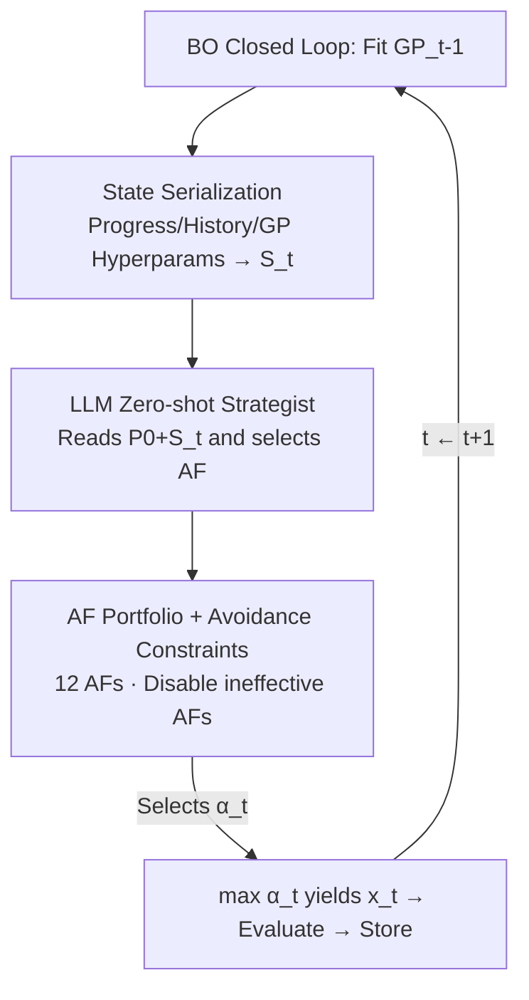

# Adaptive Acquisition Selection for Bayesian Optimization with Large Language Models

**Conference**: ICLR2026  
**OpenReview**: [https://openreview.net/forum?id=EPKmSgXvRe](https://openreview.net/forum?id=EPKmSgXvRe)  
**Code**: TBD  
**Area**: optimization  
**Keywords**: Bayesian optimization, acquisition function selection, Large Language Models, zero-shot decision making, state serialization

## TL;DR
This paper proposes LMABO, which utilizes a pre-trained Large Language Model (LLM) as a "zero-shot online strategist" for the Bayesian Optimization (BO) process. In each iteration, the optimization state is serialized into a structured text prompt, enabling the LLM to select the most suitable acquisition function (AF) from a portfolio. LMABO consistently outperforms static AFs, adaptive portfolios, and other LLM-based baselines across 50 benchmarks.

## Background & Motivation

**Background**: Bayesian Optimization approximates expensive black-box objective functions using a surrogate model (typically a Gaussian Process, GP) and employs an acquisition function $\alpha(x;D_{t-1})$ to balance "exploration (sampling unknown regions)" and "exploitation (sampling near the current optimum)" to determine the next evaluation point. Common AFs include EI, LogEI, UCB, TS, PI, KG, MES, and PES, each with specific biases: TS and UCB favor exploration, while EI and LogEI prioritize exploitation.

**Limitations of Prior Work**: It is well-established that no single fixed AF is optimal for all problems, and the optimal strategy dynamic changes across different stages of a single optimization process. Consequently, "adaptive portfolio" methods have been developed to dynamically select an AF in each round. however, methods such as GP-Hedge, No-PASt-BO, and SETUP-BO rely almost exclusively on **past function values** to calculate a reward signal for weighted selection, resulting in a very narrow perspective.

**Key Challenge**: The optimization state contains a wealth of overlooked critical information—remaining budget (number of evaluations left), the distance between evaluated points (indicating whether the previous step prioritized exploration or exploitation), and GP hyperparameters (e.g., lengthscale reflecting function complexity). The difficulty lies in manually designing an algorithmic strategy capable of reasoning over such heterogeneous "strategic, tactical, and topographical" information simultaneously.

**Goal**: To enable AF selection to utilize the full state without requiring manually written complex strategies or task-specific training.

**Key Insight**: Modern LLMs pre-trained on vast scientific literature and code implicitly encode rich knowledge of optimization principles. Rather than writing a strategy to cover all states, it is more effective to directly leverage this pre-trained knowledge and the reasoning capabilities of LLMs to guide the exploration-exploitation balance.

**Core Idea**: Reformulate "AF selection" as a **sequential decision-making problem solved in-context by a pre-trained LLM**. In each round, the multi-dimensional optimization state is serialized into a structured prompt, and the LLM selects the next AF after reading it.

## Method

### Overall Architecture

LMABO (Language Model-Assisted adaptive BO) is a closed-loop system: the main BO loop proceeds as usual (fitting GP, maximizing AF, evaluating the objective, updating the dataset), with the only change being that the step of "choosing the AF" is delegated to the LLM online. The workflow is: first, a static system prompt $P_0$ is sent to the LLM to establish the persona and rules; then, in each round $t$, the $GP_{t-1}$ is fitted, a **state summary $S_t$** is extracted from the model and history, and $S_t$ is appended to $P_0$ to form the update prompt $P_t$. The LLM returns the AF $\alpha_t$ for the round, which is used to find $x_t=\arg\max_x \alpha_t(x)$. After evaluating $y_t=f(x_t)+\eta_t$, $(x_t,y_t)$ is added to the dataset for the next round. Note that the LLM acts only as a "semantic controller" to pick the AF; it does not replace the rigorous mathematical framework of the GP.

### Key Designs

**1. Reformulating AF selection as an LLM in-context decision task: Persona + Action Space + Output Format**

This addresses the difficulty of manually writing strategies for all states. LMABO does not fine-tune any weights and relies purely on in-context learning. The initial static prompt $P_0$ consists of four parts: ① **Role-playing instructions**, directing the LLM to act as a "Bayesian Optimization expert" to invoke expert decision patterns from pre-training; ② **Available actions**, listing abbreviations and full names of AFs (e.g., EI, UCB) while **intentionally omitting descriptions** for each to avoid biased interpretations, relying instead on the LLM's encoded knowledge (falling back to UCB on invalid output); ③ **State information schema**, explaining the meaning of fields in $S_t$; ④ **Output format constraints**, enforcing a "Short Name: Reason" format for reliable parsing. $P_0$ is sent once, and $S_t$ is appended each round. The key is that the mathematical backbone (GP) is not given to the LLM; only the high-level decision of "which AF to choose" is delegated, gaining LLM reasoning without sacrificing numerical rigor—distinguishing it from LLAMBO/LLMP, which use LLMs as numerical regression engines.

**2. Multi-dimensional State Serialization $S_t$: Translating numerical states into structured summaries**

This is the core design addressing the narrow vision of prior methods. Each round, high-dimensional numerical states are compressed into a compact, human-readable text summary $S_t$ containing three types of signals: ① **Process Status**—number of evaluations $N$, remaining budget $N_{rem}$, and problem dimension $D$. The remaining budget is crucial for deciding between long-term exploration and short-term exploitation. ② **Performance History**—current best value $f_{min}$, observed range, and **the shortest distance from the last evaluation point to all historical points** (indicating the exploration/exploitation nature of the previous step). ③ **GP Model Characteristics**—key hyperparameters of the fitted surrogate model, including statistics (min/max/mean/std) of the kernel's outputscale and lengthscale, revealing function topography complexity to the LLM. $S_t$ balances compactness and completeness, showing that removing any component significantly degrades performance (Table 2).

**3. Diverse AF Portfolio + "Avoid Ineffective AF" Instruction: Providing an action pool and preventing repeated errors**

The action pool consists of 12 AFs covering various focuses from exploration (TS, UCB, MES, PES) to exploitation (EI, LogEI, PI, PosMean). Additionally, a critical prompt engineering constraint **instructs the LLM to avoid AFs that "failed to improve the current optimum."** Ablation studies show that removing this instruction causes the most significant performance drop, as the LLM otherwise repeatedly selects ineffective AFs. Providing an action pool is insufficient; simple rules are needed to prevent the LLM from repeating mistakes.

### A Complete Example

Consider a 5-dimensional synthetic function with a 50-round budget. Initialization uses $2D+1=11$ points. **Early stage** (e.g., round 5): $S_t$ shows a high remaining budget, large shortest distance, and small GP lengthscale (topographic complexity). The LLM tends to select information-theoretic AFs like MES/PES to quickly reduce uncertainty, interspersed with EI for early improvements. **Mid-stage** (e.g., round 25): If progress stalls ($f_{min}$ remains unchanged), the LLM switches to TS for better exploration to escape local optima. **Late stage** (e.g., round 45): With minimal budget left, the LLM prioritizes exploitation, frequently choosing PosMean for final refinements. Throughout the process, the LLM switches frequently between EI, LogEI, and TS, but this switching is not random; the paper proves that mimicking this with random selection or simple alternation fails to achieve LMABO's robust performance.

## Key Experimental Results

### Main Results

Evaluations were conducted on **50 problems**: 30 synthetic functions from COCO/BoTorch and 20 real-world hyperparameter optimization tasks from Bayesmark. The surrogate model used a GP with a Matérn 5/2 kernel, and the default LLM was Gemini-1.5 Flash across 10 random seeds. Metrics included Relative Performance (RP) based on the Area Under the Curve (AUC) of Simple Regret (best method = 1.0, others = own AUC / best AUC; lower is better) and Mean Rank (among 38 methods).

| Category | Best Baseline | LMABO Relative AUC vs Baseline |
|----------|---------------|-------------------------------|
| Static AF | EI/LogEI | 9.7% lower |
| Simple Meta-strategy | — | 14.8% lower |
| Adaptive Portfolio | GP-Hedge | 16.6% lower |
| LLM-based | LLAMBO | 54.7% lower |

| Method | Mean RP↓ | Mean Rank↓ (Min–Max) | CV |
|------|----------|----------------------|-----|
| EI (Strongest Static) | 1.34 | 13.08 (1–34) | 0.44 |
| GP-Hedge (Adaptive) | 1.45 | 16.96 (1–34) | 0.42 |
| LLAMBO (LLM-based) | 2.67 | 23.74 (1–38) | 0.43 |
| **LMABO** | **1.21** | **5.62 (1–19)** | **0.37** |

Ours achieved an average RP of 1.21 and a mean rank of 5.62 (worst rank was 19, whereas static AFs could drop to 35). A coefficient of variation (CV) of 0.37 indicates high consistency across seeds. The Friedman test p-value of 1.38e-106 and post-hoc comparisons confirmed that LMABO's differences from all other methods are significant. Cost-wise, a 50-round run consumes about 6000 tokens ($\approx$ \$0.01) with approximately 1 second of LLM latency per round—negligible compared to evaluating expensive black-box functions.

### Ablation Study

| Configuration | Mean RP↓ | Mean Rank↓ | Description |
|------|----------|-----------|------|
| Full LMABO | 1.21 | 5.62 | Complete model |
| w/o Remaining Budget | 1.40 | 15.72 | Least critical component |
| w/o GP Model Features | 1.50 | 20.04 | Significant performance drop |
| w/o Shortest Distance | 1.50 | 19.76 | Comparable to GP features |
| w/o Avoidance Instruction | 1.92 | 28.30 | **Largest performance drop** |

Replacing the backbone LLM: LMABO-8B (Qwen2-7B) showed a perceived decline (RP 1.48) but still outperformed all baselines; performance recovered to 1.29 with 30B models. LMABO-120B and GPT-4o mini achieved 1.21/1.22, performing on par with the default, suggesting efficacy stems from general reasoning capabilities rather than a specific LLM.

### Key Findings

- **Removing the "Avoid Ineffective AF" instruction causes the largest drop**: Simply feeding states to the LLM is insufficient; explicit rules are needed to prevent repeating mistakes. This is the most cost-effective prompt design.
- **Three state components are indispensable**: Removing the remaining budget had the smallest impact, while GP features and distance information were more critical, validating that "rich states beyond historical values" provide the edge over traditional adaptive methods.
- **Stage-dependent behavior adaptation**: Early stages are sensitive to all info and favor MES/PES; mid-stages monitor history and status, switching to TS when progress stalls; final stages focus on the current best value and PosMean. This behavior cannot be replicated by simple heuristics.
- **Task context injection prevents stagnation**: Adding objective function descriptions (e.g., "many local minima") in $P_0$ acts as a safety valve, helping LMABO avoid traps on functions like HolderTable and converge faster.

## Highlights & Insights

- **"Semantic Controller" Paradigm**: The LLM does not replace the GP mathematical framework but manages high-level AF selection. This allows for LLM reasoning without sacrificing numerical rigor, explaining why it outperforms LLM-based regressions like LLAMBO.
- **State Serialization as the Engine**: Translating "unseen" signals (budget, distance, lengthscale) into text for the LLM is the core driver. This "numerical state → structured text" approach is transferable to any online control scenario (e.g., scheduling, HPO).
- **Leverage Effect of Simple Prompt Rules**: The "avoid ineffective AF" instruction yields the highest marginal gain, suggesting that **explicit error-avoidance constraints** are often more effective than simply increasing information density in LLM agents.
- **Zero-shot, Training-free, and Agnostic**: The method works across various LLM sizes (8B to GPT-4o) and requires no training, lowering the barrier for engineering adoption.

## Limitations & Future Work

- **Dependency on Backbone Quality**: Smaller models (8B) show performance degradation; effectiveness is strongly correlated with LLM reasoning ability, potentially limiting performance in resource-constrained or offline scenarios.
- **LLM Call Overhead**: While negligible for expensive black-boxes, the latency and cost of LLM calls are not justifiable for "cheap functions" that evaluate in milliseconds.
- **Fixed AF Portfolio**: The action pool is restricted to 12 pre-defined AFs. The LLM cannot discover new AFs like FunBO; the portfolio design still relies on human expertise.
- **Manual State Design**: The selection and serialization of fields in $S_t$ are handcrafted. Different problem domains might require re-designing these fields.
- **Future Directions**: Upgrading "task context injection" from manual descriptions to automated retrieval/generation, or allowing the LLM to expand the AF portfolio online.

## Related Work & Insights

- **vs. GP-Hedge / No-PASt-BO / SETUP-BO (Adaptive Portfolios)**: These treat AF selection as a multi-armed bandit using only past values for rewards. Ours serializes "overlooked states" for contextual decisions, resulting in more robust cross-problem performance (RP 1.21 vs 1.45+).
- **vs. ESP (Information-theoretic Portfolio)**: ESP uses expected reduction in uncertainty as a look-ahead criterion but still focuses only on function values. Ours is more comprehensive and relies on LLM reasoning rather than a single metric.
- **vs. MetaBO / FSAF (Learning-based Strategies)**: These formalize selection as reinforcement learning and meta-learn strategies on source tasks. Ours is zero-shot, requiring no training or transfer.
- **vs. FunBO**: FunBO uses LLM as an **offline AF generator**; Ours performs online real-time adaptation, making the two approaches complementary.
- **vs. LLAMBO / LLMP (LLM-based BO)**: These use LLMs for surrogate modeling and candidate proposal (numerical engines). Ours keeps the GP framework and uses the LLM as a semantic controller, resulting in superior robustness (Ours has 54.7% lower AUC than the best LLM baseline).

## Rating
- Novelty: ⭐⭐⭐⭐ The paradigm of "LLM as a semantic controller for AF selection" is a clean and precise innovation.
- Experimental Thoroughness: ⭐⭐⭐⭐⭐ 50 problems, 38 methods, statistical testing, and comprehensive ablations on states, instructions, and backbones.
- Writing Quality: ⭐⭐⭐⭐ Clear motivation, insightful behavioral analysis, and well-explained prompt designs.
- Value: ⭐⭐⭐⭐ Zero-training, backbone-agnostic, and low engineering barrier; a practical advancement for adaptive BO.

<!-- RELATED:START -->

## Related Papers

- [\[ICLR 2026\] Generative Bayesian Optimization: Generative Models as Acquisition Functions](generative_bayesian_optimization_generative_models_as_acquisition_functions.md)
- [\[ICLR 2026\] Combinatorial Bandit Bayesian Optimization for Tensor Outputs](combinatorial_bandit_bayesian_optimization_for_tensor_outputs.md)
- [\[ICLR 2026\] BoGrape: Bayesian optimization over graphs with shortest-path encoded](bogrape_bayesian_optimization_over_graphs_with_shortest-path_encoded.md)
- [\[ICML 2026\] Towards Understanding Continual Factual Knowledge Acquisition of Language Models: From Theory to Algorithm](../../ICML2026/optimization/towards_understanding_continual_factual_knowledge_acquisition_of_language_models.md)
- [\[ICLR 2026\] COLD-Steer: Steering Large Language Models via In-Context One-step Learning Dynamics](cold-steer_steering_large_language_models_via_in-context_one-step_learning_dynam.md)

<!-- RELATED:END -->
