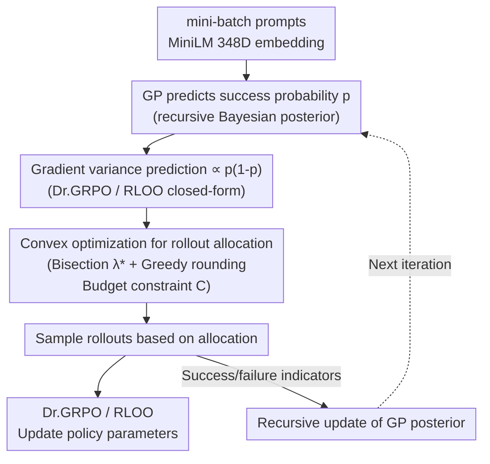

# Adaptive Rollout Allocation for Online RL with Verifiable Rewards (VIP)

**Conference**: ICLR 2026  
**arXiv**: [2602.01601](https://arxiv.org/abs/2602.01601)  
**Code**: [https://github.com/HieuNT91/VIP](https://github.com/HieuNT91/VIP)  
**Area**: Optimization  
**Keywords**: GRPO, rollout allocation, gradient variance, Gaussian process, sampling efficiency  

## TL;DR
VIP (Variance-Informed Predictive allocation) is proposed to predict success probabilities of prompts via Gaussian processes, and subsequently use convex optimization to allocate rollout counts under computational budget constraints to minimize gradient variance. This consistently improves sampling efficiency for GRPO/RLOO in mathematical reasoning tasks, showing up to a 12.3-point Pass@32 improvement on AIME24/25.

## Background & Motivation
**Background**: Group-based RL methods like GRPO/RLOO train LLMs by generating multiple rollouts per prompt and estimating relative advantages. Typically, a fixed number of rollouts (e.g., 16) is uniformly allocated to all prompts.

**Limitations of Prior Work**: Uniform allocation implicitly assumes all prompts are equally important—however, rollouts for prompts with success rates near 0 or 1 yield almost no effective gradient signal (zero variance), thus wasting computational budget. Existing filtering methods require sampling before filtering, which may offset efficiency gains.

**Key Challenge**: The need to predict which prompts are most informative (those with success rates near 0.5 have the maximum gradient variance) *before* sampling, yet success rates change dynamically as the model updates during training.

**Goal**: How to optimally allocate rollouts to various prompts in a mini-batch under a fixed computational budget?

**Key Insight**: (1) Theoretical analysis shows the relationship between gradient variance and success probability $p$ for Dr.GRPO and RLOO—both are proportional to $p(1-p)$; (2) Gaussian processes (GP) can predict $p$ for each prompt; (3) Convex optimization can solve for the optimal allocation.

**Core Idea**: Use GP to predict success probability $\rightarrow$ Predict gradient variance $\rightarrow$ Use convex optimization to minimize total gradient variance $\rightarrow$ Implement adaptive rollout allocation.

## Method

### Overall Architecture
VIP addresses the problem of "how to spend the rollout budget." Group-based RL defaults to a fixed average budget per prompt, but much of this budget is wasted on prompts with success probabilities near 0 or 1, which produce almost no gradient signals. VIP implements a closed loop: in each training iteration, a Gaussian process (GP) predicts the current success probability of each prompt in the mini-batch based on historical rollout results. This probability is converted into variance contribution via the closed-form relationship "gradient variance $\propto p(1-p)$." A closed-form convex optimization then determines the rollout allocation for each prompt under total budget constraints. Sampling follows this allocation, and the resulting success/failure indicators are used to update both the GP posterior and model parameters. This plug-and-play module operates on top of Dr.GRPO/RLOO without modifying original loss functions.

### Key Designs

**1. Gradient Variance Analysis: Quantifying "informativeness" as $p(1-p)$**

This provides the theoretical foundation. The paper analyzes the variance of advantage estimation for Dr.GRPO and RLOO, deriving closed-form relationships between gradient variance and success probability $p$:

$$\text{Var}(\tilde{G})_{\text{Dr.GRPO}} = \frac{n-1}{n^2}\, 4\sigma_Z^2\, p(1-p), \qquad \text{Var}(\tilde{G})_{\text{RLOO}} = \frac{1}{n-1}\, 4\sigma_Z^2\, p(1-p)$$

where $n$ is the number of rollouts for the prompt and $\sigma_Z^2$ is the projected gradient variance. Since both variances are proportional to $p(1-p)$, the most informative prompts are precisely defined: those with $p=0.5$ have the highest variance and strongest signals, while those with $p \to 0$ or $p \to 1$ have $p(1-p) \to 0$ and yield almost no gradients. This converts the intuition of "where to invest budget" into a quantifiable optimization objective favoring medium-difficulty prompts.

**2. Gaussian Process Success Probability Prediction: Estimating $p$ before sampling**

The challenge is that $p$ must be known *before* sampling and drifts as the model updates. VIP uses a GP built on the prompt embedding space: prompts are encoded into 384D vectors via MiniLM, similarity is measured via an RBF kernel, and a sigmoid link function maps latent values to success probabilities in $[0,1]$. As a non-parametric method, the GP does not need to explicitly track model weights; it uses recursive Bayesian updates to integrate new rollout outcomes into the posterior, naturally tracking drifts in $p$. Similarity sharing via the kernel allows predictions for unseen prompts based on results from neighboring historical prompts.

**3. Convex Optimization Allocation: Closed-form solution for minimum variance**

With predicted $p$ and corresponding variance contributions, allocation becomes a constrained optimization: minimize the total mini-batch gradient variance given a total budget $C$ and range constraints $[L, U]$ for each prompt. While an integer programming problem, the paper provides a closed-form solution via continuous relaxation (Theorem 5.1 / 5.2). The optimal point is located via bisection search on the Lagrange multiplier $\lambda^*$, followed by a greedy heuristic to round the continuous solution to integers. Coupled with hashed embeddings and cached distance matrices, GP updates and optimization steps occur on the CPU with negligible runtime overhead compared to sampling.

### Loss & Training
The method integrates seamlessly with Dr.GRPO/RLOO without altering the loss. Training is conducted on DAPO-MATH-17K, evaluated on AIME24/25 using two budget settings (8×Q, 16×Q).

## Key Experimental Results

### Main Results (AIME24/25 Pass@32)

| Model | Method | AIME24 Pass@32 | AIME25 Pass@32 |
|------|------|---------------|---------------|
| Qwen2.5-Math-1.5B | RLOO | Baseline | Baseline |
| | **RLOO+VIP** | **+12.3** | - |
| | Dr.GRPO | Baseline | Baseline |
| | **Dr.GRPO+VIP** | **Improvement** | **Improvement** |
| Qwen2.5-Math-7B | GRPO+VIP | Improved (small gain) | Improved |

### Key Findings
- VIP consistently improves Pass@32 and Mean@32 across all model, baseline, and budget configurations.
- Small models (1.5B, 3B) benefit more, as weaker models are more prone to wasting rollouts on prompts that are too hard or too easy.
- Performance gains on 7B models are smaller because stronger models have success probability distributions more concentrated in the middle range.
- GP-predicted success probabilities correlate highly with actual success rates, validating prediction quality.
- Runtime overhead is negligible due to precomputed distance matrices and CPU-based optimization.

## Highlights & Insights
- **Solid Theoretical Foundation**: Deriving the $p(1-p)$ relationship from variance analysis provides a rigorous mathematical basis for adaptive allocation.
- **Closed-form Solution**: Despite being an integer programming problem, the continuous relaxation yields an efficient closed-form solution (bisection + greedy rounding), ensuring zero extra burden for deployment.
- **GP as a Smart Choice**: Information sharing through prompt embedding similarity allows the model to predict outcomes for unseen prompts using history from similar ones.

## Limitations & Future Work
- The assumption that $\sigma_Z^2$ (projected gradient variance) is identical for all prompts may not hold in practice.
- The GP kernel bandwidth is set via a median heuristic, which may not be optimal.
- Only validated in mathematical reasoning (RLVR settings); scenarios with noisy reward models (like RLHF) might require modifications to the analysis.
- Scaling the GP's $\Sigma$ matrix for very large prompt pools may become a bottleneck for calculation and storage.

## Related Work & Insights
- **vs. Uniform Allocation GRPO**: VIP acts as a strict upgrade to uniform GRPO with theoretical guarantees of lower gradient variance.
- **vs. Filtering Methods (Yu et al. 2025)**: Filtering methods discard non-informative prompts after sampling; VIP predicts and allocates before sampling to prevent waste.
- **vs. Heuristic Difficulty Allocation (Zhang et al. 2025)**: VIP provides theoretical optimality via convex optimization rather than relying on heuristics.

## Rating
- Novelty: ⭐⭐⭐⭐⭐ Complete theoretical framework from variance analysis to GP prediction and convex allocation.
- Experimental Thoroughness: ⭐⭐⭐⭐ Comparisons across multiple models, budgets, and baselines.
- Writing Quality: ⭐⭐⭐⭐⭐ Clear theoretical derivations with closed-form solutions for Theorems.
- Value: ⭐⭐⭐⭐⭐ Provides a plug-and-play efficiency tool for GRPO/RLOO training.

<!-- RELATED:START -->

## Related Papers

- [\[ICLR 2026\] Improving Online-to-Nonconvex Conversion for Smooth Optimization via Double Optimism](improving_online-to-nonconvex_conversion_for_smooth_optimization_via_double_opti.md)
- [\[ICLR 2026\] Online Black-Box Prompt Optimization with Regret Guarantees under Noisy Feedback](online_black-box_prompt_optimization_with_regret_guarantees_under_noisy_feedback.md)
- [\[CVPR 2026\] Dynamic Momentum Recalibration in Online Gradient Learning](../../CVPR2026/optimization/dynamic_momentum_recalibration_in_online_gradient_learning.md)
- [\[ICLR 2026\] SGD with Adaptive Preconditioning: Unified Analysis and Momentum Acceleration](sgd_with_adaptive_preconditioning_unified_analysis_and_momentum_acceleration.md)
- [\[NeurIPS 2025\] Online Two-Stage Submodular Maximization](../../NeurIPS2025/optimization/online_two-stage_submodular_maximization.md)

<!-- RELATED:END -->
