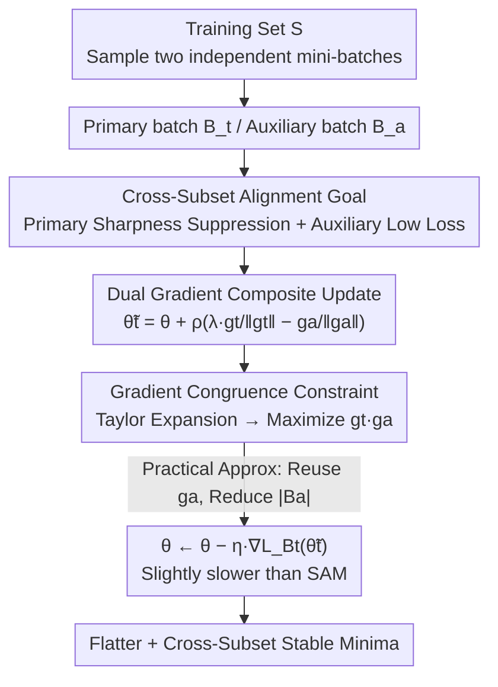

# Align-SAM: Seeking Flatter Minima for Better Cross-Subset Alignment

**Conference**: ICLR2026  
**OpenReview**: [https://openreview.net/forum?id=LvllbDxKZt](https://openreview.net/forum?id=LvllbDxKZt)  
**Code**: To be confirmed  
**Area**: optimization  
**Keywords**: Sharpness-aware minimization, flat minima, gradient alignment, generalization, optimizer

## TL;DR
Align-SAM reframes "generalization" as the "consistency of updates across two random subsets of the same distribution." Building on SAM's pursuit of flat minima, it introduces an auxiliary mini-batch and ensures the gradient of the primary training batch is "congruent" with the gradient of the auxiliary batch. This approach consistently and moderately outperforms SAM/ASAM across various settings, including classification, noisy labels, few-shot transfer, and meta-learning.

## Background & Motivation
**Background**: The generalization capability of deep networks is highly correlated with the "width" of the minima they converge to—flat minima are more robust to distribution shifts between training and testing. Sharpness-Aware Minimization (SAM, Foret et al. 2021) is a representative method in this line of research: it searches for a perturbation that maximizes loss within a $\rho$-neighborhood of the current parameters $\theta$, then minimizes the loss at this "worst-case point." This is equivalent to simultaneously lowering training loss and sharpness, pushing the model toward flat regions. Subsequent works like ASAM, GSAM, VASSO, and LookSAM are improvements based on the SAM framework.

**Limitations of Prior Work**: Theoretically, SAM's guarantees derive from PAC-Bayes, providing a "minimized sharpness on a single random training set $S \to$ smaller generalization loss upper bound." However, this perspective focuses solely on the geometric shape of a **single** subset and does not explicitly exploit the fact that the same distribution can be repeatedly resampled into different subsets. The essence of generalization is that what the model learns on $S$ must remain effective on an independently sampled subset $S_a$.

**Key Challenge**: SAM ensures "flatness on $S$," but it does not guarantee that the "update direction on $S$ aligns with the update direction on $S_a$." If gradients from two identically distributed subsets conflict, the model might remain sensitive to resampling and vulnerable to distribution shifts even if it resides in a flat region.

**Goal**: (1) Theoretically extend the generalization loss upper bound from "single-subset sharpness" to "primary-subset sharpness + auxiliary-subset low loss." (2) Design a practical optimizer that, in each update step, minimizes primary-subset sharpness while aligning the gradients of the primary and auxiliary subsets.

**Key Insight**: The authors redefine generalization as "cross-subset alignment." If a model, while primarily optimized on a random subset $S$, maintains low loss on an independently sampled auxiliary subset $S_a$, it demonstrates stability against "resampling from the same distribution," which is an indicator of good generalization.

**Core Idea**: Beyond SAM's "sharpness suppression," an auxiliary batch is added. Through a carefully designed composite update, the dot product of "primary batch gradient $\cdot$ auxiliary batch gradient" is increased. By effectively "bending" the two gradients toward the same direction, gradient alignment is used to enhance generalization.

## Method

### Overall Architecture
Align-SAM is a **plug-and-play optimizer**. Each training step independently samples **two** mini-batches from the training set: a primary batch $B_t$ and an auxiliary batch $B_a$ (where $B_a$ is typically much smaller than $B_t$ to save computation). It first uses the gradient of the auxiliary batch to construct a perturbation direction, combining it with the SAM-style ascent direction of the primary batch into a composite perturbation point $\tilde\theta^t$. The parameters are then updated using the gradient of the primary batch calculated at this point. The key is that this composite update, via Taylor expansion, is equivalent to performing three tasks: lowering primary batch loss, lowering primary batch gradient norm (the sharpness term, consistent with SAM), and **maximizing the dot product of primary and auxiliary gradients** (the alignment term unique to Align-SAM).

The theoretical support is Theorem 1: Under conditions similar to SAM, for any model $\theta^*$ that reaches optimality on the primary subset, its true generalization loss $L_D(\theta^*)$ is bounded with high probability by $L_D(\theta^*\mid S_a):=\max_{\|\theta'-\theta^*\|\le\rho}L_{S_a}(\theta')$ (the sharpness upper bound on the auxiliary subset) plus an $O(1/\sqrt{N_a})$ term. Consequently, the original problem is reformulated as a **bi-level objective** (Equation 3): among all solutions that minimize the primary subset sharpness bound $L_D(\theta\mid S_t)$, select the one that minimizes the auxiliary subset sharpness bound $L_D(\theta\mid S_a)$.

### Key Designs

**1. Cross-Subset Alignment Perspective and Auxiliary Subset Bound: Formalizing "Generalization" as Consistency Between Two Subsets**

SAM's PAC-Bayes bound only considers the sharpness of a single training subset $S$, which the authors argue misses "resampling stability." They introduce an independently sampled auxiliary subset $S_a \sim D^{N_a}$ and prove Theorem 1: For any $\theta^*$ minimizing the primary subset bound,

$$L_D(\theta^*)\le L_D(\theta^*\mid S_a)+\frac{8L}{\sqrt{N_a}}\sqrt{\log\frac{N_a+k}{\delta}}+\dots$$

where $L_D(\theta\mid S):=\max_{\|\theta'-\theta\|\le\rho}L_S(\theta')$ is the sharpness (worst-case neighborhood loss) on $S$, $k$ is the parameter dimension, and $L$ is the loss upper bound. This generalizes SAM's Theorem 1 from 0-1 loss to any bounded loss and, for the first time, incorporates the **auxiliary subset** into the bound. Intuition suggests that a truly well-generalized model must be flat not only on its own training subset but also maintain low (worst-case neighborhood) loss on another independently sampled subset—this is "cross-subset alignment." This leads to the bi-level formulation (Equation 3): first find a set of solutions minimizing the primary subset sharpness, then select the one minimizing the auxiliary subset bound.

**2. Dual Gradient Composite Update: Suppressing Sharpness and Aligning Gradients in One Step**

A direct application of MAML-style bi-level optimization would treat the auxiliary set as a validation set and require explicit train/validation splits, which contradicts the goal of "aligning two random subsets at every step." Instead, the authors convert the objective (3) into an iterative update using stochastic optimization. At step $l$, they define an auxiliary perturbation $\tilde\theta^a_l=\theta_l+\eta_2\nabla L_{B_a}(\theta_l)$ and construct a primary perturbation point:

$$\tilde\theta^t_l=\theta_l+\eta_1\nabla L_{B_t}(\theta_l)-\eta_2\nabla L_{B_a}(\tilde\theta^a_l),\qquad \theta_{l+1}=\theta_l-\eta\,\nabla L_{B_t}(\tilde\theta^t_l).$$

Applying a first-order Taylor expansion to $L_{B_t}(\tilde\theta^t_l)$ yields:

$$L_{B_t}(\tilde\theta^t_l)\approx L_{B_t}(\theta_l)+\eta_1\|\nabla L_{B_t}(\theta_l)\|_2^2-\eta_2\,\nabla L_{B_t}(\theta_l)\cdot\nabla L_{B_a}(\tilde\theta^a_l).$$

Thus, minimizing this is equivalent to simultaneously: (i) lowering primary batch loss, (ii) lowering the primary batch gradient norm (sharpness, identical to SAM), and (iii) **maximizing the dot product of primary and auxiliary gradients** $\nabla L_{B_t}\cdot\nabla L_{B_a}$. The first two terms inherit SAM's flattening effect, while the third term is the core of Align-SAM: it pulls the descent directions of two identically distributed subsets together. Theorem 2 further proves that under a sufficiently small learning rate, the dot product of these two gradients after the update has a positive lower bound (specifically, $\ge 1/2$ or $\ge 3/2$ times the original dot product depending on the sign), confirming that gradients become more "congruent" during training. Figure 1 in the paper validates this using cosine similarity.

**3. Normalized Practical Algorithm: Normalization + Mini-Auxiliary Batch + Gradient Reuse for Low Overhead**

A naive implementation requires calculating gradients for the perturbed model on the auxiliary set, doubling the cost. The authors adopt SAM's normalization trick, setting $\eta_2=\rho/\|\nabla L_{B_a}(\theta_l)\|_2$ and $\eta_1=\lambda\rho/\|\nabla L_{B_t}(\theta_l)\|_2$, leading to a concise composite perturbation (Algorithm 1):

$$\tilde\theta^t_l=\theta_l+\rho\Big(\lambda\frac{g_t}{\|g_t\|_2}-\frac{g_a}{\|g_a\|_2}\Big),\quad g_t=\nabla L_{B_t}(\theta_l),\ g_a=\nabla L_{B_a}(\theta_l).$$

Here, $\rho$ is the perturbation radius and $\lambda$ is a tradeoff coefficient between primary and auxiliary gradients. Two engineering choices to save computation: (a) replace the "perturbed model gradient" $\nabla L_{B_a}(\tilde\theta^a_l)$ with the "current model gradient" $\nabla L_{B_a}(\theta_l)$, saving one forward/backward pass; (b) set the auxiliary batch size much smaller than the primary batch (e.g., 2048 primary / 512 auxiliary for ImageNet, 128/32 for Food101). The authors found $\lambda > 1$ (weighting the primary gradient more) works better and use $\lambda=2$ in experiments. Consequently, Align-SAM is only slightly slower than standard SAM.

### Loss & Training
No additional explicit loss terms are added; the alignment effect is entirely embedded in the composite update. Key hyperparameters: perturbation radius $\rho$ (following SAM settings, e.g., 0.1 for CIFAR-100, 0.05 for CIFAR-10; 1.0/0.5 for ASAM versions), tradeoff coefficient $\lambda=2$, auxiliary batch much smaller than primary batch, cosine learning rate scheduler, and 200 epochs training from scratch. Align-SAM is an optimizer-level modification and can be stacked with ASAM to yield Align-ASAM. Convergence analysis (A.2) indicates it is in the same order as normalized SAM—like SAM, it does not strictly converge to the training loss minimum but shares the same convergence rate.

## Key Experimental Results

### Main Results
Training from scratch (ImageNet/Food101, ResNet18/34, 200 epochs):

| Dataset | Model | SAM Top-1 | Align-SAM Top-1 |
|--------|------|-----------|-----------------|
| ImageNet | ResNet18 | 62.46 | **63.64** |
| ImageNet | ResNet34 | 63.73 | **65.89** |
| Food101 | ResNet18 | 73.15 | **73.45** |
| Food101 | ResNet34 | 73.87 | **74.47** |

CIFAR training from scratch (3 architectures, 3 random seeds):

| Setting | Method | WRN28x10 | Pyramid101 | DenseNet121 |
|------|------|----------|------------|-------------|
| CIFAR-100 | SAM | 83.00 | 81.99 | 68.72 |
| CIFAR-100 | Align-SAM | **83.72** | **82.53** | 69.10 |
| CIFAR-100 | ASAM | 83.16 | 82.02 | 69.62 |
| CIFAR-100 | Align-ASAM | **83.88** | 82.31 | **69.71** |
| CIFAR-10 | SAM | 96.87 | 96.17 | 91.28 |
| CIFAR-10 | Align-SAM | 96.91 | **96.47** | **91.54** |

Transfer learning (ImageNet pre-training, fine-tuned for 50 epochs): Align-SAM achieved Top-1 gains of +0.48 / +0.88 / +0.74 over SAM on ResNet18/34/50. Using EfficientNet-B2~B4, it outperformed SGD/SAM/VASSO across small-to-medium datasets like Stanford Cars, FGVC-Aircraft, Food101, and Country211 (e.g., 12.48 $\to$ 13.41 for EfficientNet-B2 on Country211).

### Ablation Study

| Config / Analysis | Key Findings | Description |
|------------|---------|------|
| Noisy Labels (CIFAR-100, ResNet32) | Generally superior to SAM/FSAM/VASSO across noise levels | Symmetric noise levels {0.2, 0.4, 0.6, 0.8} |
| Meta-Learning (Mini-ImageNet/Omniglot) | Further improvements when stacked on Sharp-MAML$_{low}$ | Compared with MAML and Sharp-MAML |
| Gradient Cosine Similarity (Fig. 1) | Primary/Auxiliary similarity increases after update | Validates "gradient congruence" of Theorem 2 |
| Tradeoff Coefficient $\lambda$ | $\lambda > 1$ (set to 2) is optimal | Emphasizes primary batch gradient |
| Auxiliary Batch Size $|B_a|$ | Small values suffice; overhead is minimal | See Table 9 for runtime |

### Key Findings
- **The alignment term is effective**: Figure 1 shows that cosine similarity between gradients of the two subsets increases after the update, directly corresponding to the lower bound in Theorem 2. This suggests performance gains stem from "gradient congruence" rather than simply sampling an extra batch.
- **Gains are higher in difficult or overfitting-prone settings**: Significant improvements are observed in tough or noisy scenarios like ImageNet (ResNet34 +2.16), noisy labels, and Country211, whereas CIFAR-10 shows only marginal gains due to near-saturation.
- **Orthogonal to ASAM**: Align-ASAM further improves performance in most settings, indicating that "cross-subset alignment" and "adaptive sharpness" are independent sources of gain.

## Highlights & Insights
- **Revisiting generalization as "cross-subset alignment"**: Moving from "single-subset flatness" to "consistency across two identically distributed subsets." This perspective provides a new PAC-Bayes bound and leads naturally to the operational goal of maximizing gradient dot products.
- **Alignment "hidden" in the composite update**: Alignment isn't achieved by adding an explicit loss or using bi-level backpropagation. Instead, Taylor expansion allows a single update step to automatically encode three effects (loss, sharpness, and alignment). This "encoding regularization via perturbation geometry" is elegant and transferable.
- **Practically minimizing overhead to SAM levels**: By combining normalized perturbations, small auxiliary batches, and gradient reuse, the method remains nearly as fast as SAM despite its theoretical complexity.
- Theorem 2 provides an explicit positive lower bound for the gradient dot product, uniquely proving that alignment actually occurs rather than relying solely on empirical evidence.

## Limitations & Future Work
- **Training Overhead**: Each step requires an auxiliary batch, and training time increases with $|B_a|$. The authors view this as a performance-overhead tradeoff and suggest further gradient reuse, though not fully implemented here.
- **Modest Gains and Task Scope**: Improvements on saturated tasks like CIFAR-10 are small. The focus is currently on image classification and meta-learning, with its effectiveness on LLMs, detection, or segmentation tasks yet to be verified.
- **Theory-Algorithm Gap**: Theorem 2 assumes a "sufficiently small learning rate," whereas the practical algorithm uses normalization and gradient reuse approximations. The strict consistency between the two isn't fully closed.
- **Optimal Auxiliary Sampling**: The auxiliary set is currently sampled independently from the same training set. Sampling strategies based on difficulty, class distribution, or curricula could potentially amplify alignment returns.

## Related Work & Insights
- **vs SAM (Foret et al. 2021)**: SAM suppresses sharpness on a single subset (corresponding to terms i and ii in the composite update). Align-SAM adds the cross-subset alignment term (iii) and generalizes the upper bound to include auxiliary subsets and arbitrary bounded losses.
- **vs ASAM / VASSO / GSAM / LookSAM**: These improve SAM in directions like "adaptive sharpness," "variance suppression," or "first-order flatness," but remain single-subset focused. Align-SAM is orthogonal, as evidenced by Align-ASAM.
- **vs MAML / Sharp-MAML (Finn 2017; Abbas 2022)**: While the bi-level form resembles MAML, MAML treats auxiliary sets as validation sets for task adaptation. Align-SAM uses identically distributed resampling for per-step consistency. They are conceptually different and can be combined.
- **Insight**: Using "perturbation geometry + Taylor expansion" to implicitly encode consistency regularization is a powerful idea. It could be extended to multi-view self-supervised learning, federated learning (aligning client subsets), or continual learning (aligning old and new task gradients).

## Rating
- Novelty: ⭐⭐⭐⭐ Reframing generalization as cross-subset alignment and providing a new PAC-Bayes bound is a fresh perspective, though still an incremental advance in the SAM family.
- Experimental Thoroughness: ⭐⭐⭐⭐ Covers various settings and architectures, though lacking large-scale tasks like LLMs or detection.
- Writing Quality: ⭐⭐⭐⭐ Theoretical and algorithmic sections are well-connected, with intuitive derivations. The gap between practical approximations and theory could be explored deeper.
- Value: ⭐⭐⭐⭐ A practical, plug-and-play improvement with near-SAM overhead that can be stacked with ASAM.

<!-- RELATED:START -->

## Related Papers

- [\[NeurIPS 2025\] Exploring Landscapes for Better Minima along Valleys](../../NeurIPS2025/optimization/exploring_landscapes_for_better_minima_along_valleys.md)
- [\[ICLR 2026\] Combination-of-Experts with Knowledge Sharing for Cross-Task Vehicle Routing Problems](combination-of-experts_with_knowledge_sharing_for_cross-task_vehicle_routing_pro.md)
- [\[NeurIPS 2025\] Clean First, Align Later: Benchmarking Preference Data Cleaning for Reliable LLM Alignment](../../NeurIPS2025/optimization/clean_first_align_later_benchmarking_preference_data_cleaning_for_reliable_llm_a.md)
- [\[ICLR 2026\] Deep Latent Variable Model based Vertical Federated Learning with Flexible Alignment and Labeling Scenarios](deep_latent_variable_model_based_vertical_federated_learning_with_flexible_align.md)
- [\[ICLR 2026\] Bi-LoRA: Efficient Sharpness-Aware Minimization for Fine-Tuning Large-Scale Models](bi-lora_efficient_sharpness-aware_minimization_for_fine-tuning_large-scale_model.md)

<!-- RELATED:END -->
