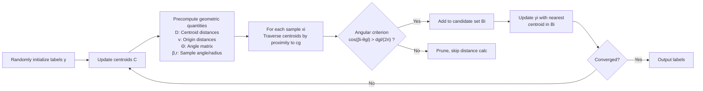

# Angle k-means: Accelerating Exact k-means via Angular Relationships

**Conference**: ICLR 2026  
**OpenReview**: [https://openreview.net/forum?id=BdhQWT0y9s](https://openreview.net/forum?id=BdhQWT0y9s)  
**Code**: C/C++ implementation + Python interface provided in supplemental material  
**Area**: Clustering / Optimization Algorithms / Accelerating Exact k-means  
**Keywords**: k-means acceleration, exact clustering, geometric pruning, angular relationships, parameter-free  

## TL;DR
This paper proposes **Angle k-means**, which accelerates the assignment step by precomputing distances and angles between centroids. By utilizing a geometric inequality involving only angular comparisons to prune distant candidate centroids, it runs faster than SOTA methods like Ball k-means and Exp-ns without introducing any hyperparameters or altering the final clustering results.

## Background & Motivation
- **Background**: Lloyd's k-means remains a pillar of clustering due to its simplicity, but the "assignment" step requires calculating the distance from every sample to all $k$ centroids, resulting in $O(nkD)$ complexity, which is expensive for large-scale, high-dimensional data. Mainstream acceleration for exact k-means follows two paths: tree structures (kd-tree, cover tree, dual-tree) and boundary-based methods (Elkan, Hamerly, Annulus, Exponion/Exp-ns, Ball k-means).
- **Limitations of Prior Work**: (1) Tree structures suffer from the "curse of dimensionality" in high-dimensional spaces; (2) Elkan's algorithm requires $O(nk)$ memory to maintain $k$ lower bounds per sample, which explodes with the number of clusters; (3) Methods like Ball k-means, Yinyang, and Adaptive k-means, while fast, **introduce additional hyperparameters** (e.g., number of neighbors, number of lower bound groups), making tuning difficult and sacrificing the "out-of-the-box" simplicity of k-means.
- **Key Challenge**: Achieving more aggressive pruning (higher speed) typically involves more complex auxiliary structures and hyperparameters. Balancing effective pruning with **zero new hyperparameters** is the core contradiction.
- **Goal**: Design an acceleration algorithm that is identical in usage to standard k-means (no hyperparameters), yields identical clustering results (exact), and significantly outperforms others in distance computations and runtime.
- **Key Insight**: **[Geometric Pruning]** Conventional boundary methods rely only on "inter-centroid distances" (triangle inequality). This paper introduces the "angle of samples/centroids relative to the origin," an almost free geometric quantity, to further compress candidate centroids into a small region defined by an angular criterion.

## Method

### Overall Architecture
Angle k-means follows the Lloyd iteration of "update centroids → re-assign." The only modification is in the assignment step: each round first $O(k^2 D)$ precomputes the inter-centroid distance matrix $D$, distances from centroids to the origin $v$, and an angle matrix $\Theta$. For each sample $x_i$ (currently in cluster $g$ with radius $r_i=\|x_i-c_g\|_2$), an **angular-only comparison** criterion is used to filter the candidate centroid set $B_i$. Exact distance comparisons are only performed within $B_i$. This filtering is theoretically guaranteed: any pruned centroid is guaranteed to have a distance to $x_i \ge r_i$, ensuring results are identical to brute-force Lloyd.

### Key Designs

**1. Angle-Distance Lower Bound Theorem: Reducing a "Two-Point Distance" problem to 1D angles.** The theoretical foundation is Theorem 2: Given reference points $a, b$, if the four distances from points $p, q$ to $a, b$ are fixed, the **minimum** possible distance between $p, q$ has a closed-form solution $d(p,q)=\sqrt{e_2^2+e_4^2-2e_2e_4\cos(\theta_1-\theta_2)}$, where $\theta_1, \theta_2$ are angles relative to the baseline $\overrightarrow{ab}$. The authors instantiate this for clustering: setting $a$ to the origin $o$ and $b$ to the current centroid $c_g$, the lower bound of the squared distance from sample $x_i$ to any centroid $c_j$ is:
$$\|x_i-c_j\|_2^2 = r_i^2 + \|c_g-c_j\|_2^2 - 2r_i\|c_g-c_j\|_2\cos(\beta_i-\theta_{gj})$$
Here $\beta_i=\angle o c_g x_i$ and $\theta_{gj}=\angle o c_g c_j$. Note that $\beta_i-\theta_{gj}$ is **not** $\angle x_i c_g c_j$; this formula derives from the theorem rather than the simple Law of Cosines, allowing sample-side angles $\beta_i$ and centroid-side angles $\theta_{gj}$ to be precomputed independently.

**2. Two special cases provide pruning intuition.** Before the formal criterion, the authors use two verifiable cases: (Case 1) If $\|c_g-c_j\|\ge r_i$ and $|\beta_i-\theta_{gj}|\ge\pi/3$, then $\|x_i-c_j\|\ge r_i$; (Case 2) If $\|c_g-c_j\|\le r_i$ and $|\beta_i-\theta_{gj}|\ge\pi/2$, the same holds. Intuition: When the angular difference is large enough (the centroid deviates from the sample's direction), the negative contribution of $\cos(\beta_i-\theta_{gj})$ cannot push the lower bound below $r_i$.

**3. Unified Angular Criterion (Core Pruning Rule).** Generalizing these cases into a continuous threshold gives Corollary 2.1: Let $t=\frac{\|c_g-c_j\|_2}{2r_i}$. If $\cos(\beta_i-\theta_{gj})\le t$, then $\|x_i-c_j\|_2\ge r_i$. Conversely, the **candidate set** $B_i$ is defined as:
$$B_i=\Big\{\, l \;\Big|\; \cos(\beta_i-\theta_{gl}) > \frac{d_{gl}}{2r_i},\; l=1,\dots,k \,\Big\}$$
Only centroids whose cosine exceeds this distance ratio "might" be closer than the current one and merit a real distance calculation. This couples distance and angle into a single scalar comparison, providing tighter pruning than distance-only methods like Ball k-means.

**4. Early termination via distance sorting.** In implementation (Algorithm 1), the algorithm avoids scanning all $k$ centroids for $x_i$. Instead, it pre-sorts each row of the distance matrix $D$ to get index matrix $H$ (neighbors of $c_g$ by proximity). It visits centroids in increasing order of $d_{gl}$: once $d_{gl} \ge 2r_i$, it `Break`s—by the triangle inequality, if $\|x_i-c_j\| < r_i$, then $\|c_g-c_j\| < 2r_i$ must hold. This reduces the candidate traversal from $O(k)$ to a few neighbors on average. The single-round complexity is $O(k^2 D\log k + npD + nk)$ with $O(k^2)$ space, where $p$ is the average candidates per sample. **Angles are nearly free**—$\Theta$ is derived from precalculated distances via the Law of Cosines.

## Key Experimental Results

### Main Results
- **Datasets**: 14 real-world datasets, 10 medium-scale (Digits, Corel5k, Coil100, CNBC, Isolet, RaFD, USPS, PINS, CPLFW, EYaleB) + 4 large-scale (L-CAS, L-CLBA, L-YTF, L-EDS). $N$ from 4,000 to 621,126, $D$ from 256 to 1,024, $k$ from 10 to 10,177.
- **Baselines** (all are **parameter-free** exact methods): Lloyd, Elkan, Annulus, Exp-ns, Ball k-means (ring/no-ring). Metrics: Average distance computations and runtime per round.

| Dataset (k) | Dist. Computations (% of Lloyd) | Runtime (% of Lloyd) |
|---|---|---|
| RaFD (k=200) | 10.15% | 32.13% |
| EYaleB (k=200) | 6.7% | 39.28% |
| L-YTF (k=2000) | 15.5% | 38.39% |
| L-CLBA (k=10000) | 14.81% | 52.16% |

### Complexity Comparison

| Algorithm | Setup | Time | Space |
|---|---|---|---|
| Lloyd | $O(1)$ | $O(nkD)$ | $O(k+n)$ |
| Elkan | $O(1)$ | $O(k^2D+knD)$ | $O(k^2+kn)$ |
| Exp-ns | $O(1)$ | $O(k^2D\log k+nD\log\log k+k^2D+knD)$ | $O(k^2+kn)$ |
| Ball k-means | $O(k^2D+knD)$ | $O(k^2D+kmD\log m+mn'D+nD)$ | $O(k^2+kn)$ |
| **Angle k-means** | $O(nD)$ | $O(k^2D\log k+npD+nk)$ | $O(k^2)$ |

### Key Findings
- In most datasets, Angle k-means uses the **fewest distance computations**. Since distance calculation dominates runtime, it is also usually the **fastest**.
- **Advantage increases with $k$**: On datasets with large $k$ (Corel5k, PINS, L-CLBA, L-CAS), the downward trend in runtime and computations is more significant, fitting real-world large-scale clustering scenarios.
- Space complexity is only $O(k^2)$, significantly better than $O(k^2+kn)$ methods like Elkan/Ball, making it friendly for large $n$.

## Highlights & Insights
- **"Free angles" is the cleverest aspect**: The angle matrix $\Theta$ is derived directly from already computed centroid distances via the Law of Cosines, adding no extra distance calculations while slicing the candidate region from a "ball neighborhood" into an "angular wedge."
- **Zero new hyperparameters** is a strong engineering selling point: Unlike Ball k-means, Yinyang, or Adaptive k-means that require tuning neighbor counts or lower bound groups, Angle k-means is used exactly like standard k-means.
- **Exact, not approximate**: All pruning is theoretically guaranteed. It avoids the hidden trade-off between speed and accuracy.
- Theorem 2 reduces the "minimum distance between two points under constraints" to a 1D closed-form solution. This lemma could potentially migrate to other nearest neighbor or retrieval problems.

## Limitations & Future Work
- **The origin $o$ as a fixed reference** is convenient but not necessarily the optimal anchor. Future work suggests using multiple reference points or dynamically selected anchors to further tighten filtering.
- Precomputing $\Theta$ and sorting $D$ incurs an $O(k^2 D\log k)$ overhead per round. When $k$ is small and $n$ is not large, this overhead may offset the acceleration gains.
- The experiments only compare against other "parameter-free" exact methods; it is unclear how it performs relative to hyperparameter-tuned SOTA (e.g., optimized Yinyang).
- The angular criterion still relies on the radius $r_i$ to the current centroid; the inherent sensitivity of k-means to initialization is not addressed.

## Related Work & Insights
- **Boundary Method Lineage**: Elkan ($k$ bounds, $O(nk)$ memory) → Hamerly (single bound, $O(n)$ space) → Annulus (pruning within rings using $\|\,\|x\|-\|c\|\,|\le\|x-c\|$) → Exponion/Exp-ns (ball neighborhoods + tighter bounds) → Ball k-means. Angle k-means represents the first systematic introduction of the "angular" dimension to this lineage, upgrading the "norm-difference" idea of Annulus with angles.
- **Insight**: In any task requiring repeated distance calculations between samples and anchors (ANN search, vector retrieval, sparse attention), the paradigm of "precomputing anchor-anchor geometric relationships + 1D pruning criteria" is a low-cost, high-reward pattern.

## Rating
- **Novelty**: ⭐⭐⭐⭐ — Introduces "angular relationships" as a free secondary pruning criterion in a mature field.
- **Experimental Thoroughness**: ⭐⭐⭐⭐ — Covers 14 datasets across scales and $k$ up to 10,000.
- **Writing Quality**: ⭐⭐⭐⭐ — Clear progression from theorem to algorithm; the 3-panel figure provides excellent intuition.
- **Value**: ⭐⭐⭐⭐ — Parameter-free, exact, $O(k^2)$ space, significant acceleration for large $k$; highly practical for engineering.

<!-- RELATED:START -->

## Related Papers

- [\[ICLR 2026\] Scalable Second-Order Riemannian Optimization for K-means Clustering](scalable_second-order_riemannian_optimization_for_k-means_clustering.md)
- [\[AAAI 2026\] Convex Clustering Redefined: Robust Learning with the Median of Means Estimator](../../AAAI2026/optimization/convex_clustering_redefined_robust_learning_with_higher_order_norms_and_beyond.md)
- [\[ICLR 2026\] Seesaw: Accelerating Training by Balancing Learning Rate and Batch Size Scheduling](seesaw_accelerating_training_by_balancing_batch_size_and_learning_rate_schedulin.md)
- [\[ICLR 2026\] DADA: Dual Averaging with Distance Adaptation](dada_dual_averaging_with_distance_adaptation.md)
- [\[ICML 2026\] Balancing Learning Rates Across Layers: Exact Two-Step Dynamics and Optimal Scaling in Linear Neural Networks](../../ICML2026/optimization/balancing_learning_rates_across_layers_exact_two-step_dynamics_and_optimal_scali.md)

<!-- RELATED:END -->
