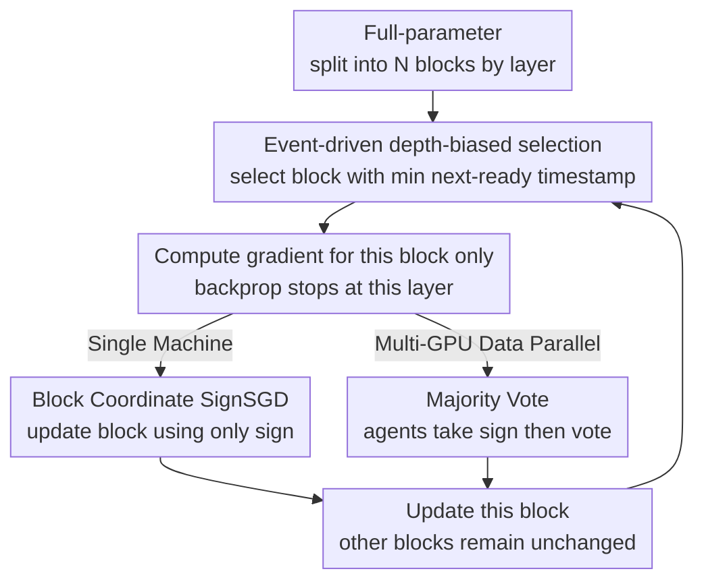

# Arbitrary-Order Block SignSGD for Memory-Efficient LLM Fine-Tuning

**Conference**: ICLR2026  
**OpenReview**: [https://openreview.net/forum?id=NQsdnYkCar](https://openreview.net/forum?id=NQsdnYkCar)  
**Code**: https://github.com/yijiezcn/ABSignSGD  
**Area**: Optimization Algorithms / Efficient LLM Fine-tuning  
**Keywords**: SignSGD, Block Coordinate Update, Full-parameter Fine-tuning, Memory-efficient, Convergence Analysis

## TL;DR
This paper proposes ABSignSGD, an optimizer combining SignSGD with "arbitrary-order block coordinate updates." By updating only one Transformer layer block per step, storing only that block's state, and using sign-based updates, it compresses the GPU memory of full-parameter fine-tuning to near-inference levels. It further incorporates a depth-biased block selection strategy to save an additional 20% runtime. A unified $O(1/\sqrt{K})$ convergence proof and a multi-agent majority-vote variant (reducing communication by 960× via sign-only transmission) are provided.

## Background & Motivation
**Background**: Deploying Large Language Models (LLMs) in downstream domains (medical, legal, multi-lingual alignment) still relies on fine-tuning. However, the GPU memory overhead of full-parameter training is prohibitively expensive. Memory reduction research has formed several major lines: system-level quantization/offloading (modifying numerical representations or moving tensors to CPU/NVMe), zero-order methods (inference-level memory but slow convergence), and first-order algorithm routes.

**Limitations of Prior Work**: First-order memory-saving methods fall into three categories, each with drawbacks: (i) PEFT (LoRA, prefix/prompt-tuning, adapter) freezes the backbone and trains small side parameters, saving memory but generally underperforming compared to full-parameter training. (ii) Low-rank projection (GaLore, Fira, Flora, Apollo) projects gradients to low-rank subspaces via SVD or random projection to save optimizer states, but suffers from performance gaps with AdamW, incompatibility with gradient accumulation, and slow runtimes during frequent decomposition. (iii) Block coordinate methods (BAdam) update one block per step and store only active optimizer states, but they rely on Adam. Since Adam depends on historical estimates of first/second-order moments, block switching repeatedly clears these states, leading to worse convergence than full-model Adam.

**Key Challenge**: Block coordinate updates (essential for saving memory) and stateful optimizers (Adam's moments) are inherently conflicted—momentum history becomes invalid whenever a block is switched. Thus, "block updates + Adam" is a forced combination of incompatible components.

**Goal**: Find an optimizer kernel naturally suited for block switching without sacrificing performance, achieving memory, runtime, and communication efficiency simultaneously.

**Key Insight**: The authors observe that SignSGD is **memoryless**—it discards gradient magnitudes and uses only $\text{sign}(g)$ for updates, requiring no cross-step momentum. Being memoryless means block switching loses no historical information, making SignSGD and block updates a perfect match. Furthermore, recent empirical evidence shows that sign-based methods match AdamW in performance and hyperparameter robustness.

**Core Idea**: Replace Adam in BAdam with the memoryless SignSGD and relax block selection from "cyclic" to "arbitrary order" (requiring each block to be updated at least once within $B$ steps). This eliminates state-reset losses and biases the update budget toward deeper layers to save backpropagation computation.

## Method

### Overall Architecture
The algorithm optimizes a general unconstrained problem $\min_{x\in\mathbb{R}^d} f(x)$, where in LLM fine-tuning $f(x)=\mathbb{E}_{\xi\sim D}F(x,\xi)$. Parameters $x$ are partitioned into $N$ disjoint blocks $\{\pi_1,\dots,\pi_N\}$ by layer (e.g., one Transformer layer including attention and FFN is one block; $N=36$ for Qwen3-8B). Each step, the algorithm selects a block $i_k$ and performs a SignSGD update on its coordinates, leaving others unchanged:

$$x^{k+1}_{i_k} = x^{k}_{i_k} - \alpha\cdot\text{sign}\big(g_{i_k}(x^k)\big),\qquad x^{k+1}_{i}=x^{k}_{i}\ (\forall i\neq i_k).$$

Memory and runtime savings are combined: since only one block is updated, optimizer states only need to store the active block (saving memory); since blocks are aligned to network layers, backpropagation can stop once the target layer's gradient is computed (deeper updates require less backpropagation, saving runtime). A multi-agent majority-vote variant further reduces communication. The result is a minimalist loop: "select block → fetch gradient sign → update block."

### Key Designs

**1. Block Coordinate SignSGD: Resolving the Conflict between Block Switching and Momentum**

This is the core of the paper, addressing the incompatibility of block updates and Adam. Adam's adaptive step size relies on long-term historical $m_t, v_t$. When blocks switch, inactive block history is shelved or reset, causing adaptive estimates to distort and convergence to degrade. SignSGD updates $x^{k+1}=x^k-\alpha\,\text{sign}(g(x^k))$ are completely state-free—they only consider the current gradient sign. Within a block coordinate framework, "block switching" loses nothing because there is no history to lose. Memory requirements are reduced to $2M+\frac{M}{8N}$ GB ($M$ is billion parameters; the first term is half-precision weights, the second is the active block's sign). For an 8B model with $N=36$, this saves about 3.5 GB over BAdam. Ablations verify that while Adam degrades with block switching, memoryless SGD/SignSGD do not, with SignSGD converging faster than SGD.

**2. Arbitrary-Order + Depth-Biased Block Selection: Converting Scheduling Freedom into Runtime Gains**

BAdam uses fixed cyclic selection, saving ~50% backprop time. This paper relaxes the constraint to "each block must be selected at least once within a window of length $B$" (Assumption 3.3). This allowed the introduction of depth-biased updates: since updating deeper layers stops backpropagation earlier, the authors make deeper layers update more frequently. An event-driven rule assigns a "virtual update cost" $\tau_i = N + c(N-i+1)$ (where $i=1$ is the shallowest layer and $c=10$ is the bias coefficient; deeper layers have smaller $\tau$). Each step, the block $i_k=\arg\min_i T_i$ is selected, and its timestamp $T_{i_k}$ is updated to $T_{i_k}+\tau_{i_k}$. This strategy further reduces runtime by ~20% over BAdam without performance loss.

**3. Majority-Vote Multi-Agent Variant: Reducing Communication to 1-bit per Coordinate**

For data-parallel bottlenecks, $n$ agents compute block gradients independently. The update rule takes the sign of each agent's local block gradient first, then performs a majority vote:

$$x^{k+1}_{i_k}=x^k_{i_k}-\alpha\cdot\text{sign}\Big(\sum_{j=1}^{n}\text{sign}\big(g^{j}_{i_k}(x^k)\big)\Big).$$

Unlike standard $\text{sign}(\sum_j g^j)$, this approach transmits only the sign—1 bit per coordinate instead of 32 bits. At $N=30$, communication is reduced by 960× compared to PyTorch DDP and 32× compared to BAdam. Furthermore, discarding magnitudes makes it robust against "confident but wrong" outlier gradients; under heavy-tailed noise common in deep learning, majority vote is asymptotically a better sign estimator than the arithmetic mean (Theorem 3.5).

### Loss & Training
The loss function is unchanged. The paper provides a unified convergence guarantee: under $L$-smoothness, stochastic sign consistency probability $\rho_i(x)=P[\text{sign}(g_i)=\text{sign}(\nabla_i f)]>1/2$ (SPB), and bounded update intervals, an "aligned norm" $\|\g(x)\|_N$ (weighted by sign consistency probability) is used to measure convergence:

$$\frac{\sum_{k=0}^{K-1}\mathbb{E}\|\nabla f(x^{kB})\|_N}{K}\le \frac{f(x^0)-f^*}{\alpha K}+\alpha L d\Big(B\big(1+\tfrac{1}{2N}\big)-\tfrac{N+1}{2}\Big).$$

Setting $\alpha=1/\sqrt{K}$ yields an $O(1/\sqrt{K})$ rate for both single-machine and multi-agent versions.

## Key Experimental Results

Experiments were primarily conducted on Qwen3-8B: mathematical reasoning (OpenMathInstruct-2) and general instruction following (Stanford-Alpaca). Baselines include LoRA, GaLore, Apollo, and BAdam, with gradient checkpointing enabled and offloading/quantization disabled to ensure runtime fairness.

### Main Results: Memory and Runtime (Qwen3-8B, OpenMathInstruct-2, 3 epochs)

| Metric | ABSignSGD | LoRA | GaLore | BAdam | Apollo |
|------|-----------|------|--------|-------|--------|
| Peak Memory (GB) | **20.29** | 22.54 | 23.47 | 23.19 | 22.58 |
| Runtime (h) | **2.66** | 5.51 | 12.77 | 3.32 | 6.64 |

Ours achieves the lowest memory (approx. 2 GB less than LoRA/Apollo and 3 GB less than BAdam) and is ~20% faster than BAdam (and twice as fast as LoRA). In terms of performance, ABSignSGD reached a 76% average accuracy on math benchmarks, outperforming BAdam (70), LoRA (68), and GaLore (65).

### Ablation Study (Qwen3-1.7B)

| Configuration | Observation | Explanation |
|------|------|------|
| Adam + Block Update (BAdam) | Convergence Degradation | Adaptive steps depend on history cleared by block switching |
| SGD / SignSGD + Block Update | No Impact | Memoryless nature makes them naturally compatible with block switching |
| SignSGD vs SGD | SignSGD Faster | Sign updates provide Adam-like regularization and suppress heavy-tailed noise |
| Selection (DB/DS/UR) | Similar Convergence | Depth-biased (DB) value lies in runtime reduction, not accuracy |

### Key Findings
- **Memoryless is the best partner for block updates**: The ablation replacing the core optimizer confirms that Adam fails upon switching blocks, while SignSGD does not.
- **Why SignSGD converges**: In these tasks, the sign consistency probability $\rho$ is heavily biased towards 1, with only ~1.1% of coordinates having $\rho_i < 0.5$, supporting the SPB assumption.
- **Why SignSGD beats SGD**: Sign updates provide Adam-like regularization beneficial for token class imbalance, and they naturally suppress high-magnitude gradient noise (frequently $>10^3$) that would otherwise derail SGD.
- **Sensitivity to noise**: ABSignSGD is more sensitive to small batch sizes (higher noise), but even at batch size 4, it remains stable and faster than BAdam.

## Highlights & Insights
- **"Memoryless properly complements block updates"**: Instead of patching Adam, the authors selected a kernel that requires no history, solving the problem at its root. This "replace, don't patch" philosophy is highly transferable.
- **Relaxing constraints for scheduling freedom**: Moving from "cyclic" to "bounded window" selection unlocked the depth-biased strategy, showing how relaxing theoretical assumptions can provide significant engineering optimization space.
- **Majority Vote = Communication Efficiency + Robustness**: Taking the sign before aggregating simultaneously achieves 1-bit communication and robustness against outlier gradients.
- **Honest Sensitivity Reporting**: The authors explicitly note SignSGD's sensitivity to small batches and suggest that offloading optimizer states could reintegrate momentum—a helpful direction for practitioners.

## Limitations & Future Work
- **Acknowledged Limitations**: SignSGD discards magnitude, making it more sensitive to gradient noise. The lack of momentum/adaptive learning rates leaves room for performance improvement.
- **Unverified Hypothesis**: The authors hypothesize that prioritizing deep layer updates might mitigate catastrophic forgetting (as shallow layers encode more general features), but leave empirical verification for future work.
- **Potential Improvements**: Using system-level offloading to store optimizer states (e.g., momentum) for variance reduction. Since block coordinate updates only require the active block's state, I/O bandwidth requirements would be minimal.
- **Independent Observations**: Main experiments are focused on 8B models. While 32B models are in the appendix, more diverse tasks and systematic joint experiments with quantization/offloading are needed.

## Related Work & Insights
- **vs BAdam (Block + Adam)**: BAdam's use of Adam leads to state-reset issues and higher memory ($2M+\frac{16M}{N}$ GB). ABSignSGD eliminates reset loss, saves ~3.5 GB (8B), and further reduces runtime via depth-biased selection.
- **vs LoRA / PEFT**: LoRA updates low-rank adapters and often underperforms compared to full-parameter training. Ours performs true full-parameter updates with lower memory.
- **vs GaLore / Apollo (Low-rank Projection)**: These rely on SVD/projections which slow down runtimes and are incompatible with gradient accumulation. Ours avoids projections, achieving better memory and significantly faster runtimes (2.66h vs 12.77h).
- **vs Standard Sign Aggregation / DDP**: Standard DDP has high communication volume and sensitivity to outliers. Majority-vote reduces communication by 960× and is asymptotically superior under heavy-tailed noise.

## Rating
- Novelty: ⭐⭐⭐⭐ The combination of memoryless SignSGD and arbitrary block updates is clean and intellectually satisfying.
- Experimental Thoroughness: ⭐⭐⭐⭐ Strong comparison across memory/runtime/convergence with comprehensive ablations.
- Writing Quality: ⭐⭐⭐⭐⭐ Logical flow from problem diagnosis to theoretical framework and empirical results.
- Value: ⭐⭐⭐⭐ A practical and theoretically grounded solution for full-parameter fine-tuning under tight memory budgets.

<!-- RELATED:START -->

## Related Papers

- [\[ICML 2026\] Memory-Efficient LLM Pretraining via Minimalist Optimizer Design](../../ICML2026/optimization/memory-efficient_llm_pretraining_via_minimalist_optimizer_design.md)
- [\[ICML 2026\] Learning a Zeroth-Order Optimizer for Fine-Tuning LLMs](../../ICML2026/optimization/learning_a_zeroth-order_optimizer_for_fine-tuning_llms.md)
- [\[ICCV 2025\] Zeroth-Order Fine-Tuning of LLMs in Random Subspaces](../../ICCV2025/optimization/zeroth-order_fine-tuning_of_llms_in_random_subspaces.md)
- [\[ICLR 2026\] Bi-LoRA: Efficient Sharpness-Aware Minimization for Fine-Tuning Large-Scale Models](bi-lora_efficient_sharpness-aware_minimization_for_fine-tuning_large-scale_model.md)
- [\[ICLR 2026\] FZOO: Fast Zeroth-Order Optimizer for Fine-Tuning Large Language Models towards Adam-Scale Speed](fzoo_fast_zeroth-order_optimizer_for_finetuning_large_language_models_towards_ad.md)

<!-- RELATED:END -->
