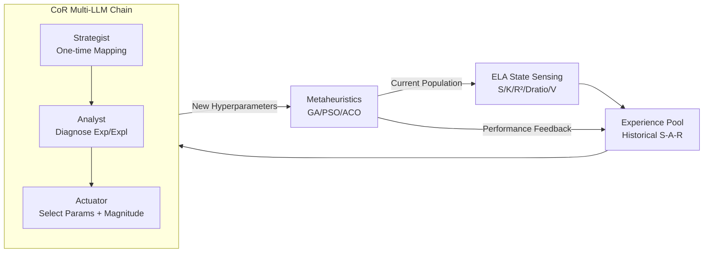

# AutoEP: LLMs-Driven Automation of Hyperparameter Evolution for Metaheuristic Algorithms

**Conference**: ICLR 2026  
**OpenReview**: [https://openreview.net/forum?id=hit3hGBheP](https://openreview.net/forum?id=hit3hGBheP)  
**Code**: [https://github.com/YiZheZhang12/AutoEP](https://github.com/YiZheZhang12/AutoEP)  
**Area**: optimization  
**Keywords**: Metaheuristic Algorithms, Dynamic Hyperparameter Tuning, Large Language Models, Exploratory Landscape Analysis (ELA), Zero-shot Control, Combinatorial Optimization  

## TL;DR
AutoEP inputs "online Exploratory Landscape Analysis (ELA) quantitative metrics" into a multi-LLM reasoning chain, allowing LLMs to dynamically adjust hyperparameters of metaheuristics (e.g., GA, PSO, ACO) generation by generation under **zero-training** conditions. By "grounding" reasoning in data to suppress hallucinations, an open-source 30B model can match the tuning performance of GPT-4.

## Background & Motivation
**Background**: The success of metaheuristic algorithms (GA, PSO, ACO) in solving combinatorial optimization problems depends on the dynamic balance of "exploration vs. exploitation" controlled by hyperparameters (mutation rate, crossover rate, etc.). Traditional approaches include manual rule-based tuning (e.g., hard-coded mutation rate increases based on iterations/diversity) and data-driven tuning (e.g., using Deep Reinforcement Learning to learn an adaptive policy from scratch).

**Limitations of Prior Work**: Manual rules are fragile, require extensive human calibration, and fail when switching problems or algorithms. While the DRL approach offers automation, it requires millions of algorithm executions to train a policy, exhibiting extreme sample complexity and a tendency to overfit training distributions, often failing on unseen instances or algorithm variants. Even Meta-BBO methods incorporating neural ELA or dual-agent RL still suffer from expensive meta-training.

**Key Challenge**: The field lacks a **zero-shot** tuning framework that provides the state-aware adaptivity of Meta-BBO without the instance-specific training cost.

**Goal**: To utilize LLMs as "plug-and-play" zero-shot reasoning engines for online hyperparameter control of any metaheuristic algorithm without any training.

**Core Idea (Grounding + Chain-of-Reasoning)**: This paper argues that the optimal role for an LLM is not to "replace the solver to generate solutions" (which is limited by floating-point representation and context length), but to act as a "high-level supervisor." Two key components support this: **(1) Grounding abstract LLM reasoning with quantitative Exploratory Landscape Analysis (ELA) metrics** from real-time search trajectories, anchoring prior knowledge like "convergence" or "diversity" to observable dynamics to suppress hallucinations. **(2) Decomposing complex control tasks into specialized sub-steps using a Multi-LLM Chain-of-Reasoning (CoR)**, enabling smaller model combinations to rival single massive proprietary models.

## Method

### Overall Architecture
AutoEP is a closed-loop control system. At each decision point, it uses ELA to extract machine-readable quantitative features from the black-box state of the metaheuristic. These features are combined with historical state-action-reward triples from an Experience Pool to form structured prompts for a Chain-of-Reasoning (CoR) composed of three specialized LLMs: "Diagnose State → Determine Exploration/Exploitation → Translate to Specific Hyperparameters." The new configuration is fed back into the algorithm, and the results are recorded in the Experience Pool, forming a continuous in-context learning loop of State-Sensing → Reasoning → Action.

### Key Designs

**1. ELA Online State Sensing: Translating black-box searches into five quantitative "symptoms."** Since metaheuristics are black-box, AutoEP uses Exploratory Landscape Analysis (ELA) to extract a compact yet complementary set of features from the current population across four dimensions. **Fitness Distribution** is assessed using skewness $S=\frac{\frac{1}{n}\sum_i (y_i-\bar y)^3}{(\frac{1}{n}\sum_i (y_i-\bar y)^2)^{3/2}}$ and kurtosis $K$; positive skewness implies many poor solutions and suggests strengthening exploitation around elites, while negative skewness suggests the population is converging and requires exploration. **Landscape Structure** uses goodness-of-fit $R^2=1-\frac{\sum_i(y_i-f(\vec x_i))^2}{\sum_i(y_i-\bar y)^2}$ to determine if the terrain is funnel-shaped ($R^2\approx1$, exploitation) or rugged/multi-modal ($R^2\approx0$, exploration). **Diversity** is measured by the dispersion ratio $D_{ratio}=\frac{D(Q_{best})}{D(Q_{worst})}$ (ratio of average pairwise distance of elite solutions to poor ones); $D_{ratio}\ll1$ indicates elites are clustered (single funnel, exploitation), while $D_{ratio}\approx1$ indicates elites are scattered (multi-modal, exploration). **Search Progress** uses the variation rate $V=\frac{\frac{1}{m}\sum_{m=g-m}^{g-1}\bar y_m}{\bar y_g}$ to measure improvement relative to the last $m$ generations; $V>1$ suggests sufficient progress for local exploitation, while $V\le1$ suggests stagnation requiring diversification. These five metrics ground the LLM's reasoning in observable numerical data.

**2. Closed-loop In-context Control: Gradient-free continuous learning via Experience Pool.** AutoEP does not update any weights. Instead, it stores "State (ELA) → Action (Hyperparameters) → Reward (Fitness Improvement)" triples in an Experience Pool. For subsequent decisions, the real-time ELA features and relevant history are placed in the prompt, allowing the LLM to see both current status and "what worked in similar past situations." result. This effectively performs in-context learning within a single optimization run, adaptively adjusting the strategy based on observed performance without offline training.

**3. Chain-of-Reasoning (CoR) Role Decomposition: Transforming a massive prompt into a specialized pipeline.** Entrusting "task understanding + state diagnosis + precise decision" to a single LLM call leads to high latency and instability. CoR splits this into three collaborating agents. The **Strategist (One-time)** reads the problem description and algorithm at the start to generate a static "control map" explaining the qualitative effect of each hyperparameter (e.g., "Mutation Rate ↑ → Promotes Exploration"). The **Analyst (Diagnosis)** synthesizes ELA signals and historical data at each decision point to identify "Consensus" (all metrics pointing to exploration) or "Conflict" (contradicting metrics), outputting a strategy like `ACTION: Increase Exploration`. The **Actuator (Decision)** implements the strategy in two steps: first selecting which hyperparameters to change based on the control map (e.g., increase mutation, decrease crossover), and then inferring the adjustment magnitude using similar cases in the Experience Pool (e.g., micro-adjustments for steady progress, aggressive shifts for deep stagnation). This decomposition stabilizes complex control into focused, cross-verifiable tasks, enabling 30B-level models to perform reliably.

## Key Experimental Results

Evaluations were conducted on TSP, CVRP, FSSP, and UAV-IoT trajectory optimization using GA, PSO, and ACO. AutoEP uses Qwen3-30B by default; EoH/ReEvo use GPT-3.5-turbo. All experiments were repeated 30 times.

### Main Results (TSP, Opt.gap %, lower is better)

| Method | eil51 | Rd100 | Kroa150 | rd300 | rat575 | dsj1000 |
|------|-------|-------|---------|-------|--------|---------|
| DACT (Neural SOTA) | 0.00 | 0.09 | 0.13 | 0.93 | 2.55 | 4.97 |
| LEHD (Neural SOTA) | 0.08 | 0.21 | 0.96 | 1.38 | 2.64 | 5.54 |
| GA (Vanilla) | 1.47 | 3.61 | 5.26 | 11.33 | 14.75 | 21.94 |
| GA+GLEET (RL Tuning SOTA) | 0.07 | 1.49 | 3.23 | 7.11 | 8.06 | 16.23 |
| GA+ReEvo (LLM-Enhanced Op) | 0.27 | 1.97 | 3.39 | 7.58 | 8.39 | 16.53 |
| **GA+AutoEP** | **0.11** | **1.06** | **2.15** | **6.27** | **6.92** | **14.02** |
| GA-2opt+GLEET | 0.00 | 0.02 | 0.09 | 0.33 | 0.91 | 5.47 |
| **GA-2opt+AutoEP** | **0.00** | **0.01** | **0.01** | **0.09** | **0.08** | **3.58** |

AutoEP achieves the best results across all scales. GA-2opt+AutoEP even exceeds Neural Combinatorial Optimization SOTAs like DACT/LEHD. Applying AutoEP to algorithms already enhanced by ReEvo/EoH yields further improvements, verifying its "plug-and-play" nature.

### Ablation Study (TSP, Opt.gap %)

| Method | eil51 | Rd100 | Kroa150 | rd300 | rat575 | dsj1000 |
|------|-------|-------|---------|-------|--------|---------|
| GA-2opt (Baseline) | 0.17 | 0.43 | 0.87 | 1.62 | 3.35 | 7.14 |
| AutoEP w/o ELA | 0.06 | 0.33 | 0.57 | 1.30 | 3.11 | 6.46 |
| AutoEP w/o CoR (Single LLM) | 0.16 | 0.43 | 0.81 | 1.60 | 3.37 | 7.11 |
| AutoEP w/o ELA+CoR | 0.21 | 0.56 | 1.37 | 1.84 | 3.91 | 7.93 |
| **AutoEP (Full)** | **0.00** | **0.01** | **0.01** | **0.09** | **0.08** | **3.58** |

Removing ELA leads to a loss of situational awareness and significant performance drops. Removing CoR (single LLM processing raw features) results in performance near baseline. Removing both is even worse than the vanilla algorithm (blind tuning), proving that "Grounding + Decomposition" is essential.

### Key Findings
- **CoR vs. Single Giant Model**: CoR using 30B open-source models matches GPT-o1 / Claude 3.7 / Gemini 2.5 Pro / DeepSeek-R1, but is an order of magnitude faster (5.8 min vs. 44–54 min on eil51).
- **Model Robustness**: While EoH/ReEvo rely on raw LLM generative power and degrade with smaller models, AutoEP maintains high performance due to its structured framework.
- **Low Overhead**: Reasoning latency per decision is ~30 ms; hundreds of adjustments per run only add 2–5 minutes.
- **Frequency & Window**: Adjusting every generation yields the fastest convergence, but adjusting every 3–5 generations retains most gains. A sliding window (L≈20) for the Experience Pool is superior to full history, which bloats prompts and reduces quality.

## Highlights & Insights
- **Positioning LLM as Supervisor rather than Solver**: Directly generating numerical solutions is hindered by floating-point precision and context windows. Using LLMs for hyperparameter control avoids numerical weaknesses while exploiting semantic priors.
- **ELA as the Anti-Hallucination Key**: Grounding abstract reasoning with quantifiable, interpretable search metrics is a generic paradigm transferable to other LLM-controlled black-box systems.
- **CoR enables small models to act like large ones**: Decomposition makes the system friendly to compute-limited scenarios requiring local deployment and reproducibility.

## Limitations & Future Work
- **Hand-crafted ELA features**: The metrics (S, K, R², Dratio, V) and their "Exploration/Exploitation" mappings involve manual priors. Their suitability for high-dimensional continuous problems remains to be discussed.
- **Dependency on Prompt Engineering**: The quality of the three agents' prompts directly affects stability; systematic analysis of prompt sensitivity and cross-model portability is missing.
- **Scale Gaps**: The 3.58% gap on dsj1000 suggests diminishing returns of hyperparameter tuning as the search space becomes vast.
- **Future Directions**: Automating feature selection/control mapping or extending to continuous black-box optimization and AutoML hyperparameter scheduling.

## Related Work & Insights
- **Meta-BBO (GLEET, NeuroCrossover, DesignX)**: AutoEP adopts the "state-aware adaptivity" concept but replaces expensive meta-training with zero-shot LLM reasoning.
- **LLM-based Algorithm Design (EoH, ReEvo, EvoLLM)**: AutoEP is orthogonal, focusing on dynamic parameter control rather than operator generation, avoiding floating-point representation issues.
- **ELA (Mersmann et al. 2011)**: Repurposes landscape analysis from an "offline difficulty characterization" tool into an "online grounding signal" for LLMs.

## Rating
- **Novelty**: ⭐⭐⭐⭐ — The combination of ELA grounding, CoR, and zero-shot control is novel and persuasive.
- **Experimental Thoroughness**: ⭐⭐⭐⭐ — Covers 3 algorithms, 4 problem types, multiple SOTA baselines (RL/Bayesian/Neural/LLM), 30 repeats, and extensive ablation/robustness analysis.
- **Writing Quality**: ⭐⭐⭐⭐ — Clear logic from motivation to method; distinct roles for ELA and CoR agents; effective figures.
- **Value**: ⭐⭐⭐⭐ — Plug-and-play, training-free, and deployable on small models. Highly relevant to metaheuristic practitioners and LLM-controller research.

<!-- RELATED:START -->

## Related Papers

- [\[ICLR 2026\] Bayesian Evidence-Driven Prototype Evolution for Federated Domain Adaptation](bayesian_evidence-driven_prototype_evolution_for_federated_domain_adaptation.md)
- [\[ICLR 2026\] CALM: Co-evolution of Algorithms and Language Model for Automatic Heuristic Design](calm_co-evolution_of_algorithms_and_language_model_for_automatic_heuristic_desig.md)
- [\[ICLR 2026\] Generalizable Heuristic Generation Through LLMs with Meta-Optimization](generalizable_heuristic_generation_through_llms_with_meta-optimization.md)
- [\[ICLR 2026\] Efficient Algorithms for Incremental Metric Bipartite Matching](efficient_algorithms_for_incremental_metric_bipartite_matching.md)
- [\[ICLR 2026\] Completed Hyperparameter Transfer across Modules, Width, Depth, Batch and Duration](completed_hyperparameter_transfer_across_modules_width_depth_batch_and_duration.md)

<!-- RELATED:END -->
