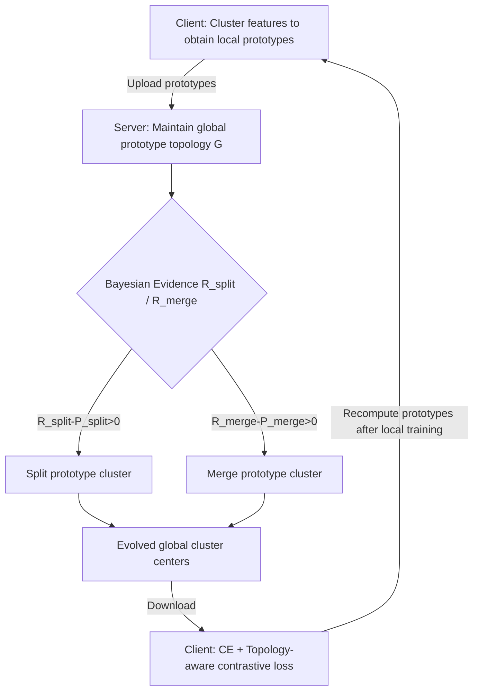

# Bayesian Evidence-Driven Prototype Evolution for Federated Domain Adaptation

**Conference**: ICLR 2026  
**OpenReview**: [https://openreview.net/forum?id=plsgbZHX8A](https://openreview.net/forum?id=plsgbZHX8A)  
**Code**: TBD  
**Area**: Federated Learning / Domain Adaptation  
**Keywords**: Federated Learning, Domain Shift, Prototype Learning, Bayesian Gaussian Mixture Model, Topological Evolution, Contrastive Learning  

## TL;DR
FedPTE treats the server-side global prototype set as a **dynamically evolving topological structure**. It employs a Bayesian Gaussian Mixture Model (BGMM) and marginal likelihood ratios as "statistical evidence" to decide when to **split** or **merge** prototype clusters. Complemented by stability penalties and client-side topology-aware contrastive learning, it continuously characterizes fine-grained intra-class structures and mitigates domain shift in cross-domain federated learning.

## Background & Motivation

**Background**: Federated Learning (FL) enables multiple clients to collaboratively train a global model without sharing local data. However, in real-world scenarios, clients often originate from different domains (e.g., imaging devices or diagnostic protocols from different hospitals), leading to structural differences in feature distributions for the same category across clients, known as **domain shift**. Prototype-based FL methods alleviate this issue through cross-domain feature alignment and represent a primary research direction.

**Limitations of Prior Work**: Existing prototype methods typically follow two suboptimal approaches. One calculates a **single average** per class as a lone prototype, which suffers from significant information loss and fails to characterize difficult domains. The other performs clustering on the client side and uploads multiple cluster centers to the server. However, as training progresses and the model's estimation of feature distributions refines, distinct **in-domain variations** emerge within classes. Whether using static clustering or simple averaging, the **quantity and structure of prototypes remain fixed**, failing to track the dynamic evolution of semantic separability and variance structures during training.

**Key Challenge**: The ideal approach is for the server to maintain a **dynamic prototype topology**—splitting prototype clusters to preserve fine-grained information when encountering complex intra-class distributions and merging adjacent clusters when redundancy or noise is present. The difficulty lies in the potential for **drastic changes** in the global prototype structure within a single round, which can cause severe mismatch with current client representations and lead to convergence degradation. Conservative criteria fail to refine the structure, while aggressive ones lead to frequent oscillations.

**Goal**: Design a prototype learning framework capable of **dynamically sensing category granularity** and modeling cross-domain feature distributions at a finer scale while ensuring training stability.

**Core Idea**: **Model the "number of prototype clusters and topological structure" as an evidence-driven model state**. Use the marginal likelihood ratio of a BGMM under Normal-Inverse-Wishart (NIW) conjugate priors as statistical evidence to adjudicate splitting/merging. Apply penalty terms to constrain structural mutations within a single round, allowing the global prototype topology to evolve adaptively with training without relying on empirical thresholds or static clustering.

## Method

### Overall Architecture
FedPTE is a closed loop of "server-side decision-making for topological evolution + client-side topology-aware alignment." In each communication round, clients upload local prototypes of each class to the server. The server aggregates all candidate points of the same class into prototype clusters and maintains a global topology $G=\{g_j\}_{j=1}^{|G|}$. It evaluates whether to split or merge each cluster based on **Bayesian hypothesis testing** (while suppressing radical changes with penalty terms). The evolved cluster centers are sent back to clients as "consensus anchors" in the feature space. Clients perform local training using cross-entropy and topology-aware contrastive losses, then recompute and upload prototypes for the next round.

### Key Designs

**1. Bayesian evidence-driven split/merge criteria: Replacing empirical thresholds with marginal likelihood ratios**. FedPTE treats the global topology $G$ as components of a BGMM. Each prototype cluster $g_j$ corresponds to a Gaussian component with mean $\mu_j$ and covariance $\Sigma_j$. By introducing a Normal-Inverse-Wishart (NIW) conjugate prior $p(\mu_j,\Sigma_j)=\mathrm{NIW}(\mu_j,\Sigma_j\mid m_0,\kappa_0,\nu_0,S_0)$, both the mean and covariance can be modeled. When judging a split, it partitions the point set $S_j$ of cluster $g_j$ into two sub-clusters and compares the marginal likelihood of the "two-component" hypothesis $H_1$ against the "single-component" hypothesis $H_0$. Thanks to NIW conjugacy, the log-marginal likelihood for a single component $\log p(S_j\mid H_0)$ has an **analytical solution**. The split evidence is defined as the marginal likelihood ratio $R_{\text{split}}=\dfrac{p(S_{j,1}\mid H_0)\cdot p(S_{j,2}\mid H_0)}{p(S_j\mid H_0)}$; $g_j$ is split into $g_{j,1},g_{j,2}$ when $R_{\text{split}}>1$. Merging is handled symmetrically: for adjacent cluster pairs $(g_j,g_l)$, the "homologous" hypothesis is compared against the "heterologous" hypothesis to derive $R_{\text{merge}}=\dfrac{p(S_j\cup S_l\mid H_1)}{p(S_j\mid H_0)\cdot p(S_l\mid H_0)}$. If $R_{\text{merge}}>1$, they are merged into a new weighted average cluster $g_{\text{new}}=(N_jg_j+N_lg_l)/(N_j+N_l)$. Thus, the number and topology of prototypes are automatically determined by statistical evidence.

**2. Progressive stability constraints: Accounting for structural quality and semantic consistency**. Purely evidence-driven decisions might produce poor structures, such as splitting into two clusters of vastly different sizes or erroneously merging clusters that are spatially close but semantically distinct. FedPTE adds a penalty for each case. For splitting, it introduces a **balance ratio** $B=\dfrac{\min(N_{j,1},N_{j,2})}{\max(N_{j,1},N_{j,2})}$ (closer to 1 is more balanced) and a penalty $P_{\text{split}}=\beta_{\text{split}}\cdot(1-B)$. The criterion becomes $\ln(R_{\text{split}})-P_{\text{split}}>0$ to suppress low-quality, highly imbalanced splits. For merging, it considers the semantic correlation of the feature distributions using a Jensen-Shannon-style KL divergence $D(p_j\|p_l)=\tfrac12 D_{\text{KL}}(p_j\|m)+\tfrac12 D_{\text{KL}}(p_l\|m)$ where $m=\tfrac12(p_j+p_l)$, with penalty $P_{\text{merge}}=\beta_{\text{merge}}\cdot D(p_j\|p_l)$. The criterion $\ln(R_{\text{merge}})-P_{\text{merge}}>0$ ensures merging only when both statistical evidence and semantics support it. This layer mitigates the risk of "drastic single-round structural mutations $\rightarrow$ convergence degradation."

**3. Topology-aware contrastive local loss: Aligning with evolved global clusters as multi-prototype anchors**. After the server evolves the topology, cluster centers are distributed to clients to constrain local features. The local objective combines cross-entropy $L_{\text{CE}}$ with a **topology-aware contrastive loss** $L_{\text{contra}}$. For a sample feature $z_i$, all global cluster centers with the same label form the set of positive anchors $G^+$, and those with different labels form $G^-$:
$$L_{\text{contra}}=-\frac{1}{N_k}\sum_{i=1}^{N_k}\log\frac{\sum_{g^+\in G^+}\exp(\mathrm{sim}(z_i,g^+)/\tau)}{\sum_{g^+\in G^+}\exp(\mathrm{sim}(z_i,g^+)/\tau)+\sum_{g^-\in G^-}\exp(\mathrm{sim}(z_i,g^-)/\tau)}$$
Crucially, the numerator **sums over all positive anchors**, allowing a sample to align with **any sub-cluster center** of its category. This perfectly matches a topological structure where one class can have multiple fine-grained sub-prototypes, rather than forcing alignment to a single class center. The total loss $L_{\text{local}}=L_{\text{CE}}+\lambda\cdot L_{\text{contra}}$ learns both discriminative boundaries and global semantic alignment.

## Key Experimental Results

Datasets used are Digit (5 domains: MNIST/SVHN/USPS/Synth/MNIST-M) and Office (4 domains: Amazon/Caltech/DSLR/Webcam). ResNet-10 is the local model, except for MPFT comparisons which use CLIP-ViT-B-32. Hyperparameters: $\lambda=100,\tau=0.06,\beta_{\text{split}}=1.0,\beta_{\text{merge}}=1.5$, averaged over 3 seeds.

### Main Results

Digit (5 clients, average accuracy %):

| Method | Model | MNIST | SVHN | USPS | Synth | MNIST-M | Avg. |
|------|------|------|------|------|------|------|------|
| FedOPT | ResNet-10 | 88.75 | 26.00 | 82.58 | 43.50 | 56.42 | 59.45 |
| FedProto | ResNet-10 | 97.65 | 72.02 | 96.20 | 87.36 | 84.36 | 87.52 |
| FPL | ResNet-10 | 98.10 | 77.02 | 96.99 | 90.50 | 87.89 | 90.10 |
| FedPLVM | ResNet-10 | 97.88 | 81.15 | 96.49 | 92.08 | 90.17 | 91.55 |
| MPFT | CLIP | 91.66 | 41.92 | 84.00 | 75.48 | 68.31 | 72.27 |
| **FedPTE** | CLIP | 95.31 | 46.68 | 93.55 | 81.42 | 71.13 | **77.62** |
| **FedPTE** | ResNet-10 | **98.88** | **84.93** | **98.32** | **95.13** | **92.65** | **93.98** |

Office (4 clients, average accuracy %):

| Method | Model | Amazon | Caltech | DSLR | Webcam | Avg. |
|------|------|------|------|------|------|------|
| FedPLVM | ResNet-10 | 75.12 | 52.22 | 65.75 | 78.36 | 67.86 |
| FedPall | ResNet-50 | 76.21 | 51.41 | 66.67 | 67.82 | 65.53 |
| MPFT | CLIP | 91.30 | 91.67 | 96.88 | 96.47 | 94.08 |
| **FedPTE** | CLIP | **97.92** | **96.44** | **100.00** | **100.00** | **98.59** |
| **FedPTE** | ResNet-10 | **80.21** | **57.38** | **71.79** | **82.66** | **73.01** |

Using ResNet-10, Digit achieves 93.98% (a ~2.4% gain over the strongest baseline FedPLVM), and Office achieves 73.01% (~5% gain over FedPLVM). Under the CLIP setting, Office reaches 98.59%, approximately 4.5% higher than MPFT.

### Ablation Study

Ablation by component on Digit with 5 clients (Average accuracy %):

| $R_{\text{split}}$ | $P_{\text{split}}$ | $R_{\text{merge}}$ | $P_{\text{merge}}$ | $L_{\text{contra}}$ | Avg. |
|:--:|:--:|:--:|:--:|:--:|:--:|
| | | | | | 83.67 |
| ✓ | | | | | 85.72 |
| ✓ | ✓ | | | | 86.31 |
| ✓ | ✓ | ✓ | | | 88.14 |
| ✓ | ✓ | ✓ | ✓ | | 89.43 |
| ✓ | ✓ | ✓ | ✓ | ✓ | **93.98** |

### Key Findings
- **Split evidence $R_{\text{split}}$ alone provides +2.05%**, highlighting the necessity of dynamically adjusting the number of prototype clusters. Accuracy climbs steadily to 89.43% as penalties and merging are added. The topology-aware contrastive loss $L_{\text{contra}}$ provides the largest single contribution, raising it to 93.98%.
- **Mismatch between pre-trained representations and target domains has a major impact**: CLIP performs exceptionally well on Office (close to its pre-training distribution) but significantly worse on Digit (low resolution, diverse styles). When representations are mismatched, fine-tuning is susceptible to noise in uploaded prototypes; FedPTE's evidence-driven topology maintenance serves to suppress this noise.
- **In strong Non-IID settings ($\alpha \rightarrow 0$), FedPTE leads across all domains**. Baselines degrade significantly in complex domains like SVHN/USPS, whereas FedPTE maintains intra-class separability through evidence-driven topology maintenance.

## Highlights & Insights
- **Promoting "prototype quantity/topology" from hyperparameters to inferable model states**: Using Bayesian model selection (marginal likelihood ratios + NIW analytical solutions) instead of empirical thresholds and static clustering is an elegant shift in perspective—splitting and merging are adjudicated naturally by data evidence.
- **The two-stage "evidence then constraint" decision process is pragmatic**: Following raw evidence alone could cause structural oscillations. The authors use balance ratio and JS divergence penalties to constrain split quality and merge semantics, respectively, harmonizing the tension between adaptive topology and training stability.
- **Multi-positive anchor contrastive loss is self-consistent with the topological structure**: By summing over all intra-class sub-cluster centers in the numerator, the loss allows samples to approach any sub-prototype. This aligns logically with the concept that a class may have multiple fine-grained sub-structures, avoiding the pitfall of dragging multi-modal classes toward a single center.

## Limitations & Future Work
- **Server-side computational overhead**: Performing BGMM hypothesis testing for each cluster and enumerating merge criteria for adjacent pairs may impose significant server-side burdens as the number of classes and prototypes grows. The paper lacks a full discussion on scalability and communication/computation trade-offs.
- **Hyperparameters are not entirely eliminated**: While the split/merge thresholds are replaced by evidence ratios >1, new parameters like $\beta_{\text{split}}, \beta_{\text{merge}}, \lambda, \tau$ and NIW priors ($m_0, \kappa_0, \nu_0, S_0$) are introduced. Marginal likelihoods can be sensitive to prior settings, necessitating further validation of cross-dataset robustness.
- **Limited evaluation scale**: Verification is conducted on only two classic small datasets (Digit/Office) with few clients (4/5). Although the appendix includes medical data, performance in large-scale client settings with more classes and real-world heterogeneity remains to be seen.

## Related Work & Insights
- **Federated Prototype Learning Lineage**: Methods like FPL (unbiased prototypes + consistency regularization), FedPLVM (two-layer prototype clustering + α-sparse loss), FedLSA (global semantic classifier + vMF contrastive), and MPFT (domain-specific prototypes for global adapter training) all address cross-domain alignment. FedPTE differentiates itself by treating the prototype set as an **evolving topology** rather than a fixed structure.
- **Bayesian Non-parametrics/Model Selection**: Employing BGMM + NIW priors for split-merge decisions shares ancestry with split-merge MCMC and Dirichlet Process Mixture Models. It represents a practical application of classic Bayesian structure learning to FL prototype maintenance.
- **Insight**: This paradigm of "adjudicating structural additions/deletions using marginal likelihood ratios" is transferable to other scenarios requiring dynamic representation granularity, such as class prototype expansion in continual learning or cluster center maintenance in retrieval systems.

## Rating
- **Novelty**: ⭐⭐⭐⭐ Introducing Bayesian model selection (marginal likelihood ratio + NIW analytical solution) into federated prototype topology decisions is a novel perspective, going beyond simple loss/aggregation refinements.
- **Experimental Thoroughness**: ⭐⭐⭐ The main experiments, component-wise ablation, Non-IID analysis, and hyperparameter sensitivity are comprehensive with clear gains, though dataset and client scales are relatively small and lack quantitative computation overhead analysis.
- **Writing Quality**: ⭐⭐⭐⭐ The motivation progresses logically. Mathematical derivations (NIW marginal likelihood analytical solution, split/merge evidence ratios) are clear, and the framework diagrams map well to the criteria.
- **Value**: ⭐⭐⭐⭐ Provides a principled, evidence-driven answer to the long-standing problem of determining prototype quantity, offering valuable insights for cross-domain FL and dynamic representation modeling.

<!-- RELATED:START -->

## Related Papers

- [\[ICLR 2026\] AutoEP: LLMs-Driven Automation of Hyperparameter Evolution for Metaheuristic Algorithms](autoep_llms-driven_automation_of_hyperparameter_evolution_for_metaheuristic_algo.md)
- [\[CVPR 2025\] Federated Learning with Domain Shift Eraser](../../CVPR2025/optimization/federated_learning_with_domain_shift_eraser.md)
- [\[ICML 2026\] Rethinking the Flow-Based Gradual Domain Adaptation: A Semi-Dual Optimal Transport Perspective](../../ICML2026/optimization/rethinking_the_flow-based_gradual_domain_adaptation_a_semi-dual_optimal_transpor.md)
- [\[ICML 2025\] Sparse Causal Discovery with Generative Intervention for Unsupervised Graph Domain Adaptation](../../ICML2025/optimization/sparse_causal_discovery_with_generative_intervention_for_unsupervised_graph_doma.md)
- [\[ICLR 2026\] DADA: Dual Averaging with Distance Adaptation](dada_dual_averaging_with_distance_adaptation.md)

<!-- RELATED:END -->
