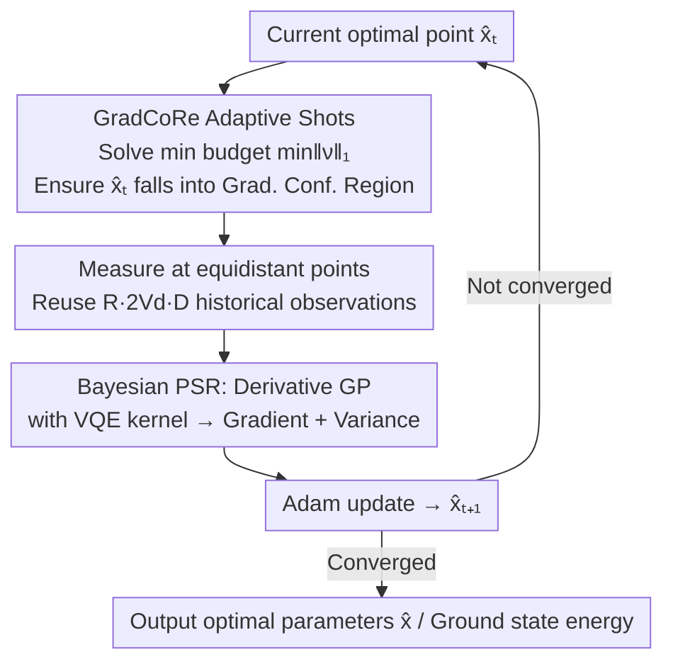

# Bayesian Parameter Shift Rules in Variational Quantum Eigensolvers

**Conference**: ICLR 2026  
**OpenReview**: [https://openreview.net/forum?id=cS0L2kj0lj](https://openreview.net/forum?id=cS0L2kj0lj)  
**Code**: To be confirmed (Paper states Qiskit implementation is provided with supplementary materials)  
**Area**: Quantum Computing / Variational Quantum Algorithms / Bayesian Optimization  
**Keywords**: Variational Quantum Eigensolver, Parameter Shift Rule, Gaussian Process, Gradient Confidence Region, Quantum Optimization

## TL;DR
The Parameter Shift Rule (PSR) used for gradient estimation in Variational Quantum Eigensolvers (VQE) is reformulated into a Bayesian version—utilizing a derivative Gaussian Process with a VQE kernel to estimate gradients. This allows for the reuse of historical observations at arbitrary positions and provides posterior uncertainty of the gradients. Based on this, "Gradient Confidence Region (GradCoRe)" is proposed to adaptively allocate measurement shots, enabling VQE SGD optimization to converge significantly faster under the same measurement budget, surpassing existing SOTAs including the NFT family.

## Background & Motivation
**Background**: VQE is a hybrid quantum-classical algorithm for estimating the ground state energy of a given Hamiltonian. The quantum side uses a parameterized quantum circuit $|\psi_x\rangle=G(x)|\psi_0\rangle$ to generate trial states and measure the energy expectation $f^*(x)=\langle\psi_x|H|\psi_x\rangle$, while the classical side minimizes this noisy objective $\min_x f^*(x)$. Since quantum resources are expensive, the true cost of optimization is the **total number of measurement shots** consumed throughout the process, rather than the number of iterations.

**Limitations of Prior Work**: Each observation $y=f^*(x)+\varepsilon$ carries shot noise with variance $\sigma^{*2}\propto N_{\text{shots}}^{-1}$. Standard gradient methods rely on PSR: first-order PSR ($V_d=1$) uses two points $\partial_d f^*=\frac{f^*(x+\alpha e_d)-f^*(x-\alpha e_d)}{2\sin\alpha}$ (typically $\alpha=\pi/2$), and generalized PSR uses $2V_d$ **fixed equidistant points**. The rigid constraints of this rule are: ① Observation positions are fixed, preventing the reuse of points measured in previous steps; ② It provides no **uncertainty** for the gradient estimate, leading to heuristically fixed shot counts (e.g., 1024), which is wasteful when noise is low and insufficient when noise is high.

**Key Challenge**: PSR couples "measurement at fixed points" with "accurate gradient estimation" without a unified probabilistic framework that can accommodate arbitrary observation layouts while outputting gradient confidence—the latter of which is the key to saving shots.

**Key Insight**: The VQE objective $f^*$ is essentially a trigonometric polynomial (Nakanishi et al. proved $f^*(x)=b^\top\mathrm{vec}(\otimes_d\psi_\gamma(x_d))$), based on which Nicoli et al. designed a **VQE kernel** $k_\gamma$ that fully reflects this physical structure. Given a reliable kernel, gradient estimation can be handled by a "derivative Gaussian Process"—since the derivative operator is linear, the derivative of a GP sample remains a GP, requiring only the reformulation of the kernel covariance terms.

**Core Idea**: A derivative GP with a VQE kernel is used to estimate the gradient of the VQE objective ("Bayesian PSR"). It strictly degrades to the generalized PSR under noiseless equidistant observations but provides analytical gradients, arbitrary observation capabilities, and posterior uncertainty. This uncertainty drives an adaptive shot allocation strategy (GradCoRe) that translates "achieving required gradient precision" into "minimal shot budget."

## Method

### Overall Architecture
The paper aims to **use fewer measurement shots to achieve lower energy** in VQE SGD optimization. The approach consists of two layers: the lower layer replaces "fixed-point PSR" with "derivative GP at arbitrary points (Bayesian PSR)", and the upper layer utilizes the posterior variance provided by Bayesian PSR to spend only the necessary shots at each step (GradCoRe).

In a single SGD-GradCoRe iteration: $2V_d$ equidistant shift points $\breve X$ are centered at the current optimal point $\hat x_t$ for each direction $d$. First, a "minimal total shots" problem is solved such that the posterior variance of the gradient at $\hat x_t$ falls within the gradient confidence region (i.e., variance in each direction $\le\kappa_d^2$) after measuring at these points. Actual measurements are performed according to the calculated shots. New observations, combined with $R\cdot 2V_d\cdot D$ historical observations, are fed into the derivative GP to obtain a gradient estimate with uncertainty. Finally, an Adam step is taken to obtain $\hat x_{t+1}$.

### Key Designs

**1. Bayesian PSR: Gradient Estimation via Derivative GP with VQE Kernel**

This serves as the foundation, addressing the pain point that PSR positions are fixed and provide no uncertainty. The objective function is placed into a GP prior $p(f)=\mathcal{GP}(f;0,k_\gamma)$, using the physics-informed VQE kernel $k_\gamma(x,x')=\sigma_0^2\prod_d\frac{\gamma^2+2\sum_v\cos(v(x_d-x_d'))}{\gamma^2+2V_d}$ from Nicoli et al. Since the derivative operator is linear, the derivative of a GP sample is also a GP. By replacing covariance terms involving derivative outputs with partial derivatives of the kernel $\tilde k(x,x')=\partial_{x_{d'}'}k(x,x')$ and $\tilde k(x',x'')=\partial^2_{x_{d'}'x_{d''}''}k(x',x'')$, the posterior of the directional derivative $p(\partial_d f|X,y)=\mathcal{GP}(\partial_d f;\tilde\mu^{(d)},\tilde s^{(d)})$ is obtained directly. The resulting gradient estimate offers four benefits over PSR: analytical form, **utilization of observations at arbitrary positions**, Bayesian optimality under heteroscedastic noise, and the ability to **analytically calculate posterior variance before measurement**—the latter being the basis for saving shots.

**2. Degradation Theorem: Relationship with Generalized PSR and Optimality of $\alpha=\pi/2$**

To ensure the new framework retains the desirable properties of PSR, the authors align Bayesian PSR with classical PSR via two theorems. Theorem 3.1: Given $2V_d$ equidistant points and homoscedastic noise $\sigma^2\ll\sigma_0^2$, the posterior mean of the derivative GP is a regularized version of generalized PSR (10)—in the noiseless limit $\sigma^2\to 0$, the variance approaches 0 and the mean converges exactly to generalized PSR. Under noise, the prior variance $\sigma_0^2$ acts as a regularizer suppressing gradient magnitude via the $(\gamma^2/2+1)\sigma^2/\sigma_0^2$ term in the denominator. Theorem 3.2: For $V_d=1$, the derivative posterior variance $\tilde s^{(d)}=\frac{\sigma^2}{(\gamma^2/2+1)\sigma^2/\sigma_0^2+2\sin^2\alpha}$ of a two-point observation is minimized at $\alpha=\pi/2$, independent of $\sigma^2,\sigma_0^2,\gamma$. This theoretically justifies the empirical choice of "shift by $\pi/2$" in literature—it corresponds to the maximum span between two observation points, where uncertainty is minimized.

**3. Bayes-SGD: Historical Observation Reuse across Iterations**

The most direct benefit of Bayesian PSR is observation reuse. Standard SGD discards observations from the previous step and re-measures $2V_d D$ points. Bayes-SGD, since GP accepts observations at any position, can retain the last $R\cdot 2V_d\cdot D$ historical observations (experimentally $R=5$) and perform GP regression with new observations. Accumulated observations improve gradient accuracy. However, experiments show that Bayes-SGD optimization curves are nearly identical to standard SGD when only "more accurate gradients" are concerned, indicating that accurate gradients alone are insufficient; the real gain comes from how shots are allocated.

**4. GradCoRe: Adaptive Shot Allocation via Posterior Uncertainty**

This is the key to converting Bayesian PSR's uncertainty into shot savings. Following the Confidence Region (CoRe), the Gradient Confidence Region is defined as $\tilde Z_{[X,\sigma]}(\kappa)=\{x:\tilde s^{(d)}_{[X,\sigma]}(x,x)\le\kappa_d^2,\forall d\}$, where the posterior variance of gradients in all directions is below a threshold $\kappa_d$. Each step solves $\min_{\tilde\nu}\|\tilde\nu\|_1$ s.t. $\hat x_t\in\tilde Z$, where $\tilde\nu$ represents shots at each measurement point and noise scales as $\breve\sigma(\tilde\nu)=\sigma^{*2}/\tilde\nu$. This minimizes the total measurement budget under the constraint that the gradient variance at the current optimal point is sufficiently small (implemented via grid search with equal shots per point). The threshold adapts over iterations: $\kappa^2(t)=\max\big(c_0,\;\frac{c_1}{D}\sum_d(\tilde\mu^{(d)}(\hat x_t))^2\big)$, proportional to the $L_2$ norm of the current estimated gradient (tolerating coarse estimates when gradients are large and tightening precision near convergence). Lower bound $c_0$ and slope $c_1$ are hyperparameters. Single-shot noise variance $\sigma^{*2}(1)$ is calibrated at random points before optimization.

### Loss & Training
The optimization objective is the VQE energy $\min_{x\in[0,2\pi)^D} f^*(x)$ without additional regularization terms (Bayesian PSR "regularization" comes from the GP prior variance). All SGD-based methods use Adam with $\text{lr}=0.05$ and $\beta=(0.9, 0.999)$. Non-adaptive methods use a fixed $N_{\text{shots}}=1024$. Bayes-SGD and GradCoRe use $R=5$ times recent observations. GradCoRe uses a fixed threshold $\kappa^2(t)=\sigma^{*2}/256$ for the first $D$ iterations before enabling adaptation.

## Key Experimental Results

### Main Results
Setup: Heisenberg / Ising Hamiltonians (open boundary), $Q=5$ qubits, $L=3$ layers of Efficient SU(2) ansatz ($V_d=1$), 100 random initial points. Qiskit is used for classical simulation (considering only shot noise). Evaluation uses $\Delta\text{Energy}$ and $\Delta\text{Fidelity}$ vs. **total cumulative shots**. Main results (qualitative comparison at the same shot budget, Figure 4):

| Method | Type | Convergence at Same Shot Budget | Remarks |
|------|------|------|------|
| SGLBO | SGD+BO Step size | Slower | Tamiya & Yamasaki 2022 |
| Bayes-NFT | Bayesian SMO | Medium | Better than original NFT |
| EMICoRe | SMO+BO Point selection | Medium-Fast | Nicoli 2023a |
| SubsCoRe | SMO+Adaptive shot | Fast | Anders 2024 |
| **GradCoRe (Ours)** | SGD+Adaptive shot | **Fastest, lowest final energy** | New SOTA (Appendix F.1 for sig. test) |

### Ablation Study
Figure 3 compares SGD / Bayes-SGD (with $N_{\text{shots}}=128/256/512/1024$) and GradCoRe on Ising:

| Configuration | Relative Performance | Explanation |
|------|---------|------|
| SGD + Standard PSR | Baseline | Fixed shots per step, no reuse |
| Bayes-SGD (Reuse) | ≈ Comparable to SGD | More accurate gradients (App. F Fig. 7), but no major gain in optimization |
| GradCoRe (Adaptive) | Outperforms all fixed settings | Automatically determines optimal shots per step |

### Key Findings
- **More accurate gradient ≠ faster optimization**: Bayes-SGD demonstrates that merely improving gradient accuracy via observation reuse does not enhance optimization performance; the real gain comes from reallocating the saved uncertainty budget to save shots.
- **GradCoRe gains from adaptive shots**: Built on Bayesian PSR uncertainty, it automatically selects the optimal shot count per step, outperforming all fixed-shot SGD/Bayes-SGD and existing SOTA under the same cumulative shots.
- **Theoretical basis for $\alpha=\pi/2$**: Theorem 3.2 proves this shift minimizes gradient uncertainty independent of noise/kernel parameters, explaining the long-standing empirical default.

## Highlights & Insights
- **Probabilizing PSR**: Using derivative GP to unify "fixed-point PSR" and "arbitrary-point Bayesian estimation" and proving the former as a special case provides new capabilities without losing existing guarantees.
- **Uncertainty as currency for saving shots**: The core insight of GradCoRe is that gradient variance can be analytically computed before measurement, allowing the "required precision" to be solved for the "minimal shot budget," which is impossible for fixed-shot PSR.
- **Transferable logic**: Any noisy zero-order optimization with known structure and designable kernels (beyond VQE) can adopt the "derivative GP gradient estimation + confidence region budget control" framework to explicitly link sampling costs to precision needs.
- **Theoretical byproduct**: Providing an optimality proof for $\alpha=\pi/2$ is an elegant "accidental" explanation of empirical values.

## Limitations & Future Work
- **Hardware noise not considered**: Only shot noise is modeled; coherent/readout errors in real hardware are not included, which might break GP homoscedasticity/heteroscedasticity assumptions.
- **Scalability**: Experiments are limited to $Q=5$ qubits, $L=3$ layers, and $V_d=1$. The $O(N^3)$ overhead of GP regression and high-dimensional grid search in GradCoRe remains a concern for larger circuits.
- **Hyperparameters & Approximations**: Thresholds $c_0, c_1$ and reuse window $R$ require tuning. The GradCoRe budget problem is solved approximately via grid search (equal shots per point), which is not strictly optimal.
- **Future Work**: Exploring optimal combinations of existing methods (SGD-based vs. SMO-based) and automatic strategy selection for specific Hamiltonians.

## Related Work & Insights
- **vs. Generalized PSR (Mitarai 2018 / Wierichs 2022)**: While they provide exact gradients at fixed points, this work generalizes it to Bayesian estimation at arbitrary points, degrading to PSR in noiseless equidistant cases while adding arbitrary layout, reuse, and uncertainty.
- **vs. NFT / Bayes-NFT (Nakanishi 2020 / Nicoli 2023a)**: NFT follows the SMO route (analytical optimum in 1D subspaces). This work follows the SGD route, proving SGD can also benefit from the VQE kernel structure.
- **vs. EMICoRe (Nicoli 2023a)**: EMICoRe uses confidence regions to **choose observation positions**; GradCoRe uses them to **set shot counts per point**, shifting focus from "where to measure" to "how much to measure."
- **vs. SubsCoRe (Anders 2024)**: Also uses CoRe to control costs but within the SMO framework. GradCoRe brings this logic to SGD and the Gradient Confidence Region.
- **vs. GIBO (Müller 2021)**: GIBO minimizes gradient uncertainty in GP. GradCoRe can be seen as an enhanced version leveraging VQE physical priors to observe at minimal cost near theoretical optima.

## Rating
- Novelty: ⭐⭐⭐⭐ Reformulating PSR as derivative GP and adapting shots is logical and theoretically backed, though an evolution of the VQE-kernel/CoRe lineage.
- Experimental Thoroughness: ⭐⭐⭐⭐ Compares against multiple SOTA baselines with significance tests; however, scale is small and lacks hardware noise.
- Writing Quality: ⭐⭐⭐⭐ Smooth transition from theory to method to experiments, with clear alignment between theorems and intuition.
- Value: ⭐⭐⭐⭐ Provides a practical framework to directly reduce measurement costs in VQE optimization; methodology is transferable.

<!-- RELATED:START -->

## Related Papers

- [\[ICML 2026\] Neural QAOA$^2$: Differentiable Joint Graph Partitioning and Parameter Initialization for Quantum Combinatorial Optimization](../../ICML2026/optimization/neural_qaoa2_differentiable_joint_graph_partitioning_and_parameter_initializatio.md)
- [\[ICLR 2026\] Local Entropy Search over Descent Sequences for Bayesian Optimization](local_entropy_search_over_descent_sequences_for_bayesian_optimization.md)
- [\[ICLR 2026\] Incorporating Expert Priors into Bayesian Optimization via Dynamic Mean Decay](incorporating_expert_priors_into_bayesian_optimization_via_dynamic_mean_decay.md)
- [\[ICLR 2026\] Sign-SGD via Parameter-Free Optimization](sign-sgd_via_parameter-free_optimization.md)
- [\[ICLR 2026\] From Sorting Algorithms to Scalable Kernels: Bayesian Optimization in High-Dimensional Permutation Spaces](from_sorting_algorithms_to_scalable_kernels_bayesian_optimization_in_high-dimens.md)

<!-- RELATED:END -->
