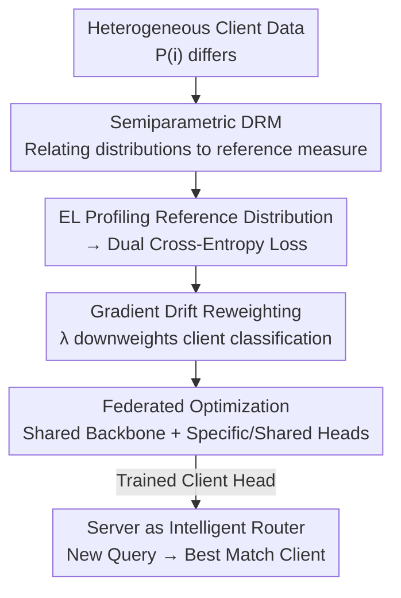

# Beyond Aggregation: Guiding Clients in Heterogeneous Federated Learning

**Conference**: ICLR2026  
**OpenReview**: [https://openreview.net/forum?id=RZT1ixYGk1](https://openreview.net/forum?id=RZT1ixYGk1)  
**Code**: https://github.com/zijianwang0510/FedDRM.git  
**Area**: Federated Learning / Optimization  
**Keywords**: Federated Learning, Statistical Heterogeneity, Density Ratio Model, Empirical Likelihood, Query Routing

## TL;DR
FedDRM upgrades the server's role from a "passive aggregator" to an "intelligent router"—utilizing Density Ratio Models (DRM) and Empirical Likelihood (EL) to model heterogeneity as a learnable client classification task. This allows the system to train high-quality local models while enabling the server to route new queries to the most specialized client, improving both local and system-level routing accuracy on CIFAR and real-world medical datasets.

## Background & Motivation
**Background**: Federated Learning (FL) enables multiple parties (hospitals, banks, mobile devices) to train models collaboratively without sharing raw data, becoming a mainstream paradigm for privacy-sensitive scenarios. However, real-world data distributions across clients vary significantly (statistical heterogeneity). The dominant approach treats heterogeneity as a nuisance to be "suppressed": either by modifying aggregation (correcting local updates, reweighting, or regularizing towards a global objective) to learn a single global model, or through personalization (fine-tuning, multi-task, or meta-learning) to customize models for each client or cluster.

**Limitations of Prior Work**: Existing methods assume the server is only responsible for "coordinating training and distributing models," acting essentially as a passive aggregator. They either flatten heterogeneity at the cost of local expertise or provide personalization without answering the critical question: **"Which client should handle a new incoming query?"** In other words, heterogeneity is suppressed as a bug, and the valuable information regarding "which client is best at which type of data" is wasted.

**Key Challenge**: Heterogeneity is both an obstacle during training (local model drift, slow convergence, poor global-to-local generalization) and a resource during deployment (different clients have different specialties). Current paradigms address the former but discard the latter.

**Goal**: To empower the server with two capabilities: (i) effectively sharing information across clients under heterogeneity to improve local models; and (ii) quantifying distribution differences in a principled way to match new queries to the most suitable client.

**Key Insight**: Inspired by medical scenarios, where a patient arrives at a server and should be routed to the hospital whose data distribution most closely matches the patient's case. To formalize this, one must calculate the probability of "which client a sample belongs to," which is fundamentally a discriminative problem.

**Core Idea**: Use a Density Ratio Model (DRM) to represent each client's distribution as a "multiplicative density tilt" relative to a reference distribution. By using Empirical Likelihood (EL) to non-parametrically "profile out" the reference distribution, the objective naturally decomposes into **two cross-entropy losses**: one for predicting the target class (supporting standard FL training) and one for predicting the client source (providing the routing signal). The server thus transitions from an aggregator to a router.

## Method

### Overall Architecture
FedDRM aims to solve for both a target classifier for each of the $m$ clients and a "client classifier" for server routing. The process involves associating all client feature distributions with a virtual server-side reference distribution via a DRM, then eliminating the unknown reference using EL. This results in a dual cross-entropy loss, optimized via a reweighted FedAvg process to handle gradient drift.

Network structure (Paper Fig. 2): A shared backbone $g_\theta$ (e.g., ResNet-18) is used by all clients. Above it, there are two paths: target classification using **client-specific linear heads** $(\alpha_i, \beta_i)$, and client classification using a **globally shared client head** (comprising a shared transformation $h_\tau$ followed by parameters $(\gamma, \xi)$). During inference for routing, the client head provides the probability distribution over clients; the query is sent to the client with the highest probability, and that client’s local target head produces the final prediction.

### Key Designs

**1. Semiparametric DRM: Relating Heterogeneous Client Distributions to a Reference Measure**

To perform routing, one must know the differences between client distributions. Estimating each distribution individually is impractical and prone to parametric bias. The authors introduce the Density Ratio Model (DRM, Anderson 1979)—modelling only **relative differences**. Assuming stable $Y|X$ across clients: $P(Y=k|X=x)=\exp(\alpha_k+\beta_k^\top g_\theta(x))/\sum_j\exp(\alpha_j+\beta_j^\top g_\theta(x))$, they link class-conditional distributions to a virtual reference measure $P^{(0)}_1$ via log-linear density ratios: $dP^{(i)}_k/dP^{(i)}_1(x)=\exp(\gamma_i+\xi_i^\top h_\tau(g_\theta(x)))$. Theorem 2.1 proves that marginal feature distributions follow the same DRM form: $dP^{(i)}_X/dP^{(0)}_X(x)=\exp\{\gamma^\dagger_i+\xi_i^\top h_\tau(g_\theta(x))\}$. This step compresses "client $i$ vs. reference" differences into log-linear tilts in the embedding space, avoiding density estimation and facilitating likelihood construction.

**2. EL Profiling of Reference Distribution: A Surprisingly Simple Dual Cross-Entropy Loss**

The reference measure $P^{(0)}_X$ is unknown. Using Empirical Likelihood (EL, Owen 2001), the authors treat the reference probability of each sample $p_{ij}=P^{(0)}_X(\{X_{ij}\})$ as parameters subject to normalization constraints. Profiling out these nuisance parameters normally requires solving $m$ Lagrange multiplier equations. However, Theorem 2.2 provides a closed-form dual: the optimal multipliers are $\rho_l=n_l/N$, and the profile log-EL simplifies to the sum of two standard cross-entropy losses:

$$\ell(\zeta)=\sum_{i,j}\ell_{CE}(i,h_\tau(g_\theta(x_{ij}));\gamma,\xi)+\sum_{i,j}\ell_{CE}(y_{ij},g_\theta(x_{ij});\alpha,\beta).$$

The first term classifies which client the sample came from; the second classifies the target category. This elegant simplification allows complex statistical modelling to be implemented as a simple loss function in deep neural networks.

**3. Gradient Drift Reweighting: Stabilizing the Client Head via λ**

Directly optimizing the dual loss leads to an issue: the client classification loss $\ell_i(\gamma,\xi)$ on client $i$ **only sees samples labeled as client $i$**, representing extreme label shift. The gradient w.r.t $\gamma_k$ for $k \neq i$ contains no effective information, leading to biased local updates. Gradient drift in the client head is significantly higher than in the target head (Paper Fig. 3). The authors address this by downweighting the higher-drift term: $\tilde\ell_i(\zeta)=(1-\lambda)\ell_i(\gamma,\xi)+\lambda\ell_i(\alpha,\beta)$, where $\lambda>0.5$. Theorem 2.5 establishes the convergence-accuracy trade-off, showing that larger $\lambda$ accelerates convergence but may diminish routing capability.

**4. Server as Intelligent Router: Turning the Client Head into a Dispatch Mechanism**

The shared client head trained via the designs above acts as the router. For a new query, the client head outputs a distribution over "client memberships" based on $dP^{(i)}_X/dP^{(0)}_X$. The server **routes the query to the client with the highest probability**, using that client's local head for final prediction. This principled dispatch mechanism is more efficient than baselines (which typically require majority voting across $m$ models).

### Loss & Training
The total loss is the reweighted negative profile log-EL: $\tilde\ell(\zeta)=\sum_i(n_i/N)\tilde\ell_i(\zeta)$, where $\tilde\ell_i(\zeta)=\lambda\ell_i(\alpha,\beta)+(1-\lambda)\ell_i(\gamma,\xi)+(\rho/2)\|\zeta\|_2^2$. The optimization follows the FedAvg framework (Algorithm 1): the server broadcasts $(\theta,\tau,\gamma,\xi)$, clients perform local SGD updates and return parameters for weighted averaging, while target heads $(\alpha_i,\beta_i)$ remain local and are never aggregated.

## Key Experimental Results

### Main Results
Evaluated on CIFAR-10/20/100 (8 clients) with both label shift (Dir-0.3 or S-SPC) and covariate shift. System accuracy (accuracy of query-to-client routing followed by prediction) results:

| Dataset / Setting | Metric | FedDRM | Strongest Baseline | Description |
|--------|------|------|----------|------|
| CIFAR-10 / Dir-0.3 | System Accuracy | **62.78** | 61.33 (FedALA) | Routing outperformed voting |
| CIFAR-10 / 5-SPC | System Accuracy | **58.50** | 57.17 (FedBABU) | Leading under heavy label shift |
| CIFAR-100 / 25-SPC | System Accuracy | **31.24** | 27.96 (FedAvgFT) | Largest gain on 100-class task |
| CIFAR-10 / Dir-0.3 | Average Accuracy | **80.26** | 79.08 (FedAvgFT) | Best local personalization |

FedDRM consistently outperforms baselines (Ditto, FedRep, FedBABU, etc.) in both system accuracy and average local accuracy.

### Ablation Study

| Configuration | Key Finding |
|------|---------|
| λ scanning (0.1→0.95) | $\lambda=0.8$ yields peak system accuracy, balancing routing and classification. |
| Covariate Shift intensity | Higher shift improves routing accuracy (46.90→63.80) but slightly hinders information sharing. |
| Backbone sharing | Deep sharing is the most parameter-efficient with comparable accuracy to shallow sharing. |
| Client count ($m=8 \to 32$) | While general performance drops with more clients, FedDRM maintains its lead over top baselines. |
| RETINA Medical Data | Achieves 1.41–7.67 point lead in system accuracy across 3 centers with real-world shifts. |

### Key Findings
- The weight $\lambda$ is crucial for deploying the EL framework in FL, balancing routing capability and classification precision.
- Heterogeneity is a "double-edged sword": higher covariate shift facilitates easier routing but makes cross-client information sharing more difficult.
- FedDRM shows the most significant advantages in complex tasks like CIFAR-100 and multi-center medical datasets.

## Highlights & Insights
- **Heterogeneity as a Feature**: A paradigm shift treatment of client differences as a learnable signal for routing rather than a problem to be suppressed.
- **Statistical Elegance**: Complex derivations involving DRM, EL, and Lagrangian duality collapse into two simple cross-entropy lines, allowing for principled statistical modeling with easy implementation.
- **Gradient Drift Diagnosis**: Precise identification of extreme label shift in the client head leads to a targeted reweighting solution supported by theoretical convergence bounds.

## Limitations & Future Work
- **DRM Assumptions**: The log-linear density ratio assumption may fail under extreme distribution discrepancies, limiting effective operation to "moderate heterogeneity."
- **Scale and Dynamics**: The current validation is limited to academic scales (up to 32 clients) and does not address dynamic client participation (churn).
- **Hyperparameter Tuning**: $\lambda$ currently requires a validation set; adaptive estimation of optimal $\lambda$ remains an open challenge.
- **Hard Routing**: The system performs "hard" assignment to a single client, without exploring soft routing or fallback mechanisms for routing failures.

## Related Work & Insights
- **vs. Aggregation Correction**: Methods like FedProx or FedSAM focus on a single global model; FedDRM learns specialized signals to enable routing.
- **vs. Personalized FL**: Methods like FedRep or FedBABU ignore the "who should handle this query" problem; FedDRM extends their capabilities with a shared routing head.
- **Methodological Insight**: The semiparametric DRM + EL toolkit is highly versatile for any distributed learning problem requiring simultaneous information fusion and domain differentiation.

## Rating
- Novelty: ⭐⭐⭐⭐⭐ Redefines the server as a router with a solid statistical foundation.
- Experimental Thoroughness: ⭐⭐⭐⭐ Solid results on CIFAR and medical data, though limited in dynamic scale.
- Writing Quality: ⭐⭐⭐⭐⭐ Clear narrative flow from medical intuition to mathematical derivation.
- Value: ⭐⭐⭐⭐ Opens a practical path for "heterogeneity as a resource," especially for multi-center clinical FL.

<!-- RELATED:START -->

## Related Papers

- [\[ICLR 2026\] Incentives in Federated Learning with Heterogeneous Agents](incentives_in_federated_learning_with_heterogeneous_agents.md)
- [\[ICLR 2026\] Byzantine-Robust Federated Learning with Learnable Aggregation Weights](byzantine-robust_federated_learning_with_learnable_aggregation_weights.md)
- [\[ICML 2026\] HO-SFL: Hybrid-Order Split Federated Learning with Backprop-Free Clients and Dimension-Free Aggregation](../../ICML2026/optimization/ho-sfl_hybrid-order_split_federated_learning_with_backprop-free_clients_and_dime.md)
- [\[ICLR 2026\] FedDAG: Clustered Federated Learning via Global Data and Gradient Integration for Heterogeneous Environments](feddag_clustered_federated_learning_via_global_data_and_gradient_integration_for.md)
- [\[ICML 2026\] Delayed Momentum Aggregation: Communication-efficient Byzantine-robust Federated Learning with Partial Participation](../../ICML2026/optimization/delayed_momentum_aggregation_communication-efficient_byzantine-robust_federated_.md)

<!-- RELATED:END -->
