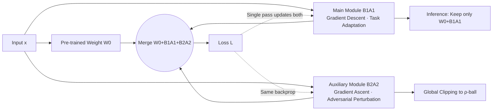

# Bi-LoRA: Efficient Sharpness-Aware Minimization for Fine-Tuning Large-Scale Models

**Conference**: ICLR 2026  
**OpenReview**: [https://openreview.net/forum?id=zoYPlgX1bH](https://openreview.net/forum?id=zoYPlgX1bH)  
**Code**: [https://github.com/CrazyElements/Bi-LoRA](https://github.com/CrazyElements/Bi-LoRA)  
**Area**: optimization  
**Keywords**: LoRA, Sharpness-Aware Minimization, flat minima, Parameter-Efficient Fine-Tuning, adversarial perturbation, generalization  

## TL;DR
Bi-LoRA utilizes an additional "adversarial LoRA module" to specifically carry SAM's adversarial perturbations, merging the original sequential two-step "perturb-then-descend" process into a single parallel forward-backward pass. This enables SAM to be practically applied to large-scale model LoRA fine-tuning with almost no added cost, while escaping the restricted subspace of LoRA-SAM to find flatter minima.

## Background & Motivation
**Background**: LoRA has become the de facto standard for fine-tuning and deploying large models by reducing trainable parameters through low-rank matrices $\Delta W \approx BA$. Regarding generalization, Sharpness-Aware Minimization (SAM) seeks flat minima by solving the min-max problem $\min_W \max_{\|\epsilon\|\le\rho} L(W+\epsilon)$, achieving state-of-the-art (SOTA) generalization gains in small-scale training. Combining the two (LoRA-SAM) appears to be a natural solution for both memory efficiency and high generalization.

**Limitations of Prior Work**: Directly applying SAM to LoRA parameters faces two major flaws. First is **efficiency**—SAM requires calculating an adversarial perturbation followed by a gradient descent step for each iteration. These two backpropagations must be sequential, doubling the training time, which becomes prohibitively expensive for large models. Second is **effectiveness**—the perturbation in LoRA-SAM is restricted to a constrained subspace: expanding the perturbation $\epsilon_W = B\epsilon_A + \epsilon_B A + \epsilon_B\epsilon_A$ and ignoring cross-terms yields $\epsilon_W \approx c\,[BB^\top(\nabla_W L) + (\nabla_W L)A^\top A]$. Its column and row spaces are dominated by $\mathrm{Col}(B)$ and $\mathrm{Row}(A)$, respectively (Proposition 1). Worse, $B$ and $A$ converge quickly in early training, causing the subspace to "collapse," forcing SAM to optimize sharpness within an increasingly narrow subspace.

**Key Challenge**: At inference, LoRA is merged into the full parameters $W_0+BA$. Sharpness in the **full parameter space** is what truly matters; however, LoRA-SAM only suppresses sharpness within a restricted subspace. Loss landscape visualizations show that while it is flattest in the LoRA subspace, it still rises steeply under perturbations in the full space. Thus, "memory efficiency" and "finding a truly flat minimum in the full space" are difficult to achieve simultaneously.

**Goal**: To make SAM both **efficient** (not doubling costs) and **effective** (escaping restricted subspaces for full-space flatness) in large model LoRA fine-tuning.

**Core Idea**: Introduce an independent auxiliary adversarial LoRA module to **decouple** "sharpness optimization" from "task adaptation." The main module performs gradient descent for the task as usual, while the auxiliary module performs gradient ascent specifically to carry the SAM perturbation. Both are updated in parallel during a single forward-backward pass. The auxiliary module is discarded at inference, reverting to a standard LoRA structure with zero extra overhead.

## Method

### Overall Architecture
Bi-LoRA formulates weights as the sum of two opposing LoRA modules: $W = W_0 + B_1A_1 + B_2A_2$. The main module $(B_1,A_1)$ uses gradient **descent** for task adaptation (equivalent to standard LoRA), while the auxiliary module $(B_2,A_2)$ uses gradient **ascent** to model SAM's adversarial perturbation. Once decoupled, they can be updated in parallel within the same gradient step. After training, the auxiliary module is discarded, leaving only $W_0+B_1A_1$ for inference.

### Key Designs

**1. Bidirectional Gradient Updates: Compressing SAM's two steps into a single parallel forward-backward pass.** This is the core of Bi-LoRA. In LoRA-SAM, the adversarial perturbation $\epsilon_B=\rho\,\frac{\partial L}{\partial B}/F_{\text{total}}$ must first be backpropagated through $(\epsilon_A, \epsilon_B)$ and then separately through $(A, B)$ sequentially. By assigning perturbations to an auxiliary module, Bi-LoRA transforms the objective into $\min_{B_1,A_1}\max_{\|B_2A_2\|_F\le\rho} L(W_0+B_1A_1+B_2A_2)$. Consequently, within a single gradient step, the main module descends and the auxiliary module ascends independently and in parallel:
$$B_1^{k+1}=B_1^k-\eta_1(\nabla_W L)A_1^{k\top},\quad B_2^{k+1}=B_2^k+\eta_2(\nabla_W L)A_2^{k\top}$$
(Similarly for $A$, where gradients are computed at the merged weight $W=W_0+B_1A_1+B_2A_2$). This parallel update eliminates the doubled computation of LoRA-SAM, keeping costs at $\times 1$ of standard LoRA. Proposition 2 further guarantees that the ascent direction generated by the auxiliary module aligns positively with the SAM perturbation direction ($\langle G_t,\tilde\epsilon_{t+1}-\tilde\epsilon_t\rangle\ge0$), ensuring this efficient update still climbs towards the worst-case direction intended by SAM.

**2. Decoupled Sharpness Exploration: Auxiliary subspace is independent and converges slower.** The perturbation space of LoRA-SAM is tied to the main module's $\mathrm{Col}(B)$ and collapses as training progresses. Bi-LoRA spans the perturbation space via $\mathrm{Col}(B_2)$, which is **strictly decoupled from the main optimization space $\mathrm{Col}(B_1)$**. Although it is still a subspace, it is no longer dragged into early convergence by task adaptation. Experiments show the auxiliary module only converges in the final 20% of training steps, evolving much slower and more independently than the main module, thus retaining flexibility to capture sharpness outside restricted subspaces. Loss landscape visualizations confirm that Bi-LoRA is significantly flatter in the **full parameter space** compared to LoRA-SAM, which is what truly matters for inference.

**3. Global Norm Clipping: Confining perturbations within the $\rho$-ball.** Since the auxiliary module carries perturbations, it must remain small enough not to disrupt normal training. Bi-LoRA applies **global** clipping across all $N$ auxiliary modules. If the total Frobenius norm $c_{\text{norm}}=\sqrt{\sum_j\|B_2^{(j)}A_2^{(j)}\|_F^2}$ exceeds the radius $\rho$, the layers $B_2, A_2$ are scaled by $\sqrt{\rho/c_{\text{norm}}}$ to constrain the overall perturbation. Ablations show "global clipping" is far superior to "no clipping" (which drops average scores by 3.48 due to excessive perturbation) or "layer-wise clipping."

**4. Mechanism: Bi-LoRA ≈ LoRA with Low-Rank Gradient Norm Regularization.** From a gradient norm perspective, SAM is equivalent to $L(W)+\rho\|\nabla_W L(W)\|_2$. Proposition 3 proves that if the inner maximization of Bi-LoRA is solved optimally, the objective reduces to $\min_{B_1,A_1} L(W_0+B_1A_1)+\rho\|\nabla_{W_0+B_1A_1}L\|_{(r)}$, where $\|\cdot\|_{(r)}$ is the Ky Fan $r$-norm (sum of the top $r$ singular values). Effectively, Bi-LoRA adds an **explicit low-rank gradient norm regularizer** to LoRA, aligning with the regularization interpretation of SAM.

## Key Experimental Results
Evaluated on Llama 2-7B / 3.1-8B (Math, Code, Dialogue, Instruction Following), Qwen 2.5-14B, SDXL Image Generation, and T5-base NLU tasks.

### Main Results
Llama 2-7B (Math/Code/Dialogue) and Llama 3.1-8B (Instruction Following). Cost represents gradient computations per step:

| Method | Cost | GSM8K | HumanEval | MT-Bench | MMLU | DROP | HEval | BBH |
|------|------|-------|-----------|----------|------|------|-------|-----|
| Full FT | ×1 | 59.74 | 33.12 | 6.16 | 64.31 | 51.52 | 41.45 | 44.78 |
| LoRA | ×1 | 58.21 | 24.75 | 5.92 | 63.38 | 49.82 | 43.15 | 42.82 |
| LoRA-SAM | ×2 | 59.16 | 26.59 | 5.97 | 63.46 | 50.94 | 44.36 | 43.49 |
| Flat-LoRA | ×1 | 59.44 | 26.67 | 5.98 | 63.67 | 50.44 | 44.31 | 43.99 |
| **Bi-LoRA** | **×1** | **60.32** | **27.20** | **6.26** | **63.67** | **51.53** | **46.12** | 43.45 |

Bi-LoRA achieves ×1 cost (vs ×2 for LoRA-SAM) and improves over LoRA by +2.11% on GSM8K, +2.45% on HumanEval, and +0.34 on MT-Bench, **surpassing full fine-tuning** on GSM8K and MT-Bench.

### Ablation Study
Llama 3.1-8B instruction following, decomposing "extra branch vs. adversarial ascent vs. clipping method":

| Method | Clipping | Adversarial | MMLU | DROP | HEval | BBH | Avg. |
|------|------|------|------|------|-------|-----|------|
| LoRA | ✗ | ✗ | 63.38 | 49.82 | 43.15 | 42.82 | 49.79 |
| Dual-LoRA (Dual Descent) | Global | ✗ | 63.49 | 49.97 | 42.71 | 43.25 | 49.86 |
| Bi-LoRA (No Clipping) | ✗ | ✓ | 61.33 | 47.31 | 40.24 | 41.96 | 47.71 |
| Bi-LoRA (Layer-wise) | Per-layer | ✓ | 63.49 | 50.26 | 43.29 | 43.06 | 50.03 |
| **Bi-LoRA (Global)** | Global | ✓ | **63.67** | **51.53** | **46.12** | **43.45** | **51.19** |

### Key Findings
- **Gains stem from adversarial ascent, not just extra parameters**: Dual-LoRA (two descent branches) only improves by +0.07 over LoRA, proving performance comes from gradient ascent, not increased capacity/rank.
- **Global clipping is critical**: No clipping leads to excessive perturbations (drops 3.48), while layer-wise clipping only yields a minor +0.24 gain. Global clipping provides a +1.40 gain.
- **Hyperparameter robustness**: The average score remains stable [50.55, 51.19] for auxiliary learning rate $\eta_2$ between 1e-4 and 1e-3. The optimal $\eta_2=3\text{e-}4$ matches the main learning rate.
- **Plug-and-play**: When added to LoRA-GA, PiSSA, or DoRA, Bi-LoRA further increases T5-base average performance by 1.45% on MRPC+CoLA.

## Highlights & Insights
- **"Decoupling" is the key to solving efficiency and effectiveness simultaneously**: By separating SAM's adversarial perturbations from the main optimization, Bi-LoRA parallelizes the sequential steps (efficiency) and frees the perturbation space from the collapsing LoRA subspace (effectiveness).
- **Addressing the blind spot of LoRA-SAM**: Proposition 1 rigorously shows LoRA-SAM only flattens the restricted $\mathrm{Col}(B)/\mathrm{Row}(A)$ subspace which collapses quickly. The paper validates this using norm curves and cosine similarity.
- **Balancing Theory and Engineering**: Propositions 2 and 3 connect the "efficient single-step parallel update" to the "low-rank gradient norm regularizer," providing a theoretical foundation for the empirical success.

## Limitations & Future Work
- **Gap between theory and practice**: The equivalence in Proposition 3 assumes the inner maximization is solved optimally, whereas the practical version uses a single-step approximation for efficiency.
- **Introduction of new hyperparameters and memory**: The auxiliary module introduces $r_2, \eta_2, \rho$. While robust, it increases training memory/computation due to auxiliary parameters.
- **Subspace remains a subspace**: $\mathrm{Col}(B_2)$ is decoupled but still not the full space. "Broader exploration" is relative to LoRA-SAM, and there is still a gap to true full-space SAM.
- **Task-dependent gains**: Gains on some tasks like BBH are less pronounced compared to Math or Code.

## Related Work & Insights
- **SAM and its accelerated variants**: Methods like ESAM, LookSAM, and S²SAM reduce costs via sparse or periodic perturbations but often still carry overhead (×1.x) or show performance drops. Bi-LoRA's "parallel step with independent modules" offers a new "parallelize" rather than "reduce" approach.
- **Flat minima for LoRA**: Works like Flat-LoRA and LoRA-oBAR/nBAR also target flatness. This paper adds the critical observation of subspace collapse and addresses it with decoupling and global clipping.
- **Orthogonal to advanced LoRA variants**: The ability to stack with LoRA-GA/PiSSA/DoRA suggests the "adversarial auxiliary module" is a general-purpose plugin compatible with various PEFT improvements.

## Rating
- Novelty: ⭐⭐⭐⭐ Uses "auxiliary adversarial LoRA modules" to decouple sharpness optimization, parallelizing SAM and escaping the restricted subspace.
- Experimental Thoroughness: ⭐⭐⭐⭐ Covers 7B-14B LLMs, diffusion models, and T5, with systematic ablations on clipping, hyperparameters, and rank.
- Writing Quality: ⭐⭐⭐⭐ Clear motivation regarding subspace collapse; well-aligned propositions and charts.
- Value: ⭐⭐⭐⭐ Makes SAM practically viable for large model LoRA tuning (×1 cost, improved generalization, zero inference overhead).

<!-- RELATED:START -->

## Related Papers

- [\[ICLR 2026\] FZOO: Fast Zeroth-Order Optimizer for Fine-Tuning Large Language Models towards Adam-Scale Speed](fzoo_fast_zeroth-order_optimizer_for_finetuning_large_language_models_towards_ad.md)
- [\[ICLR 2026\] MASAM: Multimodal Adaptive Sharpness-Aware Minimization for Heterogeneous Data Fusion](masam_multimodal_adaptive_sharpness-aware_minimization_for_heterogeneous_data_fu.md)
- [\[ICLR 2026\] Towards Understanding the Calibration Benefits of Sharpness-Aware Minimization](towards_understanding_the_calibration_benefits_of_sharpness-aware_minimization.md)
- [\[ICLR 2026\] Minor First, Major Last: A Depth-Induced Implicit Bias of Sharpness-Aware Minimization](minor_first_major_last_a_depth-induced_implicit_bias_of_sharpness-aware_minimiza.md)
- [\[ICML 2025\] Tilted Sharpness-Aware Minimization](../../ICML2025/optimization/tilted_sharpness-aware_minimization.md)

<!-- RELATED:END -->
