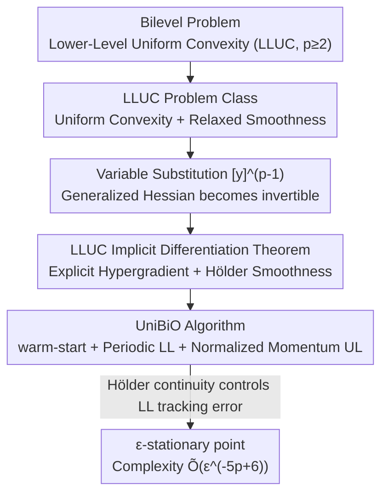

# Bilevel Optimization with Lower-Level Uniform Convexity: Theory and Algorithm

**Conference**: ICLR2026  
**OpenReview**: [https://openreview.net/forum?id=dJgb3ngAvT](https://openreview.net/forum?id=dJgb3ngAvT)  
**Code**: https://github.com/MingruiLiu-ML-Lab/bilevel-optimization-lower-level-uniform-convexity  
**Area**: optimization  
**Keywords**: bilevel optimization, uniform convexity, implicit differentiation, hypergradient, oracle complexity

## TL;DR
This paper bridges the solvable gap between lower-level strong convexity ($p=2$) and general convexity by introducing "lower-level uniform convexity (LLUC, index $p\ge 2$)". It establishes an implicit differentiation theorem under uniform convexity (providing explicit hypergradient formulas and Hölder smoothness) and designs a stochastic algorithm, UniBiO, proving an oracle complexity of $\widetilde{O}(\epsilon^{-5p+6})$ to find an $\epsilon$-stationary point, which recovers the optimal $\widetilde{O}(\epsilon^{-4})$ when $p=2$.

## Background & Motivation

**Background**: Bilevel optimization features a hierarchical structure where the feasibility of the upper-level problem $\min_x \phi(x):=f(x,y^*(x))$ is constrained by the lower-level problem $y^*(x)\in\arg\min_y g(x,y)$. It is widely used in hyperparameter optimization, meta-learning, data cleaning, and neural architecture search. To provide non-asymptotic convergence guarantees (finding a point with a sufficiently small hypergradient in polynomial time), existing mainstream works almost exclusively assume the lower-level function is **strongly convex** or satisfies the **Polyak-Łojasiewicz (PL)** condition. These assumptions ensure a non-singular lower-level Hessian, allowing for direct calculation of the hypergradient $\nabla\phi(x)$ using the standard implicit function theorem by Ghadimi & Wang (2018).

**Limitations of Prior Work**: Strong convexity/PL does not always hold in practice. A natural idea is to relax it to "general convexity," but Chen et al. (2024) provided a negative conclusion: for generally convex lower-level functions, bilevel optimization is essentially **unsolvable** when the goal is to "find a small hypergradient"—the hyperobjective $\phi$ may be discontinuous, or a stationary point might not even exist. Consequently, a cliff-like gap exists between lower-level strong convexity (LLSC) and lower-level only convex (LLC).

**Key Challenge**: LLSC is too restrictive (not satisfied by many problems), while LLC is too weak (theoretically unsolvable). Does there exist an intermediate function class that is **stronger than LLC to be solvable, yet more relaxed than LLSC**?

**Goal**: Identify such a solvable intermediate problem class and solve two accompanying issues: (1) the lower-level Hessian may be singular, making standard implicit differentiation inapplicable; (2) uniform convexity and standard smoothness (global Lipschitz $\nabla_y g$) are **incompatible** on unbounded domains, causing the failure of smoothness assumptions relied upon by existing algorithm analyses.

**Key Insight**: The authors leverage the concept of "uniform convexity" from optimization theory—$g(x,y_2)\ge g(x,y_1)+\langle\nabla_y g(x,y_1),y_2-y_1\rangle+\frac{\mu}{p}\|y_2-y_1\|^p$, controlled by the index $p\ge 2$. $p=2$ corresponds exactly to strong convexity, while $p\to\infty$ approaches general convexity. This provides a natural, continuous interpolation scale.

**Core Idea**: By replacing the lower-level assumption with "uniform convexity (LLUC)" and performing a variable substitution $[y]^{\circ(p-1)}$ (element-wise power of $p-1$), the authors prove that a "generalized Hessian" becomes invertible, thereby restoring implicit differentiation. They then design the stochastic algorithm UniBiO, utilizing warm-start, periodic lower-level updates, and normalized momentum upper-level updates to handle the resulting Hölder (instead of Lipschitz) smooth hyperobjective.

## Method

### Overall Architecture

This paper is a **theory + algorithm** paper, following a two-step main line: first, establishing an implicit differentiation theorem under LLUC regarding how to calculate the hypergradient and how smooth the hyperobjective is (Section 4); second, designing a stochastic algorithm UniBiO that matches the optimal rate and providing a convergence proof (Section 5).

The problem is formulated as:
$$\min_{x\in\mathbb{R}^{d_x}}\ \phi(x):=f(x,y^*(x)),\qquad y^*(x)\in\arg\min_{y\in\mathbb{R}^{d_y}} g(x,y),$$
where access is provided only through stochastic oracles for the gradients and Hessian-vector products of $f$ and $g$. The key obstacle is that when the lower level is uniformly convex with $p>2$, $g$ is **not strongly convex** in $y$. Its Hessian may degenerate and become singular at the optimal point, causing the $(\nabla^2_{yy}g)^{-1}$ in the classical formula $\nabla\phi(x)=\nabla_x f-\nabla^2_{xy}g\,(\nabla^2_{yy}g)^{-1}\nabla_y f$ to fail.

The logic of the method can be summarized as follows:

### Key Designs

**1. LLUC Problem Class: Continuous interpolation between strong and general convexity via index $p$**

This is the foundation, directly addressing the conflict between LLSC and LLC. The authors assume the lower-level function is $(\mu,p)$-uniformly convex (Assumption 3.2(i)): $g(x,y_2)\ge g(x,y_1)+\langle\nabla_y g(x,y_1),y_2-y_1\rangle+\frac{\mu}{p}\|y_2-y_1\|^p$. When $p=2$, this reduces to standard $\mu$-strong convexity; larger $p$ signifies flatter lower-level curvature. Accompanying this is a **relaxed smoothness** assumption (Assumption 3.2(ii)): $\|\nabla^2_{yy}g(x,y)\|\le L_0+L_1\|\nabla_y g(x,y)\|$, rather than classical global $L$-smoothness. The authors emphasize that standard $L$-smoothness is **incompatible** with uniform convexity on unbounded domains (uniform convexity requires gradient growth, while $L$-smoothness restricts it linearly). This relaxation is a prerequisite for differentiating this work from LLSC algorithms.

To demonstrate the existence of such problems, the authors provide the example of data cleaning with $\ell_p$ norm regression. The lower-level $g(w,\lambda)=\frac{1}{n}\|\Lambda(Xw-\bar y)\|_p^p+c\|w\|_p^p$ is uniformly convex but **not strongly convex** when $p>2$, falling exactly between LLC and LLSC.

**2. LLUC Implicit Differentiation Theorem: Variable substitution restores singular Hessian**

This is the core technical contribution, solving the singularity issue. The trick is to differentiate not with respect to $y$, but with respect to $[y]^{\circ(p-1)}$, defining the "generalized Hessian" $\frac{d\nabla_y g(x,y)}{d[y]^{\circ(p-1)}}$. The authors prove (Lemma B.2) that the minimum eigenvalue of this generalized Hessian is $\lambda_{\min}\ge\mu>0$, making it **invertible**—restoring the non-degeneracy lost by $p>2$. Thus, Theorem 4.1 provides an explicit hypergradient formula:
$$\nabla\phi(x)=\nabla_x f(x,y^*)-\nabla^2_{xy}g(x,y^*)\Big(\tfrac{d\nabla_y g(x,y^*)}{d[y^*]^{\circ(p-1)}}\Big)^{-1}\tfrac{df(x,y^*)}{d[y^*]^{\circ(p-1)}}.$$
This precisely recovers the formula of Ghadimi & Wang (2018) when $p=2$. More importantly, it characterizes the **smoothness degradation**: $\phi$ is no longer Lipschitz smooth, but **Hölder smooth**—
$$\|\nabla\phi(x_1)-\nabla\phi(x_2)\|\le L_{\phi_1}\|x_1-x_2\|^{\frac{1}{p-1}}+L_{\phi_2}\|x_1-x_2\|,$$
with an associated descent inequality: $\phi(x_1)\le\phi(x_2)+\langle\nabla\phi(x_2),x_1-x_2\rangle+\frac{(p-1)L_{\phi_1}}{p}\|x_1-x_2\|^{\frac{p}{p-1}}+\frac{L_{\phi_2}}{2}\|x_1-x_2\|^2$. Intuitively, larger $p$ leads to a smaller Hölder index $\frac{1}{p-1}$, making the hyperobjective "rougher," which is the root cause of the complexity dependence on $p$.

**3. UniBiO Algorithm: warm-start + Periodic LL updates + Normalized Momentum UL updates**

The explicit hypergradient is not enough for efficiency. Standard practices of solving the lower-level problem to high precision at every step lead to high oracle complexity. UniBiO (Algorithm 2) utilizes three mechanisms. First, **warm-start**: fix $x_0$ and pre-warm $y$ using Epoch-SGD (Algorithm 1). Second, **periodic lower-level updates**: update the lower level via Epoch-SGD every $I$ steps. This is feasible because Lemma 4.2 guarantees that $y^*(x)$ moves slowly ($\|y^*(x_2)-y^*(x_1)\|\le l_p\|x_1-x_2\|^{\frac{1}{p-1}}$). With a normalized update $\|x_{t+1}-x_t\|=\eta$, the drift is small enough for $y_t$ to remain a good estimate of $y^*(x_t)$. Third, **upper-level normalized momentum**: $m_t=\beta m_{t-1}+(1-\beta)\hat\nabla f(x_t,y_t;\bar\xi_t)$, where $\hat\nabla f$ approximates the inverse matrix using Neumann series. The Epoch-SGD variant for the lower level uses a "shrinking ball" strategy to adapt the convergence analysis to uniform convexity and relaxed smoothness.

**4. Loss & Training**

This work does not follow a specific "training loss" paradigm but provides Algorithm 2 (UniBiO) as the core training loop: warm-start $\to$ update lower level via shrinking-ball Epoch-SGD every $I$ steps $\to$ update upper level via normalized momentum with Neumann hypergradient approximation every step. Hyperparameter magnitudes ($\eta, I, 1-\beta, K_t$) are explicitly defined by Theorem 5.1 and scaled with $p$ to compensate for the roughness of the hyperobjective.

## Key Experimental Results

Experiments were conducted to **verify the theory** ("larger $p$ slows convergence") and **validate UniBiO**.

### Main Results

| Task | Setting | Baselines | Key Conclusion |
|------|------|----------|----------|
| Synthetic | $g=\frac{1}{p}y^p-y\sin x$, $p\in\{2,4,6,8\}$ | Different $p$ values | Hypergradient norm convergence slows as $p$ increases, consistent with theory across noise levels. |
| Data Cleaning | Noisy SNLI text classification, $\|w\|_p^p$ penalty ($p=3$), 3-layer RNN | StocBio, TTSA, SABA, MA-SOBA, SUSTAIN, VRBO | UniBiO outperforms all baselines in accuracy and efficiency (Accuracy vs. Runtime). |

### Ablation Study

The paper uses "sweeping $p$" as the core analytical variable:

| Configuration ($p$) | Observed Phenomena | Explanation |
|------|---------|------|
| $p=2$ (Strong Convexity) | Fastest convergence | Complexity reduces to optimal $\widetilde{O}(\epsilon^{-4})$. |
| $p=4$ | Significantly slower | Hölder index $\frac{1}{p-1}$ decreases. |
| $p=6,8$ | Progressively slower | Consistent with the $-5p$ term in $\widetilde{O}(\epsilon^{-5p+6})$. |

### Key Findings
- **$p$ is the dominant complexity parameter**: Synthetic results quantitatively confirm the $p$ dependence in $\widetilde{O}(\epsilon^{-5p+6})$.
- **Variable substitution is key to singular Hessians**: Substituting $[y]^{\circ(p-1)}$ ensures the generalized Hessian is invertible ($\lambda_{\min}\ge\mu$) when $p>2$.
- **Periodic updates save oracle costs without sacrificing precision**: Leveraging the Hölder continuity of $y^*(x)$, lower-level updates do not need to occur at every step.

## Highlights & Insights
- **Interpolation using $p$**: It transforms a discrete opposition (LLSC vs. LLC) into a continuous scale, allowing solvability to degrade smoothly with $p$.
- **Variable substitution $[y]\to[y]^{\circ(p-1)}$**: Instead of modifying the problem, changing the differentiation coordinate makes the second-order information non-degenerate.
- **Hölder Adaptation**: Generalizing normalized momentum and periodic updates from Lipschitz smoothness to Hölder smoothness provides a template for other non-Lipschitz bilevel/composite problems.

## Limitations & Future Work
- It is unknown if the complexity $\widetilde{O}(\epsilon^{-5p+6})$ is **tight** with respect to $\epsilon$ when $p>2$; matching lower bounds are missing.
- Assumptions are relatively strong: they require generalized Jacobians/derivatives with respect to $[y]^{\circ(p-1)}$ to be differentiable, Lipschitz, and bounded ($\le C$), plus light-tailed noise for high-probability analysis.
- Experimental scale is limited (synthetic + SNLI data cleaning); the index $p$ is assumed to be known or given.

## Related Work & Insights
- **vs. Ghadimi & Wang (2018)**: They involve standard Hessian inversion for LLSC. Ours uses generalized Hessian inversion for LLUC, serving as a strict generalization that recovers their results at $p=2$.
- **vs. Chen et al. (2024)**: They proved LLC is unsolvable for finding small hypergradients. Ours identifies that a small amount of curvature (uniform convexity) restores solvability.
- **vs. Hao et al. (2024) BO-REP**: While the algorithm skeletons are similar, BO-REP focuses on LLSC + relaxed smoothness, whereas UniBiO targets LLUC + Hölder smoothness, requiring different parameter scaling and analysis.

## Rating
- Novelty: ⭐⭐⭐⭐⭐ Bridging LLSC/LLC with LLUC and established the first non-asymptotic result.
- Experimental Thoroughness: ⭐⭐⭐ Primarily theoretical verification; lacks large-scale scenarios and lower bounds.
- Writing Quality: ⭐⭐⭐⭐ Clear theoretical progression from problem class to algorithm.
- Value: ⭐⭐⭐⭐ Provides a clean and generalizable theoretical framework for relaxing lower-level assumptions.

<!-- RELATED:START -->

## Related Papers

- [\[NeurIPS 2025\] Learning Theory for Kernel Bilevel Optimization](../../NeurIPS2025/optimization/learning_theory_for_kernel_bilevel_optimization.md)
- [\[NeurIPS 2025\] An Adaptive Algorithm for Bilevel Optimization on Riemannian Manifolds](../../NeurIPS2025/optimization/an_adaptive_algorithm_for_bilevel_optimization_on_riemannian_manifolds.md)
- [\[ICLR 2026\] Faster Gradient Methods for Highly-Smooth Stochastic Bilevel Optimization](faster_gradient_methods_for_highly-smooth_stochastic_bilevel_optimization.md)
- [\[ICML 2026\] Lower Complexity Bounds for Nonconvex-Strongly-Convex Bilevel Optimization with First-Order Oracles](../../ICML2026/optimization/lower_complexity_bounds_for_nonconvex-strongly-convex_bilevel_optimization_with_.md)
- [\[ICLR 2026\] Reducing Contextual Stochastic Bilevel Optimization via Structured Function Approximation](reducing_contextual_stochastic_bilevel_optimization_via_structured_function_appr.md)

<!-- RELATED:END -->
## Related Papers

- [\[NeurIPS 2025\] Learning Theory for Kernel Bilevel Optimization](../../NeurIPS2025/optimization/learning_theory_for_kernel_bilevel_optimization.md)
- [\[NeurIPS 2025\] An Adaptive Algorithm for Bilevel Optimization on Riemannian Manifolds](../../NeurIPS2025/optimization/an_adaptive_algorithm_for_bilevel_optimization_on_riemannian_manifolds.md)
- [\[ICML 2026\] Lower Complexity Bounds for Nonconvex-Strongly-Convex Bilevel Optimization with First-Order Oracles](../../ICML2026/optimization/lower_complexity_bounds_for_nonconvex-strongly-convex_bilevel_optimization_with_.md)
- [\[ICLR 2026\] Faster Gradient Methods for Highly-Smooth Stochastic Bilevel Optimization](faster_gradient_methods_for_highly-smooth_stochastic_bilevel_optimization.md)
- [\[ICLR 2026\] Reducing Contextual Stochastic Bilevel Optimization via Structured Function Approximation](reducing_contextual_stochastic_bilevel_optimization_via_structured_function_appr.md)

<!-- RELATED:END -->
