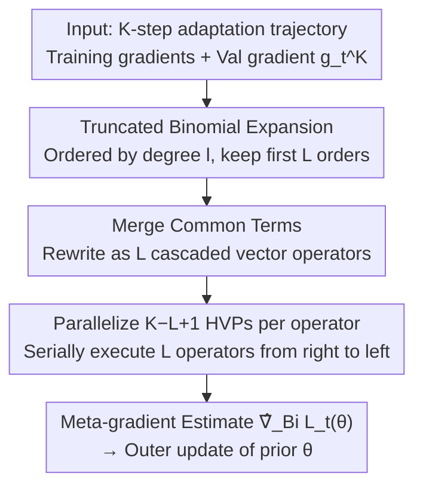

# Binomial Gradient-Based Meta-Learning for Enhanced Meta-Gradient Estimation

**Conference**: ICLR2026  
**OpenReview**: [https://openreview.net/forum?id=mKgUAO41zf](https://openreview.net/forum?id=mKgUAO41zf)  
**Code**: To be confirmed  
**Area**: Optimization / Meta-Learning / Bi-level Optimization  
**Keywords**: Meta-Learning, Meta-Gradient Estimation, MAML, Binomial Expansion, Truncated Backpropagation

## TL;DR
Addressing the pain point in gradient-based meta-learning (GBML) like MAML where "meta-gradient backpropagation scales linearly with adaptation steps $K$," this paper applies **truncated binomial expansion** to the meta-gradient product sequence $\prod_{k}(I-\alpha H_k)$ instead of simply truncating the tail. The resulting estimator, BinomMAML, preserves more second-order information at the same truncation order $L$, with error decaying at a **super-exponential rate** relative to $L$. It supports parallel HVP computation and achieves precision significantly closer to full MAML on miniImageNet/tieredImageNet with only a slight increase in overhead.

## Background & Motivation
**Background**: Meta-learning aims to learn a "task-agnostic prior" from a batch of related tasks, enabling rapid adaptation to new tasks even with few samples. A prominent branch is **Gradient-Based Meta-Learning (GBML)**, exemplified by MAML—which encodes the prior as a shared initialization $\theta$ for all tasks, performs $K$ steps of gradient descent for each task to obtain task-specific parameters $\phi_t^K(\theta)$, and updates $\theta$ using validation loss.

**Limitations of Prior Work**: Training $\theta$ requires computing the "meta-gradient" $\nabla L_t(\theta)$. By the chain rule, this involves a product of Hessian-related terms:

$$\nabla L_t(\theta)=\prod_{k=0}^{K-1}\big(I_d-\alpha H_t^k\big)\,g_t^K,\qquad H_t^k:=\nabla^2\ell_t^{\mathrm{trn}}(\phi_t^k),\ g_t^K:=\nabla\ell_t^{\mathrm{val}}(\phi_t^K).$$

The time and space complexity of this sequence are $O(Kd)$, growing linearly with adaptation steps $K$, which makes MAML difficult to scale to scenarios requiring large $K$.

**Key Challenge**: The trade-off between accuracy and complexity. To save costs, existing approximators "discard information": the first-order method FOMAML simply sets all $H_t^k=0$, reducing complexity to $O(d)$ but losing all second-order information, leading to large errors and slow convergence. Truncated backpropagation (TruncMAML) keeps only the **last $L$ steps** of second-order terms $\prod_{k=K-L}^{K-1}(I-\alpha H_t^k)g_t^K$. Its complexity is $O(Ld)$, but its error decays slowly with $L$—requiring $L$ to be close to $K$ for accuracy, which yields little savings. iMAML follows the implicit function theorem but relies on the approximate optimality of the solution and suffers from numerical instability.

**Goal**: Without abandoning second-order information, find a "truncation method" that allows meta-gradient estimation error to decay **rapidly** with the truncation order $L$, thereby achieving accuracy close to full MAML with costs much smaller than $K$.

**Key Insight**: The author notes that the product above and the truncation in TruncMAML are essentially **serial HVP chains that cannot be parallelized**—multiplication must proceed one by one from right to left. Since modern GPU computational power is abundant, why not **calculate more terms in parallel** at each HVP step to squeeze more information into the estimate?

**Core Idea**: Instead of simply "cutting the tail," expand the product $\prod_k(I-\alpha H_t^k)$ using the **binomial theorem** into a polynomial ordered by degree $l$, and then **truncate by order** to $L$. Low-order terms contribute most while high-order terms $O(\alpha^{L+1})$ are negligible. Thus, at the same $L$, it preserves significantly more information than TruncMAML, and these terms are naturally parallelizable.

## Method

### Overall Architecture
BinomGBML solves the same problem—estimating the MAML meta-gradient $\nabla L_t(\theta)$—but adopts a different "truncation" method. Inputs are the training gradients $\{\nabla\ell_t^{\mathrm{trn}}(\phi_t^k)\}$ on a $K$-step adaptation trajectory, the validation gradient $g_t^K$, step size $\alpha$, and truncation order $L$; the output is the meta-gradient estimate $\hat\nabla_{\mathrm{Bi}}L_t(\theta)$, fed to the outer optimizer to update $\theta$.

The pipeline consists of three steps: first, the meta-gradient matrix product is **expanded via binomial theorem** into a sum ordered by degree and truncated to $L$; since a direct expansion results in $\sum_{l=1}^L\binom{K}{l}$ terms—computationally infeasible—the second step **merges common terms**, rewriting the sum as $L$ cascaded operators. The third step implements these cascaded operators as Algorithm 1, where each operator contains $K-L+1$ independent HVPs that can be **parallelized** on a GPU, proceeding serially through the $L$ operators from right to left to get the final estimate.

### Key Designs

**1. Truncated Binomial Expansion: Replacing "tail cutting" with "order-based information retention"**

This directly addresses the TruncMAML pain point where "error decays too slowly with $L$." The author expands the matrix product using the binomial theorem—similar to the scalar $(1+z)^K=\sum_{l=0}^K\binom{K}{l}z^l$:

$$\prod_{k=0}^{K-1}(I_d-\alpha H_t^k)=I_d+\sum_{l=1}^{K}\sum_{0\le k_{1:l}\uparrow<K}\prod_{i=1}^{l}(-\alpha H_t^{k_i}),$$

where $\{0\le k_{1:l}\uparrow<K\}$ denotes all $\binom{K}{l}$ combinations of $l$ **strictly increasing** indices from $\{0,\dots,K-1\}$. Each $l$-th order term $\prod_{i}(-\alpha H_t^{k_i})=O(\alpha^l)$ decays exponentially with order $l$ when $\alpha$ is small. Keeping only the first $L$ orders yields the estimator:

$$\hat\nabla_{\mathrm{Bi}}L_t(\theta)=\Big[I_d+\sum_{l=1}^{L}\sum_{0\le k_{1:l}\uparrow<K}\prod_{i=1}^{l}(-\alpha H_t^{k_i})\Big]g_t^K,$$

where discarded high-order terms are as small as $O(\alpha^{L+1})$. Compared to TruncMAML, which only keeps the "product of the last $L$ steps," binomial expansion takes combinations **across the entire trajectory** within the same order $L$, capturing far more information. For $L=1$, $\hat\nabla_{\mathrm{Bi}}L_t(\theta)=g_t^K-\alpha\sum_{k=0}^{K-1}H_t^k g_t^K$, utilizing all $K$ first-order Hessian terms, whereas TruncMAML($L=1$) uses only the very last one.

**2. Merge Common Terms → Cascaded Vector Operators: Turning exponential terms into $O(L)$ parallel operators**

While accurate, binomial expansion has $\sum_{l=1}^L\binom{K}{l}$ terms, lead to a combinatorial explosion. This design solves the "efficient implementation" problem. The author found shared product prefixes among terms; defining $P_t^i:=\prod_{k=K-i}^{K-1}(I_d-\alpha H_t^k)$, Proposition 3.1 proves truncated binomial expansion equals a cascade of $L$ matrix operators $B_t^{L-1}B_t^{L-2}\cdots B_t^0 I_d$; Theorem 3.2 further reduces this to a **vector operator** version:

$$\hat\nabla_{\mathrm{Bi}}L_t(\theta)=B_t^{g_t^K,L-1}B_t^{g_t^K,L-2}\cdots B_t^{g_t^K,0}\,g_t^K,$$

where each operator applied to a vector requires several HVPs ($Hv=\nabla_{\phi}\langle\nabla\ell^{\mathrm{trn}},v\rangle$). Crucially: while these $L$ operators must proceed **serially** from right to left, **a single operator contains $K-L+1$ independent HVPs that can be parallelized on the GPU**. This compresses exponential terms into $O(L)$ serial steps + parallel internal steps, implementing the "parallelize more info next to each HVP" idea (Algorithm 1). Consequently, BinomMAML's time complexity $O(Ld)$ matches TruncMAML, while space complexity is $O((K-L+1)d)$.

**3. Dynamic Computation Graph Management: Solving MAML's memory scalability**

This is an incidental benefit of the method. Standard MAML builds and **keeps** all $K$ HVP computation graphs simultaneously, requiring $O(Kd)$ space. BinomMAML, by proceeding through operators, can **build and release** computation graphs on the fly. Result: when $L=K$, BinomMAML has the same time complexity as MAML but significantly lower space complexity. At general $L$, time matches TruncMAML, and space grows affinely with $L$. The cost is the need for $K-L+1$ compute cores and the overhead of parallel scheduling, though in practice this is small compared to the HVP itself.

### Loss & Training
The method does not change MAML's bi-level objective; it only replaces the meta-gradient estimation method. Thus, it can be directly plugged into the MAML training flow: $K$ steps of inner GD to find $\phi_t^K$, and an outer update of the prior $\theta$ using $\hat\nabla_{\mathrm{Bi}}L_t(\theta)$. Two boundary cases: $L=0$ reduces to FOMAML; $L=K$ is equivalent to full MAML (but more memory-efficient). The expansion logic can be generalized to other GBML variants, with MAML used as the primary example.

## Key Experimental Results

### Main Results
On miniImageNet / tieredImageNet for 5-way few-shot classification. Meta-training was **early-stopped** at 20,000 steps to amplify the "meta-gradient error slowing convergence" effect. Values in parentheses represent the accuracy gap relative to full MAML (closer to 0 is better).

| Setting | Method | miniImageNet 1-shot | miniImageNet 5-shot | tieredImageNet 1-shot |
|------|------|------|------|------|
| $L=0$ | FOMAML | 44.57 (-1.93) | 62.97 (-1.26) | 43.53 (-3.50) |
| $L=2$ | TruncMAML | 44.93 (-1.57) | 63.61 (-0.62) | 45.93 (-1.10) |
| $L=2$ | **BinomMAML** | **46.23 (-0.27)** | 63.49 (-0.74) | **46.20 (-0.83)** |
| $L=3$ | BinomMAML | 46.00 (-0.50) | 64.17 (-0.06) | 46.43 (-0.60) |
| $L=5$ | MAML (Ref) | 46.50 | 64.23 | 47.03 |

At the same $L$, BinomMAML outperforms TruncMAML in most cases, consistently beats iMAML, and the performance gap rapidly approaches full MAML with only small $L$.

### Ablation Study

| Dimension | Key Findings | Remarks |
|------|---------|------|
| Truncation Order $L$ (Sine) | BinomMAML($L=1$) meta-gradient error $\approx$ TruncMAML($L=4$); negligible error for $L\ge2$ | Binomial expansion info density is much higher than tail-cutting |
| Error Comparison at same $L$ | At $L=4$, BinomMAML's error is $10^3\sim10^4$ lower than TruncMAML | Empirical gains exceed theoretical bounds |
| 1-shot vs 5-shot | In 1-shot, BinomMAML leads TruncMAML by +1.33; 1-shot gap narrows to +0.27 | Low-data regimes require precise meta-gradients; high-data can tolerate truncation averaging |
| Time/Memory/Compute | Time slightly higher than TruncMAML, but memory and compute far lower than vanilla MAML | Benefits of dynamic computation graph management |

### Key Findings
- **Binomial expansion is the main reason for error decay**: Theoretically, BinomMAML error decays super-exponentially with $L$, while TruncMAML decays slowly. Empirical error gaps are even larger than theoretical bounds.
- **Small $L$ approximates MAML**: Accuracy at $L=2\sim3$ is already very close to full MAML ($L=K$), meaning "full strength" meta-gradients can be obtained at costs much lower than $K$.
- **Highest gains in low-data scenarios**: Benefits are more pronounced in 1-shot vs 5-shot, matching the few-shot settings where meta-learning is most critical.

## Highlights & Insights
- **Optimal Truncation Method over Brute Force**: For the same $L$-th order approximation, "binomial truncation" holds a higher layer of information density than "discarding the first $K-L$ steps"—a transferable perspective for any "cascade product" structure.
- **Serial constraints with parallel internals**: Folding exponential terms into $L$ cascaded vector operators with parallel HVPs ($K-L+1$) effectively translates "more compute for better estimates" into a GPU-friendly format.
- **Incidental solution to MAML memory bottlenecks**: Dynamic graph management allows BinomMAML to match MAML precision at $L=K$ while saving memory—a significant engineering "free gift."
- **Solid Theory**: Provides error bounds $e_t^{\mathrm{Bin}}<e_t^{\mathrm{Tr}}<e_t^{\mathrm{FO}}$ under three sets of assumptions (Lipschitz, convex, locally strongly convex), proving super-exponential decay for BinomMAML.

## Limitations & Future Work
- **Dependency on Parallel Resources**: Requires $K-L+1$ cores per operator; advantages diminish on systems without GPUs or with limited cores; parallel scheduling adds non-zero overhead.
- **Loose Theoretical Bounds under Convexity**: While bounds are sharp under Lipschitz-only assumptions, the BinomMAML upper bound is loose under convexity (though still super-exponential and better than TruncMAML). Actual error is much smaller than the bound.
- **Validated only on MAML**: Claims of generalizability to other GBML variants are made, but empirical evidence is limited to MAML few-shot classification and sine regression. Scalability to larger models/longer $K$ remains for future work.
- **Small Learning Rate Premise**: Super-exponential decay relies on "non-aggressive" step size conditions like $\alpha=O(1/H)$, where $H$ is difficult to estimate in practice.

## Related Work & Insights
- **vs FOMAML / Reptile**: First-order methods ($L=0$) discard second-order info, leading to large errors and slow convergence; BinomMAML reduces to FOMAML at $L=0$ and recovers more info with each increased order via binomial expansion.
- **vs TruncMAML**: Both retain partial second-order info, but TruncMAML discards the first $K-L$ steps, leading to slow error decay. BinomMAML utilizes combinations across the full trajectory, achieving super-exponential decay at the same $L$.
- **vs iMAML**: iMAML uses the implicit function theorem for a closed-form solution, but depends on approximate optimality and requires inner solvers like conjugate gradient, which can be numerically unstable. BinomMAML follows explicit backpropagation, is more stable, and consistently outperforms iMAML in experiments.

## Rating
- Novelty: ⭐⭐⭐⭐⭐ Reframing "truncated backpropagation" as "truncated binomial expansion" is novel and natural.
- Experimental Thoroughness: ⭐⭐⭐⭐ Covers synthetic and real data, error/accuracy/overhead, but limited to MAML and small-scale few-shot tasks.
- Writing Quality: ⭐⭐⭐⭐⭐ Clear chain from motivation to method to theory to experiments; comprehensive error bounds.
- Value: ⭐⭐⭐⭐ Provides a plug-and-play alternative with better accuracy/cost trade-offs for GBML meta-gradient estimation, particularly useful in low-data regimes.

<!-- RELATED:START -->

## Related Papers

- [\[ICLR 2026\] Evaluating Data Influence in Meta Learning](evaluating_data_influence_in_meta_learning.md)
- [\[ICLR 2026\] Generalizable Heuristic Generation Through LLMs with Meta-Optimization](generalizable_heuristic_generation_through_llms_with_meta-optimization.md)
- [\[ICLR 2026\] $\mu$LO: Compute-Efficient Meta-Generalization of Learned Optimizers](mulo_compute-efficient_meta-generalization_of_learned_optimizers.md)
- [\[ICLR 2026\] Unbiased Gradient Estimation for Event Binning via Functional Backpropagation](unbiased_gradient_estimation_for_event_binning_via_functional_backpropagation.md)
- [\[ICLR 2026\] Compositional Generalization through Gradient Search in Nonparametric Latent Space](compositional_generalization_through_gradient_search_in_nonparametric_latent_spa.md)

<!-- RELATED:END -->
