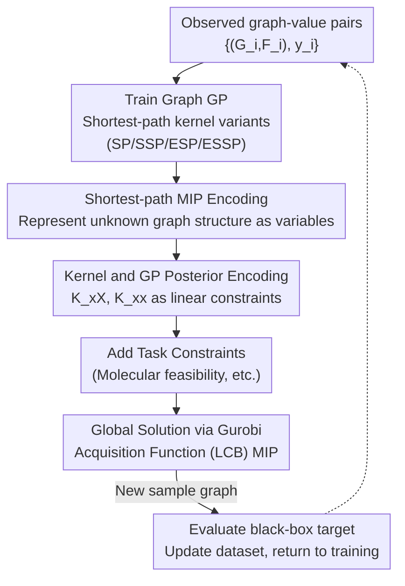

# BoGrape: Bayesian optimization over graphs with shortest-path encoded

**Conference**: ICLR2026  
**OpenReview**: [https://openreview.net/forum?id=g0EbJrKFQJ](https://openreview.net/forum?id=g0EbJrKFQJ)  
**Code**: To be confirmed  
**Area**: optimization  
**Keywords**: Bayesian optimization, Graph optimization, Shortest-path graph kernel, Mixed-integer programming, Molecular design

## TL;DR
BoGrape transforms the challenging task of "Bayesian optimization over the graph structure itself" into a Mixed-Integer Programming (MIP) problem. It precisely characterizes the shortest-path structure of an unknown graph using decision variables and encodes the shortest-path graph kernel along with the Gaussian Process (GP) posterior into the MIP. This allows for **global** optimization of the acquisition function and the integration of task constraints like molecular feasibility, outperforming existing graph BO methods on synthetic benchmarks and QM7/QM9 molecular design tasks.

## Background & Motivation
**Background**: Many scientific and engineering problems (molecular design, supply chains, sensor placement, neural architecture search) essentially involve optimizing an expensive black-box objective over a **graph**. Due to the black-box and expensive nature, gradient-based or evolutionary/population-based methods are inefficient; Bayesian Optimization (BO) is preferred for its sample efficiency. BO requires two components: a surrogate model for uncertainty modeling (typically a Gaussian Process, GP) and an acquisition function constructed from the GP posterior to select the next sample point. To apply BO to graphs, the standard approach is to equip the GP with a graph kernel.

**Limitations of Prior Work**: Graph optimization is categorized into (i) optimization **on nodes of a fixed graph** and (ii) optimization of the **graph structure itself** over the entire graph space. The latter is significantly harder as the structure constitutes combinatorial variables, yet it is what this paper addresses. Existing graph BO methods mostly fall into the first category: they either restrict the search space to specific sub-classes (fixed graphs, directed labeled graphs, etc.) or rely on task-specific similarity metrics, lacking a general framework. More critically, the optimization of the acquisition function is problematic: since graph spaces contain both continuous (node features) and discrete (graph structure) variables, existing methods rely on evolutionary algorithms or random sampling. These fail to: (i) effectively explore the entire search domain, (ii) embed task-specific constraints, and (iii) guarantee the global optimum of the acquisition function (on which BO convergence proofs rely).

**Key Challenge**: There is a lack of a unified representation for graph BO that can both express arbitrary connected graph structures and transform acquisition optimization into a globally solvable problem. While GNNs as surrogates can be encoded into MIP, they require large amounts of data, yield massive MIP models, and do not inherently provide uncertainty estimates, making them unsuitable for graph BO surrogates.

**Goal**: (1) Provide an exact representation of **unknown** graph structures and node attributes suitable for mathematical programming; (2) Encode the graph kernel and GP posterior as constraints to turn acquisition function optimization into a globally solvable MIP; (3) Ensure the framework is naturally compatible with task constraints.

**Key Insight**: The authors observe that shortest-path (SP) graph kernels are versatile—handling directed/undirected graphs, considering node labels, and characterizing relationships between non-adjacent nodes—making them more general than subgraph-pattern-based kernels. Recent progress in encoding trained ML models as MIP constraints (GPs, trees, and NNs) provides a paradigm for embedding surrogates into decision problems. By encoding the "shortest-path structure of an unknown graph" as MIP constraints, a complete optimization pipeline can be established.

**Core Idea**: The paper introduces a set of decision variables characterizing the existence of shortest paths, their lengths, and the nodes they traverse. It proves that the feasible region of these variables corresponds one-to-one with "all $n$-node connected graphs." By expressing the shortest-path graph kernel and GP posterior as linear or tractable expressions of these variables, acquisition function optimization becomes a mixed-integer programming problem.

## Method

### Overall Architecture
BoGrape follows the standard BO loop but replaces the "acquisition function optimization" step with solving an MIP. In each iteration: (1) A graph GP (with kernel parameters $\alpha, \beta, \sigma_k^2$ learned via fitting) is trained on the current dataset $X=\{(G_i,F_i),y_i\}$; (2) The acquisition function (primarily LCB in the paper) along with the GP posterior mean/variance are formulated as the objective and constraints; (3) Crucially, the "next graph $x=(G,F)$ to be sampled" is treated as a decision variable, using shortest-path encoding constraints and graph kernel constraints to represent $K_{xX_i}$ and $K_{xx}$, and adding task-specific constraints (e.g., molecular feasibility); (4) The resulting MIP is solved globally using Gurobi to output the next graph $(G_t,F_t)$ for evaluation.

### Key Designs

**1. Four Shortest-path Graph Kernel Variants: A Spectrum of Expressivity and Optimizability**

The authors derive four variants from the classic SP kernel to balance different needs. The **SP** kernel compares node labels and shortest distances. The **SSP** (Simplified SP) kernel decouples labels, comparing only the distribution of shortest path lengths ($k_{SSP}=\frac{1}{n_1^2 n_2^2}\sum \mathbb{1}(d_{u_1,v_1}=d_{u_2,v_2})$), with label information handled by a separate feature kernel. **ESP** and **ESSP** are non-linear versions obtained by taking the exponent of SP and SSP respectively ($k_{ESP}=\exp(k_{SP})/\sigma_k^2$), similar to RBF/Matérn kernels, providing better uncertainty quantification at the cost of higher optimization complexity.

**2. Encoding Shortest Paths of Unknown Graphs as MIP Constraints: Core Technical Contribution**

For a given number of nodes $n$, those authors introduce three sets of variables: edge existence $A_{u,v}\in\{0,1\}$, shortest distance $d_{u,v}\in[n]$, and an indicator $\delta^w_{u,v}\in\{0,1\}$ for whether node $w$ lies on the $u\to v$ shortest path. Inspired by Floyd–Warshall, linear constraints (MIP-SP) are formulated: if adjacent, distance $\le 1$; if not, distance $\ge 2$ ($d_{u,v}\le 1+n(1-A_{u,v})$ and $d_{u,v}\ge 2-A_{u,v}$); and the triangle equality $d_{u,v}=d_{u,w}+d_{w,v}$ linked via $\delta$ and big-M notation. 

The **Bijection Theorem** (Theorem 3.5) proves that for any $n$, every solution $(A,d,\delta)$ in the MIP-SP feasible region uniquely corresponds to an $n$-node connected graph. This ensures the solver searches exactly within the space of valid connected graphs.

**3. Encoding Kernel and GP Posterior as Constraints**

To express $K_{xX_i}=k(x,X_i)$ as a function of shortest-path variables, indicator variables $d^s_{u,v}=\mathbb{1}(d_{u,v}=s)$ are introduced for SSP/SP. Since $D_s(G_i)$ (the count of paths of length $s$ in the **known** graph $G_i$) is a constant, the kernel value becomes linearized. For the non-stationary (exponential) kernels ESP/ESSP, additional layers of indicators are used to linearize the quadratic forms in $K_{xx}$, and Gurobi’s dynamic outer approximation handles the exponential terms. This formulation allows the acquisition function (e.g., LCB: $\min\ \mu-\beta_t^{1/2}\sigma$) to be solved as a mixed-integer quadratic program (MIQP).

**4. Native Compatibility with Task Constraints**

In molecular design, graph structures must satisfy chemical constraints (e.g., valency). While evolutionary/sampling methods struggle to generate valid candidates, BoGrape embeds these as linear constraints directly into the MIP, ensuring every proposed candidate is a valid molecule.

## Key Experimental Results

Experiments used GNNs (GAT/GCN/GraphSAGE) as synthetic black-box functions and property predictors for QM7/QM9 molecular design.

### Main Results

| Task | Setting | Baselines | BoGrape Results |
|------|------|----------|--------------|
| Synthetic Benchmark | $N\in\{10,20\}$, 10 init + 50 iterations | Random, RW-rand, WL-rand, WL-evol | All four kernel variants outperformed baselines in most scenarios. |
| Molecular Design | QM7 / QM9, $N\in\{10,20,30\}$ | Random, RW/WL-rand (WL-evol failed to produce valid candidates) | Outperformed baselines significantly across all kernels. |

### Key Findings
- **Expressivity vs. Optimization Complexity**: SP/ESP perform better on smaller graphs due to higher expressivity. On larger graphs, simpler kernels (SSP/ESSP) often yield better results within a fixed time budget because the resulting MIP is easier for the solver.
- **Task Constraints are a Watershed**: In molecular design, structural constraints make sampling/evolutionary methods almost incapable of producing feasible solutions. BoGrape's ability to embed constraints into the MIP is essential for such tasks.
- **Global Optimality**: Using MIP ensures the acquisition function is globally optimized, satisfying the theoretical assumptions of BO convergence.

## Highlights & Insights
- **The Bijection Theorem**: It formalizes graph searching by proving the MIP-SP feasible region is equivalent to the space of valid connected graphs.
- **Symmetric Encoding**: The duality where shortest paths are constants for known graphs and decision variables for unknown graphs allows for the linearization of the graph kernel.
- **Constraint Integration**: The framework turns "optimization with constraints" from a burden into a structural advantage by using an MIP solver.

## Limitations & Future Work
- **Computational Cost**: As graph size increases, the MIP complexity grows rapidly, requiring the use of simpler kernels to maintain solvability within time limits.
- **Connectivity Assumption**: The current encoding requires connected graphs; relaxing this is an area for future work.
- **Undirected Focus**: While the theory supports directed graphs, the implementation focuses on undirected cases.
- **Benchmarking**: The black-box functions are synthetic (GNNs); more diverse real-world benchmarks could further validate the method.

## Related Work & Insights
- **vs. WL-evol**: WL-evol uses the WL kernel and evolutionary algorithms. BoGrape out-performs it on constrained tasks where evolutionary methods fail to generate valid candidates.
- **vs. Fixed-graph BO**: Previous methods optimize over nodes; BoGrape optimizes the graph structure itself.
- **vs. GNN-as-surrogate MIP**: GNN surrogates result in much larger MIPs and lack uncertainty quantification; BoGrape’s use of GP provides both uncertainty and a more manageable MIP.

## Rating
- Novelty: ⭐⭐⭐⭐⭐ 
- Experimental Thoroughness: ⭐⭐⭐⭐ 
- Writing Quality: ⭐⭐⭐⭐ 
- Value: ⭐⭐⭐⭐⭐ 

<!-- RELATED:START -->

## Related Papers

- [\[ICLR 2026\] Combinatorial Bandit Bayesian Optimization for Tensor Outputs](combinatorial_bandit_bayesian_optimization_for_tensor_outputs.md)
- [\[ICLR 2026\] Adaptive Acquisition Selection for Bayesian Optimization with Large Language Models](adaptive_acquisition_selection_for_bayesian_optimization_with_large_language_mod.md)
- [\[ICLR 2026\] Unleashing LLMs in Bayesian Optimization: Preference-Guided Framework for Scientific Discovery](unleashing_llms_in_bayesian_optimization_preference-guided_framework_for_scienti.md)
- [\[ICLR 2026\] Symmetry-Aware Bayesian Optimization via Max Kernels](symmetry-aware_bayesian_optimization_via_max_kernels.md)
- [\[ICLR 2026\] Generative Bayesian Optimization: Generative Models as Acquisition Functions](generative_bayesian_optimization_generative_models_as_acquisition_functions.md)

<!-- RELATED:END -->
