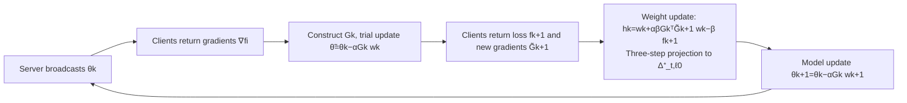

# Byzantine-Robust Federated Learning with Learnable Aggregation Weights

**Conference**: ICLR 2026  
**OpenReview**: [https://openreview.net/forum?id=lXSrulux48](https://openreview.net/forum?id=lXSrulux48)  
**Code**: To be confirmed  
**Area**: optimization  
**Keywords**: Federated Learning, Byzantine-robust, adaptive aggregation weights, alternating minimization, convergence analysis, data heterogeneity  

## TL;DR
The paper reformulates the discrete decision of "detecting and removing malicious clients" into a continuous optimization of aggregation weights $w$. By jointly solving this with the global model $\theta$, the authors propose FedLAW—a federated learning framework that suppresses Byzantine clients while adaptively re-weighting honest clients in data-heterogeneous scenarios, backed by provable robustness and convergence guarantees.

## Background & Motivation
- **Background**: Federated Learning (FL) enables clients to collaboratively train a global model without sharing raw data. FedAvg aggregates client updates using weights proportional to data volume. However, malicious (Byzantine) clients can submit arbitrary updates to sabotage the model. Existing robust aggregation methods fall into three categories: distance-based (Krum), statistics-based (Median, Trimmed Mean, Bulyan), and performance-based, all focusing on identifying and then excluding outlier updates.
- **Limitations of Prior Work**: The authors observe that almost all existing Byzantine-robust methods assign **uniform weights** to the remaining honest clients after exclusion (degenerating to a FedAvg-style approach). In non-independent and identically distributed (non-IID) scenarios, excluding malicious clients further exacerbates the label/data distribution imbalance among honest clients. Uniform weighting fails to adapt to this imbalance, leading to insufficient attention to certain labels and degraded accuracy.
- **Key Challenge**: In heterogeneous settings, the "benign update bias" caused by data heterogeneity is difficult to distinguish from "poisoned updates" from malicious clients. Furthermore, the "exclusion followed by uniform weighting" paradigm lacks the capability to compensate for distribution imbalance and decouples the robust defense from the training objective.
- **Goal**: Embed Byzantine defense directly into the learning objective itself, allowing aggregation weights to both suppress malicious clients to zero and adaptively assign non-uniform weights to honest clients based on their data distributions.
- **Core Idea**: **[Transforming discrete detection into continuous weight optimization]** Aggregation weights $w$ are treated as decision variables co-equal to the global model $\theta$. Both are learned jointly within an optimization problem constrained by a sparse-unit-capped simplex. The problem is solved via alternating minimization, providing theoretical guarantees for both robustness and convergence.

## Method

### Overall Architecture
FedLAW reformulates the "fixed weights + post-hoc exclusion" of traditional FL into a joint optimization problem: minimize $\sum_i w_i f_i(\theta)$ over the weight feasible region $\Delta^+_{t, \ell_0}$ (a unit simplex that is sparse, non-negative, and has a per-element upper bound $t$, where the number of non-zero elements is $\le s$). A **nested alternating minimization** strategy is employed: the inner loop performs a single model gradient descent step for fixed weights, while the outer loop updates the weights based on how they affect the model update. Weight updates are performed via a quadratic approximation of the non-convex objective followed by a projection onto the sparse simplex, while model updates remain consistent with standard FL.

### Key Designs

**1. Sparse Unit-Capped Simplex: Coding removal and capping into constraints.** The feasible region is defined as $\Delta^+_{t,\ell_0}=\{w\mid \sum_i w_i=1,\ w_i\ge 0,\ w_i\le t,\ \|w\|_0\le s\}$. The $\ell_0$ pseudo-norm constraint $\|w\|_0\le s$ forces the retention of at most $s$ non-zero weights, effectively embedding the "exclude at most $n-s$ clients (including Byzantine ones)" rule into the constraints. The individual weight cap $t$ prevents any single client from dominating the aggregation. A notable special case is when $t=1/(n-b_f)$ and $s=n-b_f$; the unique feasible solution is then "exclude $b_f$ clients and weight the rest uniformly," meaning existing methods are included as special cases of this framework. Relaxing $t$ allows for non-uniform weighting of honest clients, providing the degrees of freedom required for heterogeneous scenarios.

**2. Nested Reformulation + Quadratic Approximation: Making weights "aware" of their impact on model updates.** Unlike standard alternating algorithms like BSUM or prox-linear (which the authors found to be too aggressive, ignoring useful coupling for detection), the problem is rewritten in a nested form: $\min_{w}\min_{\theta}\sum_i w_i f_i(\theta)$. The inner layer uses a quadratic approximation $\hat f_i(\theta;\theta_k)=f_i(\theta_k)+\langle\nabla f_i(\theta_k),\theta-\theta_k\rangle+\frac{1}{2\alpha}\|\theta-\theta_k\|^2$, yielding $\theta_{k+1}(w)=\theta_k-\alpha G_k w$, where $G_k=[\nabla f_1(\theta_k),\dots,\nabla f_n(\theta_k)]$. Crucially, the outer objective $\Phi_k(w)=\sum_i w_i f_i(\theta_k-\alpha G_k w)$ **explicitly substitutes the weight's effect on the model update into the loss**: it prioritizes clients whose gradients align with the descent direction—honest client gradients form coherent clusters in the parameter space, while Byzantine clients are naturally suppressed as outliers due to divergence or inconsistency.

**3. Three-Step Projection to Non-convex Sparse Simplex (Theorem 1): Efficient and exact weight updates.** Since the outer layer is non-convex, the authors apply another quadratic approximation to $\Phi_k$, making the weight update equivalent to a proximal mapping $w_{k+1}=\mathrm{prox}_{\Delta^+_{t,\ell_0}}(h_k)$, which projects $h_k=w_k-\beta\nabla_w\Phi_k(w_k)$ onto the non-convex set $\Delta^+_{t,\ell_0}$. Theorem 1 proves that this projection can be completed **exactly** in three steps: (i) Sparsification—select the $s$ largest elements of $h_k$ as $h_\lambda=P_{L_s}(h_k)$; (ii) Support selection $S^*=\mathrm{supp}(h_\lambda)$; (iii) Projection onto the unit-capped simplex on the support set $w_{k+1}^{S^*}=P_{\Delta^+_t}(h_\lambda^{S^*})$, with others set to zero. The server-side overhead for weight updates is $O(dn)$ in memory and $O(n\min(s,\log n)+s^2)$ in computation. Model updates are identical to standard FL, with the only extra communication being two rounds per iteration (though total rounds may not double as $w$ can accelerate convergence).

**4. Dual Theoretical Guarantees: Linking Robustness (Theorem 2) and Convergence (Theorem 3).** The Byzantine-resilience analysis begins by reformulating the objective (6) into a quadratic form $w^\top G_k^\top G_k w$ using Taylor's theorem with an exact remainder. By analyzing pairwise gradient distances, the authors prove high-probability robustness where the aggregator bias $\|\mathbb{E}\{\tilde F\}-g\|\le\eta_k$, with $\eta_k$ decomposed into loss heterogeneity, gradient heterogeneity, inter-client variance, and mini-batch sampling noise. Theorem 3 further proves that even under attack, the adaptive weight sequence stabilizes to a critical point of objective (6). The algorithm converges to a neighborhood of the optimal solution in both non-convex and strongly convex cases, with the error radius determined by the aggregator's asymptotic bias and variance $(\zeta_\infty,\sigma_{F,\infty})$, where $\zeta_\infty\le\eta_\infty$. This unified mechanism defines both "stepwise robustness" and "long-term convergence bias."

## Key Experimental Results

### Main Results (MNIST / CIFAR10, 200 Clients, non-IID)
- **Datasets & Models**: MNIST (3-layer MLP), CIFAR10 (4-layer CNN with group norm). Heterogeneity controlled by concentration parameter $q\in\{0.6,0.9\}$; malicious client ratio $\in\{0.1,0.2,0.3,0.4\}$.
- **Attack Types (5 total)**: label-flipping, inverse-gradient, backdoor, double (combination), and LIE (Little Is Enough).
- **Baselines**: Krum, Trimmed Mean, Bulyan, Coordinate-wise Median, CCLIP, RFA, Huber Aggregator, along with their Bucketing combinations, and undefended FedAvg.

| Scenario | FedLAW (Ours) | Best Baseline | Gain |
|------|--------|----------|------|
| MNIST, inverse-gradient, 40% malicious | — | Second-best | **+3.6** pp |
| CIFAR10, label-flipping, $q{=}0.6$, 40% malicious | **70.5%** | Bulyan 62.2% | **+8.3** pp |
| CIFAR10, inverse-gradient, $q{=}0.9$, 40% malicious | **59.38%** | 56.24% | **+3.1** pp (RFA/CClip diverged) |
| MNIST, double attack, high heterogeneity | Robust | RFA variants dropped >31% | Significant |

### Key Findings
- **Superiority under Extreme Contamination**: The higher the ratio of malicious clients and the greater the heterogeneity, the more pronounced FedLAW's advantage becomes. While many baselines (RFA, CClip, and their bucketing variants) degrade sharply or diverge as attacks increase, FedLAW exhibits "graceful degradation" and maintains stable accuracy across attack ratios.
- **Fast Weight Convergence**: Aggregation weights $w$ typically stabilize within the first 20 rounds; subsequent updates have negligible impact. The weights of malicious clients are consistently suppressed near zero, providing empirical evidence for $\zeta_k\to 0$.
- **Dual-Action Mechanism**: Robustness stems from (i) identifying and excluding malicious clients and (ii) adaptively re-weighting the remaining honest clients—the latter being the missing piece in the traditional "exclude then weight uniformly" paradigm.

## Highlights & Insights
- **Paradigm Shift**: Recasting "discrete detection-exclusion" as "continuous weight optimization" makes existing "uniform weighting after exclusion" methods a special case of this framework ($t=1/(n-b_f), s=n-b_f$), providing conceptual elegance.
- **Coupling is Key**: The outer objective explicitly incorporates how weights alter the model update $\theta_k-\alpha G_k w$, making the weight optimization naturally favor honest gradient clusters that align with the descent direction without needing extra detectors.
- **Theoretical Closure**: The robustness bound $\eta_k$ and convergence bias $\zeta_\infty\le\eta_\infty$ are locked by the same quantity. This unifies the aggregator's static robustness with the algorithm's dynamic convergence, covering more realistic settings like non-IID, mini-batch, and high probability.
- **Engineering Friendly**: Extra server-side overhead is limited to a single sparse simplex projection ($O(n\min(s,\log n)+s^2)$). The model updates match standard FL, and assumptions like $\ell_2$ clipping are already standard practice in FedAvg/DP-Fed.

## Limitations & Future Work
- **Two Communication Rounds per Epoch**: FedLAW requires two communication rounds per training epoch (collecting gradients, then collecting losses and new gradients at trial points). While total rounds may not double due to accelerated convergence, this remains an extra cost in communication-constrained scenarios.
- **Cross-Silo Focus**: The method is designed for cross-silo scenarios (hospitals, financial institutions) with a moderate number of clients that are mostly online. Large-scale cross-device scenarios with frequent client dropout/sampling have not been fully validated.
- **Experimental Scale**: Validation was performed on MNIST/CIFAR10 with shallow networks. It has not yet been tested on large models, complex tasks, or real-world heterogeneous datasets. The attack model assumes norm-boundedness $\|b_{k,i}\|\le\max_j\|\tilde v_{k,j}\|$ (ensured via server-side clipping); performance under stronger or adaptive attacks remains to be explored.
- **Hyperparameter Sensitivity**: The choice of sparsity $s$, cap $t$, and learning rates $\alpha, \beta$ significantly impacts the robustness-accuracy trade-off. Sensitivity analysis is provided in Appendix I, but tuning is required for deployment.

## Related Work & Insights
- **Three Schools of Robust Aggregation**: Distance-based, statistics-based, and performance-based. This paper highlights their shared blind spot: "uniform weighting after exclusion," and introduces label imbalance compensation in heterogeneous settings as a new dimension.
- **CCLIP / RFA / Bucketing / Huber**: As strong baselines for heterogeneous robust FL, this paper demonstrates their degradation or divergence under high heterogeneity and contamination, emphasizing the value of adaptive re-weighting.
- **Nested/Bilevel Optimization and Proximal Projection**: Treating weights as decision variables and using nested reformulation to avoid the "over-aggressive updates" of BSUM/prox-linear, combined with exact three-step projection for non-convex sparse simplexes, is a technique transferable to other "soft selection" problems like client selection, data weighting, or robust regression.
- **Insight**: When "hard exclusion of outliers" risks losing useful information, "relaxing discrete selection into continuous learnable weights embedded in the objective" often balances robustness and adaptability—a strategy applicable to learning from noisy labels and Mixture-of-Experts routing.

## Rating
- **Novelty**: ⭐⭐⭐⭐ Recasting Byzantine detection-exclusion as continuous weight optimization while including existing paradigms as special cases is novel and self-consistent.
- **Experimental Thoroughness**: ⭐⭐⭐ Covers 5 attacks across 2 datasets with varying heterogeneity/contamination and rich baselines. However, it is limited to small datasets and shallow networks, lacking large-scale validation.
- **Writing Quality**: ⭐⭐⭐⭐ The motivation is clear, and the methodological derivation (nested reformulation → quadratic approximation → three-step projection) is logical, with strong alignment between theory and experiments.
- **Value**: ⭐⭐⭐⭐ Offers stable and significant improvements over strong baselines in high-heterogeneity and high-contamination scenarios. With provable guarantees, it holds practical value for cross-silo robust FL.

<!-- RELATED:START -->

## Related Papers

- [\[ICML 2026\] Delayed Momentum Aggregation: Communication-efficient Byzantine-robust Federated Learning with Partial Participation](../../ICML2026/optimization/delayed_momentum_aggregation_communication-efficient_byzantine-robust_federated_.md)
- [\[ICLR 2026\] DeepAFL: Deep Analytic Federated Learning](deepafl_deep_analytic_federated_learning.md)
- [\[ICLR 2026\] Distributionally Robust Linear Regression with Block Lewis Weights](distributionally_robust_linear_regression_with_block_lewis_weights.md)
- [\[ICLR 2026\] Beyond Aggregation: Guiding Clients in Heterogeneous Federated Learning](beyond_aggregation_guiding_clients_in_heterogeneous_federated_learning.md)
- [\[ICLR 2026\] Unified Analyses for Hierarchical Federated Learning: Topology Selection under Data Heterogeneity](unified_analyses_for_hierarchical_federated_learning_topology_selection_under_da.md)

<!-- RELATED:END -->
