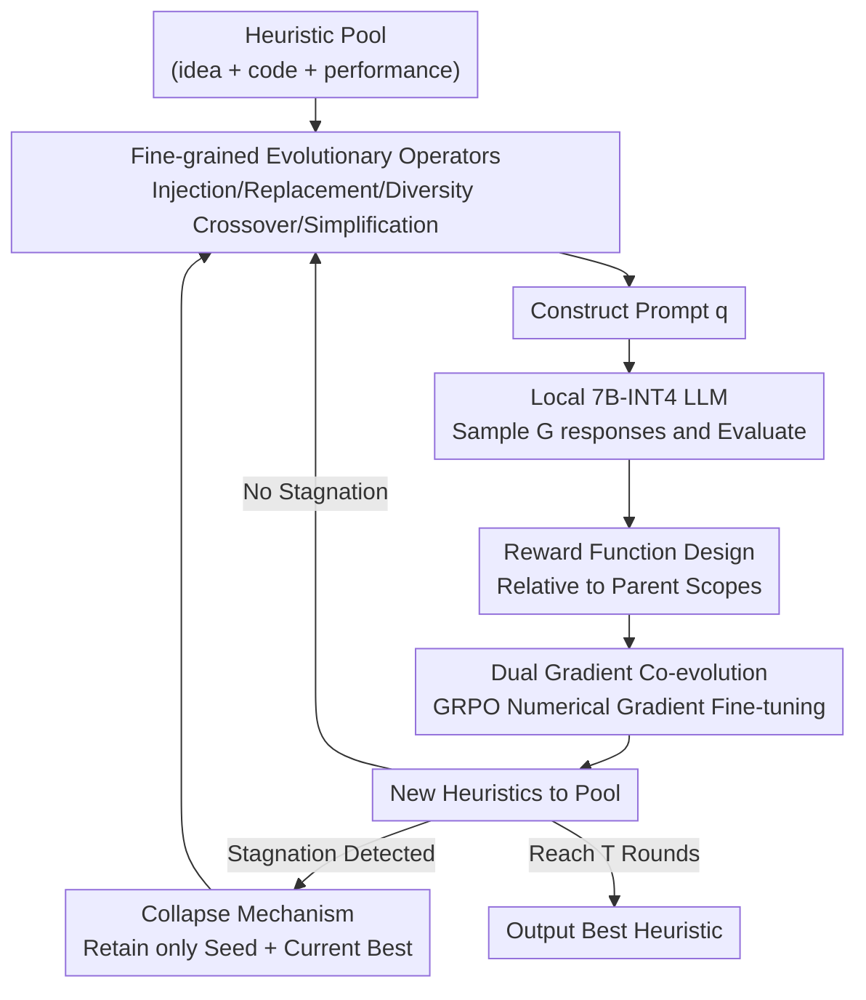

# CALM: Co-evolution of Algorithms and Language Model for Automatic Heuristic Design

**Conference**: ICLR2026  
**OpenReview**: [https://openreview.net/forum?id=x6bG2Hoqdf](https://openreview.net/forum?id=x6bG2Hoqdf)  
**Code**: https://github.com/whxru/CALM  
**Area**: Optimization / Automatic Heuristic Design / LLM  
**Keywords**: Automatic Heuristic Design, LLM evolutionary search, GRPO, Combinatorial Optimization, Co-evolution

## TL;DR
CALM enables the simultaneous evolution of "prompts for heuristic generation" and the "underlying LLM" itself. Within an LLM-driven evolutionary heuristic design loop, each "prompt-response-performance" triplet is treated as reinforcement learning data. A local 7B INT4 model is fine-tuned online using GRPO, allowing heuristics generated on a single 24GB GPU to outperform SOTA methods relying on the GPT-4o-mini API across multiple combinatorial optimization tasks.

## Background & Motivation
**Background**: Many practical optimization problems (logistics, scheduling, path planning) have long relied on expert-designed heuristics, which is labor-intensive. Recently, "LLM-based Automatic Heuristic Design (AHD)" has emerged, using LLMs as heuristic generators and Evolutionary Computation (EC) as a search framework. LLMs generate new candidates based on descriptions, code, and scores of current elite heuristics, which are then evaluated and fed back into the next round of prompts, forming an "evaluation-generation" feedback loop (e.g., FunSearch, EoH, ReEvo, MCTS-AHD).

**Limitations of Prior Work**: These methods almost exclusively **evolve prompts while freezing the model**. They guide heuristic evolution by manipulating the prompt generation process (termed "verbal gradient" by the authors), while the underlying LLM parameters remain fixed. This means the vast signals generated during the evolution loop regarding "which generation method is more effective" are wasted, and the LLM's own generative capability does not improve through feedback.

**Key Challenge**: The evolution loop naturally produces a continuous stream of "prompt-response-performance" triplets. The quality of each heuristic serves as an implicit supervisory signal for "whether the underlying generation process is useful." However, the fixed-model paradigm lacks a mechanism to digest these signals. Consequently, high-quality results can only be achieved by stacking stronger (and more expensive) commercial API models.

**Goal**: To upgrade AHD from "optimizing only prompts" to "simultaneously optimizing the prompt generation process and the LLM itself," achieved on the local small models to be both cost-effective and superior to APIs.

**Key Insight**: By treating heuristic generation as both an optimization target and a source of training data, reinforcement learning can be used to convert performance feedback into "numerical gradients" to fine-tune the LLM, allowing the model to gradually internalize the characteristics of "successful heuristics."

**Core Idea**: Utilizing a hybrid guidance of "verbal gradients (prompt modification) + numerical gradients (GRPO fine-tuning of the LLM)" to achieve **co-evolution** of algorithms and language models, rather than letting the model remain a passive observer while only the algorithms evolve.

## Method

### Overall Architecture
CALM maintains a heuristic pool where each heuristic is associated with three elements: a natural language idea, source code, and measured performance $g(h)=\mathbb{E}_{x\in D}[-f(h(x))]$. In each iteration, CALM selects an operator, constructs a new prompt $q$ using sampled heuristics, and the local LLM $\pi_\theta$ samples a set of $G$ responses for evaluation. The evaluation results are converted into rewards for online fine-tuning of the LLM via GRPO (the "numerical gradient"), and valid new heuristics are added to the pool. If the search stagnates, a collapse mechanism resets the population to escape local optima. After $T$ rounds, the historical best heuristic is returned.

The two new dimensions of this process are: **Operator level**, using fine-grained mutation and diversity-aware crossover for precise control; **Model level**, using GRPO and customized rewards to strengthen the LLM alongside the search. The co-evolution circuit is shown below:

### Key Designs

**1. Dual Gradient Co-evolution: Evolving the LLM alongside the search**

This is the fundamental differentiator of CALM. Previous methods only utilized "verbal gradients." CALM introduces "numerical gradients" by treating performance feedback as RL signals to fine-tune the LLM. Using GRPO (an efficient RL algorithm), for each prompt $q$, $G$ responses $\{o_i\}$ are sampled. Advantages for each token $\hat{A}_{i,t}=(r_i-\text{mean}(r))/\text{std}(r)$ are calculated based on relative rewards, and parameters are updated using $J_{GRPO}(\theta)$ with clipping and KL regularization. GRPO eliminates the value network, enabling fine-tuning of an INT4-quantized 7B model (tuning 1.15% of weights) on a single 24GB card. The LLM internalizes success traits, leading to sustained quality improvements.

**2. Fine-grained Evolutionary Operators: Precise control of mutation**

To help GRPO identify the contributions of specific structural changes, CALM uses specialized operators. **Injection** adds a new component to an existing heuristic and records a brief description in a global library to promote diversity. **Replacement** rewrites a specific component, such as changing instance-independent rules to instance-dependent ones. **Diversity-aware crossover** selects parents based on performance and a diversity metric defined as $\text{div}(h_{c,1},h)=|\text{idea\_token}(h)\setminus\text{idea\_token}(h_{c,1})|/|\text{idea\_token}(h)|$. **Simplification** compresses heuristics that become bloated through repeated operations; ablations show this operator is critical for countering "code bloat."

**3. Collapse Mechanism: Escaping local optima via probabilistic restarts**

To prevent "inbreeding" where the population is filled with minor variants of the current best, CALM employs a collapse mechanism. When stagnation is detected (multiple rounds without a global improvement), it discards all individuals except the "original seed" and the "current best." This is controlled by a counter $c_n$. If no improvement occurs, $c_n$ increases; collapse is triggered if $\text{random}(0,1)<c_n\delta_0$ or $c_n\ge C$, where $\delta_0\ll1$ and $C$ is a hard limit. The expected rounds before trigger is approximately $\mathbb{E}[c_n\mid \text{collapse},\,C>1/\delta_0]\approx\sqrt{\pi}/(2\delta_0)$.

**4. Reward Function Design: Credit assignment relative to parents**

Rewards are tiered: invalid responses < duplicate heuristics < new heuristics < high-performance heuristics. Crucially, the reward is calculated **relative to the best base heuristic $h_{t\_base}$** in the prompt: $\Delta(h_{new},h_{t\_base})=\text{clip}\big(|g(h_{new})-g(h_{t\_base})|/\min\{|g(h_{new})|,|g(h_{t\_base})|\},0,1\big)$. The final reward uses $\Delta$ to scale negative rewards for underperformance and grants positive rewards (starting from 1) for improvements. This strips away the "prompt bonus" and focuses on the LLM's marginal contribution.

### Loss & Training
The model is based on Unsloth, using Qwen2.5-7B-Instruct with INT4 quantization, fine-tuning 1.15% of weights on a single GPU. The objective is $J_{GRPO}(\theta)$ involving the clipping ratio $\hat{r}_{i,t}=\pi_\theta(o_{i,t}\mid q,o_{i,<t})/\pi_{\theta}^{old}(o_{i,t}\mid q,o_{i,<t})$ and KL penalty $\beta D_{KL}[\pi_\theta\|\pi_{ref}]$. A budget of 2000 LLM queries is used for most tasks.

## Key Experimental Results

### Main Results
Tasks include Online Bin Packing (OBP), Traveling Salesman Problem (TSP), Capacitated Vehicle Routing (CVRP), and Orienteering Problem (OP).

| Task | Metric | CALM (Local + GRPO) | Prev. SOTA LLM-AHD | Note |
|--------|------|------|----------|------|
| OBP (Avg. Gap) | gap↓ | **0.71%** | MCTS-AHD 0.89% | Reached 0.00% (exact) on 1k_500 |
| OBP (CALM API w/o GRPO) | gap↓ | 0.82% | > MCTS-AHD | Top-tier via verbal gradient alone |
| TSP N=200 (Out-of-domain) | gap↓ | **13.41%** | MCTS-AHD 13.71% | Outperforms POMO (20.45%) |
| CVRP N=200 | gap↓ | **3.95%** | MCTS-AHD 4.70% | Consistent lead |
| OP N=200 | gap↓ | **12.58%** | MCTS-AHD 16.34% | Large improvement |

Ours (local 7B + GRPO) effectively **outperforms** GPT-4o-mini-based methods.

### Ablation Study (OBP / OP optimality gap, lower is better)

| Configuration | OBP | OP | Note |
|------|---------|------|------|
| CALM (Local, w/ GRPO) | 0.71% | 17.41% | Full model |
| CALM (API, w/o GRPO) | 0.82% | 19.13% | Verbal gradient only |
| Local, w/o GRPO | 1.78% | 19.89% | Largest drop without RL |
| rew = performance | 1.24% | 21.30% | Performance-based reward is worse |
| w/o Collapse | 0.98% | 19.57% | - |
| w/o simplification | 1.35% | 19.45% | Simplification is vital |

### Key Findings
- **RL (GRPO) contribution**: Disabling GRPO leads to the most significant performance degradation, highlighting numerical gradients as the core engine.
- **Simplification is critical**: It is the only operator countering code bloat induced by others.
- **Diversity > Performance in crossover**: Performance-only parent selection is worse than no crossover at all.
- **Collapse tolerance**: Aggressive collapse configurations ($\delta_0=0.005$) perform poorly; patience is required.

## Highlights & Insights
- **Turning "by-products" into training data**: CALM is the first to realize that evolution triplets are excellent RL signals, unifying "algorithm evolution" and "model evolution."
- **Relative rewards**: By scoring relative to the parent heuristic, the framework isolates the LLM's marginal contribution from the quality of the input context.
- **Small model + RL > Large model API**: Demonstrates a cost-effective paradigm for AHD where quality is achieved through tuning rather than sheer scale.
- **Analytical Collapse**: Provides an expected-round estimate $\sqrt{\pi}/(2\delta_0)$ to make an engineering trick parameters-tunable.

## Limitations & Future Work
- **Domain limitation**: Experiments are limited to combinatorial optimization with fast simulators.
- **Execution dependency**: Assumes heuristics can be quickly executed and scored; expensive evaluation tasks may be budget-constrained.
- **Quantization loss**: INT4 quantization reduces base model precision; the gains partly involve recovering this lost precision through RL.
- **Hyperparameter sensitivity**: Reward and collapse parameters require careful tuning.

## Related Work & Insights
- **vs. Fixed-model AHD (FunSearch, MCTS-AHD)**: CALM adds numerical gradients and local fine-tuning, outperforming them while reducing costs.
- **vs. EvoTune (DPO-based tuning)**: CALM uses score-based RL (GRPO) with a relative reward design which proves superior to standard performance-based rewards.
- **vs. Neural Combinatorial Optimization (POMO)**: CALM generalizes better across scales by evolving algorithmic structures rather than end-to-end policies.

## Rating
- Novelty: ⭐⭐⭐⭐⭐ First to unify prompt evolution and online LLM tuning in AHD.
- Experimental Thoroughness: ⭐⭐⭐⭐ Extensive tasks and ablations, though focused on classical CO.
- Writing Quality: ⭐⭐⭐⭐⭐ Clear motivations and solid analytical derivations for the collapse mechanism.
- Value: ⭐⭐⭐⭐⭐ Provides a superior and resource-efficient paradigm for automatic heuristic design.

<!-- RELATED:START -->

## Related Papers

- [\[ICML 2026\] PathWise: Planning through World Model for Automated Heuristic Design via Self-Evolving LLMs](../../ICML2026/optimization/pathwise_planning_through_world_model_for_automated_heuristic_design_via_self-ev.md)
- [\[ICLR 2026\] AutoEP: LLMs-Driven Automation of Hyperparameter Evolution for Metaheuristic Algorithms](autoep_llms-driven_automation_of_hyperparameter_evolution_for_metaheuristic_algo.md)
- [\[ICML 2026\] Automatic Unsupervised Ensemble Outlier Model Selection–Extended Version](../../ICML2026/optimization/automatic_unsupervised_ensemble_outlier_model_selection--extended_version.md)
- [\[ICLR 2026\] Generalizable Heuristic Generation Through LLMs with Meta-Optimization](generalizable_heuristic_generation_through_llms_with_meta-optimization.md)
- [\[AAAI 2026\] Co-Layout: LLM-driven Co-optimization for Interior Layout](../../AAAI2026/optimization/co-layout_llm-driven_co-optimization_for_interior_layout.md)

<!-- RELATED:END -->
