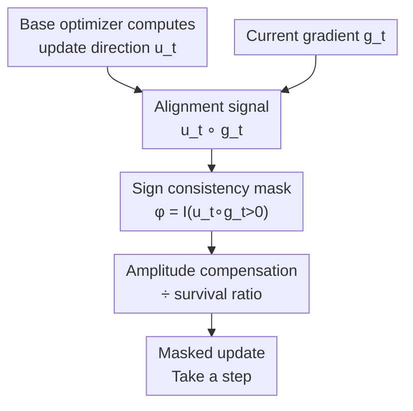

# Cautious Optimizers: Improving Training with One Line of Code

**Conference**: ICLR 2026  
**OpenReview**: [https://openreview.net/forum?id=zBPZeRjfgu](https://openreview.net/forum?id=zBPZeRjfgu)  
**Code**: To be confirmed  
**Area**: Optimizers / LLM Pre-training  
**Keywords**: Momentum optimizers, sign consistency mask, Hamiltonian dynamics, monotonic descent, AdamW

## TL;DR
Add a single line of code to any momentum optimizer: only update coordinates where the "update direction" and "current gradient" share the same sign; otherwise, zero out the update for those coordinates and scale up others proportionally. This yields "cautious" versions like C-AdamW / C-Lion, which consistently accelerate LLM pre-training and image classification without modifying original hyperparameters.

## Background & Motivation
**Background**: For nearly a decade since its introduction, Adam / AdamW has been the default optimizer for Transformer pre-training. The community continuously attempts faster and more stable alternatives—Lion, SHAMPOO, SOAP, ADOPT, Schedule-Free, etc.—each claiming significant improvements over AdamW.

**Limitations of Prior Work**: To achieve promised gains, these new optimizers often require non-trivial hyperparameter re-tuning (especially learning rate and momentum coefficients). This high tuning cost limits their adoption—most practical training still relies on AdamW because the risk and engineering cost of switching optimizers are too high.

**Key Challenge**: The update direction $u_t$ of momentum-based optimizers does not always align with the current gradient $g_t = \nabla L(w_t)$. Momentum possesses "inertia," causing parameters to continue along historical directions even if that direction temporarily increases the loss at the current moment. Consequently, the loss $L(w_t)$ is **not monotonically decreasing** along the trajectory, leading to oscillations and overshooting that slow down convergence.

**Goal**: Is it possible to eliminate these "anti-gradient" wasteful actions to make training more stable and faster **without changing original hyperparameters**, increasing memory, or adding significant computation?

**Key Insight**: The authors noticed that the coordinates doing more harm than good are precisely those where $u_t$ and $g_t$ have opposite signs—updating on these coordinates increases the loss in that direction. Therefore, one should simply **avoid moving in those coordinates**. This observation can be implemented as an element-wise mask without touching the internal states of the optimizer.

**Core Idea**: Construct an alignment mask using $u_t \circ g_t > 0$, zeroing out updates for coordinates with sign inconsistency and then scaling the remaining updates by the survival ratio. This can be implemented in a single line of PyTorch, transforming any momentum optimizer into a "cautious" version. Theoretically, this preserves the convergence guarantees of the original optimizer while additionally ensuring monotonic loss descent.

## Method

### Overall Architecture
A Cautious Optimizer is not a new optimizer but a **post-processing layer** wrapped around any momentum optimizer. The base optimizer calculates its update direction $u_t$ as usual (e.g., Adam, Lion, Polyak/Nesterov momentum). The cautious layer performs three steps: ① Calculate the alignment signal $u_t \circ g_t$ via element-wise multiplication; ② Retain updates for positive (aligned) coordinates and zero out negative (misaligned) ones to form the mask $\phi_t = \mathbb{I}(u_t \circ g_t > 0)$; ③ Since masking reduces the total step magnitude, compensate by scaling the learning rate by the survival ratio of coordinates before taking the final step.

The core modification replaces the original update $w_{t+1} \leftarrow w_t - \epsilon_t u_t$ with:

$$w_{t+1} \leftarrow w_t - \epsilon_t \, u_t \circ \phi(u_t \circ g_t),$$

where $\circ$ denotes the element-wise product. The minimalist PyTorch implementation (Algorithm 1) first computes the alignment mask `m = (u * g > 0)`, then performs `p.add_(u * m / (m.mean() + eps), alpha=-lr)`, where `m.mean()` represents the survival ratio used for amplitude compensation.

### Key Designs

**1. Sign Consistency Mask: Update only on coordinates with aligned signs**

This step directly addresses momentum-induced anti-gradient overshooting. For each coordinate $i$, the signs of $u_t$ and $g_t$ are compared: if they are consistent ($u_{t,i} g_{t,i} > 0$), moving in this direction reduces loss, so it is kept; if inconsistent, momentum inertia is pushing parameters toward higher loss, so it is zeroed out. Formally, the mask $\phi(v) = \mathbb{I}(v > 0)$ acts on $v = u_t \circ g_t$. The inner product of the modified update and the gradient is non-negative, and from the first-order Taylor expansion:

$$L(w_{t+1}) - L(w_t) \approx -\epsilon_t \, (u_t \circ g_t)^\top \phi(u_t \circ g_t) \le 0,$$

ensuring **monotonic descent** for sufficiently small step sizes—a property standard momentum methods cannot guarantee even with infinitesimal steps. Crucially, it only reads signs and does not modify internal first/second-order momentum states, making it "zero-intrusion."

**2. Amplitude Compensation: Scaling step size by survival ratio**

Simply zeroing out coordinates would have a side effect: the more coordinates masked, the smaller the actual total update magnitude, effectively shrinking the learning rate. The authors introduce a positive scaling factor $\alpha$ to compensate:

$$\alpha(v) = \frac{\dim(v)}{\mathrm{nnz}(v > 0) + \xi},$$

where $\dim(\cdot)$ is the total number of coordinates, $\mathrm{nnz}(v > 0)$ is the number of surviving (aligned) coordinates, and $\xi > 0$ defaults to $1$. Intuitively, $\alpha$ is "total / survived," providing larger compensation when fewer coordinates survive to maintain the original average update magnitude. In C-AdamW (Algorithm 2), this is implemented by multiplying the learning rate by $\frac{d}{\|\phi_t\|_0 + 1}$. This compensation is the engineering key to making the cautious version usable without re-tuning the original optimizer's learning rate.

**3. Hamiltonian + Descent Guarantees: Preserving convergence while reducing loss**

The authors unify common momentum methods into a continuous-time "damped Hamiltonian system" framework: there exists a Lyapunov / Hamiltonian function $H(w,s) = L(w) + K(s)$, where $L$ is potential energy (loss) and $K$ is kinetic energy from momentum, satisfying $\min_s H(w,s) = L(w)$. The original system only guarantees $H$ is non-increasing, while $L$ itself can rise temporarily. Theorem 2.1 proves that after re-weighting the update direction $\nabla K(s)$ by $\phi(\nabla L \circ \nabla K)$, as long as $\phi$ satisfies $x^\top \phi(x) \ge 0$, then $\frac{d}{dt}L(w_t) \le 0$ (monotonic descent for $L$). Furthermore, if $x^\top(1 - \phi(x)) \le 0$, both $H$ and $L$ decrease faster than in the original system. The default mask $\phi(v) = \alpha(v)\mathbb{I}(v \ge 0)$ ($\alpha \ge 1$) satisfies these conditions. Corollary 2.2 also shows the algorithm does not get stuck at non-stationary points because momentum continues to accumulate gradients; even if $u_t$ is fully masked one step, it will eventually rotate to have a positive inner product with $g_t$.

**4. Discrete-time Advantages and a Family of New Optimizers**

Beyond continuous time, the authors prove that the cautious version is "at least as good as the base" in discrete time. Theorem 2.3: Under $\mu$-smooth loss, starting from the same point $(w_t, s_t)$, there exists a step size range such that $L(w_{t+1}) \le L(\bar w_{t+1})$ (cautious version decreases loss more). Theorem 2.4 provides a stricter class of masks $\phi_k = \alpha_k \mathbb{I}(\nabla L \circ u_k \ge \frac{\mu\sigma}{2} u_k \circ u_k)$ that guarantees strict loss reduction. The authors honestly note that multi-step dominance does not generally hold (optimizers diverge to different regions after one step), consistent with "no free lunch" theorems; however, in deep learning, single-step advantages typically persist, as evidenced by experiments. More importantly, multiple $\phi$ choices satisfy condition (6), revealing an entire **family** of cautious optimizers, of which the simplest (hard mask + ratio compensation) was tested.

### Example: Comparison on 2D Quadratic Function
Consider $L(w) = \kappa w_1^2 + w_2^2$ ($\kappa = 4$, optimum at origin), starting from $(1,1)$. Standard Gradient Descent with Momentum (GDM), even with optimal $(\epsilon, \beta)$, exhibits overshooting and oscillating loss. Cautious GDM (C-GDM) with identical hyperparameters yields a smoother trajectory with less overshooting, monotonic descent of $L(w_t)$, and faster Hamiltonian reduction. The authors plotted convergence rate heatmaps over the $(\epsilon, \beta)$ grid: optimal rates for all cautious variants are lower than the GDM closed-form optimal $\frac{\sqrt\kappa-1}{\sqrt\kappa+1}$, and the mask makes convergence more robust when hyperparameters are suboptimal.

## Key Experimental Results

### Main Results
**LLaMA-100M Pre-training on C4** (batch size 2M tokens, 50B tokens total, ~25× Chinchilla). Final evaluation perplexity (lower is better):

| Optimizer | Best lr | Perplexity | Cautious Version | Perplexity |
|-----------|---------|------------|------------------|------------|
| AdamW     | 1e-2    | 18.965     | C-AdamW          | **18.684** |
| Lion      | 3e-4    | 21.401     | C-Lion           | **19.795** |

The cautious version is generally superior across learning rates and does not change the optimal hyperparameter point of the base optimizer. In Lion experiments, C-Lion even tolerated higher learning rates where the baseline diverged.

**Scaling on FineWeb-Edu (1× Chinchilla, per-scale hyperparameter tuning)**:

| Scale | AdamW | C-AdamW | Gain (%) |
|-------|-------|---------|----------|
| 130M  | 27.39 | 27.30   | 0.33     |
| 300M  | 18.30 | 18.28   | 0.10     |
| 520M  | 15.07 | 14.92   | 1.00     |
| 1.2B  | 11.36 | 11.32   | 0.32     |

C-AdamW consistently outperformed AdamW at all scales. In 7 downstream evaluations for the 1.2B checkpoint, the cautious version won 5 (MMLU, OpenBookQA, Arc Easy, HellaSwag, Arc Challenge).

### Ablation Study
**ViT Image Classification on Mini-ImageNet** (Top-1, higher is better):

| Config   | Top-1 | Note   |
|----------|-------|--------|
| AdamW    | 72.11 | Base   |
| C-AdamW  | 73.52 | +1.41  |
| LaProp   | 71.73 | Base   |
| C-LaProp | 73.92 | +2.19  |
| MARS     | 74.06 | Base   |
| C-MARS   | **74.91** | +0.85  |

The cautious mask provided consistent gains when applied to AdamW, LaProp, and MARS, validating the universality of the "plug-and-play" approach for any momentum optimizer.

### Key Findings
- **Robustness is a major selling point**: The cautious modification is insensitive to learning rate and does not change the base optimizer's optimal hyperparameters. C-Lion remained stable at learning rates where Lion diverged, suggesting the mask suppresses inertia-induced divergence.
- **Gains are task-dependent**: Perplexity improvements in language models are stable but relatively small (fraction of a percent to ~1%). Image classification Top-1 gains are more significant (up to +2.19).
- **Theory matches experiment**: In the 2D toy model, $L(w_t)$ decreases monotonically and convergence rates are globally improved compared to GDM, aligning with the monotonic descent and single-step dominance theorems.

## Highlights & Insights
- **Extreme simplicity of "one line of code"**: By reading only the sign consistency of $u_t$ and $g_t$ without touching internal states, adding memory, or requiring more compute, the method is plug-and-play with almost zero engineering cost.
- **Grounding engineering tricks in theory**: The authors did not stop at "the mask works"; they used the Hamiltonian + descent framework to prove it preserves original convergence while adding monotonic descent, revealing a whole family of valid masks.
- **Amplitude compensation is subtle but critical**: Simple zeroing-out would implicitly shrink the step size and necessitate LR re-tuning. The "total/survived" compensation enables "tuning-free" adoption, a detail that determines practical usability.
- **Transferable logic**: Sign consistency masking can be extended to eigenspaces (future work), RL, or continual learning. "Being cautious where updates conflict with gradients" is a universal stabilization principle.

## Limitations & Future Work
- **Single-step vs Multi-step Dominance**: Theory only guarantees single-step advantages; multi-step gains rely on empirical evidence as counterexamples can be constructed (consistent with no free lunch).
- **Variable Gain Magnitude**: Improvements in LLM perplexity are often under 1%; whether to enable this in all scenarios depends on the specific task.
- **Aggressive Masking**: The hard mask $\mathbb{I}(\cdot > 0)$ might discard useful updates when gradient noise is high. The authors mention smoother $\phi_c$ or inner-product-based masks, but only the simple hard mask was used in main experiments.
- **Future Directions**: Extension to RL and continual learning; masking in eigenspace instead of parameter space; rigorous analysis of why cautious optimizers improve convergence rates beyond empirical evidence.

## Related Work & Insights
- **vs AdamW Variants (NAdam / AdaBelief / Adan / ADOPT)**: These methods modify Adam's internal momentum, second-order statistics, or Nesterov terms, usually requiring re-tuning and sometimes increasing memory. Cautious optimization is an outer layer that works with any momentum optimizer.
- **vs Lion / SHAMPOO / SOAP / Schedule-Free**: These "AdamW replacements" claim major gains but carry high tuning costs. This paper does not replace them but enhances them (e.g., C-Lion), positioning itself as a "performance booster" rather than a standalone optimizer.
- **vs Hamiltonian Dynamics Analysis**: While prior work used these frameworks to explain momentum convergence, this paper uses the framework as a design tool to derive modifications that simultaneously decrease $H$ and $L$.

## Rating
- Novelty: ⭐⭐⭐⭐ Minimalistic modification with a fresh perspective—rooting sign consistency in the Hamiltonian framework.
- Experimental Thoroughness: ⭐⭐⭐⭐ Covers 2D toys, LLM pre-training (scaling to 1.2B + benchmarks), and multiple image classification optimizers, though improvements in some cases are marginal.
- Writing Quality: ⭐⭐⭐⭐ Clear interleaving of theory and intuition; pseudo-code and "one line of code" are very accessible.
- Value: ⭐⭐⭐⭐⭐ Extremely high practical value due to zero-cost plug-and-play nature without hyperparameter changes.

<!-- RELATED:START -->

## Related Papers

- [\[ICLR 2026\] Cautious Weight Decay](cautious_weight_decay.md)
- [\[ICLR 2026\] Towards Dynamic Interleaving Optimizers](towards_dynamic_interleaving_optimizers.md)
- [\[ICLR 2026\] Fantastic Pretraining Optimizers and Where to Find Them](fantastic_pretraining_optimizers_and_where_to_find_them.md)
- [\[ICLR 2026\] DES-LOC: Desynced Low Communication Adaptive Optimizers for Foundation Models](des-loc_desynced_low_communication_adaptive_optimizers_for_foundation_models.md)
- [\[ICLR 2026\] Improving Feasibility via Fast Autoencoder-Based Projections](improving_feasibility_via_fast_autoencoder-based_projections.md)

<!-- RELATED:END -->
