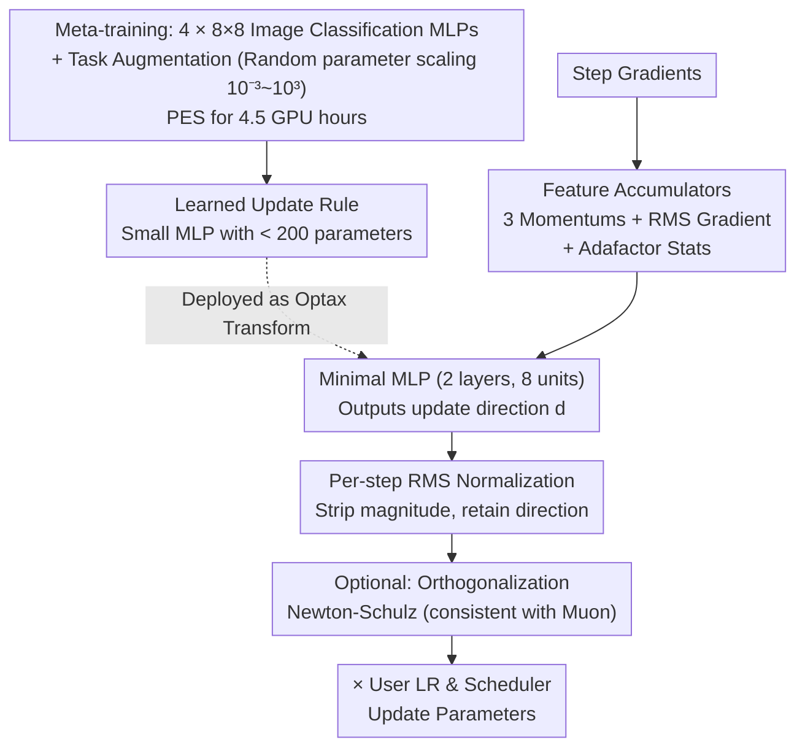

# Celo2: Towards Learned Optimization Free Lunch

**Conference**: ICLR 2026  
**arXiv**: [2602.19142](https://arxiv.org/abs/2602.19142)  
**Code**: [https://github.com/amoudgl/celo2](https://github.com/amoudgl/celo2)  
**Area**: Optimization  
**Keywords**: Learned Optimizer, Meta-learning, Meta-generalization, Normalized Update Rules, AdamW Alternative

## TL;DR

Ours proposes Celo2—a learned optimizer meta-trained in only 4.5 GPU hours. Through simple recipes such as normalized MLP update rules and task augmentation, it achieves stable generalization to billion-parameter models (GPT-3 XL 1.3B), which is 6 orders of magnitude larger than the meta-training distribution. Performance surpasses the previous VeLO, which consumed 4000 TPU-months, and carefully tuned AdamW baselines.

## Background & Motivation

Foundation model pre-training dominates modern computational workloads, and the choice of optimizer (usually Adam and its variant AdamW) directly impacts training efficiency. Learned Optimizers (LO) discover update rules via meta-learning and can theoretically surpass hand-designed optimizers. However, this direction faces three core challenges:

**Difficulty in Meta-generalization**: Optimizers meta-trained on small-scale tasks often fail to generalize to large-scale tasks. VeLO was previously the strongest learned optimizer, but despite an investment of 4000 TPU-months (approximately 10× the training computation of GPT-3), it still failed to generalize to tasks exceeding 600M parameters.

**High Meta-training Cost**: The 4000 TPU-month requirement of VeLO makes research iterations for learned optimizers extremely slow.

**Insufficient Stability**: Learned optimizers are prone to unstable training dynamics when moving beyond the training distribution, limiting practical adoption.

**Key Challenge**: How to obtain strong meta-generalization capabilities at an extremely low meta-training cost?

Ours provides a surprising answer: by carefully designing a simple normalized optimizer architecture and enhancing meta-training strategies, a high-performance universal learned update rule can be meta-trained in just 4.5 GPU hours. This rule stably scales to tasks 6 orders of magnitude larger than the meta-training distribution (GPT-3 XL 1.3B).

**Core Idea**: Instead of learning step sizes and schedulers (which are decoupled as user-tuned parameters), only the normalized update direction is learned—this decoupling grants the learned rule stronger task invariance and scale generalization.

## Method

### Overall Architecture

Celo2 is a plug-and-play Optax optimizer transformation that replaces AdamW with a single line of code. It first spends 4.5 GPU hours meta-training a tiny MLP update rule (fewer than 200 parameters) on four 8×8 image classification MLP tasks. This rule is then inserted into a standard training pipeline as a transformation, while the user provides the learning rate schedule and weight decay. The core of the design is: **learn only the normalized update direction**, while decoupling everything strongly related to task scale—such as step size and schedulers—to the user, thereby gaining cross-magnitude scale generalization.

Specifically for one update step: current gradients are fed into a set of accumulators (3 momentums + RMS gradient + Adafactor row/column statistics) to compute features. These features pass through a minimal MLP to obtain a **direction**, which is then stripped of its magnitude via per-step RMS normalization. Optionally, a Newton-Schulz orthogonalization is performed. Finally, it is multiplied by the user-provided learning rate and applied to parameters. The meta-training phase relies on "task augmentation"—randomly scaling the parameters of the optimized network—to artificially create loss landscapes of varying widths, forcing the rule to learn task-invariant directions.

### Key Designs

**1. Normalized Update Rules: Forcing MLP to learn direction, not step size**

Previous learned optimizers treated the raw MLP output as the update step. The output magnitude was naturally tied to the loss scale of specific tasks, leading to explosions or vanishing gradients when deployed on larger models. Celo2 thoroughly decouples "direction" and "magnitude": the update rule itself is just a small MLP with 2 layers, 8 hidden units, and ReLU activation. Input features for each parameter include 3 momentum accumulators ($\beta_1, \beta_2, \beta_3 = 0.9, 0.99, 0.999$), 1 RMS gradient accumulator ($\beta_4 = 0.95$), and Adafactor row/column statistics. The MLP outputs a direction $\mathbf{d}$ instead of a magnitude $\mathbf{m}$, and the output undergoes per-step RMS normalization:

$$\Delta\mathbf{p}_t = \frac{\text{MLP}(\mathbf{F})}{\text{RMS}(\text{MLP}(\mathbf{F}))}$$

By stripping out magnitude information, the MLP is forced to learn task-invariant update directions during meta-training. A direct consequence is that training dynamics become almost identical to AdamW (weight norm curves overlap, Figure 2), preventing divergence when the rule is scaled to 1000× parameter counts. Ablations confirm this: removing normalization drops LM-30M validation loss from 3.812 to 3.961; conversely, letting the MLP output magnitude (Table 1e) increases loss from 3.812 to 3.900. The authors compared various schemes like rolling RMS and normalization with clipping (Table 2), concluding that the simplest per-step RMS is the most stable.

**2. Decoupling Step Size and Scheduler: Sacrificing one extra hyperparameter for reliable generalization**

This is the fundamental divergence from predecessors like VeLO and Celo—those works meta-learned the learning rate scheduler within the optimizer. Consequently, the scheduler "memorized" the scales of small tasks and failed when scaled up. Celo2 abandons learning the scheduler, leaving the step size entirely for the user to search. The cost is searching for one extra learning rate during deployment, but the reward is stable generalization to tasks 6 orders of magnitude larger than meta-training. Prior work Celo failed on large scales specifically because it learned the scheduler; thus, this trade-off is the deciding factor in the methodology.

**3. Task Augmentation: Creating diverse optimization landscapes with parameter scaling**

With only 4 meta-training tasks, the landscape is too homogeneous, causing the rule to memorize specific scales. During meta-training, Celo2 randomly scales the parameters of the optimized network by a factor $\alpha \sim \text{LogUniform}(0.001, 1000)$ across six orders of magnitude. This artificially generates a large batch of loss landscapes with varying widths for the MLP to encounter. This step is indispensable for meta-generalization: removing task augmentation (Table 1c) causes the LM-30M loss to jump from 3.812 to 4.417 (+16%), the most severe degradation among all components.

**4. Orthogonalization Compatibility: Generalizing Muon orthogonalization to learned rules**

Celo2 is naturally compatible with Newton-Schulz orthogonalization from Muon. The difference lies in what is being orthogonalized—Muon orthogonalizes manual momentum, while Celo2 applies it to the learned MLP update. Figure 4 shows the cumulative benefits: adding orthogonalization to Celo2-base and then using Adam separately for 1D parameters results in step-by-step improvements, demonstrating that learned update directions and orthogonalization frameworks are orthogonal sources of gain.

### Loss & Training

Meta-training is conducted on four 8×8 image classification MLPs (MNIST, Fashion-MNIST, CIFAR-10, SVHN). Persistent Evolution Strategies (PES) are used for meta-optimization to avoid gradient bias from long unrolls. Inner-loop steps $K=50$, unroll lengths are sampled log-uniformly between [100, 2000], and the meta-objective is the average loss during the unroll. The entire process runs for 100K outer cycles with 8 tasks in parallel, totaling approximately 4.5 GPU hours on an Nvidia L40S. During deployment, the learning rate is searched across 7 values log-uniformly in $[10^{-5}, 10^{-3}]$, weight decay is chosen from 0.0/0.1/10.0, using a cosine decay schedule with 5% linear warmup. Default precision is float32 (bfloat16 is equally stable on ImageNet).

## Key Experimental Results

### Main Results

**Language Modeling (Out-of-distribution Meta-generalization):**

| Task | Parameters | Scale Ratio | Celo2 | AdamW | VeLO |
|------|------------|-------------|-------|-------|------|
| LM-30M | 30M | 30,000× | Competitive | Baseline | Competitive |
| GPT-2 | 124M | 124,000×| Slightly Better | Baseline | Competitive |
| GPT-3 XL | 1.3B | 1,000,000× | **Competitive** | Baseline | **Failed** |

This marks the first time a learned optimizer has successfully generalized to 1-billion-parameter pre-training tasks. GPT-3 XL is **6 orders of magnitude** beyond the meta-training distribution.

**ImageNet ViT Classification (Long Unroll Generalization, 50K steps = 25× Meta-training Unroll):**

| Metric | Celo2 | AdamW | VeLO |
|------|-------|-------|------|
| Steps to reach VeLO final loss | ~50% steps | Slower | 100% |
| Final Val Accuracy | ~66% | ~66% | ~66% |
| Training Stability | High (Consistent w/ AdamW) | High | Atypical dynamics |

Celo2 requires only ~50% of the steps used by VeLO to reach VeLO's final loss.

**Reinforcement Learning (Atari PPO, Generalization under High-variance Gradients):**

| Environment | Celo2 | AdamW | VeLO |
|------|-------|-------|------|
| Asterix | Comparable to AdamW | Baseline | Significant Lag/Stagnation |
| Freeway | Comparable to AdamW | Baseline | Significant Lag/Stagnation |
| SpaceInvaders | Comparable to AdamW | Baseline | Significant Lag/Stagnation |

VeLO exhibited training stagnation across all RL tasks (consistent with VeLO original paper Figure 11), whereas Celo2 remained stable.

### Ablation Study

| Configuration | Val Loss (LM-30M) | Description |
|------|-------------------|------|
| Hidden size=8 (Default) | **3.812** | Optimal |
| Hidden size=4 | 4.128 | Too small |
| Hidden size=16 | 3.857 | Oversized is worse |
| RMS Decay $\beta=0.95$ (Default) | **3.812** | Optimal |
| $\beta=0.999$ | 3.893 | Classic Adam setting |
| W/ Task Aug (Default) | **3.812** | Key component |
| W/o Task Aug | 4.417 | Severe degradation |
| Normalization (Default) | **3.812** | Key component |
| W/o Normalization | 3.961 | Obvious degradation |
| Only Output Direction $\mathbf{d}$ (Default) | **3.812** | Optimal |
| Output $\mathbf{d}$ and $\mathbf{m}$ | 3.900 | Magnitude output is harmful |

### Key Findings

- **Normalization is the Key to Generalization**: RMS normalization of MLP outputs aligns training dynamics with AdamW, serving as the core mechanism for cross-scale generalization.
- **Task Augmentation is Indispensable**: Removing task augmentation increased loss from 3.812 to 4.417 (+16%), showing that gradient landscape diversity is critical for meta-generalization.
- **Celo2 is Competitive with Muon**: On GPT-2, Celo2 (3.35588 or 3.36785) is nearly identical to Muon (3.35636) (Figure 7). The difference lies only in the update rule—Muon uses momentum, while Celo2 uses learned MLP updates.
- **Runtime and Memory Overhead**: Celo2-base has the same wall-clock time as Adam. Memory overhead is ~5× (3 momentums + 1 RMS + Adafactor features vs. 3× for Adam). With orthogonalization, wall-clock time is 1.3×.

## Highlights & Insights

- **The Breathtaking Discovery of a "Free Lunch"**: Only 4.5 GPU hours of meta-training computation can produce a practical universal optimizer—a 5-6 orders of magnitude improvement in computational efficiency compared to VeLO's 4000 TPU-months.
- **Shift in Design Philosophy**: Moving from "learning everything" (VeLO learning update + scheduler + step size) to "learning only the update direction"—the less it learns, the better it generalizes.
- **The Power of Normalization**: A simple RMS normalization elevates learned optimizers from "toy" status to "practical" status.
- **Training a GPT-3 Optimizer on 8×8 Images**: The vast contrast between the simplicity of meta-training tasks and the complexity of deployment tasks demonstrates the essential universality of the learned update rules.
- **Complementarity with Muon**: Celo2 generalizes Muon's orthogonalization framework from manual momentum to learned update rule orthogonalization.

## Limitations & Future Work

- **Requirement for Learning Rate Tuning**: Unlike VeLO's self-tuning mode, Celo2 requires searching for a learning rate (7 candidates). While the search space is small, it increases the barrier to entry.
- **Higher Memory Overhead**: A 5× parameter memory overhead is higher than Adam's 3×, which might be an issue in memory-constrained scenarios.
- **Homogeneous Meta-training Tasks**: Only meta-trained on 4 × 8×8 image classification MLPs. More diverse meta-training tasks might provide even better generalization.
- **Insufficient Testing in Mixed Precision**: The authors acknowledge float32 as the default; bfloat16 only underwent preliminary testing on ImageNet.
- **No Learned Scheduler**: While decoupling step size is key for generalization, how to safely incorporate the scheduler into learning remains an open question.
- **Insufficient Comparison with Update-model Optimizers**: Comparisons are limited to AdamW, VeLO, and Muon, lacking detailed comparisons with SOAP or AdaMuon.

## Related Work & Insights

- **VeLO (Metz et al., 2022)**: Previously the strongest LO, 4000 TPU-months computation, but generalization ceiling at 600M parameters.
- **Celo (Moudgil et al., 2025)**: Predecessor to Celo2, achieved better efficiency than VeLO in 24 GPU-hours but with a performance drop.
- **Muon (Jordan et al., 2024)**: Hand-designed orthogonalization optimizer, performed well in NanoGPT speed challenges. Celo2 is highly compatible with it.
- **SOAP (Vyas et al., 2024)**: Explores optimization in block norms, complementary to Celo2's direction.
- **Insight**: The success of Celo2 suggests the existence of a low-dimensional "universal update rule space"—an MLP with fewer than 200 parameters can capture it. This provides a new perspective for understanding the essence of optimization algorithms.

## Rating

- **Novelty**: ⭐⭐⭐⭐ — The decision to use normalization and step-size decoupling is simple but surprisingly effective, supported by thorough ablations.
- **Experimental Thoroughness**: ⭐⭐⭐⭐⭐ — Covers multiple domains and scales, including Language Modeling (30M→1.3B), ImageNet ViT, and Atari RL.
- **Writing Quality**: ⭐⭐⭐⭐ — Clear methodology, well-organized ablations, and the appendix provides full code and background knowledge.
- **Value**: ⭐⭐⭐⭐⭐ — A milestone in the field of learned optimizers, achieving practical generalization to the billion-parameter scale for the first time.

<!-- RELATED:START -->

## Related Papers

- [\[ICLR 2026\] $\mu$LO: Compute-Efficient Meta-Generalization of Learned Optimizers](mulo_compute-efficient_meta-generalization_of_learned_optimizers.md)
- [\[NeurIPS 2025\] Better NTK Conditioning: A Free Lunch from ReLU Nonlinear Activation in Wide Neural Networks](../../NeurIPS2025/optimization/better_ntk_conditioning_a_free_lunch_from_relu_nonlinear_activation_in_wide_neur.md)
- [\[CVPR 2026\] DABO: Difficulty-Aware Bayesian Optimization with Diffusion-Learned Priors](../../CVPR2026/optimization/dabo_difficulty-aware_bayesian_optimization_with_diffusion-learned_priors.md)
- [\[ICLR 2026\] WSM: Decay-free Learning Rate Schedule via Checkpoint Merging for LLM Pre-training](wsm_decay-free_learning_rate_schedule_via_checkpoint_merging_for_llm_pre-trainin.md)
- [\[ICLR 2026\] Cutting the Skip: Training Residual-Free Transformers](cutting_the_skip_training_residual-free_transformers.md)

<!-- RELATED:END -->
