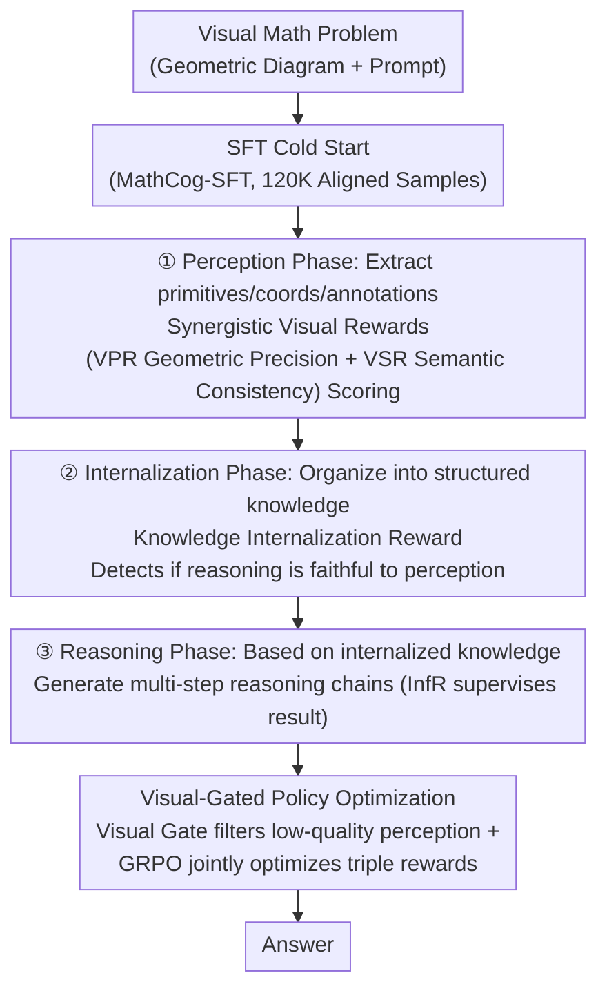

# CogFlow: Bridging Perception and Reasoning through Knowledge Internalization for Visual Mathematical Problem Solving

**Conference**: ICLR 2026  
**arXiv**: [2601.01874](https://arxiv.org/abs/2601.01874)  
**Code**: [https://shchen233.github.io/cogflow/](https://shchen233.github.io/cogflow/)  
**Area**: Optimization  
**Keywords**: Visual Mathematical Reasoning, Knowledge Internalization, GRPO, Perception-Reasoning Alignment, Cognitive-inspired

## TL;DR
CogFlow proposes a cognitive-inspired three-stage visual mathematical reasoning framework (Perception → Internalization → Reasoning). By employing Synergistic Visual Rewards to enhance perception, a Knowledge Internalization Reward to bridge perception and reasoning, and Visual-Gated Policy Optimization to anchor visual reasoning, it addresses the core issue of "correct perception but drifted reasoning" in existing methods.

## Background & Motivation

**Background**: MLLMs perform poorly on visual mathematical problems. Early "one-step reasoning" frameworks conflate perception and reasoning; later "decoupled reasoning" pipelines separate them but optimize each independently.

**Limitations of Prior Work**:
   - One-step frameworks (VLM-R1) produce unstructured reasoning where perceptual and reasoning errors are intertwined.
   - Decoupled pipelines (MathFlow), while improving perception, often ignore perceptual results during the reasoning phase—leading to "reasoning drift."
   - A critical question has been overlooked by prior research: **Are the extracted visual cues faithfully integrated into subsequent reasoning?**

**Key Challenge**: Accurate perception does not guarantee correct reasoning—models may "see" the diagram correctly but take shortcuts during reasoning, generating plausible-sounding chains that are visually groundless.

**Goal**
   - How to ensure perceptual results are faithfully converted into reason-able knowledge representations?
   - How to explicitly anchor reasoning on perceptual results during RL training?

**Key Insight**: "Knowledge Internalization" in cognitive science—human reasoning does not jump directly from perception to conclusions but first transforms perceptual information into structured knowledge (e.g., "$AB$ is the diameter + $C$ is on the circle $\rightarrow \angle ACB = 90^\circ$") before reasoning based on it.

**Core Idea**: Insert a "knowledge internalization" stage between perception and reasoning, using a specialized reward model to detect whether reasoning remains faithful to perception, and a visual gate to filter out low-quality perception before reasoning.

## Method

### Overall Architecture
CogFlow decomposes visual mathematical solving into a three-stage cognitive flow: first **Perception** (extracting geometric primitives, coordinates, and text annotations from the image), then **Internalization** (organizing fragmented perceptual results into structured, reason-able knowledge), and finally **Reasoning** (calculating the answer step-by-step based on internalized knowledge). The primary difference from previous "decoupled pipelines" is that it does not merely focus on individual stage performance but uses three targeted rewards to tighten the "Perception → Internalization → Reasoning" chain: SynVRs manage perception quality, IntlzR ensures reasoning is faithful to perception, and VGPO blocks low-quality perception during training and inference. The model undergoes SFT cold-start followed by GRPO reinforcement learning fine-tuning with triple rewards.

### Key Designs

**1. Synergistic Visual Rewards (SynVRs): Dual-space scoring of perception quality**

To train the perception phase effectively, a reward is needed to judge if a diagram is "read" correctly. SynVRs split perceptual scoring into two complementary paths: VPR (Visual Parametric Reward) follows a geometric precision route, converting identified primitives (segments, circles, points) into parametric equations and using Hungarian matching to align predicted primitives with ground truth, scoring based on Euclidean distance in parametric space; VSR (Visual Semantic Reward) follows a semantic consistency route, re-rendering the model's textual perception output into an image and using FG-CLIP to calculate cosine similarity with the original image to check if "global relationships are misinterpreted." The weighted total score is:

$$\mathcal{S}_{SynVRs} = \alpha \cdot \mathcal{S}_{VPR} + (1-\alpha) \cdot \mathcal{S}_{VSR}$$

VPR captures local geometric accuracy while VSR captures global perceptual consistency, preventing models from exploiting any single metric.

**2. Knowledge Internalization Reward (IntlzR): Training a reward model to detect reasoning faithfulness**

This is the core patch for "reasoning drift" (correct perception, shortcut reasoning). IntlzR trains a reward model to identify such deviations: for each sample, it constructs 1 positive + 5 negative trajectory pairs. The five negative trajectories deliberately cover five typical failure modes (omitting primitives, hallucinating facts, misusing theorems, violating geometric constraints, inconsistent referencing), teaching the reward model to distinguish "faithful reasoning" from these types of drift. Training uses Softmax-DPO to contrast one positive sample against multiple negatives:

$$\mathcal{L} = -\log \sigma\!\left(-\log \sum_j \exp(s_j^- - s^+)\right)$$

Where $s^+$ and $s_j^-$ represent the scores of positive and negative trajectories, respectively. The resulting IntlzR acts as the reward signal for "internalization faithfulness" during RL, bridging the gap between perception and reasoning.

**3. Visual-Gated Policy Optimization (VGPO): Filtering low-quality perception before reasoning**

Even with strong reasoning capability from RL, if the perceptual input is incorrect, the reasoning will only be confidently wrong. VGPO adds a "Quality Gate" between perception and reasoning: for each input, it samples $M$ perceptual trajectories, scores them using $S_{vis}$ (using VPR+VSR during training, and only VSR during inference), and the Visual Gate $\Gamma$ selects the first perception exceeding threshold $\tau$ (if none exceed it, the highest score is taken). Only perception that passes the gate serves as a condition for generating reasoning, cutting off the path where "low-quality perception contaminates downstream reasoning."

### Loss & Training
Training consists of two stages. The SFT stage uses MathCog-SFT (120K+ perception-reasoning aligned samples) for standard supervised fine-tuning as a cold start. The RL stage uses GRPO to optimize a composite reward—SynVRs (perception quality) + IntlzR (internalization faithfulness) + InfR (answer correctness)—to constrain the three cognitive stages. The accompanying MathCog dataset provides 120K+ high-quality perception-reasoning aligned annotations.

## Key Experimental Results

### Main Results (Visual Math Benchmarks)

| Method | MathVista | GeoQA | MathCheck-Geo | Average |
|------|----------|-------|-------------|------|
| MathFlow (Decoupled) | Medium | Medium | Medium | ~60% |
| VLM-R1 (One-step) | Medium | Low | Low | ~55% |
| **CogFlow (Ours)** | **Highest** | **Highest** | **Highest** | **~70%+** |

### Ablation Study

| Configuration | Reasoning Drift Accuracy↑ | Answer Accuracy↑ |
|------|------------|----------|
| w/o IntlzR | 73% | Baseline |
| w/o Visual Gate | Low | -3% |
| w/o SynVRs | Low | -5% |
| **Full CogFlow** | **92%** | **Highest** |

### Key Findings
- **Significant Reduction in Reasoning Drift**: CogFlow's reasoning drift accuracy improved from 73% (MathFlow) to 92%, proving the effectiveness of the knowledge internalization stage.
- **Surpassing Closed-source Models**: Matches or surpasses GPT-4V/Claude-3.5 on several benchmarks despite having significantly fewer parameters.
- **Triple Rewards are Indispensable**: Removing any reward component leads to performance degradation; IntlzR has the strongest impact on reasoning drift.
- **Visual Gate Enhances Robustness**: Filtering low-quality perception improves reasoning accuracy by approximately 3%.

## Highlights & Insights
- **Introduction of "Knowledge Internalization" fills a major gap**: Previous methods focused on "seeing accurately" or "thinking correctly," ignoring the bridge between them. CogFlow proves this bridge is vital—it directly reduced reasoning drift by 19%.
- **Practical Taxonomy of 5 Negative Sample Types**: The systematic classification of reasoning drift (omitting primitives, hallucinating, misusing theorems, violating constraints, inconsistent references) provides an analytical framework for future research.
- **Visual Gate concept is transferable to other Multi-modal RL scenarios**: Actively filtering low-quality intermediate outputs during RL before subsequent generation is a strategy applicable to all multi-stage generation tasks.

## Limitations & Future Work
- Focuses exclusively on visual mathematical reasoning; natural image understanding/VQA scenarios were not tested.
- IntlzR training requires carefully constructed positive/negative pairs; extending to new domains requires redesigning these pairs.
- The Visual Gate threshold $\tau$ requires manual setting and may need adjustment across different tasks.
- The three-stage pipeline increases inference latency (Perception, Internalization, and Reasoning each require independent generation).
- MathCog dataset primarily covers geometry; coverage for algebra and statistical charts is insufficient.

## Related Work & Insights
- **vs MathFlow (Chen et al.)**: Both are decoupled pipelines, but MathFlow lacks the internalization stage, leading to significant reasoning drift; CogFlow's IntlzR effectively solves this.
- **vs VLM-R1 (Shen et al.)**: One-step frameworks cannot structurally manage perception and reasoning; CogFlow provides clear role division across three stages.
- **vs OVR (Wei et al.)**: Also utilizes two-stage multi-modal RL but lacks an explicit mechanism for perception-reasoning alignment.

## Rating
- Novelty: ⭐⭐⭐⭐⭐ The "knowledge internalization" concept is uniquely introduced to visual reasoning with a sophisticated three-stage framework.
- Experimental Thoroughness: ⭐⭐⭐⭐⭐ Extensive benchmarks, ablations, quantitative analysis of reasoning drift, and comparisons with closed-source models.
- Writing Quality: ⭐⭐⭐⭐⭐ Clear cognitive science motivation, excellent diagram design, and strong problem-solution alignment.
- Value: ⭐⭐⭐⭐⭐ 120K dataset + open-source code provides a significant contribution to the field of visual reasoning.

<!-- RELATED:START -->

## Related Papers

- [\[AAAI 2026\] GHOST: Solving the Traveling Salesman Problem on Graphs of Convex Sets](../../AAAI2026/optimization/ghost_solving_the_traveling_salesman_problem_on_graphs_of_convex_sets.md)
- [\[NeurIPS 2025\] AutoOpt: A Dataset and a Unified Framework for Automating Optimization Problem Solving](../../NeurIPS2025/optimization/autoopt_a_dataset_and_a_unified_framework_for_automating_optimization_problem_so.md)
- [\[ICLR 2026\] Learning to Solve Orienteering Problem with Time Windows and Variable Profits](learning_to_solve_orienteering_problem_with_time_windows_and_variable_profits.md)
- [\[ICLR 2026\] Landing with the Score: Riemannian Optimization through Denoising](landing_with_the_score_riemannian_optimization_through_denoising.md)
- [\[ICLR 2026\] Generalizable Heuristic Generation Through LLMs with Meta-Optimization](generalizable_heuristic_generation_through_llms_with_meta-optimization.md)

<!-- RELATED:END -->
