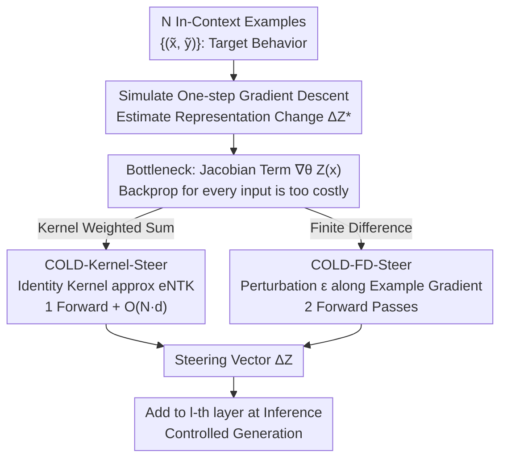

# COLD-Steer: Steering Large Language Models via In-Context One-step Learning Dynamics

**Conference**: ICLR 2026  
**arXiv**: [2603.06495](https://arxiv.org/abs/2603.06495)  
**Code**: [https://github.com/Ksartik/cold-steer](https://github.com/Ksartik/cold-steer)  
**Area**: Optimization  
**Keywords**: Activation Steering, Learning Dynamics, Training-free Inference, Sample Efficiency, Pluralistic Alignment

## TL;DR
The authors propose COLD-Steer, which achieves training-free LLM activation steering by approximating representation changes produced by gradient descent on in-context examples. It achieves 95% of the steering effect using only 1/50th of the sample size.

## Background & Motivation

**Background**: Activation steering allows controlling LLM behavior at inference time without retraining. Existing methods are categorized into contrastive methods (DiffMean/CAA), which construct direction vectors using activation differences between positive/negative pairs, and parameter-tuning methods (ReFT/BiPO), which train steering parameters end-to-end.

**Limitations of Prior Work**: Contrastive methods are sample-efficient but only utilize activation-level signals (ignoring loss functions), leading to limited steering precision. Parameter-tuning methods (e.g., ReFT) require 250-1000 examples for training and involve multi-epoch hyperparameter tuning, which is costly.

**Key Challenge**: A fundamental trade-off exists between sample efficiency and steering precision—how can one achieve steering performance equivalent to fine-tuning using a small number of examples without training parameters?

**Goal**: To design a training-free framework that efficiently steers LLM behavior using only 10-50 examples.

**Key Insight**: The authors observe that changes in model representations during fine-tuning follow analyzable patterns (learning dynamics). The core insight is that the impact of gradient descent on representations can be **simulated** at inference time without actually updating the parameters.

**Core Idea**: Activation steering is redefined as "simulating the learning dynamics of one-step gradient descent"—calculating how gradients from in-context examples would change the target representation and using this change directly as the steering vector.

## Method

### Overall Architecture
**Mechanism**: COLD-Steer addresses the problem of steering model behavior toward a specific style (e.g., more honest, non-sycophantic) by calculating "what would happen if we fine-tuned on these examples for one step," but **only computing the change in representation without updating parameters**. Specifically, given $N$ examples $\{(\tilde{\mathbf{x}}_i, \tilde{\mathbf{y}}_i)\}$, it estimates how much and in what direction the target representation moves after a single gradient descent step on these examples. This displacement $\Delta\mathbf{Z}^*$ is added as a steering vector to the representation of the $l$-th layer for a new input at inference time:

$$\Delta\mathbf{Z}^*(\mathbf{x}) \approx -\frac{\eta}{N} \nabla_\theta \mathbf{Z}(\mathbf{x};\theta) \sum_i \nabla_\theta \mathcal{L}(\mathcal{M}(\tilde{\mathbf{x}}_i), \tilde{\mathbf{y}}_i)$$

The main challenge is the Jacobian term $\nabla_\theta \mathbf{Z}(\mathbf{x};\theta)$ relative to the new input $\mathbf{x}$. Computing this directly would require backpropagation for every new input, which is prohibited at inference. COLD-Steer provides two approximation routes (Kernel weighting and Finite Difference) and uses a unified perspective to show that existing contrastive methods are special cases.

### Key Designs

**1. COLD-Kernel-Steer: Approximating eNTK with Kernel Functions to Avoid Backprop**

The Jacobian term is expensive because it couples the "new input gradient" with the "example gradient." By expanding the chain rule, this coupling can be expressed as a kernel function $\kappa$ acting on the representation space. The change becomes a weighted sum of gradients from example-side losses, weighted by kernel similarity:

$$\Delta\mathbf{Z}^{(\kappa)}(\mathbf{x}) = -\frac{\eta}{N} \sum_i \kappa(\mathbf{Z}(\mathbf{x}), \mathbf{Z}(\tilde{\mathbf{x}}_i)) \nabla_{\mathbf{Z}} \mathcal{L}|_{\mathbf{Z}(\tilde{\mathbf{x}}_i)}$$

Here, $\kappa$ is essentially the empirical Neural Tangent Kernel (eNTK). The authors use the simplest identity kernel $\kappa=1$ as an approximation, based on the Linear Representation Hypothesis—that the gradient of the same concept is dominated by a shared direction, making identical weights sufficient. This allows the model to perform 1 forward pass to get the representation, followed by $O(N \cdot d)$ kernel similarity calculations without any backpropagation.

**2. COLD-FD-Steer: Bypassing Jacobian via Finite Difference**

While kernel approximation avoids backprop, the identity kernel is a coarse assumption. COLD-FD takes a different path: instead of explicitly calculating the Jacobian, it uses finite difference to approximate "how the representation changes when parameters are slightly perturbed along the example gradient direction":

$$\Delta\mathbf{Z}^{(fd)} = -\frac{\eta}{\varepsilon N} \big[\mathbf{Z}(\mathbf{x}; \theta + \varepsilon \textstyle\sum_i \nabla_\theta \mathcal{L}_i) - \mathbf{Z}(\mathbf{x}; \theta)\big],\quad \varepsilon = 10^{-6}$$

It accumulates loss gradients from all examples into one direction, pushes the parameters a tiny step $\varepsilon$ along that direction, and compares the representation difference of the same new input before and after perturbation. This requires 2 forward passes for a new input (standard parameters and perturbed parameters). The computational cost remains fixed regardless of input complexity, though it requires storing the full model gradient at $O(|\theta|)$ cost. This method retains real Jacobian information, leading to more accurate steering.

**3. Unified Perspective: Existing Contrastive Methods as Special Cases**

By substituting different loss functions and kernels into the kernel approximation formula, existing methods can be derived. Contrastive methods like DiffMean are equivalent to COLD-Kernel using an identity kernel and a loss $\mathcal{L} = -\sum_i \|\mathbf{Z}(\tilde{\mathbf{x}}_i \oplus \tilde{\mathbf{y}}_i^+) - \mathbf{Z}(\tilde{\mathbf{x}}_i \oplus \tilde{\mathbf{y}}_i^-)\|^2$. They utilize only activation differences of positive/negative pairs, ignoring gradient information from the loss function. RepE/ICV are equivalent to adding a PCA dimensionality reduction step on top of COLD-Kernel.

### Loss & Training
- DPO loss is used for paired settings; Cross-Entropy is used for positive-only settings.
- Hyperparameter search: $\eta \in \{0.1, 1, 2\}$, $l \in \{10, 15, 20, 30\}$.
- For open-ended generation, intervention is applied only at the first generated token to limit compounding effects.

## Key Experimental Results

### Main Results (CAA Dataset, Llama-2-7b-chat, Choice Accuracy)

| Method | Coordinate | Corrigible | Hallucination | Refusal | Sycophancy | Avg Rank↓ |
|------|---------|--------|------|------|------|----------|
| Base | 0.28 | 0.62 | 0.70 | 0.62 | 0.80 | 5.14 |
| DiffMean | 0.52 | 0.82 | 0.86 | 0.74 | 0.80 | 4.00 |
| ReFT(vec) | 0.48 | 0.62 | 0.70 | 0.72 | 0.82 | 3.29 |
| **COLD-FD** | **0.90** | **0.86** | **0.96** | **0.98** | 0.86 | **2.00** |
| COLD-Kernel | 0.28 | 0.62 | 0.70 | 0.64 | 0.80 | 4.43 |

### Sample Efficiency Comparison

| Method | Examples Required | Avg Steering Accuracy |
|------|----------|--------------|
| ReFT(mlp) | 250-1000 | ~70-80% |
| DiffMean | 50 | ~65-75% |
| **COLD-FD** | **10-50** | **~85-95%** |
| **COLD-Kernel** | **10-50** | **~75-85%** |

### Key Findings
- **COLD-FD achieved an average rank of 2.00 on CAA** (paired setting), significantly outperforming all baselines.
- It achieves performance close to ReFT using only **1/50th** of the samples.
- Contrastive methods (DiffMean) are proven to be special cases of COLD-Kernel under specific losses, unifying contrastive and gradient-based approaches.
- It is effective in pluralistic alignment tasks (OpinionsQA), supporting adaptations to minority viewpoints.
- Cross-model validation: COLD-FD accuracy improvement reached up to 96% on Qwen-2.5-7B-Instruct; it also proved effective on Gemma-2-9B and Mistral-7B.

## Highlights & Insights
- **Conceptualizing activation steering as a simulation of learning dynamics** is elegant—instead of training a steerer, it directly computes "what if we fine-tuned."
- **Strong theoretical unification**: Proving that DiffMean/RepE/ICV are special cases of COLD-Kernel provides a unified gradient perspective for existing methods.
- **COLD-FD's two-forward-pass scheme**: Being able to avoid backpropagation for new inputs makes the method highly practical.

## Limitations & Future Work
- COLD-FD requires storing the full model gradient $O(|\theta|)$, which poses memory pressure for 70B+ models.
- The identity kernel approximation performs poorly on certain tasks (e.g., no improvement for COLD-Kernel on Llama-2).
- Experiments were restricted to single-layer intervention; multi-layer synergistic steering might be more powerful.
- The choice of $\varepsilon$ in finite difference is empirically dependent.

## Related Work & Insights
- **vs. CAA/DiffMean**: COLD-Steer demonstrates that contrastive methods only use activation difference signals and fail to exploit information within the loss function.
- **vs. ReFT**: ReFT requires training an MLP with hundreds of samples and multiple epochs; COLD-Steer requires zero training and only 10 samples.
- **vs. Prompt Tuning**: COLD-Steer operates at the activation level, providing finer control without being limited by the context window.

## Rating
- Novelty: ⭐⭐⭐⭐⭐ Redefining activation steering as learning dynamics simulation is a significant theoretical contribution.
- Experimental Thoroughness: ⭐⭐⭐⭐ Tested across 5 LLMs, multiple datasets, and pluralistic alignment, though ablation studies could be deeper.
- Writing Quality: ⭐⭐⭐⭐⭐ Clear theoretical derivation and persuasive unified perspective.
- Value: ⭐⭐⭐⭐⭐ 50x improvement in sample efficiency offers huge practical value, especially for pluralistic alignment.

<!-- RELATED:START -->

## Related Papers

- [\[ICLR 2026\] ViTSP: Guiding Large-Scale Traveling Salesman Problem Solving with Vision-Language Models](vitsp_a_vision_language_models_guided_framework_for_solving_large-scale_travelin.md)
- [\[ICLR 2026\] Adaptive Acquisition Selection for Bayesian Optimization with Large Language Models](adaptive_acquisition_selection_for_bayesian_optimization_with_large_language_mod.md)
- [\[ICLR 2026\] Scaling Multi-Task Bayesian Optimization with Large Language Models](scaling_multi-task_bayesian_optimization_with_large_language_models.md)
- [\[ICLR 2026\] HBO: Hierarchical Balancing Optimization for Fine-Tuning Large Language Models](hbo_hierarchical_balancing_optimization_for_fine-tuning_large_language_models.md)
- [\[ICLR 2026\] Exploring Diverse Generation Paths via Inference-time Stiefel Activation Steering](exploring_diverse_generation_paths_via_inference-time_stiefel_activation_steerin.md)

<!-- RELATED:END -->
