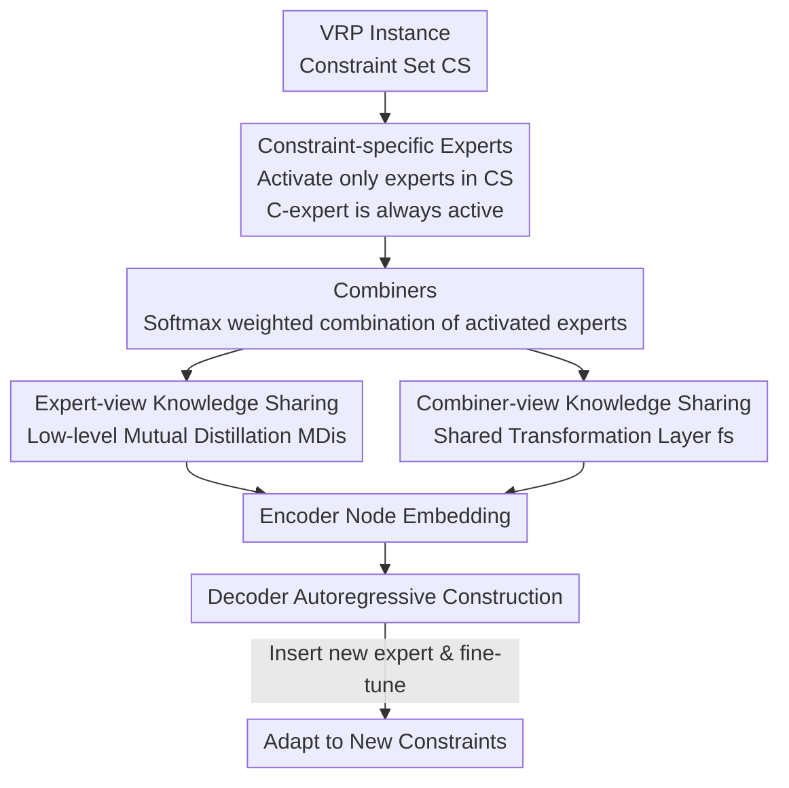

# Combination-of-Experts with Knowledge Sharing for Cross-Task Vehicle Routing Problems

**Conference**: ICLR2026  
**OpenReview**: [https://openreview.net/forum?id=lHBs9mbgwp](https://openreview.net/forum?id=lHBs9mbgwp)  
**Code**: https://github.com/yuzikang0/CoEKS  
**Area**: Neural Combinatorial Optimization / Vehicle Routing Problem (VRP) / Mixture-of-Experts  
**Keywords**: Cross-task generalization, Constraint combination, Combination-of-Experts, Mutual distillation, Out-of-distribution generalization

## TL;DR
Addressing the structural characteristic of Vehicle Routing Problems (VRP) where "each task is composed of several basic constraints," this paper proposes CoEKS: utilizing "constraint-specific experts + combiners" to activate and weigh experts of each constraint on demand, combined with a "mutual expert distillation + shared transformation layer" for multi-view knowledge sharing. This enables a unified model to perform accurately on seen constraint combinations, achieve zero-shot generalization to unseen combinations (relative improvement of 12–18% over SOTA), and support the insertion of new experts to adapt to entirely new constraints (approx. 25% improvement).

## Background & Motivation

**Background**: VRP is one of the most fundamental and challenging problems in combinatorial optimization—planning routes for a fleet of vehicles to serve customers while satisfying various constraints like capacity and time windows. Recent neural construction methods use deep reinforcement learning to learn an end-to-end policy, constructing solutions node-by-node in an autoregressive manner, which avoids the exponential cost of traditional exact solvers and the reliance on manual rules in heuristics. However, most methods follow a "one task, one model" paradigm, requiring retraining and redeployment for changed constraints. Consequently, **cross-task unified models** have emerged to solve multiple VRP variants (e.g., CVRP, OVRP, VRPTW) with a single network.

**Limitations of Prior Work**: Existing unified models perform poorly in **out-of-distribution (OOD)** scenarios, which are highly practical: (1) Unseen **constraint combinations** during training (e.g., trained on VRPB and VRPL, asked to solve VRPBL); (2) Completely **new basic constraints** not present during training. Current methods fall into two categories: **Task-shared dense models** (POMO-MTL, RouteFinder, CaDA), where all parameters are shared, over-emphasizing coupled representations at the expense of task-specific ones, leading to **negative transfer** and poor OOD performance; and **Node-level MoE models** (MVMoE, ReLD-MoEL), which route each node's embedding to different experts via gating, but this restricts experts to a **narrow field of view** of node subsets, weakening the perception of task-level knowledge.

**Key Challenge**: Both categories ignore a critical fact—**each VRP task is essentially a combination of multiple basic constraints** (e.g., OVRPBLTW = Open + Backhaul + Duration + TimeWindow + Capacity). Dense models fail to learn specialized knowledge by mixing all constraints; node-level MoE ties experts to node granularity, failing to capture "constraint-level" knowledge. The root cause is that the **granularity of expert division does not align with the structural properties of VRP**—it should be neither "fully shared" nor "divided by node," but rather "divided by constraint."

**Goal**: (1) Enable the model to learn reusable specialized knowledge for each basic constraint; (2) Achieve zero-shot generalization to unseen constraint combinations through flexible combination of this knowledge; (3) Rapidly adapt to new constraints by inserting new experts; (4) Ensure experts share transferable general knowledge to avoid isolated learning and poor collaboration.

**Key Insight**: Since VRP Task = Combination of Constraints, let **experts also be combined by constraints**. Assign a specific expert to each basic constraint, activate only the experts involved in a given task, and adaptively weigh their outputs. This naturally corresponds to the combinatorial structure of VRP, where an unseen combination is simply a "new subset of activated experts," facilitating zero-shot generalization.

**Core Idea**: Replace "fully shared / node-level MoE" with a "flexible combination-of-experts (CoE)" and stack "cross-constraint multi-view knowledge sharing" to suppress expert fragmentation, effectively encoding VRP structural priors directly into the network architecture.

## Method

### Overall Architecture
CoEKS focuses its modifications on the encoder. In standard Transformer blocks, the FFN responsible for capturing complex relationships is replaced by a **constraint-specific expert pool + combiner**, along with a cross-expert knowledge sharing mechanism. The workflow is as follows: Sample a VRP instance (e.g., OVRP, with constraint set $CS=\{C,O\}$) → The encoder **only activates experts corresponding to the constraints** in $CS$ (C and O experts), while others remain zeroed out → Each activated expert’s combiner calculates normalized weights to sum the expert outputs into node embeddings → The decoder constructs feasible solutions autoregressively. Training utilizes REINFORCE (POMO-style policy gradient with a shared baseline), with mutual distillation between activated experts in low-level encoders. During inference, the policy activates the relevant expert subset for unseen combinations (zero-shot) or inserts and fine-tunes a new expert for completely new constraints.

The VRP is modeled on a complete graph $G=(V,E)$, aiming to minimize the total distance $\min_{\tau\in\Phi} c(\tau)$. This paper focuses on six basic constraints: Capacity C, Open routes O, Backhaul B, duration Limit L, Time Window TW, and Mixed Backhaul MB, where C is the underlying constraint for all VRPs.

### Key Designs

**1. Constraint-Specific Experts and Combiners: Experts by Constraint, Weighted Combination on Demand**

This design addresses the pain point of "expert granularity mismatch with VRP structure." CoEKS replaces a single FFN in the Transformer block with a pool of FFNs, where each expert $E_j$ ($j\in\{C,O,B,L,TW\}$) is responsible for one basic constraint. For an instance with constraint set $CS\subseteq E$, only relevant experts are activated:

$$O^E_j(h)=\begin{cases}E_j(h),& j\in CS\\ 0,& \text{otherwise}\end{cases}$$

Where $E_j(h)=\mathrm{FFN}_j(h)\in\mathbb{R}^d$. Since capacity C is the foundation of all VRPs, the C-expert is set as an **always-active shared expert** (corresponding to CVRP), ensuring general solving capability across tasks while allowing other experts to focus on specific constraint knowledge. After activation, a combiner $W_j\in\mathbb{R}^{1\times d}$ for each expert calculates a score $s_j(h)=W_j\cdot h$, normalized via softmax within the activated set:

$$S_j(h)=\frac{\exp(s_j(h))}{\sum_{k\in CS}\exp(s_k(h))},\quad j\in CS$$

The final output is the weighted combination $O(h)=\sum_{j\in CS}E_j(h)\cdot S_j(h)$. The beauty of this design lies in unseen constraint combinations: they are essentially subsets of **well-trained experts that have simply never appeared together**, allowing the model to handle them zero-shot without new parameters.

**2. Expert-view Knowledge Sharing: Low-level Mutual Distillation**

Dividing experts solely by constraint risks making them too "narrow," lacking awareness of VRP commonalities. This paper uses **Mutual Distillation (MDis)** to allow activated experts to perform **point-to-point mutual learning**. This is implemented via an auxiliary loss, where the total loss is $L=L_p+\alpha\cdot L_{md}$ ($L_p$ is the task loss, $\alpha=0.01$):

$$L_{md}=\begin{cases}0,& K=1\\ \mathrm{MSE}(E_1(h),E_2(h)),& K=2\\ \frac{1}{K}\sum_{i=1}^{K}\mathrm{MSE}(E_i(h),E_{avg}(h)),& K>2\end{cases}$$

$K$ is the number of activated experts, and $E_{avg}(h)=\frac1K\sum_i E_i(h)$ is a "virtual expert." For $K>2$, all experts align with the virtual expert, reducing complexity from $O(K^2)$ to $O(K)$. **Crucially, MDis is only applied to low-level encoders (e.g., the first layer)**—based on the premise that lower layers learn general features while higher layers learn task-specific knowledge.

**3. Combiner-view Knowledge Sharing: Shared Transformation Layer**

Experts sharing knowledge is insufficient; **combiners** also need global context to make informed weighting decisions. A **Shared Transformation Layer** $f_s$ processes the embedding $h$ before it enters the combiners, injecting cross-task knowledge. $f_s$ is implemented as a low-rank MLP with a residual connection:

$$f_s(h)=W_2\cdot\mathrm{ReLU}(W_1\cdot h)+h$$

Where $W_1\in\mathbb{R}^{d\times r}$ and $W_2\in\mathbb{R}^{r\times d}$ form a bottleneck structure ($r\ll d$). The final CoEKS output integrates this:

$$O_{CoEKS}(h)=\sum_{j\in CS}E_j(h)\cdot S_j(f_s(h))$$

This complements Design 2: MDis enables sharing between "experts," while $f_s$ enables sharing between "combiners."

**4. Inserting New Experts for New Constraints: Individual Fine-tuning**

To handle entirely new constraints (e.g., Mixed Backhaul MB), CoEKS **inserts a new constraint-specific expert + combiner and fine-tunes only this module** while freezing all existing parameters. This prevents catastrophic forgetting. Two variants are provided: CoEKS+ (randomly initialized new expert) and CoEKSc+ (reusing the shared C-expert for initialization to speed up learning).

### Loss & Training
The policy is optimized using REINFORCE with a shared baseline $b(G)$. The gradient is $\nabla_\theta L_p=\mathbb{E}[(r(\tau)-b(G))\nabla_\theta\log p_\theta(\tau|G)]$. With auxiliary mutual distillation, the total loss is $L=L_p+\alpha L_{md}$ ($\alpha=0.01$). CoEKS is implemented on the SOTA ReLD backbone, training for 300 epochs. The training set includes 7 tasks (CVRP, OVRP, VRPB, VRPL, VRPTW, OVRPTW, OVRPL).

## Key Experimental Results

Experiments cover 48 VRP tasks using an RTX 3090. Baselines include traditional solvers (PyVRP, OR-Tools) and cross-task neural methods (POMO-MTL, RF-TE, MVMoE, CaDA, ReLD-MoEL).

### Main Results

Average Gap for ID (In-Distribution): CoEKS leads across 7 training tasks, achieving the smallest gap in 10 out of 14 (task × scale) cases.

| Setting | Metric | CoEKS | ReLD-MoEL (Runner-up) | Traditional Best |
|------|------|------|----------|------|
| ID Avg. n=50 | gap | **1.751%** | 1.902% | 0% (HGS-PyVRP, 10.4m) |
| ID Avg. n=100 | gap | **2.646%** | 2.852% | 0% (HGS-PyVRP, 20.8m) |

Average Gap for OOD Unseen Combinations (9 tasks): CoEKS is optimal in all cases, with relative improvements of at least 18.3% (n=50) and approx. 13% (n=100) over neural baselines.

| Task | Scale | CoEKS gap | ReLD-MoEL gap | RF-TE gap |
|------|------|-----------|---------------|-----------|
| OVRPB | n=100 | **8.811%** | 10.691% | 14.520% |
| OVRPBL | n=100 | **8.755%** | 10.506% | 14.864% |
| OOD Avg. | n=50 | **3.432%** | 4.202% | 4.823% |
| OOD Avg. | n=100 | **5.857%** | 6.735% | 8.702% |

### Ablation Study
On 16 VRP tasks ($n=50$), using ReLD-MoEL as the baseline, removing components:

| Configuration | Phenomenon | Description |
|------|------|------|
| Full CoEKS | Optimal | CoE + MDis + Shared Transformation |
| w/o MDis | ID/OOD drops | Removal of expert mutual distillation |
| w/o Shared Trans | ID/OOD drops | Removal of combiner-view sharing |
| w/o Both | Largest drop | Degenerates to pure CoE |

### Key Findings
- **Multi-view knowledge sharing provides higher gains for OOD than ID**: Universal cross-constraint knowledge is critical for generalizing to unseen combinations.
- **MDis placement is vital**: Improving OOD performance only occurs when MDis is limited to low levels; applying it to all layers hurts performance by homogenizing experts.
- **Architecture Generality**: CoEKS provides gains regardless of whether the backbone is POMO or ReLD.
- **Complexity Advantage**: For OOD tasks with more constraints (e.g., OVRPBLTW), CoEKS leads node-level MoE by a wider margin.

## Highlights & Insights
- **Encoding "Task = Constraint Combination" prior into the architecture**: This is the core "Aha!" moment—by aligning expert granularity with constraint granularity, zero-shot generalization to unseen combinations becomes a natural byproduct.
- **Efficient $O(K)$ Mutual Distillation**: Using a virtual average expert to align others simplifies complexity and is transferable to other multi-expert scenarios.
- **"Low-level sharing, high-level specificity"**: Strategically placing MDis in the first layer balances sharing useful information without losing expert diversity.
- **Plug-and-play adaptation**: Freezing old parameters to adapt to new constraints provides a practical path for evolving logistics systems.

## Limitations & Future Work
- **Linear growth of experts**: One expert per basic constraint may lead to pool bloat as the number of constraints increases.
- **Encoder-centric modification**: CoE replaces the encoder FFN; the decoder structure remains unchanged, leaving open whether the decoding stage should also be expert-organized.
- **Reliance on explicit enumeration**: The method assumes tasks can be decomposed into a discrete set $CS$. Its validity for coupled or non-decomposable constraints remains to be seen.

## Related Work & Insights
- **vs. Shared Dense Models**: Unlike models that suffer from negative transfer, CoEKS preserves specificity through constraint-specific experts.
- **vs. Node-level MoE**: Unlike node-level routing, CoEKS experts are bound to **constraint semantics**, providing a task-level field of view.
- **vs. Adapter-based Adaptation**: While others add global adapter layers, CoEKS inserts modules with clear semantic roles and prevents forgetting by freezing known parameters.

## Rating
- Novelty: ⭐⭐⭐⭐⭐ High. Encoding the structural prior of VRP as a CoE architecture is clear and intuitive.
- Experimental Thoroughness: ⭐⭐⭐⭐⭐ Extensive testing across 48 tasks, OOD scenarios, and dual backbones.
- Writing Quality: ⭐⭐⭐⭐ Clear structure and flow, though requires VRP background to parse variants.
- Value: ⭐⭐⭐⭐⭐ Significant breakthrough for OOD cross-task VRP and practical for real-world deployment.

<!-- RELATED:START -->

## Related Papers

- [\[ICLR 2026\] LMask: Learn to Solve Constrained Routing Problems with Lazy Masking](lmask_learn_to_solve_constrained_routing_problems_with_lazy_masking.md)
- [\[NeurIPS 2025\] Rethinking Neural Combinatorial Optimization for Vehicle Routing Problems with Different Constraint Tightness Degrees](../../NeurIPS2025/optimization/rethinking_neural_combinatorial_optimization_for_vehicle_routing_problems_with_d.md)
- [\[CVPR 2026\] Label-Free Cross-Task LoRA Merging with Null-Space Compression](../../CVPR2026/optimization/label-free_cross-task_lora_merging_with_null-space_compression.md)
- [\[NeurIPS 2025\] Learning to Insert for Constructive Neural Vehicle Routing Solver](../../NeurIPS2025/optimization/learning_to_insert_for_constructive_neural_vehicle_routing_solver.md)
- [\[ICLR 2026\] Align-SAM: Seeking Flatter Minima for Better Cross-Subset Alignment](align-sam_seeking_flatter_minima_for_better_cross-subset_alignment.md)

<!-- RELATED:END -->
