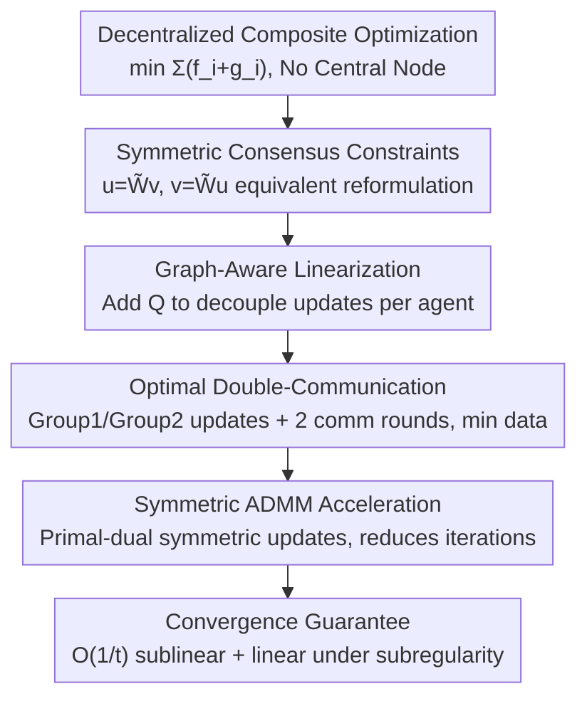

# Communication-Efficient Decentralized Optimization via Double-Communication Symmetric ADMM

**Conference**: ICLR2026  
**OpenReview**: [https://openreview.net/forum?id=HZYuyNkBdD](https://openreview.net/forum?id=HZYuyNkBdD)  
**Code**: To be confirmed  
**Area**: optimization  
**Keywords**: decentralized optimization, symmetric ADMM, multi-round communication, communication-efficient, linear convergence

## TL;DR
Addressing decentralized composite optimization without a central node, this paper proposes DS-ADMM: embedding two rounds of communication per iteration into the ADMM structure via a pair of symmetric consensus constraints and accelerating it with symmetric ADMM. Although communication per iteration doubles, the total number of iterations decreases significantly, reducing overall communication costs while proving linear convergence under the weak condition of metric subregularity.

## Background & Motivation

**Background**: Decentralized optimization allows a group of agents to collaboratively solve global problems over a connected network without a central server—each agent performs local computation and exchanges information only with neighbors. Most mainstream methods (DGD, EXTRA/PG-EXTRA, NIDS, gradient tracking, and various decentralized ADMM variants) follow a standard convention: **one round of communication per local iteration**.

**Limitations of Prior Work**: This "one-iteration-one-communication" convention is rarely challenged because it is assumed that extra communication per iteration increases total costs. A few works attempting fixed multi-round communication (Jakovetić 2014, Berahas 2019, Ye 2023, Li 2018) follow the **multi-consensus** route—repeatedly mixing local variables through communication within a single iteration to accelerate consensus. However, experiments consistently show that fixed multi-consensus **fails to truly reduce total communication rounds**; it inherits the convergence issues of DGD, accelerating consensus without improving the quality of each optimization step.

**Key Challenge**: Multi-consensus treats multi-round communication as an **external enhancement** (repeated averaging). Communication is spent on "aligning variables" rather than "advancing optimization," so the extra communication does not yield a sufficient reduction in iterations. The root problem is that multi-round communication is not designed into the algorithmic structure but merely appended to it.

**Goal**: To find a way to **endogenously embed multi-round communication into the problem structure**, ensuring that "multiple communications per iteration" leads to a significant decrease in total iterations/communication, with strict linear convergence guarantees under weak assumptions.

**Key Insight**: Instead of the "repeated mixing" approach of multi-consensus, the authors start from **ADMM constraint design**. By formulating the consensus condition as a pair of linear constraints involving 2-hop neighbor information, "two rounds of communication" becomes a **necessary and minimal** requirement for each iteration rather than an artificial addition. This is further combined with Symmetric ADMM to balance primal and dual variable updates for faster convergence.

**Core Idea**: Integrate dual communication into the ADMM structure using a pair of **symmetric consensus constraints** $u=\widetilde{W}v,\ v=\widetilde{W}u$, and accelerate with symmetric ADMM. The cost of one extra communication round per iteration is traded for a significant reduction in total iterations, leading to a net saving in communication.

## Method

### Overall Architecture

Consider the decentralized composite optimization problem without a central coordinator:
$$\min_{x\in\mathbb{R}^d} F(x)=\sum_{i=1}^n \big(f_i(x)+g_i(x)\big),$$
where $f_i$ is a private convex loss and $g_i$ is a private convex regularizer (e.g., Lasso: squared loss + $\ell_1$; SVM: hinge loss + $\ell_2$). The network is a connected undirected graph $G=(V,E)$, with neighbor weights encoded by a symmetric, doubly stochastic mixing matrix $W$ with a positive spectral gap, where $\widetilde{W}=W\otimes I_d$.

The DS-ADMM pipeline is as follows: **(1)** Reformulate the "all agent variables are equal" consensus constraint into a pair of symmetric linear constraints that naturally require 2-hop information, generating endogenous dual communication; **(2)** Apply generalized symmetric ADMM to the reformulated problem using a graph-aware approximation matrix $Q$ to linearize and decouple updates for per-agent decomposition; **(3)** Split updates into Group 1 / Group 2 local updates with two rounds of communication, minimizing the data sent per round (only two $d$-dimensional vectors); **(4)** Prove (sub)linear convergence under standard and weak regularity conditions.

### Key Designs

**1. Symmetric Consensus Constraints: Embedding "Dual Communication" into ADMM Structure**

The challenge in decentralized ADMM is the lack of a central coordinator to enforce variable consistency. The consensus must be written as locally executable linear constraints. Using the spectral properties of the mixing matrix ($W$ is symmetric, doubly stochastic, with a positive spectral gap), the null space of $I_n-W$ is exactly the consensus subspace $\mathrm{span}\{\mathbf{1}\}$. This leads to an equivalent characterization (Proposition 2): stacked local variables satisfy $u_1=\cdots=u_n$ if and only if there exists an auxiliary variable $v$ such that $u=\widetilde{W}v$ and $v=\widetilde{W}u$. The original problem is rewritten as:
$$\min_{u,v}\ f(u)+g(v)\quad \text{s.t.}\quad Au-Bv=0,\qquad A=(\widetilde{W},I_{nd})^\top,\ B=(I_{nd},\widetilde{W})^\top.$$
This constraint is **perfectly symmetric (self-adjoint)** with respect to $u\leftrightarrow v$ and $(A,B)\leftrightarrow(B,A)$. Both primal variable blocks enter the augmented Lagrangian identically, naturally fitting symmetric ADMM. Crucially, $\widetilde{W}^\top\widetilde{W}$ involves 2-hop information, making "two rounds of communication" the **minimal necessary cost**—multi-round communication is an endogenous product of the problem structure. This contrasts with Wang et al. (2018), which uses an **asymmetric** constraint ($A=((I-\widetilde W)^{1/2},I)^\top,\ B=(0,I)^\top$) requiring only one round but losing symmetric acceleration.

**2. Graph-Aware Linearization: Eliminating Quadratic Coupling for Agent Decomposition**

Applying generalized symmetric ADMM directly would produce **quadratic coupling terms** like $\|Au-Bv^{(t)}\|^2$ in subproblems, preventing distributed solving. The authors introduce a graph-aware positive definite matrix:
$$Q=\beta\big((1+\tau)I_{nd}-\widetilde{W}^\top\widetilde{W}\big),\qquad \tau>0,$$
as an approximation term in the subproblems. This $Q$ cancels out the coupling from $\widetilde W^\top\widetilde W$, making the augmented Lagrangian separable among agents. Both primal blocks reduce to forms involving "neighbor averages + neighbor info + proximal regularization," solvable via proximal operators. For common losses/regularizers like $\ell_1$ or hinge, updates are closed-form and entirely local.

**3. Optimal Double-Communication: Two Rounds, Two $d$-dimensional Vectors per Round**

The 2-hop requirement in the updates necessitates two communication rounds. Communication is minimized by: **(i) Minimal rounds**—exactly two; **(ii) Minimal data**—sending **carefully constructed dual combinations** instead of raw variables. One iteration is split:
- **Group 1 + Comm 1**: Agent $i$ updates $\lambda_{2,i}$, calculates $u_i^{(t+1)}$ via $f_i$'s proximal operator, and forms intermediate dual $\lambda_{2,i}^{(t+1/2)}$. It broadcasts $(u_i^{(t+1)}, a_i^{(t+1)})$ where $a_i^{(t+1)}=\lambda_{2,i}^{(t+1/2)}+\tfrac{1}{r}(\lambda_{2,i}^{(t+1/2)}-\lambda_{2,i}^{(t)})$.
- **Group 2 + Comm 2**: Using received $\widetilde u_i^{(t+1)}, \widetilde a_i^{(t+1)}$, it updates $\lambda_{1,i}^{(t+1/2)}$, calculates $v_i^{(t+1)}$ via $g_i$ proximal operator, and forms $\lambda_{1,i}^{(t+1)}$. It broadcasts $(v_i^{(t+1)}, b_i^{(t+1)})$ where $b_i^{(t+1)}=2\lambda_{1,i}^{(t+1)}-\lambda_{1,i}^{(t+1/2)}$.
This defines a **coupled feedback** loop between groups where information from one set of updates drives the other.

**4. Symmetric ADMM Acceleration: Trading Comms for Iterations**

Symmetric ADMM (He et al. 2016) accelerates convergence by inserting an **extra dual variable update** ($\lambda^{(t+1/2)}$), balancing primal and dual updates. Step sizes are set as $0<r\le1$ and $s=1$. The symmetric constraint is what enables the use of symmetric ADMM. The net effect: per-iteration communication doubles, but total iterations decrease so significantly that net communication and computation are reduced.

### Loss & Training
The objective is the problem (1) $\sum_i(f_i+g_i)$. Key hyperparameters: augmented Lagrangian penalty $\beta$, dual step size $r\le1$ (with $s=1$), and approximation coefficient $\tau$. Experiments use $(r,s)=(0.99,1)$ and $\tau=0.01$. Initialization: $u^{(0)}=v^{(0)}=\lambda_1^{(0)}=\lambda_2^{(-1/2)}=0$.

## Key Experimental Results

### Convergence Theory

| Condition | Convergence Type | Rate / Bound |
|------|----------|-----------|
| Standard (non-strongly convex) | Non-ergodic sublinear | $\|\theta^{(t)}-\theta^{(t+1)}\|^2\le \dfrac{1+r}{\beta\tau(t+1)(1-r)}\big(\|\theta^{(1)}-\theta^{(0)}\|_H^2+\|v^{(1)}-v^{(0)}\|_Q^2\big)$ i.e., $O(1/t)$ |
| Metric subregularity of KKT map | Q-linear to solution set | $\mathrm{dist}_H^2(\theta^{(t+1)},\Omega^\*)\le \dfrac{1}{1+\epsilon}\,\mathrm{dist}_H^2(\theta^{(t)},\Omega^\*)$ where $\epsilon=\tfrac{\phi}{c^2\delta\zeta}$ |
| Same as above | R-linear optimality | $\|f(u^{(t)})+g(v^{(t)})-(f^\*+g^\*)\|\le l\,q^t$ where $q=\sqrt{\tfrac{1}{1+\epsilon}}$ |

Here $\phi=\min\{2\beta\rho, (1-r)/\beta\}$, where $\rho$ is the spectral gap—**better connectivity (larger $\rho$) leads to faster convergence**. Sublinear results are topology-independent. Metric subregularity is satisfied for Lasso, Logistic Regression, and SVM (Proposition 3).

### Main Results

| Task | Dataset | $f_i$ | $g_i$ | Baselines |
|------|--------|-------|-------|----------|
| Lasso Regression | a9a | $\tfrac{1}{2m}\|A_ix-b_i\|^2$ | $\tfrac{\lambda}{n}\|x\|_1$ | DProx-ADMM, PG-EXTRA, NIDS, ProxMudag |
| SVM Classification | a1a | $\tfrac1m\sum\max(0,1-b_ja_j^\top x)$ | $\tfrac{\lambda}{2n}\|x\|_2^2$ | DProx-ADMM, PG-EXTRA, NIDS |

Settings: $n=30$ agents, random graph ($p=0.5$), Metropolis–Hastings matrix.

### Key Findings
- **Core Conclusion**: DS-ADMM converges in **fewer iterations** and **significantly fewer communication rounds** across Lasso and SVM tasks compared to existing decentralized methods.
- **Mechanism Insight**: Contrary to previous beliefs that multi-round communication always increases total costs, DS-ADMM proves that **endogenous** double communication enables "trading comms for iterations" effectively.
- **Robustness**: Sublinear convergence is robust to topology, while the linear rate explicitly benefits from better network connectivity.

## Highlights & Insights
- **Communication as a Structural Product**: Rather than an external hyperparameter, two rounds of communication become a structural necessity derived from the 2-hop symmetric constraint.
- **Symmetric Constraints → Symmetric ADMM**: The self-adjoint design is a prerequisite for symmetric ADMM acceleration, providing a clear advantage over asymmetric formulations.
- **Dual Combinations**: Broadcasting $a_i, b_i$ instead of raw variables minimizes data per round.
- **Linear Convergence under Weak Conditions**: Using metric subregularity instead of strong convexity makes the theory applicable to non-strongly convex models like Lasso.

## Limitations & Future Work
- **Experimental Scale**: Evaluated on $n=30$ agents with a9a/a1a; further validation is needed for large-scale, high-dimensional, or deep learning models.
- **Synchronous/Static Assumptions**: Assumes synchronized agents and fixed topology; asynchronous or time-varying scenarios are not addressed.
- **Parameter Sensitivity**: The linear rate depends on $\beta$ and $\tau$, which may require tuning in diverse network environments.
- **Trading Bounds**: The net benefit of "double communication" might diminish in networks where single-round latency is extremely high.

## Related Work & Insights
- **vs Multi-consensus**: Those methods mix variables externally to improve consensus but inherit DGD's convergence flaws. DS-ADMM integrates communication into the optimization structure.
- **vs Wang et al. (2018)**: Both use ADMM, but Wang's asymmetric constraints prevent the use of symmetric acceleration.
- **vs Gradient Tracking**: Gradient tracking estimates average gradients; DS-ADMM uses dual/proximal approaches, which are more natural for non-smooth composite objectives.

## Rating
- Novelty: ⭐⭐⭐⭐ Innovative use of symmetric constraints to endogenously trigger double communication and symmetric acceleration.
- Experimental Thoroughness: ⭐⭐⭐ Strong theoretical results, but experimental evaluation is limited to small-scale simulations.
- Writing Quality: ⭐⭐⭐⭐ Clear motivation and logical derivation of constraints and communication schedules.
- Value: ⭐⭐⭐⭐ Provides a significant new trade-off perspective and theoretical basis for decentralized algorithm design.

<!-- RELATED:START -->

## Related Papers

- [\[ICLR 2026\] DES-LOC: Desynced Low Communication Adaptive Optimizers for Foundation Models](des-loc_desynced_low_communication_adaptive_optimizers_for_foundation_models.md)
- [\[ICLR 2026\] Decentralized Nonconvex Optimization under Heavy-Tailed Noise: Normalization and Optimal Convergence](decentralized_nonconvex_optimization_under_heavy-tailed_noise_normalization_and_.md)
- [\[AAAI 2026\] A Unified Convergence Analysis for Semi-Decentralized Learning: Sampled-to-Sampled vs. Sampled-to-All Communication](../../AAAI2026/optimization/a_unified_convergence_analysis_for_semi-decentralized_learni.md)
- [\[ICLR 2026\] Enhancing Communication Compression via Discrepancy-aware Calibration for Federated Learning](enhancing_communication_compression_via_discrepancy-aware_calibration_for_federa.md)
- [\[ICML 2026\] Delayed Momentum Aggregation: Communication-efficient Byzantine-robust Federated Learning with Partial Participation](../../ICML2026/optimization/delayed_momentum_aggregation_communication-efficient_byzantine-robust_federated_.md)

<!-- RELATED:END -->
