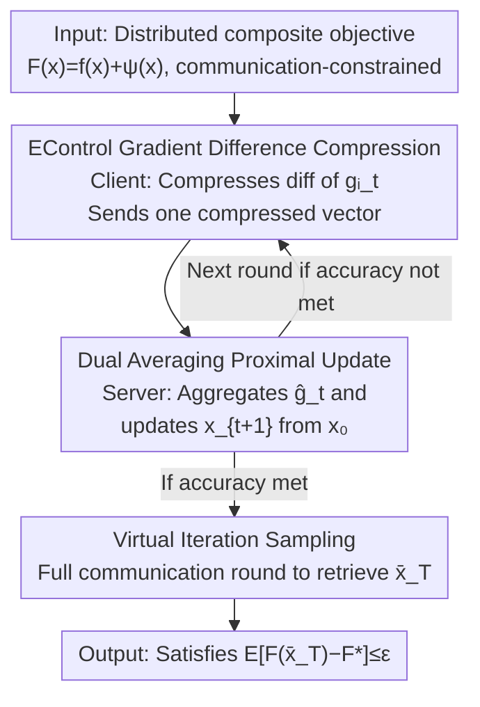

# Composite Optimization with Error Feedback: the Dual Averaging Approach

**Conference**: ICLR 2026  
**OpenReview**: [https://openreview.net/forum?id=PSmakC4sw5](https://openreview.net/forum?id=PSmakC4sw5)  
**Code**: https://github.com/mlolab/comp-opt-da_iclr  
**Area**: Distributed Optimization / Communication Compression / Convex Optimization Theory  
**Keywords**: Error Feedback, Composite Optimization, Dual Averaging, Communication Compression, Virtual Iteration

## TL;DR
To address the long-standing gap where "Error Feedback (EF) fails in composite optimization with non-smooth regularization/constraints," this paper reshapes the summation structure of iterations using **Dual Averaging (DA)**. By combining it with the recent EControl error feedback mechanism, it provides the first convergence rate for composite convex optimization that **perfectly matches** the rate of non-composite cases.

## Background & Motivation

**Background**: In distributed training, clients transmit local gradients to the server, making communication a primary bottleneck. A common solution is **contractive compression (e.g., Top-K)**, but such compression is biased and leads to divergence if aggregated directly. The standard fix in both industry and theory is **Error Feedback (EF)**: accumulating information lost during compression into an error term $e_t$ and compensating for it in the next step. EF is highly effective and possesses a complete theoretical framework under smooth unconstrained settings ($\psi\equiv 0$), with analyses typically relying on the **virtual iteration** framework.

**Limitations of Prior Work**: Real-world objectives often take a **composite form** $F(x)=f(x)+\psi(x)$, where $f$ is smooth and $\psi$ is a non-smooth regularizer (e.g., $\ell_1$) or even a constraint indicator function (taking $+\infty$). Once $\psi$ is added, updates transition from "gradient subtraction" to **proximal steps**, causing the classical EF and its virtual iteration analysis to **completely collapse**. Existing works on composite EF either introduce restrictive assumptions, fail to handle stochastic gradients, or yield suboptimal convergence rates.

**Key Challenge**: The lifeblood of the virtual iteration framework is that when $\psi\equiv 0$, the real iterate $x_t$ is exactly a **clean sum** of all past gradient estimates: $x_0-\frac1\gamma\sum_k \hat g_k$. Thus, subtracting the accumulated error $e_t=\sum_k(\hat g_k-g_k)$ precisely recovers the "trajectory generated by true gradients." However, with $\psi$, every proximal operator introduces distortion, and $x_t$ **can no longer be written as a sum of past gradient estimates**, while $e_t$ remains a sum of compression errors. This **structural misalignment** means the virtual iterate $\tilde x_t:=x_t-h_t e_t$ might even fall outside $\mathrm{dom}\,\psi$, ceasing to be a valid proxy. This is the fundamental reason why classical analysis fails.

**Goal**: To establish an EF mechanism and analysis framework for **general composite settings** that matches the optimal rates of non-composite cases.

**Key Insight**: Since the problem stems from "proximal steps breaking the summation structure," the authors switch to an iteration format that **naturally preserves the summation structure**—**Dual Averaging**. DA accumulates all past gradients at each step and moves from the initial point in one step. Consequently, $x_t$ is redefined by a (weighted) sum like $\sum_k a_k\hat g_k$. The weighted accumulated error $e_t:=\sum_k a_k(\hat g_k-g_k)$ can then correct the bias as before, but this time the correction occurs **inside** the proximal operator.

**Core Idea**: Replace gradient descent with **Dual Averaging** to restore the summation structure required for EF analysis, and layer it with the **EControl** mechanism to control error via gradient differences. This cleanly extends Error Feedback theory to composite convex optimization for the first time.

## Method

### Overall Architecture

The method consists of rounds of distributed compressed communication. In each round: **Clients** compute local stochastic gradients and use the EControl mechanism to compress the "gradient difference," sending only one compressed vector to the server. The **Server** aggregates these compressed increments into a global gradient estimate $\hat g_t$ and performs a **Dual Averaging proximal update** to obtain $x_{t+1}$. At the end of training, a lightweight **virtual iteration sampling** step is used to retrieve an output point $\bar x_T$ with convergence guarantees. The roles are: EControl "keeps error controllable," Dual Averaging "ensures error remains correctable," and sampling "actually produces the virtual iterate that is not explicitly stored during analysis."

The true novelty lies not in a single module, but in using **Dual Averaging as the spine** to integrate these three components into a rigorously analyzable whole—complete with a standalone "Inexact Dual Averaging" analysis template.

### Key Designs

**1. EControl Gradient Difference Compression: Shifting Error Bounds from "Gradient Norm" to "Gradient Difference"**

Classical EF, when bounding the error $\frac1n\sum_i\|e^i_t\|^2$, eventually relies on bounding $\|\nabla f(x_t)\|^2$. While this holds automatically under smoothness when $\psi\equiv 0$, it **no longer holds** in composite settings—unless $\nabla f(x^\star)=0$ (which is generally false). This paper adopts the **gradient difference compression** logic from EControl (Gao et al., 2024a) to bypass this: clients do not directly compress the current gradient. Instead, they compress $\delta^i_t = g^i_t - \hat g^i_{t-1} - \eta e^i_t$ (a combination of the current gradient, previous estimate, and error), then set $\hat g^i_t=\hat g^i_{t-1}+\mathcal C(\delta^i_t)$. This ensures the error sum is bounded by the **difference of adjacent gradients** $\|g^i_{t+1}-g^i_t\|^2$ (Lemma 4.1). The latter can be controlled using the "average smoothness" Assumption 2.5, **completely avoiding dependence on gradient norms and data heterogeneity assumptions**. Setting $\eta=\frac{\delta}{3\sqrt{1-\delta}(1+\sqrt{1-\delta})}$ yields $\sum_t\|e^i_t\|^2\le\frac{81(1-\delta)^2(1+\sqrt{1-\delta})^4}{2\delta^4}\sum_t\|g^i_{t+1}-g^i_t\|^2$. This bound **depends only on the EControl mechanism itself**, making it a versatile component for convergence analysis.

**2. Reshaping Summation with Dual Averaging: Making EF Controllable in Composite Settings**

This is the core maneuver. The server performs a Dual Averaging proximal step instead of a "gradient subtraction" update:

$$x_{t+1}=\arg\min_{x\in\mathrm{dom}\,\psi}\Big\{\sum_{k=0}^{t}a_k\big(\langle\hat g_k,x\rangle+\psi(x)\big)+\frac{\gamma_t}{2}\|x-x_0\|^2\Big\}$$

The beauty here is that $x_t$ is now **exactly determined by the weighted sum of all gradient estimates** $\sum_k a_k\hat g_k$, restoring the summation structure. Thus, one can define the weighted accumulated error $e_t:=\sum_{k=0}^{t-1}a_k(\hat g_k-g_k)$ and use $-\langle e_t,x\rangle$ **inside** the proximal operator to correct the bias. The resulting virtual iteration is exactly equivalent to "feeding the true gradients $g_k$ into the same Dual Averaging." In other words, the EF goal of "recovering true gradient trajectories via accumulated error" is restored for composite settings, and the virtual iterate remains within $\mathrm{dom}\,\psi$ as a valid proxy.

**3. Inexact Dual Averaging Template and Virtual Iteration Sampling**

The authors abstract a **"Inexact Dual Averaging" general analysis template** (Algorithm 1): as long as an approximate gradient $\hat g_t\approx g_t$ is provided at each step, convergence can be guaranteed from a virtual iteration perspective. Lemma 3.2 bounds the distance between the virtual and real iterates using accumulated error: $\|\tilde x_t-x_t\|^2\le\frac1{\gamma_{t-1}^2}\|e_t\|^2$. Theorem 3.3 provides the main convergence theorem for the virtual iteration. This template does not assume a finite-sum structure for $f$ and can be used independently for problems where updates are distorted by approximation, noise, or constraints.

Since the virtual iterate $\tilde x_t$ is **not explicitly stored**, how is it returned? The authors design a **sampling process**: using a Bernoulli variable $\tau_t$ ($\Pr[\tau=1]=a_t/A_{t+1}$), clients maintain local accumulated true gradients $\bar g^i$. This allows a random virtual iterate to be sampled proportional to $a_t$ at the end. A **single full communication round** then collects $\bar g^i$ and solves one proximal problem to produce the output $\bar x_T$ (Lemma 3.4 ensures its expected optimality equals the weighted average optimality of virtual iterates). The cost is just 1 extra bit per round plus 1 final full communication. Collectively, these form **Algorithm 2: EControl with Dual Averaging**.

### Loss & Training

The goal is distributed stochastic composite optimization $\min_x f(x)+\psi(x)$, where $f=\frac1n\sum_i f_i$. Each $f_i$ is accessed via an unbiased stochastic gradient oracle with bounded variance ($\le\sigma^2$). $f_i$ satisfies average smoothness (Assumption 2.5, which is weaker than per-function $L_{\max}$-smoothness). With $a_t=1$, constant $\gamma_t=\gamma$, and the aforementioned $\eta$, the step size is set as $\gamma=\max\{\tfrac{24\sqrt2\,\ell}{\delta},\sqrt{\tfrac{T\sigma^2}{nR_0^2}},17\tfrac{T^{1/3}\ell^{1/3}\sigma^{2/3}}{R_0^{2/3}\delta^{4/3}}\}$. In composite settings ($\psi\not\equiv 0$), an additional initial exact stochastic gradient step is taken to bound the initial suboptimality $F_0$ by $LR_0^2$.

## Key Experimental Results

The paper is a theoretical work; experiments serve to **corroborate** the conclusions. Main experiments use synthetic objectives: a softmax objective with $\ell_1$ regularization $F(x)=\mu\log\sum_i\exp(\frac{\langle a_i,x\rangle-b_i}{\mu})+\lambda\|x\|_1$, with $\mu=0.1, \lambda=0.1, d=200, k=2048$, Top-K compression $K/d=0.1$, and $\sigma^2=25$. Appendix includes FashionMNIST experiments.

### Main Results (Theoretical Convergence Rate)

| Setting | Ours (Iteration/Communication Complexity) | Comparison |
|------|------|------|
| Composite Convex + EF (Ours Thm 4.4) | $O\!\big(\frac{R_0^2\sigma^2}{n\varepsilon^2}+\frac{R_0^2\sqrt{\ell}\sigma}{\delta^2\varepsilon^{3/2}}+\frac{\ell R_0^2}{\delta\varepsilon}\big)$ | First to match non-composite rates |
| Non-composite $\psi\equiv 0$ (EControl, Gao 2024a) | Same as above | Ours **reduces exactly to this** when $\psi\equiv 0$ |
| Existing Composite EF Works | Require extra constraints / no stochastic gradients / suboptimal rates | All surpassed by Ours |

The dominant term $\frac{R_0^2\sigma^2}{n\varepsilon^2}$ shows **linear speedup** with the number of clients $n$ and is independent of the compression rate $\delta$, which is the most valued property of EF methods.

### Ablation Study

| Experiment | Phenomenon | Explanation |
|------|------|------|
| Increasing client count $n$ (4→8→16→32, fixed $\gamma=0.0001$) | The error of real iterates stabilizes at a level that **decreases linearly** with $n$. | Validates linear speedup on real iterates (theory only guarantees virtual iterates). |
| Virtual vs. Real Iterates | Suboptimality curves for both are **nearly identical**. | Suggests real iterates may also have strong theoretical properties (open problem). |

### Key Findings
- **Theoretical gap between virtual and real iterates**: Rigorous convergence is guaranteed for (randomly sampled) virtual iterates, necessitating the sampling process for retrieval. However, experiments show real iterates perform nearly as well, suggesting potential for stronger real-iterate theory or tighter lower bounds.
- **Gradient difference compression is the key to bypassing composite difficulties**: By bounding error via $\|g^i_{t+1}-g^i_t\|^2$ instead of $\|\nabla f(x_t)\|^2$, the bound remains valid in composite settings where $\nabla f(x^\star)\ne 0$.
- **Initial exact gradient step**: Used in composite settings to bound $F_0$ by $LR_0^2$. Removing it still results in convergence, but the rate adds a term dependent on $F_0$ (still within $O(\frac1{\delta\varepsilon})$).

## Highlights & Insights
- **The "change iteration format to save analysis" approach is elegant**: The problem was accurately diagnosed as "proximal steps breaking the summation structure." Rather than forcing a fix on virtual iterates, switching to Dual Averaging restores the summation naturally, allowing existing tools to work.
- **Decoupling error from gradient norms to gradient differences** simultaneously removes the data heterogeneity assumption. This trick is transferable to other constrained/composite compression scenarios where the gradient at the optimum is non-zero.
- **The Inexact Dual Averaging analysis template** is explicitly noted as being of "independent interest." Any algorithm where updates are distorted by approximation, noise, or constraints (e.g., safe RL, constrained distributed optimization) could potentially reuse this virtual-iterate + sampling framework.

## Limitations & Future Work
- **Theoretical/Practical gap in iterates**: Strong guarantees apply to virtual iterates; real iterates lack equally strong bounds, currently bridged by sampling or empirical confidence.
- **Convexity Assumption**: Analysis assumes $f, \psi$ are convex (and $f$ is average-smooth). Non-convex composite optimization with EF remains an open area.
- **Small-scale Experiments**: Primarily validated on synthetic softmax-$\ell_1$ and FashionMNIST; lacks end-to-end evidence from large-scale real-world distributed training.
- **Future Work**: Refining the template in Appendix I to directly characterize real iterates or constructing lower bounds; integrating this method with recent works that simplify EF for practical use.

## Related Work & Insights
- **vs. Classical EF + virtual iteration (Stich 2018 / Karimireddy 2019)**: They used Gradient Descent + virtual iteration under $\psi\equiv 0$. In composite cases, proximal steps break the sum structure. Ours uses DA to rebuild the structure, reviving the virtual iteration analysis.
- **vs. EControl (Gao et al., 2024a)**: EControl provides gradient difference compression but was only analyzed for $\psi\equiv 0$. Ours embeds it into the DA framework to achieve composite rates and even provides an analysis for variable step sizes $\gamma_t$ (previously unknown).
- **vs. Existing Composite EF (Islamov 2025 / Condat 2022 / Qian 2020)**: These are limited by extra constraints, lack of stochastic gradient support, or suboptimal rates. Ours covers general composite + stochastic gradients with matching optimal rates.

## Rating
- Novelty: ⭐⭐⭐⭐⭐ First clean extension of EF to composite convex optimization; "DA saves analysis" is a clear and powerful insight.
- Experimental Thoroughness: ⭐⭐⭐ Sufficient for a theoretical paper, but synthetic/small-scale focus leaves real-iterate and large-scale performance less explored.
- Writing Quality: ⭐⭐⭐⭐⭐ Excellent diagnosis of why classical EF fails; the motivation-diagnosis-strategy-analysis chain is complete.
- Value: ⭐⭐⭐⭐ Fills a long-standing theoretical gap; the accompanying Inexact DA template has independent utility.

<!-- RELATED:START -->

## Related Papers

- [\[ICLR 2026\] Error Feedback for Muon and Friends](error_feedback_for_muon_and_friends.md)
- [\[ICLR 2026\] DADA: Dual Averaging with Distance Adaptation](dada_dual_averaging_with_distance_adaptation.md)
- [\[ICLR 2026\] Online Black-Box Prompt Optimization with Regret Guarantees under Noisy Feedback](online_black-box_prompt_optimization_with_regret_guarantees_under_noisy_feedback.md)
- [\[ICLR 2026\] Riemannian Federated Learning via Averaging Gradient Streams](riemannian_federated_learning_via_averaging_gradient_streams.md)
- [\[ICLR 2026\] Egalitarian Gradient Descent: A Simple Approach to Accelerated Grokking](egalitarian_gradient_descent_a_simple_approach_to_accelerated_grokking.md)

<!-- RELATED:END -->
