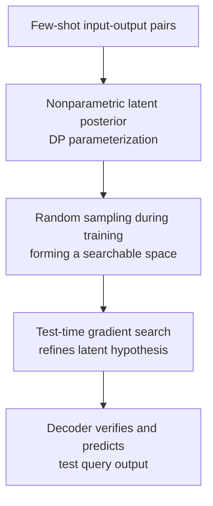

# Compositional Generalization through Gradient Search in Nonparametric Latent Space

**Conference**: ICLR2026  
**OpenReview**: [https://openreview.net/forum?id=RNTWTJe4x6](https://openreview.net/forum?id=RNTWTJe4x6)  
**Code**: https://github.com/idiap/AbductionTransformer  
**Area**: Optimization / Test-time Adaptation  
**Keywords**: Compositional generalization, nonparametric latent variables, gradient search, Dirichlet Process, meta-learning

## TL;DR
This paper proposes the Abduction Transformer, which represents hidden rules in few-shot abstract reasoning tasks as variable-sized nonparametric latent mixture distributions. By performing gradient search on latent hypotheses at test time, it significantly improves OOD compositional generalization on 1-D ARC, SRAVEN, and linguistic systematicity tasks.

## Background & Motivation
**Background**: Compositional generalization examines whether a model can recombine primitives, rules, or subroutines encountered during training to solve novel tasks unseen during training. Current Transformer, LLM, and meta-learning models are powerful on many in-distribution tasks. However, on tasks requiring systematic knowledge reorganization—such as ARC-like puzzles, Raven's matrices, or grammar induction—they often memorize patterns from the training distribution but fail to combine old rules in new configurations.

**Limitations of Prior Work**: Standard encoder-decoder Transformers typically compress few-shot examples into a context representation via a single forward pass to decode test answers. This representation remains fixed once the forward pass is complete, and the model lacks an explicit mechanism to verify if "this hidden rule truly explains all provided examples." Existing methods like Latent Program Networks introduce test-time latent search, but latents are usually fixed-dimensional vectors. When task complexity scales from a single rule to combinations of multiple rules, a fixed-size vector struggles to naturally accommodate a variable number of constituent components.

**Key Challenge**: Compositional generalization requires two simultaneous conditions: the representation space must accommodate hidden hypotheses of varying complexity, and the inference process must be capable of searching for these hypotheses under the constraints provided by test samples. Relying solely on high model capacity leads to memorization of training combinations; relying solely on test-time search may fail if the latent space is not smooth or compositional, leading to no meaningful search direction.

**Goal**: The authors reformulate few-shot meta-learning tasks as a posterior inference problem for a hidden mapping $H$: given several input-output pairs $X=\{(x_i, y_i)\}$, the model must infer a hypothesis $H$ that explains these examples and then use it to answer the test query $x_{query}$. The goal is not for the model to memorize all possible mappings, but to learn to conduct a hypothesis search for unseen test combinations based on primitives and partial combinations seen during training.

**Key Insight**: A key observation is that Transformers inherently output a set of vectors rather than a single vector, where the count of these vectors varies with the number of input tokens. The authors interpret this set-of-vector structure as a variable-complexity representation within Bayesian nonparametrics. They construct a nonparametric latent space using a Dirichlet Process (DP) and perform gradient descent on the latent hypothesis sampled at test time.

**Core Idea**: Replace one-shot forward inference with a "nonparametric latent mixture distribution + information-theoretic regularization + test-time latent gradient search," allowing the model to combine rules learned during training within a searchable hypothesis space.

## Method

### Overall Architecture
The Abduction Transformer treats a few-shot episode as abductive inference: example pairs are observations, and the hidden mapping $H$ is the cause explaining these observations. The model first uses an encoder to infer a Dirichlet Process posterior from each input-output pair, sampling a latent mixture to represent candidate hypotheses. The decoder then checks whether this hypothesis can decode example inputs back into example outputs. $H$ is updated directly at test time via cross-entropy loss on the examples. After several search steps, the refined $H^o$ is used to decode the test query for the final prediction.

From a probabilistic perspective, the encoder approximates $q_\phi(H \mid X)$ and the decoder approximates $p_\theta(X \mid H)$. The training objective is variational free energy: maintaining the posterior close to the prior while ensuring the sampled hypothesis explains the data. At test time, model parameters $\phi, \theta$ are fixed, and only the latent hypothesis $H$ is updated. Thus, it is not traditional test-time fine-tuning, but rather instance-level posterior inference within the learned generative space.

### Key Designs
**1. Nonparametric latent posterior: Adapting hidden rule complexity to the task**

Hidden rules in compositional tasks can range from simple to complex serial combinations. If the latent representation is always a fixed-dimensional vector, the model must compress the number of rules, rule types, and their relations into a single bottleneck; this representation often collapses on complex combinations when training only covers simple ones. Abduction Transformer utilizes the set-of-vector output of the Transformer encoder to project each output vector as a Dirichlet Process pseudo-observation: mean $\mu_i$, variance $\sigma_i^2$, and pseudo-count $\alpha_i$.

The paper defines the posterior as a DP: $q_\phi(H \mid X) := DP(N_0(\mu, \sigma^2), \alpha_0)$, where the base distribution $N_0$ is a mixture of Gaussian pseudo-observations weighted by $\alpha_i/\alpha_0$, with $\alpha_0 = \sum_i \alpha_i$. Consequently, $H$ is not a single vector but a discrete mixture distribution sampled from the DP. The number of effective components can vary with input complexity. This aligns with the requirements of compositional generalization: simple rules seen during training correspond to fewer components, while more complex test-time combinations can be expressed via more components or different weights.

**2. Training-time random sampling and KL regularization: Turning latent space into a searchable space**

Simply interpreting encoder outputs as a DP is insufficient, as gradient descent requires a smooth and meaningful search terrain. If latent representations are deterministic during training, gradient search may follow local noise directions in the decoder. Therefore, the authors sample latent mixtures from the posterior DP during training and incorporate a KL regularization term. This ensures the posterior carries necessary task information without becoming an over-complex, sharp, or non-interpolable memory table.

The training loss is approximated as $L(\phi, \theta) = \lambda_{KL} \frac{1}{n} \sum_i KL(q_\phi(H \mid x_i, y_i) \Vert p(H)) - \log p_\theta(y^* \mid x_{query}, H)$. The KL term encourages sparse mixture weights and uses noisy sampling to ensure the decoder develops stable responses around the latent. Ablation studies showing a significant drop without KL-regularization suggest it is a prerequisite for search functionality: without it, the latent space may encode training examples but fails to support continuous optimization for unseen combinations.

**3. Test-time gradient search: Using few-shot examples as hypothesis testers**

The core action during the test phase is: the encoder provides an initial hypothesis $H$, then $-\sum_i \log p_\theta(y_i \mid x_i, H)$ is minimized on few-shot examples by calculating gradients only with respect to $H$, while keeping encoder and decoder parameters fixed. Each update essentially asks, "Does the current hypothesis explain these example pairs?" If not, the latent mixture is adjusted in a direction that reduces the example reconstruction loss.

This search is particularly suited for compositional generalization because unseen combinations do not necessarily require new parameters; they may represent new positions or ratios of learned rules in the latent space. The decoder acts as a differentiable verifier: the same $H$ must explain multiple few-shot pairs to be preserved by gradient updates. The resulting $H^o$ never sees the test output $y^*$, utilizing only example constraints, making it a posterior refinement rather than a label leak.

**4. Decoder conditioned on latent mixture: Explicitly applying hypotheses to queries**

The Abduction Transformer's decoder autoregressively generates the output $\hat y$, accessing the latent hypothesis $H$ via cross-attention. Since $H$ is a mixture distribution, the authors adopt the denoising-attention perspective of Henderson & Fehr, generalizing standard attention to attention over a distribution. When the input distribution degrades to a discrete set of vectors, it reverts to conventional attention.

This design ensures the "hidden mapping" is not just an internal encoder state but a conditional variable accessible during every step of decoder generation. For few-shot examples, the decoder computes $H(x_i)$; for test queries, it computes $H^o(x_{query})$. Thus, the method maintains semantic closure: the encoder infers the rule, gradient search corrects the rule using examples, and the decoder applies the corrected rule to the new input.

### Loss & Training
Training data consists of meta-learning episodes, each containing a problem specification $X$, a test query $x_{query}$, and ground-truth output $y^*$. During default training, $H_i$ is sampled from the DP posterior of each $(x_i, y_i)$, and averaged to get $H = \frac{1}{n} \sum_i H_i$; the decoder uses $H$ to predict $y^*$, backpropagating alongside the KL term.

The paper also allows for intermediate gradient search during training: performing several steps of example reconstruction loss optimization on $H$ to obtain $H^o$, which is then used by the decoder. Typically, 1 search step is used during training, while 10 or 100 steps are used during testing depending on the task. The optimizer is AdamW, and the model scale for ARC/SRAVEN is approximately 1.1M to 1.3M parameters, indicating that results are not driven by massive model capacity.

## Key Experimental Results

### Main Results
The paper uses three task families to verify compositional generalization: 1-D ARC for unseen function combinations, SRAVEN for unseen rule combinations, and linguistic systematicity for unseen recursive grammars. The primary comparison is against LPN (Latent Program Network), which also uses test-time latent search but with a single-vector latent, and standard Transformer baselines that lack this searchable posterior structure.

| Task | Metric | Abduction Transformer | Strongest Baseline | Gain / Conclusion |
| :--- | :--- | :--- | :--- | :--- |
| 1-D ARC OOD Composition | Solve Rate | 25.1 ± 2.6 | LPN 1.9 ± 1.0 / Decoder-only 5.2 ± 1.3 | Nonparametric latent + search significantly outperforms single-vector search and standard Transformers |
| SRAVEN 1% Rule Composition | Solve Rate | 46.1 ± 4.2 | LPN 37.1 ± 2.0 / Decoder-only 28.8 ± 1.3 | Most significant advantage in extreme OOD scenarios |
| SRAVEN 90% Rule Composition | Solve Rate | 96.4 ± 0.4 | Decoder-only 95.3 ± 1.1 / LPN 93.5 ± 1.0 | Performance saturates for various models when training coverage is sufficient |
| Linguistic Systematicity | Perfect Solve Rate | Near perfect >10-shot, ~50% at 5-shot | Encoder-decoder drops as examples decrease | More robust when few-shot information is sparse |

Notably, the authors include GPT-5 Thinking and GPT-4.1 as zero-shot references: GPT-5 Thinking achieves 29.0% on 1-D ARC, slightly higher than the proposed model, and 41.0% on the SRAVEN 1% split, which is lower than the 46.1% achieved by this model. This comparison highlights method potential, as the proposed model has only about a million parameters and is task-trained.

### Ablation Study
| Configuration | 1-D ARC Solve Rate | SRAVEN 1% Solve Rate | Design Motivation |
| :--- | :--- | :--- | :--- |
| Full Abduction Transformer | 25.1 | 46.1 | Full method: DP mixture latent + KL reg + test-time search |
| No KL-regularization | 16.7 | 16.8 | Search performance drops sharply when the latent space loses information bottlenecks and smoothness |
| No gradient search | 0.1 | 20.9 | Extreme compositional generalization is insufficient without test-time posterior refinement |
| Encoder-decoder baseline | 0.1 | 10.8 | Deterministic representations do not form a searchable space even with similar training |
| LPN | 1.9 | 37.1 | Single-vector latent search helps, but is inferior on complex combinations compared to nonparametric mixtures |

### Key Findings
- In non-compositional settings, Abduction Transformer and LPN perform similarly: 98.39 vs 97.90 on 1-D ARC, and 99.95 vs 99.90 on SRAVEN. This indicates the advantage is specifically for unseen combinations, not general task-solving ability.
- Both Abduction Transformer and LPN benefit from more search steps at test time, but Abduction Transformer has a higher starting point and upper bound, suggesting its latent geometry is better suited for gradient optimization.
- t-SNE visualizations show that primitive transformations seen during training are clearly separated in the latent space, while unseen combinations fall near their relevant constituent transformations.
- On the SRAVEN 90% split, the decoder-only baseline approaches a full score, meaning that if training covers most combinations, standard Transformers can interpolate; the 1% split is what truly differentiates the methods.

## Highlights & Insights
- Formulating compositional generalization specifically as "hidden hypothesis posterior inference" is highly insightful. Instead of a vague claim of "reasoning," the paper decomposes it into a trainable posterior, a searchable latent, and a verifiable decoder.
- The nonparametric latent space is the most critical structural choice. It leverages the natural set-of-vector output of the Transformer, which is more aligned with the "variable number of rules" problem nature than compressing everything into a single latent vector.
- Optimizing only the latent hypothesis at test time, without updating model parameters, provides a clean form of test-time adaptation. It avoids parameter drift issues in TTFT while retaining the ability to "think further" for a specific instance.
- The role of KL regularization is clearly validated: it is not for generative aesthetics, but for ensuring latent space searchability. This concept can migrate to other tasks requiring instance-level search, such as tool composition or program induction.
- Comparisons with LLMs highlight that small models with appropriate posterior inference mechanisms can approach or exceed the zero-shot performance of massive general-purpose models on specific abstract reasoning tasks.

## Limitations & Future Work
- Tasks are primarily synthetic or procedurally generated abstract reasoning (1-D ARC, SRAVEN). These precisely measure compositional generalization but are distant from real-world multimodal tasks or complex software engineering.
- Test-time gradient search requires additional computation, and the number of steps varies by task: 100 steps for extreme ARC/SRAVEN settings significantly increases inference cost. Future work should investigate adaptive stopping or more efficient latent optimizers.
- While t-SNE shows latent structure, direct causal analysis for whether mixture components correspond to interpretable sub-rules is still lacking.
- The method depends on few-shot examples providing enough constraints; when they are insufficient, the model might follow data distribution biases rather than true inference.
- Future work could apply this latent posterior search to more realistic program synthesis, 2D ARC-AGI tasks, or LLM tool-use planning to test if nonparametric latents can handle longer, more discrete compositional structures.

## Related Work & Insights
- **vs Latent Program Network**: LPN also searches latent programs at test time but primarily uses single-vector latents. This paper outperforms LPN on unseen combinations due to the DP mixture's ability to represent variable-complexity hypotheses.
- **vs Standard encoder-decoder Transformer**: Standard models lack explicit posterior refinement. This paper turns "explaining examples" into a test-time optimization goal.
- **vs Decoder-only Transformer / in-context learning**: Decoder-only baselines drop significantly in extreme OOD composition. This paper suggests that context-conditioning alone may not suffice without an intermediate hypothesis that can be corrected by example feedback.
- **vs Test-Time Fine-Tuning**: TTFT usually updates model parameters; this paper fixes parameters and updates representation, which is a cleaner separation and fits the "posterior inference" interpretation better.
- **vs VAE / Transformer VAE**: This paper inherits variational inference but extends latents from fixed vectors to nonparametric mixtures, fitting the variable complexity of compositional tasks.

## Rating
- Novelty: ⭐⭐⭐⭐⭐ Combining DP nonparametric latents, variational regularization, and test-time gradient search for compositional generalization is a highly distinctive design.
- Experimental Thoroughness: ⭐⭐⭐⭐ Covers three task types and multiple baselines, though lacking real-world open-domain tasks.
- Writing Quality: ⭐⭐⭐⭐ Clear main narrative with complete formulas and settings.
- Value: ⭐⭐⭐⭐⭐ Provides an implementable, ablatable, and scalable direction for how neural networks systematically combine knowledge.

<!-- RELATED:START -->

## Related Papers

- [\[AAAI 2026\] Instance Generation for Meta-Black-Box Optimization through Latent Space Reverse Engineering](../../AAAI2026/optimization/instance_generation_for_meta-black-box_optimization_through_latent_space_reverse.md)
- [\[ICLR 2026\] Improving LLM-based Global Optimization with Search Space Partitioning](improving_llm-based_global_optimization_with_search_space_partitioning.md)
- [\[ICLR 2026\] Binomial Gradient-Based Meta-Learning for Enhanced Meta-Gradient Estimation](binomial_gradient-based_meta-learning_for_enhanced_meta-gradient_estimation.md)
- [\[ICLR 2026\] Deep Latent Variable Model based Vertical Federated Learning with Flexible Alignment and Labeling Scenarios](deep_latent_variable_model_based_vertical_federated_learning_with_flexible_align.md)
- [\[ICLR 2026\] Generalizable Heuristic Generation Through LLMs with Meta-Optimization](generalizable_heuristic_generation_through_llms_with_meta-optimization.md)

<!-- RELATED:END -->
