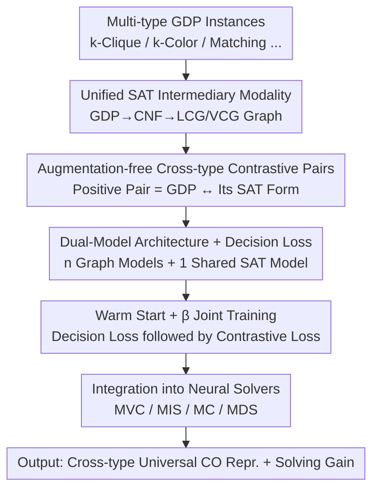

# ConRep4CO: Contrastive Representation Learning of Combinatorial Optimization Instances across Types

**Conference**: ICLR 2026  
**OpenReview**: [https://openreview.net/forum?id=OXRnvOOiAf](https://openreview.net/forum?id=OXRnvOOiAf)  
**Code**: https://github.com/Thinklab-SJTU/ConRep4CO  
**Area**: Combinatorial Optimization / Representation Learning / Contrastive Learning / Graph Neural Networks  
**Keywords**: Combinatorial Optimization, Contrastive Pre-training, SAT Reduction, Cross-type Representation, Graph Decision Problems

## TL;DR
ConRep4CO unifies diverse combinatorial optimization (CO) instance types by reducing them to a SAT format as an "intermediary modality." It employs augmentation-free contrastive pre-training using "original instance ↔ its SAT form" as positive pairs to learn cross-problem universal representations. When integrated into specialized neural solvers for MVC, MIS, MC, and MDS, the optimality gap is reduced by an average of 32% to 61%.

## Background & Motivation
**Background**: Machine learning for combinatorial optimization (ML4CO) has gained significant attention. The dominant paradigm involves a two-stage process: encoding graph instances into low-dimensional representations via GNNs, followed by solution prediction or construction. However, most existing works are tailored for **single problem types**, such as specifically for TSP or graph matching.

**Limitations of Prior Work**: Compared to mature representation learning in NLP and CV (e.g., BERT, CLIP), **representation learning** for CO has been largely overlooked, particularly universal representations across **heterogeneous types**. Single-type methods are trained in isolation; knowledge learned from k-Clique does not benefit k-Coloring, failing to exploit potential commonalities between problems and leading to poor generalization on larger or unseen instances.

**Key Challenge**: To perform cross-type contrastive learning, a direct approach would be to adopt SimCLR from CV, which generates positive samples via data augmentation. However, "augmentation" for CO instances is notoriously difficult, as graph structures are highly constrained. Randomly adding edges or deleting nodes often destroys problem semantics (e.g., a satisfiable instance might become unsatisfiable), making CV-style augmentation unsuitable. Furthermore, topological differences between diverse Graph Decision Problem (GDP) types are vast, lacking a natural common space for alignment.

**Goal**: ① Identify a common representation space spanning heterogeneous CO problem types; ② Construct effective contrastive positive/negative pairs without relying on data augmentation; ③ Ensure the learned universal representations effectively enhance actual NP-hard optimization solvers.

**Key Insight**: The authors leverage the theoretical fact that **all NP-complete (NPC) problems can be reduced to one another and specifically to the Boolean Satisfiability Problem (SAT)**. Among Karp’s 21 NPC problems, 10 are GDPs, which are decision versions of various NP-hard optimization problems (MVC, MIS, etc.). Since SAT serves as their "greatest common form," it can act as the bridge connecting all types.

**Core Idea**: Treat each GDP as a "modality" and use the **SAT format as the unified intermediary modality**. The "original GDP instance" and its "reduced SAT instance" naturally form a contrastive positive pair (augmentation-free). Through contrastive learning, heterogeneous problem types are aligned in the same representation space, establishing a transferable CO pre-training paradigm.

## Method

### Overall Architecture
ConRep4CO addresses how to learn universal representations across multiple CO problem types. The process begins with $n$ types of GDPs (k-Clique, k-Color, Matching, etc.), reducing each instance into CNF via tools like CNFGen and constructing SAT graphs (LCG or VCG). The architecture assigns an independent "graph model" to each GDP type and uses a single shared "SAT model," each consisting of a **representation extractor (GNN) and an output module (MLP)**. Training involves two types of supervision: **decision loss** to ensure each model learns discriminative representations within its domain, and **contrastive loss** to align GDP modalities with the SAT modality, enabling information flow across problem domains. The pre-trained SAT model can be frozen and integrated into specialized solvers for MVC/MIS/MC/MDS to achieve gains across multiple tasks.

### Key Designs

**1. SAT as a Unified Intermediary Modality: Finding a Common Space for Heterogeneous Types**

Topological differences between GDPs hinder cross-type representation learning. The authors reduce each GDP instance $(P_i, G_i^j)$ to a CNF formula and then a SAT graph $B_i^j$ (using LCG or VCG). Consequently, whether the original problem is coloring or clique search, it is standardized into a SAT graph representation, providing a unified modeling interface. Reduction via CNFGen has polynomial complexity and is negligible compared to training costs. This step converts the challenge of "aligning heterogeneous graphs" into a simpler task of "aligning each instance with its SAT form."

**2. Augmentation-free Cross-type Contrastive Pairs: Generating Pairs via SAT Reduction**

Unlike CV, which uses cropping/flipping for positive samples, CO instances cannot be easily augmented without losing semantics. ConRep4CO **eschews augmentation entirely**: for a GDP type $P_n$, the "original instance" and its "reduced SAT instance" are defined as a **positive pair**. Negative samples for the graph model are SAT graphs of other instances in the same GDP type, and vice versa for the SAT model. The contrastive loss uses a standard InfoNCE form for bidirectional alignment of $N$ pairs within a batch:

$$\mathcal{L}_{con,n}=\sum_{i=1}^{N}\left(-\log\frac{\exp(\mathrm{sim}(\hat r_n^i,\hat r_{sat}^i)/\tau)}{\sum_{j=1}^{N}\mathbb{1}_{j\neq i}\exp(\mathrm{sim}(\hat r_n^i,\hat r_{sat}^j)/\tau)}-\log\frac{\exp(\mathrm{sim}(\hat r_n^i,\hat r_{sat}^i)/\tau)}{\sum_{j=1}^{N}\mathbb{1}_{j\neq i}\exp(\mathrm{sim}(\hat r_n^j,\hat r_{sat}^i)/\tau)}\right)$$

where $\hat r_n^i$ and $\hat r_{sat}^i$ are normalized representations, $\tau$ is temperature, and $\mathrm{sim}(\cdot,\cdot)$ is cosine similarity. The SAT modality acts as a "hub" aligned with all other modalities, allowing knowledge from k-Clique to transfer to k-Color via SAT.

**3. Dual-Model Architecture + Decision Loss: Balancing Commonality and Domain-Specific Features**

To preserve problem-specific features while aligning commonalties, the authors employ $n+1$ models: $n$ graph models $M_1,\dots,M_n$ (one per GDP) and one unified SAT model $M_{sat}$. Each model comprises a representation extractor (GNN) and an output module (MLP). Besides the contrastive loss, each model is supervised by an independent **decision loss** (Binary Cross-Entropy):

$$\mathcal{L}_{dec}=\sum_{i\in Batch}\left[-d_i^{gt}\log(d_i^{out})-(1-d_i^{gt})\log(1-d_i^{out})\right]$$

where $d^{out}$ is the decision output and $d^{gt}$ is the ground truth. This ensures each model learns discriminative features for its specific GDP, while the contrastive loss facilitates cross-modal information fusion.

**4. Warm Start + β-weighted Joint Training: Stability before Alignment**

Simultaneously applying decision and contrastive losses might misguide the model before meaningful representations are learned. A **warm start** strategy is used: initially, only the decision loss is active. Once models learn stable task-specific representations, contrastive loss is introduced. During joint training, a weight parameter $\beta$ balances the two objectives. The SAT model is optimized by **averaging** the contrastive losses computed across all GDP modalities to ensure fair alignment.

**5. Integration into Specialized Neural Solvers: Enhancing Actual Optimization**

Pre-training occurs on GDPs, but the primary value lies in NP-hard optimization. The "plug-and-play" workflow involves: ① Converting decision-version instances of the target problem (e.g., MVC) into CNF; ② Aligning the neural solver with a **frozen** pre-trained SAT model using the defined losses; ③ Fine-tuning the solver in the original problem domain. Since the SAT model is reusable and fixed, this process requires only lightweight alignment rather than full retraining.

### Loss & Training
Total Loss = Decision Loss $\mathcal{L}_{dec}$ (independent BCE for each model) + Contrastive Loss $\mathcal{L}_{con}$ (InfoNCE aligning GDP and SAT modalities), weighted by $\beta$. Training utilizes a warm start: initial decision-only phase followed by joint training with contrastive alignment. The SAT model is optimized via the mean contrastive loss across all GDP modalities.

## Key Experimental Results

### Main Results
Evaluation covers **Representation Quality** (GDP accuracy) and **CO Solving Enhancement** (improvement in specialized solvers when integrated with ConRep4CO). Seven GDPs across easy/medium/hard difficulties were used, with 160k samples per easy/medium dataset (50/50 SAT/UNSAT ratio).

Representation Quality (GCN + ConRep4CO Overall Accuracy on identical distribution, selected):

| Difficulty | Configuration | Overall Accuracy (%) |
|------|------|------|
| Easy | Graph Model | 68.5 |
| Easy | + ConRep4CO | 71.9 |
| Medium | Graph Model | 65.7 |
| Medium | + ConRep4CO | 69.1 |

Improvement is particularly significant on GraphSAGE backbones: Easy Overall increases from 54.9 to 73.9, and Medium from 54.8 to 70.9.

CO Solving Enhancement (Optimality gap reduction, higher is better):

| Problem | Baseline Solver | Avg. Gain |
|------|-----------|-----------|
| MVC | OptGNN | 61.27% |
| MIS | GFlowNet | 32.20% |
| MC | GFlowNet | 36.46% |
| MDS | GFlowNet | 45.29% |

For MVC ER(50,100), the OptGNN baseline objective value is 55.87 (Optimal 54.62, absolute gap 1.25); with ConRep4CO, it reduces to 54.70 (gap 0.08), reflecting a gain of 93.6%.

### Ablation Study

| Configuration | Easy Overall (%) | Medium Overall (%) | Description |
|------|------|------|------|
| + ConRep4CO (Full) | 71.9 | 69.1 | Cross-domain transfer enabled |
| + ConRep4CO + Single Domain | 71.4 | 67.9 | Cross-domain transfer disabled |

Disabling cross-domain transfer leads to a drop in performance (most visible in Medium, 69.1 → 67.9), confirming that "cross-domain information transfer" is a core benefit beyond the SAT transformation itself.

### Key Findings
- **Cross-domain transfer is the primary gain source**: Table 6 shows the single-domain version (Ours-1) provides only ~5% gain, mostly from the SAT transformation; multi-domain alignment drives major performance increases.
- **Saturation of pre-training domains**: As the number of source domains increases from 1 to 7, downstream gains grow **sub-linearly**. The jump from 1 to 2 is steepest, saturating after 5–6 domains (diminishing marginal returns).
- **Reduced gain for large-scale problems**: Gains are smaller on larger instances (e.g., 38.83% for MVC ER(400,500)), likely due to the size gap between pre-training and evaluation.
- **Significant generalization improvements**: Ours consistently outperforms independently trained baselines on unseen hard datasets (in-domain size generalization) and completely unseen GDP domains (cross-domain, via minor fine-tuning).

## Highlights & Insights
- **Transforming heterogeneous alignment into instance-reduction alignment**: Directly aligning different GDP graphs is difficult. The authors use NPC theoretical reductions to treat SAT as a common form, effectively reducing a complex problem into a simpler task of aligning naturally paired instances.
- **Augmentation-free contrastive learning**: Rather than forcing problematic graph augmentations, the "Original ↔ SAT" pairing provides genuine semantic equivalence, proving more reliable than random perturbations.
- **Transferable paradigm**: The process of "frozen pre-trained SAT model + lightweight alignment + fine-tuning" effectively brings a CLIP-style "pre-train + downstream adapt" paradigm to CO, making it reusable across multiple solvers.

## Limitations & Future Work
- **Dependency on labeled data**: Decision loss requires SAT/UNSAT labels, which may be sparse; authors suggest exploring unsupervised/self-supervised approaches.
- **SAT-centric reduction**: Current intermediary modality is fixed to SAT, which fits NPC problems well but may be less suitable for general CO like MILP.
- **Scale generalization decay**: Gains decrease as instance size grows, indicating a bottleneck where the scale gap between pre-training and downstream remains an issue.
- **Information saturation**: The saturation at 5–6 domains suggests a cap on information gain that has not yet been overcome.

## Related Work & Insights
- **vs. Single-type ML4CO**: Conventional methods are isolated; ConRep4CO uses SAT as a hub to bridge types and share cross-domain knowledge, enhancing generalization.
- **vs. Multi-task CO (GOAL, UniCO)**: Unlike direct multi-task learning, ConRep4CO focuses on contrastive pre-training for shared representations and is orthogonal to these methods.
- **vs. Graph Contrastive Learning (SimCLR, GraphCL)**: Traditional methods rely on structural/feature perturbations that destroy CO semantics; ConRep4CO is **augmentation-free**, utilizing semantic-preserving SAT reductions.

## Rating
- Novelty: ⭐⭐⭐⭐⭐ Leveraging NPC reductions for cross-type CO representation via SAT-hubbed contrastive learning is innovative and theoretically grounded.
- Experimental Thoroughness: ⭐⭐⭐⭐ Extensive testing across 7 GDPs and 4 NP-hard problems, including generalization and saturation analyses; however, focused on synthetic rather than real-world graphs.
- Writing Quality: ⭐⭐⭐⭐ Clear motivation, well-structured diagrams, and transparent explanation of the reduction/contrastive scheme.
- Value: ⭐⭐⭐⭐ The "one pre-train, multiple reuse" paradigm is highly attractive for ML4CO, demonstrating substantial gap reductions.

<!-- RELATED:START -->

## Related Papers

- [\[ICLR 2026\] HeuriGym: An Agentic Benchmark for LLM-Crafted Heuristics in Combinatorial Optimization](heurigym_an_agentic_benchmark_for_llm-crafted_heuristics_in_combinatorial_optimi.md)
- [\[ICLR 2026\] FrontierCO: Real-World and Large-Scale Evaluation of Machine Learning Solvers for Combinatorial Optimization](frontierco_real-world_and_large-scale_evaluation_of_machine_learning_solvers_for.md)
- [\[ICLR 2026\] NExCO: Native Solution Expansion for Diffusion-based Combinatorial Optimization](nexco_native_solution_expansion_for_diffusion-based_combinatorial_optimization.md)
- [\[ICLR 2026\] Multi-Action Self-Improvement for Neural Combinatorial Optimization](multi-action_self-improvement_for_neural_combinatorial_optimization.md)
- [\[ICML 2026\] Bayesian Gated Non-Negative Contrastive Learning](../../ICML2026/optimization/bayesian_gated_non-negative_contrastive_learning.md)

<!-- RELATED:END -->
