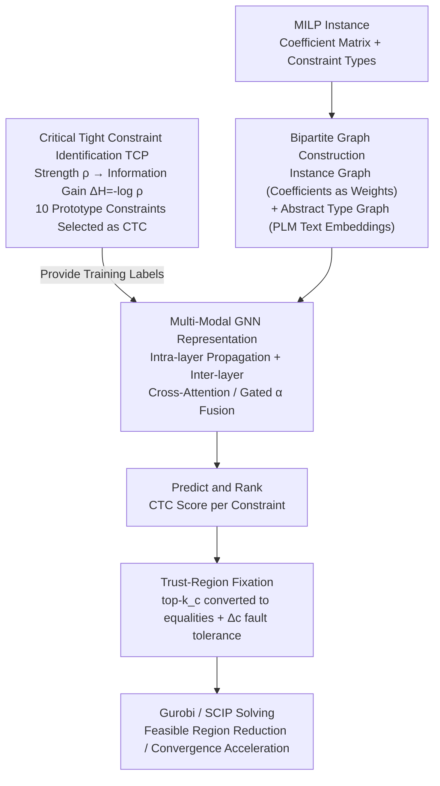

# Constraint Matters: Multi-Modal Representation for Reducing Mixed-Integer Linear programming

**Conference**: ICLR2026  
**arXiv**: [2508.18742](https://arxiv.org/abs/2508.18742)  
**Code**: [https://github.com/Liwow/Constraint_Matters](https://github.com/Liwow/Constraint_Matters)  
**Area**: Optimization/Theory  
**Keywords**: MILP, constraint reduction, tight constraint, multi-modal representation, GNN

## TL;DR

A MILP model simplification framework based on constraint reduction is proposed. It defines fixed constraint strength $\rho$ and utilizes information gain $\Delta H=-\log\rho$ to identify Critical Tight Constraints (CTC). A multi-modal GNN representation, merging instance-level bipartite graphs with abstract-level type graphs, is designed to predict CTCs. Across 4 large-scale benchmarks, solution quality ($\text{gap}_\text{abs}$) improved by an average of 51.06%, and convergence speed (PDI) accelerated by an average of 17.47%.

## Background & Motivation

**Background**: Large-scale MILP problems are prevalent in industrial scenarios such as production scheduling, supply chain, and energy management. Exact solvers like Gurobi/SCIP are computationally expensive for large-scale instances. ML-based model reduction (predicting and fixing a subset of variables) is a mainstream acceleration method.

**Limitations of Prior Work**:

- Variable reduction (Predict-and-Search, ConPaS, etc.) can lead to infeasible solutions if predictions are incorrect.
- Constraint reduction (converting inequality constraints into equalities) has rarely been systematically studied.
- Directly fixing all tight constraints yields unstable results: on CA_easy tasks, the best fixation takes only 1.85s vs. 465.74s for the worst (baseline 378.23s).

**Key Challenge**: Different tight constraints contribute vastly differently to solving acceleration—random fixation may actually slow down the process, necessitating a principled selection.

**Key Insight**: Starting from duality theory, constraints and variables are inherently coupled; fixing tight constraints is equivalent to reducing the feasible region. The key problem becomes: which constraints are most worth fixing? How can they be predicted efficiently?

## Method

### Overall Architecture

The framework addresses the bottleneck of slow large-scale MILP solving by fixing a subset of tight constraints (inequalities that hold as equalities at the optimal solution) to reduce the feasible region. This process is divided into three sequential steps: first, an information-theoretic rule is used to define "which types of constraints are worth fixing," labeling them as Critical Tight Constraints (CTC) for training. Second, a multi-modal graph network encodes MILP instances to capture both coefficient matrices and constraint semantic types, predicting and ranking the CTC score for each constraint. Finally, the top-$k_c$ constraints are converted to equalities with a trust-region approach for fault tolerance and solved using Gurobi/SCIP. These steps answer "which to fix," "how to represent and predict," and "how to fix safely."

### Key Designs

**1. CTC Identification: Quantifying Constraint Value via Information Gain**

Since fixing all tight constraints results in large performance fluctuations (1.85s to 465.74s), a principled ranking is required. This work uses an information-theory-inspired TCP (Tight Constraints Priority) module. It defines the fixed constraint strength $\rho(C_i)=|S_{\hat{C}_i}|/|S_{C_i}|$, representing the reduction ratio of the local feasible region after fixing category $C_i$, and converts it into "fixation gain" via information gain $\Delta H_{C_i}=-\log\rho$. A smaller $\rho$ indicates a more compressed feasible region and higher $\Delta H$, contributing more to acceleration. Based on this, 10 prototypes are selected from 17 basic MIPLIB constraints to estimate strength: Set Packing constraints have $\rho=n/(n+1)\to 1$ (low gain), while Knapsack and Bin Packing have $\rho=O(1/A\sqrt{n})$ (high gain). Consequently, tight constraints in the latter categories are prioritized as CTCs.

**2. Multi-modal GNN Representation: Semantic Types as a Second Modality**

Relying solely on the coefficient matrix makes it difficult for networks to distinguish constraint types (e.g., Knapsack vs. Set Packing) and weakens cross-instance generalization. CTCs are strongly correlated with constraint categories. Thus, the method overlays two graphs: a lower-level standard instance bipartite graph (variables and constraints as nodes, coefficients as edge weights) and an upper-level abstract type bipartite graph where nodes represent variable/constraint categories. Initial features for categories are encoded from text descriptions using a Pre-trained Language Model (PLM). Intra-layer message passing (MP) occurs independently, followed by inter-layer MP fusion: abstract category nodes use Cross-Attention to query corresponding instance node features. Simultaneously, the mean instance feature $\bar{h}_{V_j}$ and abstract feature $\hat{h}_{V_j}$ are gated via $\alpha=\text{Gate}(\bar{h}_{V_j}\,\|\,\hat{h}_{V_j})\in[0,1]$ to dynamically fuse information back into instance nodes.

**3. Trust-Region Fixation: Buffering Prediction Errors**

To prevent infeasibility caused by incorrect predictions, a trust-region parameter $\Delta_c$ is introduced, allowing at most $\Delta_c$ fixed constraints to violate the equality form. This creates a buffer between "full fixation" and "full relaxation." Since the optimal solution $x^*$ already satisfies these tight constraints, fixing them (or penalizing violations) does not exclude $x^*$. Even with prediction noise, $\Delta_c$ ensures the reduced feasible region remains a non-empty subset of the original, likely containing $x^*$.

### Loss & Training

Focal Loss is used instead of Cross-Entropy to counter selective learning bias, where the network tends to predict simple, non-critical constraints with high confidence. Focal Loss down-weights easy samples using $(1-\hat{y})^\gamma$, forcing focus onto difficult and critical CTCs. The total loss combines variable and constraint predictions: $\mathcal{L}=\lambda\mathcal{L}^{\text{sol}}_{\text{Focal}}+(1-\lambda)\mathcal{L}^{\text{con}}_{\text{Focal}}$.

## Key Experimental Results

### Main Results (800s limit, 100 test instances)

| Method | CA $\text{gap}_\text{abs}$↓ | CA PDI↓ | MIS $\text{gap}_\text{abs}$↓ | MIS PDI↓ | MVC $\text{gap}_\text{abs}$↓ | MVC PDI↓ | WA $\text{gap}_\text{abs}$↓ | WA PDI↓ |
|------|---:|---:|---:|---:|---:|---:|---:|---:|
| Gurobi | 477.51 | 76.29 | 2.70 | 33.09 | 8.38 | 68.02 | 0.20 | 4.76 |
| PS+Gurobi | 210.19 | 73.78 | 0.04 | 0.69 | 0.28 | 7.39 | 0.07 | 4.97 |
| ConPaS+Gurobi | 197.36 | 73.75 | 0.02 | 0.71 | 0.10 | 7.64 | 0.10 | 4.97 |
| **Ours+Gurobi** | **104.72** | **73.02** | **0.00** | **0.47** | **0.00** | **6.26** | **0.06** | **4.40** |
| Gain(%) | 77.06% | 4.22% | 100% | 98.58% | 100% | 90.80% | 70.00% | 7.56% |
| SCIP | 4005.99 | 190.18 | 4.16 | 103.91 | 12.42 | 140.89 | 2.60 | 37.06 |
| PS+SCIP | 3575.18 | 179.48 | 0.66 | 6.49 | 2.98 | 21.03 | 1.27 | 34.85 |
| ConPaS+SCIP | 3545.92 | 146.88 | 0.43 | 5.52 | 2.56 | 24.05 | 1.20 | 29.91 |
| **Ours+SCIP** | **3401.63** | **109.41** | **0.34** | **4.65** | **1.48** | **18.34** | **0.83** | **21.52** |
| Gain(%) | 15.08% | 42.47% | 91.83% | 95.52% | 88.08% | 86.98% | 68.08% | 41.93% |

In Gurobi, the $\text{gap}_\text{abs}$ for MIS and MVC dropped to 0 (perfectly finding the optimal solution); in SCIP, PDI improved by up to 42.47%.

### Generalization & Real-world Scenarios

| Method | CA (Large) $\text{gap}_\text{abs}$↓ | CA PDI↓ | MVC (Large) $\text{gap}_\text{abs}$↓ | MVC PDI↓ | MMCN (Real) $\text{gap}_\text{abs}$↓ | MMCN PDI↓ |
|------|---:|---:|---:|---:|---:|---:|
| SCIP | 7009.58 | 198.78 | 22.07 | 228.21 | 13819.90 | 427.63 |
| PS | 6541.87 | 169.86 | 4.07 | 39.63 | 8084.36 | 329.60 |
| ConPaS | 6287.22 | 156.95 | 2.20 | 35.39 | 6064.85 | 330.05 |
| **Ours** | **5955.86** | **131.44** | **0.55** | **24.54** | **3547.08** | **246.89** |

On the real-world logistics network MMCN, the $\text{gap}_\text{abs}$ decreased from 13819.90 to 3547.08 (↓74.3%).

### Sensitivity to Constraint Fixation

| Scenario | CA_easy Time (s) | WA Time (s) |
|------|---:|---:|
| Original Solve | 378.23 | >3600 |
| Best Fixation | 1.85 | 50.73 |
| Worst Fixation | 465.74 | >3600 |

The 250x gap between best and worst fixation underscores that "which constraints are fixed" is critical.

## Highlights & Insights

- **New Dimension of Constraint Reduction**: One of the first systematic studies on constraint reduction in ML4Optimization, complementing variable reduction.
- **Informing Principled Design**: $\rho$ and $\Delta H$ provide a theoretically grounded measure of constraint importance rather than relying on heuristics.
- **Novel Multi-modal Definition**: Fusing the abstract model (semantic types) with instance modalities—a perspective applicable to other structured optimization problems.
- **Significant Speedup with 5% Fixation**: Low prediction overhead with high returns.

## Limitations & Future Work

- The local decoupling assumption (constraint types independently affecting the feasible region) may not hold under high coupling.
- CTC labeling relies on oracle optimal solutions, which are expensive to obtain.
- Validated only on binary integer variables; not yet extended to general integer encoding.
- Cannot be directly applied to standard benchmarks like MIPLIB that lack explicit mathematical descriptions.

## Related Work & Insights

- **vs. Variable Reduction (PS/ConPaS)**: This work opens a new direction in constraint reduction from a duality perspective, complementing existing methods.
- **vs. Bertsimas & Stellato (2022)**: The latter predicts all tight constraints, which is difficult; this work selects only a critical subset.
- **vs. Gasse et al. (2019) GNN**: The addition of abstract type graphs and PLM embeddings improves cross-instance generalization.

## Rating

- Novelty: ⭐⭐⭐⭐⭐ Innovative combination of constraint reduction, information theory, and multi-modal representation.
- Experimental Thoroughness: ⭐⭐⭐⭐ 4 datasets + real-world scenarios + generalization + ablation.
- Writing Quality: ⭐⭐⭐⭐ Motivation-driven with clear theoretical analysis.
- Value: ⭐⭐⭐⭐⭐ Opens a new path for constraint reduction in ML4Optimization.

<!-- RELATED:START -->

## Related Papers

- [\[ICLR 2026\] FMIP: Joint Continuous-Integer Flow for Mixed-Integer Linear Programming](fmip_joint_continuous-integer_flow_for_mixed-integer_linear_programming.md)
- [\[ICML 2026\] Provably Data-Driven Lagrangian Relaxation for Mixed Integer Linear Programming](../../ICML2026/optimization/provably_data-driven_lagrangian_relaxation_for_mixed_integer_linear_programming.md)
- [\[ICML 2026\] Variational Adapter for Cross-modal Similarity Representation](../../ICML2026/optimization/variational_adapter_for_cross-modal_similarity_representation.md)
- [\[ICLR 2026\] In-Context Multi-Objective Optimization](in-context_multi-objective_optimization.md)
- [\[ICLR 2026\] Optimizer Choice Matters for the Emergence of Neural Collapse](optimizer_choice_matters_for_the_emergence_of_neural_collapse.md)

<!-- RELATED:END -->
