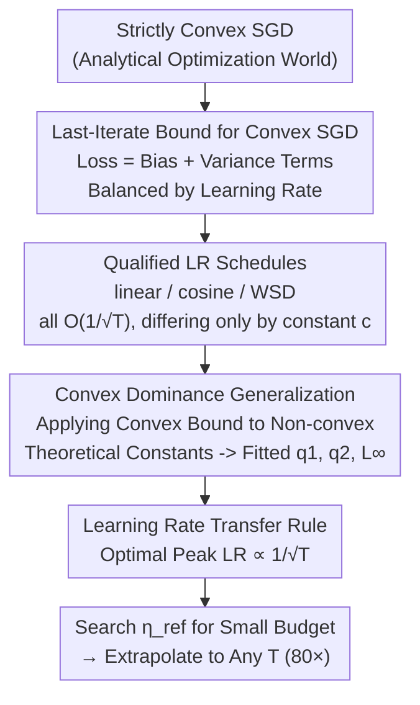

# Convex Dominance in Deep Learning I: A Scaling Law of Loss and Learning Rate

**Conference**: ICLR 2026  
**arXiv**: [2602.07145](https://arxiv.org/abs/2602.07145)  
**Code**: Not public  
**Area**: Optimization  
**Keywords**: Scaling Law, Learning Rate Schedule, Convex Optimization, Loss Convergence, Training Planning

## TL;DR
Starting from convex optimization theory, this work proves that deep learning training loss converges at a rate of $O(1/\sqrt{T})$ and the optimal learning rate scales with $1/\sqrt{T}$. This scaling law is validated on models ranging from GPT-2 to 12.5B parameter models ($R^2 \ge 0.978$), achieving learning rate extrapolation for up to 80x the training steps.

## Background & Motivation

**Background**: Chinchilla-style scaling laws describe the relationship between loss and data volume or model size, but the theoretical foundation for the coupling of loss with training steps and learning rate is lacking. In practice, the choice of learning rate schedules (cosine, linear decay, WSD) is primarily empirical.

**Limitations of Prior Work**: When changing the training budget (total steps $T$), the optimal learning rate must be re-searched—an expensive and uncertain process. Existing empirical scaling laws lack theoretical guidance and cannot reliably extrapolate to new training settings.

**Key Challenge**: Despite deep learning being a non-convex optimization problem, the convergence behavior observed in actual training resembles convex optimization. This "implicit convexity" has not been systematically theorized.

**Goal**: (a) Establish a unified scaling law for loss, learning rate, and training steps; (b) achieve learning rate transfer across training budgets.

**Key Insight**: It is hypothesized that deep learning macroscopically exhibits "convex dominance," where convergence bounds derived from convex analysis can describe actual training behavior.

**Core Idea**: Deep learning training loss follows $L(T) \approx L_\infty + C/\sqrt{T}$, and the optimal learning rate follows $\eta^* = \eta_{\text{ref}}/\sqrt{T}$, where $\eta_{\text{ref}}$ can be determined in small-scale experiments and then directly transferred.

## Method

### Overall Architecture
The paper addresses the quantitative relationship between training loss, learning rate, and total training steps $T$, and whether the optimal learning rate can be fixed in small-scale experiments for large-scale application. The reasoning chain is as follows: first, derive a "last-iterate" loss upper bound for strictly convex SGD to understand how loss changes with steps and learning rate; then, extract conditions for "qualified learning rate schedules" that achieve optimal convergence rates; next, apply the form from convex theory directly to non-convex deep learning by replacing theoretical constants with coefficients fitted from data; finally, derive a concise learning rate transfer rule from the fitted scaling law.

### Key Designs

**1. Last-Iterate Convergence Bound for Convex SGD: Clarifying the Loss-LR relationship**
The theoretical starting point is SGD on strictly convex objectives. The authors derive the loss upper bound for the **last-iterate** $w_T$, as actual training utilizes the final model rather than the historical average. The bound takes the form:

$$\mathbb{E}[L(w_T)] \le L^* + \frac{D^2}{2\sum_t \eta_t} + \frac{G^2 \sum_t \eta_t^2}{2\sum_t \eta_t} + \text{residual terms},$$

where $D$ is the distance from initialization to the optimum, $G$ is the gradient norm upper bound, and $\eta_t$ is the learning rate at step $t$. This expression decomposes the excess loss into two parts: one that decays as the sum of learning rates $\sum_t \eta_t$ increases (reduced bias), and one that rises as $\sum_t \eta_t^2$ increases (increased variance). The optimal learning rate is the equilibrium point of these two terms.

**2. Qualified Learning Rate Schedules: Proving rate equivalence**
Next, the paper identifies which learning rate schedules allow loss to converge at the optimal $O(1/\sqrt{T})$ rate. The authors define these as **qualified schedules** and prove that linear decay, cosine decay, and WSD (warmup-stable-decay) all qualify. For each qualified schedule, optimizing the peak learning rate yields:

$$\eta_{\text{peak}}^*(T) = \frac{D}{G\sqrt{c\,T}},$$

where $c$ is a constant factor depending only on the schedule shape. This theoretically explains why switching between different decay curves often yields similar final performance in practice.

**3. Generalization to Deep Learning (Convex Dominance Hypothesis): Applying convex form to non-convex training**
Real-world deep learning is non-convex, and theoretical parameters like $D$, $G$, and $L^*$ cannot be directly computed. The core bet of the paper is the **Convex Dominance Hypothesis**: despite the non-convex loss landscape, the macroscopic optimization dynamics are dominated by convexity, meaning the **functional form** of the convex bound should remain valid. Consequently, the loss is modeled as:

$$\mathbb{E}[L(w_T)] \approx L_\infty + \frac{q_1^2}{T\,\eta_{\text{peak}}} + \eta_{\text{peak}}\,q_2^2,$$

where $L_\infty$ (irreducible loss), $q_1$, and $q_2$ are coefficients fitted from actual training data. Optimizing for $\eta_{\text{peak}}$ gives $\eta_{\text{peak}}^* = q_1 / (q_2\sqrt{T})$—consistent with $1/\sqrt{T}$ scaling in the convex case.

**4. Learning Rate Transfer Rule: Extrapolating to arbitrary budgets**
The derived $\eta_{\text{peak}}^*(T) \propto 1/\sqrt{T}$ leads directly to a transfer rule:

$$\eta_{\text{peak}}^*(T) = \frac{\eta_{\text{ref}}}{\sqrt{T}},\qquad \eta_{\text{ref}} = \eta_{\text{peak}}^*(T_{\text{small}})\cdot\sqrt{T_{\text{small}}}.$$

This implies one only needs to find the optimal learning rate for a small training budget $T_{\text{small}}$ to solve for the step-independent reference value $\eta_{\text{ref}}$. Subsequently, the optimal peak learning rate for any larger $T$ can be calculated without further searching. The paper demonstrates effective extrapolation for 80x the training steps with minimal error.

## Key Experimental Results

### Model Fitting Quality

| Model | Dataset | $R^2$ |
|------|--------|-----|
| ResNet18 | ImageNet | $\ge 0.95$ |
| GPT2-124M | OpenWebText | $\ge 0.95$ |
| GPT2-0.1B (AdamW) | OpenWebText | $\ge 0.99$ |
| GPT2-0.1B (Muon-NSGD) | OpenWebText | $\ge 0.99$ |

### Validation across Model Sizes (Chinchilla Dataset)

| Model Size | $L_\infty$ | $R^2$ |
|---------|-------|-----|
| 0.074B | 2.825 | 0.991 |
| 0.632B | 2.367 | 0.998 |
| 2.004B | 2.178 | 0.999 |
| 9.290B | 2.046 | 0.988 |
| 12.56B | 2.053 | 1.000 |

### Key Findings
- $L(T) \sim L_\infty + C/\sqrt{T}$ maintains $R^2 \ge 0.978$ across all tested settings.
- Learning rate transfer enables 80x extrapolation (from 100 steps to 5,000 steps) with minimal error.
- Different learning rate schedules (linear, cosine, WSD) exhibit highly consistent behavior when normalized.
- Various optimizers (SGD, AdamW, Muon) all follow the same scaling law.
- The scaling law form is consistent across model sizes (0.074B to 12.56B).

## Highlights & Insights
- **Bridging Theory and Practice**: Deriving bounds from convex optimization that accurately describe deep learning training supports the bold "Convex Dominance" hypothesis.
- **Practical Extrapolation Tool**: By determining $\eta_{\text{ref}}$ in small experiments, one can calculate the optimal learning rate for any training budget, bypassing expensive large-scale hyperparameter searches.
- **Unified Schedule Analysis**: Linear, cosine, and WSD schedules are equivalent under the scaling law framework, differing only by a constant factor.

## Limitations & Future Work
- "Convex Dominance" is an empirical hypothesis, while the deep learning loss landscape is theoretically non-convex.
- Fitting parameters ($L_\infty, q_1, q_2$) requires multiple training runs, incurring a non-negligible initial cost.
- Theoretical analysis for the warmup phase is not yet included.
- The validation is focused on pre-training; scaling laws for fine-tuning may differ.

## Related Work & Insights
- **vs Chinchilla Scaling Law**: Chinchilla describes the data/model size-loss relationship, whereas this paper describes the steps/learning rate-loss relationship; the two are complementary.
- **vs Kaplan et al. (2020)**: While early LLM scaling laws existed, they did not address learning rate scaling.

## Rating
- Novelty: ⭐⭐⭐⭐⭐ The theoretical link from convex optimization to deep learning scaling laws is profound.
- Experimental Thoroughness: ⭐⭐⭐⭐⭐ Spans ResNet to 12.5B GPT, covering 170x in model size.
- Writing Quality: ⭐⭐⭐⭐⭐ Rigorous derivation and clear experimental presentation.
- Value: ⭐⭐⭐⭐⭐ Direct guiding significance for LLM training planning.

<!-- RELATED:START -->

## Related Papers

- [\[NeurIPS 2025\] Functional Scaling Laws in Kernel Regression: Loss Dynamics and Learning Rate Schedules](../../NeurIPS2025/optimization/functional_scaling_laws_in_kernel_regression_loss_dynamics_and_learning_rate_sch.md)
- [\[ICLR 2026\] DeepAFL: Deep Analytic Federated Learning](deepafl_deep_analytic_federated_learning.md)
- [\[ICLR 2026\] Seesaw: Accelerating Training by Balancing Learning Rate and Batch Size Scheduling](seesaw_accelerating_training_by_balancing_batch_size_and_learning_rate_schedulin.md)
- [\[ICLR 2026\] Weight Decay May Matter More Than µP for Learning Rate Transfer in Practice](weight_decay_may_matter_more_than_µp_for_learning_rate_transfer_in_practice.md)
- [\[ICLR 2026\] WSM: Decay-free Learning Rate Schedule via Checkpoint Merging for LLM Pre-training](wsm_decay-free_learning_rate_schedule_via_checkpoint_merging_for_llm_pre-trainin.md)

<!-- RELATED:END -->
