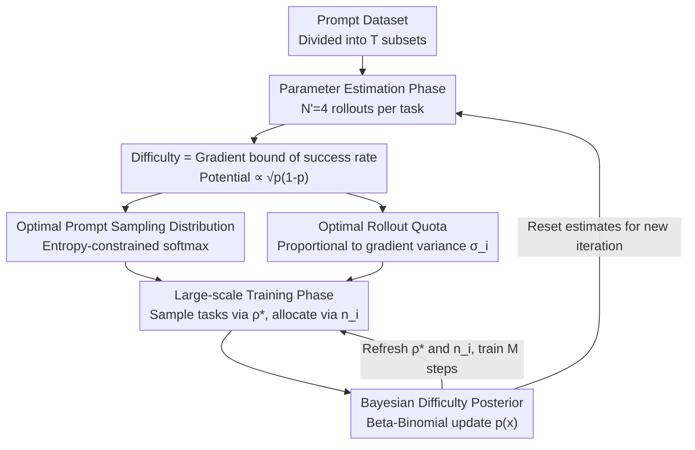

# CurES: From Gradient Analysis to Efficient Curriculum Learning for Reasoning LLMs

**Conference**: ICLR2026  
**OpenReview**: [https://openreview.net/forum?id=QXrZ0Y3yGJ](https://openreview.net/forum?id=QXrZ0Y3yGJ)  
**Code**: https://github.com/ZexuSun/CurES  
**Area**: Reinforcement Learning / Reasoning LLM / Curriculum Learning  
**Keywords**: RLVR, Curriculum Learning, Gradient Variance, Bayesian Posterior, Sample Efficiency

## TL;DR
Starting from gradient analysis in reinforcement learning, CurES proves that "the prompt sampling distribution determines convergence speed, while rollout quotas determine the stability of gradient updates." Based on this, it employs a Bayesian (Beta-Binomial) difficulty estimation to dynamically bias sampling probabilities and rollout budgets toward medium-difficulty tasks. It outperforms GRPO by an average of 3.3 (1.5B) / 4.82 (7B) points across eight mathematical reasoning benchmarks and achieves up to 5.5x faster convergence.

## Background & Motivation
**Background**: Reinforcement Learning with Verifiable Rewards (RLVR, e.g., GRPO, REINFORCE++) has become a mainstream paradigm for training reasoning LLMs. This involves sampling multiple rollouts for a single question and using "correctness" as a 0/1 reward to update the policy. However, standard practices typically treat all training questions **equally**, using uniform sampling and fixed rollout counts per question.

**Limitations of Prior Work**: Task difficulty is naturally heterogeneous. Uniform treatment wastes computational resources on two types of ineffective tasks: easy tasks where the model already succeeds (providing minimal gradient signal) and extremely difficult tasks that the model cannot yet learn. Existing improvements have flaws: manual staged curriculum learning is too coarse to track evolving model capabilities; online data filtering requires completing all rollouts before pruning, still wasting rollout computation; and dynamic resource re-allocation methods (e.g., GVM, Speed-RL) only address either sampling or rollout quotas in isolation.

**Key Challenge**: These methods are empirical and fragmented. They lack a unified theory to explain "which tasks to sample" and "how many rollouts to run per task" simultaneously—specifically, what metrics fundamentally determine training efficiency.

**Goal**: From the perspective of **gradients**, which is closest to the essence of optimization, this paper answers two sub-questions: (1) How does the prompt sampling distribution affect the loss convergence rate? (2) How do rollout quotas affect the consistency and stability of gradient updates? The answers are then implemented as a low-overhead practical algorithm.

**Key Insight**: This paper defines "task difficulty" directly as the model's success rate on that task $p_\theta(x)$, making difficulty a scalar that can be repeatedly estimated and updated during training. Using natural gradients and the Cramér-Rao inequality, the upper bound of the loss reduction for a single task is precisely derived as a function of $p_\theta(x)$.

**Core Idea**: The optimizable potential of the loss is proportional to $\sqrt{p_\theta(x)(1-p_\theta(x))}$, which peaks at $p=0.5$ (medium difficulty) and approaches zero as $p \to 0$ or $p \to 1$ (too hard or too easy). Based on this, both sampling probabilities and rollout budgets are biased toward medium-difficulty tasks, with difficulty estimates continuously and cheaply refreshed via Bayesian posterior updates during training.

## Method

### Overall Architecture
The goal of CurES is to maximize the gradient signal extracted at each policy update step under a fixed total rollout budget. It re-engineers RLVR training into a two-phase cycle: "estimate difficulty, then allocate resources," embedded within an iterative structure to resist distribution shift.

The pipeline is supported by two theoretical components and a practical algorithm loop. On the **theoretical side**, it proves that the upper bound of single-task loss reduction is determined by the difficulty $p_\theta(x)$ (Section 4.1), deriving the **optimal prompt sampling distribution**. It then proves that the variance of actual gradient estimates is determined by rollout quotas (Section 4.2), deriving the **optimal rollout quota**. On the **algorithmic side**, the dataset is divided into $T$ non-overlapping subsets for iterative training. Each iteration has two phases: ① **Parameter Estimation Phase**—run a small number of rollouts ($N'=4$) for each task in the current subset to cold-start difficulty and variance estimates; ② **Large-scale Training Phase**—sample prompts with replacement based on the estimated distribution and allocate rollouts according to quotas. After execution, the difficulty is refreshed via Bayesian posterior updates for the next RL update. Estimates are reset at the start of each new iteration to counter distribution shift caused by changing model capabilities.

### Key Designs

**1. Gradient Upper Bound of Difficulty: Converting "What to Practice" into a Solvable Optimization Problem**

The authors define task difficulty as the model's success rate $p_\theta(x)=\mathbb{E}_{y\sim\pi_\theta}[r(x,y)]$, where $r$ is a 0/1 reward. By performing an optimal update under a KL trust region constraint $\mathrm{KL}(\pi_{\theta_{old}}\|\pi_\theta)\le\delta$ and using a first-order Taylor expansion for loss and second-order for KL, they solve for the natural gradient direction. This yields a loss reduction magnitude equal to $\sqrt{2\delta\,g^\top F^{-1} g}$ (where $F$ is the Fisher Information Matrix). Noting that 0/1 rewards are unbiased estimators of success rates and applying the Cramér-Rao inequality leads to the core inequality:

$$|L(\theta_{old}+d)-L(\theta_{old})|\le\mathbb{E}_{x\sim\rho}\Big[\sqrt{2\delta\,p_{\theta_{old}}(x)\big(1-p_{\theta_{old}}(x)\big)}\Big].$$

This step provides the theoretical foundation, mapping the potential loss reduction of a task precisely to the function $\sqrt{p(1-p)}$. This peaks at $p=0.5$ and vanishes at extremes, theoretically **proving** the "medium difficulty is most useful" heuristic.

**2. Optimal Prompt Sampling Distribution: Biasing Probabilities Toward Medium Difficulty**

Since the potential per task is $\sqrt{p(1-p)}$, the sampling distribution $\rho$ should favor high-potential tasks without collapsing to a few samples (maintaining exploration). This is formulated as constrained optimization: $\max_\rho \mathbb{E}_{x\sim\rho}[\sqrt{2\delta p(1-p)}+\alpha H(\rho)]$. The closed-form solution is a temperature-scaled softmax:

$$\rho^*(x)=\frac{\exp\big(\sqrt{p(1-p)}/\tau\big)}{\sum_{x'}\exp\big(\sqrt{p(x')(1-p(x'))}/\tau\big)},\quad \tau=\frac{\alpha}{\sqrt{2\delta}}.$$

Unlike hard filtering (e.g., Speed-RL) that discards 0 or 1 accuracy tasks, this uses **continuous weighting**. Medium-difficulty tasks have the highest probability, while extreme tasks remain non-zero. The temperature $\tau$ smoothly adjusts "focus vs. exploration."

**3. Optimal Rollout Quota: Determining Samples via Gradient Variance**

While sampling handles task selection, gradient estimates $\hat g$ are calculated using finite rollouts, introducing variance that causes unstable updates. Minimizing the total variance $\mathrm{Tr}(V(\hat g))$ under a total budget $\sum_i n_i=N$ yields quotas proportional to the gradient standard deviation per task:

$$n_i=\frac{\sigma_i}{\sum_j\sigma_j}N,\quad \sigma_i=\sqrt{\mathrm{Tr}\big(V_{y\sim\pi_{old}}(h(y,x_i;\theta_{old}))\big)}.$$

A key insight is the calculation of $\sigma_i$. The authors expand the variance into a symmetric closed-form based on "correct/incorrect" outcomes, allowing it to **reuse the difficulty estimate $p(x)$** from Section 4.1. This explains why CurES behaves differently from GVM: while GVM monotonically decreases rollouts as accuracy increases, CurES uses a bell-shaped allocation (maximizing rollouts for medium difficulty), leading to more consistent gradients.

**4. Bayesian Difficulty Posterior + Iterative Subsets: Cheap, Accurate, and Robust Estimation**

The designs rely on accurate $p(x)$, but difficulty changes during training. Frequent evaluation is expensive. The authors split rollouts into mini-batches using Beta-Binomial conjugacy. Assuming $p_{\theta_{old}}(x_i)\sim\mathrm{Beta}(\alpha_0,\beta_0)$, observing $s$ correct out of $n_i$ rollouts updates the posterior: $\alpha_t=\alpha_{t-1}+s$ and $\beta_t=\beta_{t-1}+n_i-s$. Training **rollouts double as evidence for difficulty**, requiring no independent evaluation steps.

To combat distribution shift as the model improves, the dataset is divided into $T=15$ non-overlapping subsets. Each iteration trains for $M$ steps and **resets all difficulty and variance estimates** at the start of a new iteration, ensuring quotas align with current model capabilities.

### Loss & Training
The objective remains standard RLVR (maximizing expected verifiable reward within a trust region). The advantage function is $A_{\theta_{old}}(x,y)=r(x,y)-\mathbb{E}_{y\sim\pi_{old}}[r]$. GRPO and REINFORCE++ (RPP) can both serve as advantage estimators. Training uses the VERL framework. Policies are initialized with Qwen2.5-Math (1.5B / 7B); the learning rate is $1\times10^{-6}$. The Numina-Math dataset is split into 15 subsets for 15 iterations, with 4 cold-start rollouts per task and a training budget of $8\times1024$.

## Key Experimental Results

### Main Results
Evaluation across eight benchmarks (MATH500, GSM8K, Gaokao-EN, Minerva, OlympiadBench, AIME24, AIME25, AMC23), using a pass@16 average for competition-level sets.

| Model | Method | Avg. Score | vs GRPO |
|------|------|------|------|
| Qwen2.5-Math-1.5B | GRPO | 41.64 | — |
| 1.5B | GVM-GRPO | 42.82 | +1.18 |
| 1.5B | **CurES-GRPO** | **44.94** | **+3.30** |
| 1.5B | **CurES-RPP** | 44.14 | — |
| Qwen2.5-Math-7B | GRPO | 47.59 | — |
| 7B | GVM-GRPO | 50.64 | +3.05 |
| 7B | **CurES-GRPO** | **52.41** | **+4.82** |

CurES-GRPO achieves the best average scores at both scales, outperforming the strongest sample-efficient baseline by +2.12 points.

### Efficiency and Behavior Analysis

| Analysis | Configuration | Key Findings |
|------|------|---------|
| Convergence Speed (Fig.6) | CurES-GRPO vs GRPO | Reaches peak performance **5.5×** faster; CurES-RPP vs RPP is 1.75× faster. |
| Rollout Quota (Fig.4) | Different iterations | Quotas follow a "bell shape" relative to accuracy; medium difficulty tasks receive the most rollouts. |
| Sampling Config (Fig.5) | $N'\in\{4,8,16\}$, $n\in\{8,16,32\}$ | Diminishing returns beyond small $N'$ or $n$, proving high sample efficiency. |

### Key Findings
- **Theoretical Proof of "Medium Difficulty"**: Potential for loss reduction $\propto\sqrt{p(1-p)}$, maximizing at $p=0.5$.
- **CurES vs. GVM Resource Direction**: GVM decreases rollouts as accuracy rises; CurES allocates most to medium difficulty, providing more stable gradients via bell-shaped distribution.
- **Difficulty Shift**: The difficulty distribution shifts right and tightens as training progresses, making uniform sampling increasingly inefficient.

## Highlights & Insights
- **Heuristics to Theorems**: Instead of relying on intuition that medium difficulty is better, this paper uses the natural gradient to derive the $\sqrt{p(1-p)}$ upper bound.
- **Variance Reuse**: The $\sigma_i$ calculation for rollout quotas is simplified into a symmetric form that reuses $p(x)$, unifying task selection and resource allocation with zero additional overhead.
- **Bayesian Efficiency**: Using Beta-Binomial conjugacy amortizes the cost of evaluation into training rollouts, a transferable strategy for any online sample valuation task.
- **Iterative Resets**: Using simple subset splitting and estimate resets effectively handles distribution shift at a low engineering cost.

## Limitations & Future Work
- **Domain Specificity**: Experiments are limited to Qwen2.5-Math and math benchmarks; generalizability to code generation or logical reasoning is untested.
- **Theoretical Approximations**: Relies on Taylor expansions and natural gradient bounds which may vary in actual large-scale training.
- **Coarse Difficulty Metric**: Defining difficulty solely by success rate $p(x)$ overlooks structural gradient differences between tasks with identical success rates.
- **Hyperparameter Sensitivity**: $\tau$, $T$, and cold-start $N'$ may require tuning for new tasks.

## Related Work & Insights
- **vs GVM**: GVM uses gradient variance for quotas but decreases rollouts monotonically and ignores sampling distributions. CurES optimizes both, using a bell-shaped quota.
- **vs Speed-RL**: Speed-RL employs hard filtering. CurES uses continuous weighting via entropy-regularized softmax, preserving exploration while focusing on high-yield tasks.
- **vs Staged Curriculum**: Manual stages are too coarse; CurES is adaptive at the task and iteration level.
- **vs Online Filtering**: Filtering discards data after rollout; CurES allocates budget before rollouts, saving computation at the source.

## Rating
- Novelty: ⭐⭐⭐⭐⭐ Theoretically proves the medium-difficulty heuristic and unifies sampling with quotas.
- Experimental Thoroughness: ⭐⭐⭐⭐ Solid across scales and benchmarks, though limited to mathematical reasoning.
- Writing Quality: ⭐⭐⭐⭐ Clear derivation and logic, though math-heavy.
- Value: ⭐⭐⭐⭐⭐ Provides a theoretically grounded and practical resource allocation framework for RLVR, significantly accelerating convergence.

<!-- RELATED:START -->

## Related Papers

- [\[ICLR 2026\] New Hybrid Fine-Tuning Paradigm for LLMs: Algorithm Design and Convergence Analysis Framework](new_hybrid_fine-tuning_paradigm_for_llms_algorithm_design_and_convergence_analys.md)
- [\[ICLR 2026\] Sobolev Gradient Ascent for Optimal Transport: Barycenter Optimization and Convergence Analysis](sobolev_gradient_ascent_for_optimal_transport_barycenter_optimization_and_conver.md)
- [\[ICLR 2026\] Binomial Gradient-Based Meta-Learning for Enhanced Meta-Gradient Estimation](binomial_gradient-based_meta-learning_for_enhanced_meta-gradient_estimation.md)
- [\[ICLR 2026\] Clipped Gradient Methods for Nonsmooth Convex Optimization under Heavy-Tailed Noise: A Refined Analysis](clipped_gradient_methods_for_nonsmooth_convex_optimization_under_heavy-tailed_no.md)
- [\[ICML 2026\] Learning a Zeroth-Order Optimizer for Fine-Tuning LLMs](../../ICML2026/optimization/learning_a_zeroth-order_optimizer_for_fine-tuning_llms.md)

<!-- RELATED:END -->
