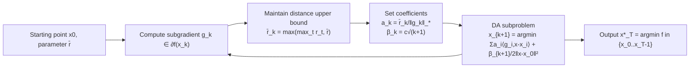

# DADA: Dual Averaging with Distance Adaptation

**Conference**: ICLR 2026  
**OpenReview**: [https://openreview.net/forum?id=t4WNcclzLE](https://openreview.net/forum?id=t4WNcclzLE)  
**Code**: TBD  
**Area**: optimization  
**Keywords**: convex optimization, parameter-free, dual averaging, distance adaptation, universal method, tuning-free step size  

## TL;DR
DADA grafts the technique of "dynamically estimating the distance from the initial point to the optimal solution" onto the classic Dual Averaging (DA) framework. This results in a universal first-order method that requires **no problem-dependent parameters, holds for both constrained and unbounded domains, and automatically adapts to six major convex function classes**. Simultaneously, it reduces the cost of misestimating the initial distance from multiplicative $\rho^2$ to logarithmic $\log^2\rho$.

## Background & Motivation

**Background**: First-order gradient methods are the workhorses of machine learning training. However, the learning rate must be determined through manual tuning or line search, which becomes increasingly expensive as models grow larger. Recently, a wave of parameter-free methods has emerged (DoG, DoWG, D-Adaptation, Prodigy, Bisection Search). The core idea is to dynamically estimate the initial distance $D_0:=\|x_0-x^*\|$, eliminating the need for prior knowledge of the step size.

**Limitations of Prior Work**: Almost all these methods are built upon AdaGrad-style conditioning on the accumulation of squared gradient norms. This leads to two significant drawbacks: first, the theoretical convergence rate is locked at the $\epsilon^{-2}$ magnitude, unable to automatically accelerate for smoother function classes (missing out even if the function has a Lipschitz Hessian); second, many methods either assume bounded domains (DoWG) or cannot be generalized to constrained problems (D-Adaptation, Prodigy). Another line of work, Nesterov's UGM, although called "universal," only covers the Hölder-smooth subset and relies on internal line searches, making it impractical for constrained or composite problems.

**Key Challenge**: True "universality" should imply a single algorithm with zero problem-dependent parameters that can achieve complexities matching the respective optimal rates across the entire spectrum—from non-smooth Lipschitz to high-order smooth and quasi-self-concordant functions. Existing methods either sacrifice universality for being parameter-free or sacrifice being parameter-free for universality.

**Goal**: To design a universal first-order method that is both parameter-free and valid for constrained/unbounded domains, while automatically adapting to the local growth behavior of the objective function.

**Core Idea**: **Replace AdaGrad-style accumulation with Dual Averaging (DA)**—instead of accumulating squared gradient norms, DADA directly normalizes each step's gradient $g_k$ by its own norm and allows the DA coefficients to inflate dynamically with the "distance from the iterate to the starting point" $r_t=\|x_0-x_t\|$. It is this combination of "normalization + distance-driven coefficients" that allows the algorithm to incur only a logarithmic cost for an unknown $D_0$ and enables the convergence rate to automatically adapt to the function's local growth function $\omega(t)$.

## Method

### Overall Architecture
DADA is built upon the skeleton of classic Weighted Dual Averaging (WDA): it accumulates weighted linearized terms of historical gradients at each step, adds a regularization term of $\frac{\beta_{k+1}}{2}\|x-x_0\|^2$, and solves for the next iterate $x_{k+1}$. The only essential difference from WDA lies in the selection of coefficients $a_k, \beta_k$—where WDA uses a fixed user estimate $\hat D_0$, DADA replaces it with an online-maintained distance upper bound $\bar r_k$. The entire analysis revolves around a scalar quantity $v(x)$ (the distance from the iterate to the "supporting hyperplane"), which is then translated into function residuals via the local growth function $\omega(\cdot)$, allowing a single proof to cover all function classes.

### Key Designs

**1. Using $v(x)$ instead of function residuals as the convergence scale to encapsulate "universality" in the local growth function $\omega$**: DADA does not look directly at $f(x)-f^*$. Instead, it defines the distance to the supporting hyperplane $v(x):=\frac{\langle\nabla f(x),x-x^*\rangle}{\|\nabla f(x)\|_*}\ge 0$ as a quality measure. Crucially, a bridge inequality exists between this and the function residual: $f(x)-f^*\le\omega(v(x))$, where $\omega(t):=\max_{x\in B(x^*,t)}f(x)-f^*$ characterizes the local growth of the objective near the optimum. This step is the lever of the entire paper: the algorithm itself only needs to guarantee $v^*_T\to 0$, while "how fast it runs on a specific function class" is entirely determined by the $\omega$ corresponding to that class. Thus, six categories of functions—non-smooth, Lipschitz-smooth, Hölder, high-order smooth, QSC, and $(L_0,L_1)$-smooth—share the same convergence proof. The complexities naturally differentiate by substituting different $\omega$ upper bounds, which is the technical implementation of "universality."

**2. Distance-driven coefficients: Normalized gradients + monotonically inflating $\bar r_k$**: DADA sets $a_k=\frac{\bar r_k}{\|g_k\|_*}$ and $\beta_k=c\sqrt{k+1}$, where $\bar r_k:=\max\{\max_{1\le t\le k}r_t,\ \bar r\}$ is the running maximum of all $r_t=\|x_0-x_t\|$ observed so far ($\bar r$ is a tiny initial guess). Similar to DoG/DoWG, it uses $r_t$ to estimate $D_0$, but the difference lies in simply dividing $g_k$ by its own norm $\|g_k\|_*$ rather than accumulating squared norms like AdaGrad. In the proof, this choice brings two chain benefits: first, it can be proven by induction that $\bar r_k\le\bar D$ is uniformly bounded (where $\bar D:=\max\{\bar r,\frac{2c}{c-\sqrt 2}D_0\}$), thereby eliminating the $\bar r_{k-1}$ term on the right side; second, combined with $D_0^2-D_k^2\le 2r_kD_0$ and a summation inequality for non-decreasing sequences, it ultimately yields $v^*_T\le\frac{eD}{\sqrt T}\log\frac{e\bar D}{\bar r}$ (Theorem 1).

**3. Reducing the cost of misestimating initial distance from multiplicative $\rho^2$ to logarithmic $\log^2\rho$**: In classic WDA, if $\hat D_0$ deviates from the true $D_0$, a multiplicative penalty $\rho^2$ ($\rho:=\max\{\hat D_0/D_0,\ D_0/\hat D_0\}$) is incurred, which explodes when $D_0$ is poorly estimated. DADA's complexity is unified as $T_v(\delta)=\frac{e^2D^2}{\delta^2}\log^2\frac{e\bar D}{\bar r}$, where the dependence on the initial guess $\bar r$ enters only into the $\log^2(\bar D_0/\bar r)$ term. In other words, even if $\bar r$ is set several orders of magnitude too small, the cost is only a log-squared factor. This is a substantial improvement over WDA and even some NGM variants (where the penalty remains multiplicative $\rho^2=D_0^2/\bar r^2$), and it serves as the theoretical basis for stable convergence even when $\delta=10^{-6}$ is set extremely conservatively in experiments. Setting the coefficient constant to $c=2\sqrt 2$ minimizes the complexity upper bound (outside the logarithmic factor).

**4. Unified complexity spectrum for six major function classes**: By substituting different $\omega$, DADA achieves complexities matching the standard rates for various classes (adding only an unavoidable logarithmic factor): Non-smooth Lipschitz $O(\frac{L_0^2\bar D_0^2}{\epsilon^2}\log^2_+\frac{\bar D_0}{\bar r})$; Lipschitz-smooth $O(\frac{L_1\bar D_0^2}{\epsilon}\log^2_+)$; Hölder-smooth $O((\frac{H_\nu}{\epsilon})^{\frac{2}{1+\nu}}\bar D_0^2\log^2_+)$; High-order Lipschitz derivatives $O((\frac{L_p}{p!\,\epsilon})^{\frac{2}{p+1}}\bar D_0^2\log^2_+)$; QSC $O(\frac{(M^2+\|\nabla^2 f(x^*)\|)\bar D_0^2}{\epsilon}\log^2_+)$; $(L_0,L_1)$-smooth $O(\frac{(L_1^2+L_0)\bar D_0^2}{\epsilon}\log^2_+)$. The difference from the line-search version of UGM is merely that the logarithmic factor is **multiplicative** rather than **additive**, but the trade-off gains coverage for classes UGM cannot reach, such as QSC and high-order smoothness. Notably, the QSC class is systematically covered by a first-order parameter-free method for the first time.

## Key Experimental Results

The goal of the experiments is to verify DADA's competitiveness across function classes without parameter tuning, comparing it against DoG, Prodigy, UGM (line search with initial $L_0=1$, target accuracy $\epsilon=10^{-6}$), and classic WDA. Starting point $x_0=(1,\dots,1)$, initial distance guess $\bar r=\delta(1+\|x_0\|)$, with $\delta=10^{-6}$.

### Main Results: High-order smooth worst-case functions

Test function $f(x)=\frac1p\sum_{i=1}^{d-1}|x^{(i)}-x^{(i+1)}|^p+\frac1p|x^{(d)}|^p$ ($d=10000$, optimum $x^*=0$), corresponding to the "high-order Lipschitz derivatives" class, where $p$ is adjusted to change the smoothness order:

| Method | $p=2$ | $p=4$ | $p=6$ | Tuning required? |
|------|-------|-------|-------|-----------|
| WDA (known $D_0$) | Near optimal | — | — | Yes (true $D_0$) |
| UGM (Line search) | Near optimal | Stable | Stable | Yes (line search) |
| DoG | Near optimal | Slows as $p$ grows | Significantly lags | No |
| Prodigy | Slow start, catches up | Slow start | Slow start | No |
| **DADA** | Near optimal | **Significantly faster than DoG** | **Significantly faster than DoG** | **No** |

### Key Findings
- **Advantage becomes more pronounced as $p$ increases**: At $p=2$, all methods are similar (except Prodigy, which is slow initially but catches up); as $p$ increases, DADA's convergence is significantly faster than DoG's. The authors attribute this to DADA's ability to automatically benefit from high-order smoothness, whereas DoG's rate is independent of $p$ and cannot exploit it.
- **Stable across $p$**: Only DADA and UGM remain stable and consistent across different $p$ values, with DADA slightly outperforming UGM—despite DADA not requiring UGM's line search.
- **Robustness to $\delta$**: Additional sensitivity experiments show that even when the initial distance guess $\bar r$ (controlled by $\delta$) is set extremely small, DADA still converges stably, confirming the theoretical $\log^2(\bar D_0/\bar r)$ logarithmic cost.

## Highlights & Insights
- **A small change in framework leverages massive universality**: Switching from "AdaGrad-style accumulation of squared norms" to "normalization by own norm + distance-driven coefficients" seems like a minor adjustment, but it ensures $v^*_T\to 0$, which in turn allows the convergence rate to adapt to the local growth $\omega(t)$—a property DoG and similar methods fail to achieve even in deterministic settings.
- **The $v(x)$ metric as a narrative pivot**: Using the distance to the supporting hyperplane as the convergence scale and bridging it to function residuals via $\omega$ cleverly decouples "algorithm analysis" from "function class characteristics," allowing six function classes to share a single proof.
- **Misestimation cost from $\rho^2$ to $\log^2\rho$**: This is the most valuable point for engineering—it means initial step sizes or distance guesses can be set very conservatively (small) with almost no loss in convergence speed, truly approaching "out-of-the-box" usability.
- **Expanded coverage to QSC and high-order smoothness**: Systematically covers quasi-self-concordant functions (logistic/softmax/exp all belong to this class) and high-order Lipschitz derivative functions with a first-order parameter-free method for the first time.

## Limitations & Future Work
- **No stochastic analysis**: Table 1 explicitly marks DADA with a ✗ in the Stochastic column. It currently only covers deterministic (full-gradient) settings, whereas DoG, Prodigy, and others already have stochastic versions—this is a necessary step before deployment in deep learning training.
- **Multiplicative rather than additive logarithmic factor**: Compared to the line-search version of UGM/GM-LS, which places the $\log$ in an additive position, DADA's $\log^2_+$ is multiplicative, making the theoretical rate slightly inferior; however, this is the price paid for broader function class coverage and avoiding line search.
- **Lack of an accelerated version**: The current version is non-accelerated DA, yielding $O(1/\epsilon)$ for the Lipschitz-smooth class instead of the $O(1/\sqrt\epsilon)$ of accelerated methods. Whether Nesterov acceleration can be integrated while maintaining universality remains an open question.
- **Synthetic experimental focus**: Validated only on synthetic convex worst-case functions, lacking empirical comparisons on real-world ML training scales (e.g., logistic regression, neural networks).

## Related Work & Insights
- **Distance adaptation lineage**: DoG (Ivgi 2023), DoWG (Khaled 2023), D-Adaptation (Defazio & Mishchenko 2023), and Prodigy (Mishchenko & Defazio 2024) all use $r_t$ or increasing lower bounds to estimate $D_0$; DADA's difference lies in using DA + normalization instead of AdaGrad accumulation.
- **Universal gradient methods**: Nesterov's UGM (2015) achieves optimal rates for Hölder-smooth functions via line search and is the direct point of comparison and target for DADA in terms of universality.
- **Comparison with Second-order / NGM**: For QSC, second-order methods (Doikov 2023) are more expensive per step but have better rates; NGM (Nesterov 2018/2024) and Vankov 2024 are non-adaptive relatives of DADA for $(L_0,L_1)$-smooth functions.
- **Insight**: When a parameter-free technique (distance adaptation in this case) is locked into a specific complexity by its framework, changing the underlying optimization skeleton (subgradient → dual averaging) often unlocks greater adaptive capabilities more effectively than tuning parameters within the original framework; "intermediate metric + bridge function" is a reusable paradigm for extending a single algorithm proof to multiple function classes.

## Rating
- **Novelty**: ⭐⭐⭐⭐ — Grafting distance adaptation onto DA to achieve true universality across six function classes, with QSC/high-order smoothness systematically covered by a first-order parameter-free method for the first time and misestimation cost reduced to logarithmic, represents a clean and powerful theoretical contribution.
- **Experimental Thoroughness**: ⭐⭐⭐ — Comparisons on synthetic worst-case functions clearly confirm the theory (larger $p$ advantage, robustness to $\delta$), but it lacks stochastic settings and verification on real ML task scales.
- **Writing Quality**: ⭐⭐⭐⭐ — Linking the entire paper with $v(x)$ and $\omega$, with Table 1 summarizing differences from similar methods, and providing a clear proof sketch.
- **Value**: ⭐⭐⭐⭐ — Provides a solid theoretical paradigm for "one algorithm fits many function classes with almost no tuning"; it would be highly attractive for practical training once a stochastic version is added.

<!-- RELATED:START -->

## Related Papers

- [\[ICML 2025\] Layer-wise Quantization for Quantized Optimistic Dual Averaging](../../ICML2025/optimization/layer-wise_quantization_for_quantized_optimistic_dual_averaging.md)
- [\[ICML 2026\] Rethinking the Flow-Based Gradual Domain Adaptation: A Semi-Dual Optimal Transport Perspective](../../ICML2026/optimization/rethinking_the_flow-based_gradual_domain_adaptation_a_semi-dual_optimal_transpor.md)
- [\[ICLR 2026\] Dual Optimistic Ascent (PI Control) is the Augmented Lagrangian Method in Disguise](dual_optimistic_ascent_pi_control_is_the_augmented_lagrangian_method_in_disguise.md)
- [\[ICLR 2026\] Bayesian Evidence-Driven Prototype Evolution for Federated Domain Adaptation](bayesian_evidence-driven_prototype_evolution_for_federated_domain_adaptation.md)
- [\[CVPR 2026\] Defending Unauthorized Model Merging via Dual-Stage Weight Protection](../../CVPR2026/optimization/defending_unauthorized_model_merging_via_dual-stage_weight_protection.md)

<!-- RELATED:END -->
