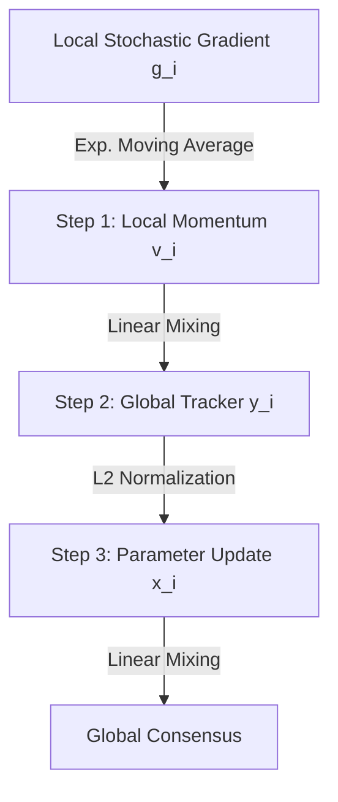

# Decentralized Nonconvex Optimization under Heavy-Tailed Noise: Normalization and Optimal Convergence

**Conference**: ICLR2026  
**OpenReview**: [https://openreview.net/forum?id=B0qUqxBOT6](https://openreview.net/forum?id=B0qUqxBOT6)  
**Code**: To be confirmed  
**Area**: optimization  
**Keywords**: decentralized optimization, heavy-tailed noise, gradient normalization, gradient tracking, nonconvex optimization  

## TL;DR
This paper proposes GT-NSGDm—a decentralized algorithm combining gradient normalization, momentum variance reduction, and gradient tracking. For the first time in a decentralized nonconvex setting, assuming only that gradient noise has finite $p$-th moments ($p\in(1,2]$), it proves that the expected gradient norm achieves the optimal convergence rate of $O(1/T^{(p-1)/(3p-2)})$, consistent with the centralized lower bound.

## Background & Motivation

**Background**: Decentralized optimization requires $n$ nodes to communicate only with direct neighbors in a graph to collaboratively solve a global objective $f(x)=\frac{1}{n}\sum_{i=1}^n f_i(x)$. It is widely used in distributed learning, privacy-sensitive medical scenarios, and data center training due to its scalability and privacy preservation (data remains local). First-order stochastic methods (DSGD, gradient tracking methods) are mainstream due to their simplicity and scalability, but they almost all assume that the stochastic gradient noise has **bounded variance**.

**Limitations of Prior Work**: Recent empirical and theoretical evidence shows that when training attention models (especially Transformers), gradient noise actually follows a **heavy-tailed distribution**—where variance is extremely large or even infinite (e.g., Lévy $\alpha$-stable noise). The paper’s Remark 2 observes that when training a 3M parameter GPT on Multi30k: as training progresses, the empirical distribution of the gradient noise norm shows increasingly heavier tails, resembling $\alpha$-stable noise rather than Gaussian. Under such noise, standard SGD faces training instability, sharp accuracy drops, or even model collapse.

**Key Challenge**: In centralized settings, mature techniques exist to handle heavy-tailed noise—nonlinear adaptive operators such as clipping, sign, or normalization. However, bringing these nonlinear operators into decentralized algorithms poses fundamental difficulties: decentralized algorithms are inherently iterations on "summation-average" objectives where peer-to-peer communication is a linear mixture. Applying nonlinear operators at each node introduces **non-linearity coupled with the summation structure** into the algorithmic dynamics, causing existing design and analysis frameworks to fail. The few existing works on decentralized heavy-tailed optimization (Sun & Chen 2024; Yu et al. 2023) are forced to add strong assumptions like strong convexity, compact domains/bounded gradients, or symmetric noise, and their convergence rates are either unclear or sub-optimal.

**Goal**: To design a decentralized first-order algorithm in the most general **nonconvex** heavy-tailed setting—assuming only **zero-mean + finite $p$-th moments ($p\in(1,2]$)** noise without requiring symmetry or bounded gradients—and achieve **optimal iteration complexity**.

**Key Insight**: The authors bet on normalization as the nonlinear operator—compared to clipping, normalization has fewer hyperparameters and is easier to tune. However, they pointedly note (Remark 3 + Claim 1) that **naively porting normalization to decentralized settings will fail**; it must be rescued by gradient tracking and momentum. This logic of "providing a counter-example first, then supplementing the design" is the primary methodological thread.

**Core Idea**: Use a "triad" of normalization (to combat heavy-tailed noise), momentum (for variance reduction), and gradient tracking (to eliminate node heterogeneity and nonlinear errors introduced by normalization) to pull decentralized heavy-tailed optimization back to the centralized optimal rate.

## Method

### Overall Architecture

GT-NSGDm (Gradient Tracking based Normalized Stochastic Gradient Descent with momentum) maintains three quantities at each node $i$ and updates them in three steps per iteration:

1.  **Local Momentum Gradient Estimate** $v_i^t$: An exponential moving average of local stochastic gradients.
2.  **Global Gradient Tracker** $y_i^t$: Approaches the global average gradient by mixing with neighbors.
3.  **Normalized Parameter Update** $x_i^{t+1}$: The $\ell_2$ normalization is applied only to the tracker during the $x$ update step, followed by neighborhood mixing.

The update equations for the three steps are:

$$v_i^t = \beta v_i^{t-1} + (1-\beta) g_i(x_i^t, \xi_i^t)$$

$$y_i^t = \sum_{r=1}^n w_{ir}\left(y_r^{t-1} + v_r^t - v_r^{t-1}\right)$$

$$x_i^{t+1} = \sum_{r=1}^n w_{ir}\left(x_r^t - \eta\,\frac{y_r^t}{\|y_r^t\|}\right)$$

where $\beta\in[0,1)$ is the momentum coefficient, $\eta$ is the step size, and $\{w_{ir}\}$ are mixing weights satisfying "primitive, doubly stochastic" properties—non-zero only if $(i,r)\in E$ or $i=r$, ensuring the algorithm uses only neighbor information. A key design tradeoff is: **normalization is applied only in the $x$ update, not in the recurrence of $v_i^t$ or $y_i^t$**. This keeps momentum and tracking as linear recurrences (facilitating analysis), while normalization limits the magnitude of the update direction to 1 at the final moment, suppressing heavy-tailed noise without destroying the tracker's convergence.

### Key Designs

**1. Design Motivation: Why Naive Decentralized Normalization Fails**
The authors first consider the most direct approach—each node normalizing its local gradient before mixing: $x_i^{t+1}=\sum_r w_{ir}(x_r^t - \eta\,\nabla f_r(x_r^t)/\|\nabla f_r(x_r^t)\|)$. The problem is: the global average $\bar{x}^t$ will move in the negative direction of the **sum of normalized local gradients**, i.e., $\bar{x}^{t+1}=\bar{x}^t-\frac{\eta}{n}\sum_r \frac{\nabla f_r(x_r^t)}{\\|\nabla f_r(x_r^t)\\|}$. However, at the optimal point $x^*$, while $\sum_r \nabla f_r(x^*)=0$, the norms $\|\nabla f_r(x^*)\|$ differ due to function heterogeneity. **Normalizing them individually before summing does not yield zero**, thus pushing the average iteration away from $x^*$ even if all nodes are at the optimum. Claim 1 proves that for any $B\geq 1$, one can construct $\{f_i\}$ such that the time-averaged gradient norm $\frac{1}{nT}\sum_t\sum_i \mathbb{E}\|\nabla f(x_i^t)\|\geq B$—meaning iterates can stay **arbitrarily far** from the optimum. This necessitates gradient tracking to eliminate the "heterogeneous normalization error."

**2. Mechanism: Gradient Tracking to Eliminate Bias**
To address the bias in Design 1, the gradient tracker $y_i^t$ is introduced. The classic role of gradient tracking is to eliminate node heterogeneity. Under doubly stochastic weights, $y_i^t$ converges to its global average $\bar{y}^t$, which in turn approximates the true global average gradient $\frac{1}{n}\sum_i \nabla f_i(x_r^t)$. By dividing by the norm of this tracked value, each node effectively uses the "scale of the global gradient direction" rather than biased local norms. This allows $x_i^t$ to move along the direction of the **normalized sum of global gradients**, simulating a centralized algorithm.

**3. Mechanism: Momentum Variance Reduction**
Normalization alone is insufficient. As a nonlinear operator, it generates bias when applied to gradients with heavy-tailed noise. To suppress this, the authors use local momentum $v_i^t=\beta v_i^{t-1}+(1-\beta)g_i$ as a form of variance reduction. This averages stochastic gradients over multiple steps, stabilizing the input to the tracker and normalization. In the theory, $\beta$ is tied to $T$: for known $p$, $1-\beta = 1/T^{p/(3p-2)}$ is used. This "momentum scheduling" reduces the effective noise of the normalized gradient to a level that allows for an optimal rate.

**4. Topology Influence: Spectral Gap and Speedup**
The rate depends on the spectral gap $\rho:=\|W-\mathbf{1}_n\mathbf{1}_n^\top/n\|_2<1$. When $p$ is **known**, the dominant term is $(1/T^{(p-1)/(3p-2)})(\sigma/n^{1-1/p}+\sqrt{L\Delta_0/(1-\rho)})$, matching the centralized lower bound and providing an $n^{1-1/p}$ node speedup factor in high-noise regimes. When $p$ is **unknown**, the rate becomes $\frac{\sigma}{n^{1-1/p}}\cdot\frac{1}{T^{(p-1)/2p}}$, which is **independent of topology $\rho$** for $p\in(1,2)$, indicating that the best centralized rate can be achieved without knowing the tail index.

## Key Experimental Results

### Main Results: Decentralized Transformer Training (Log-Perplexity)

Training a 3M parameter GPT on Multi30k across 8 nodes using three topologies (Ring, Exp., Comp.) for 12 epochs. Algorithms are grouped by whether they have theoretical guarantees under heavy-tailed noise:

| Algorithm | Theoretical Guarantee | Ring | Exp. | Comp. |
| :--- | :--- | :--- | :--- | :--- |
| DSGD | No | 5.633 | 5.632 | 5.635 |
| DSGD-GClip | No | **0.253** | **0.249** | **0.267** |
| DSGD-CClip | No | 2.725±3.18 | 5.058±2.39 | 8.225±1.70 |
| GT-DSGD | No | 5.362 | 5.632 | 5.631 |
| GT-Adam | No | 0.520 | 0.587 | 0.524 |
| QG-DSGDm | No | 0.394 | 0.388 | 0.353 |
| SClip-EF-Network | Yes | 5.653 | 5.632 | 5.636 |
| DSGD-Clip | Yes | 5.633 | 5.659 | 5.661 |
| **GT-NSGDm (Ours)** | **Yes** | **0.258** | 0.261 | 0.282 |

Observations: **Ours** (GT-NSGDm) nearly matches the best-performing DSGD-GClip (which has no heavy-tailed guarantees) and **significantly outperforms** other baselines with theoretical guarantees (SClip-EF-Network and DSGD-Clip, which failed to converge).

### Key Findings
- **Gradient Tracking is essential**: Naive normalization without it (Claim 1) results in arbitrary divergence.
- **Moderate dependence on connectivity**: Final errors on the Ring ($\rho=0.904$) were comparable to the Complete graph ($\rho=0$), supporting the "topology-independent rate" theory for unknown $p$.
- **Node speedup**: In a complete graph, as $n$ increased from 2 to 40, errors decreased ($[0.4, 0.35, 0.29, 0.20, 0.21]$), verifying the $n^{1-1/p}$ speedup factor.
- **Noise scale**: The final error is proportional to $\sigma$, consistent with the dominant term in the theoretical rate.

## Highlights & Insights
- **"Proof by Negation" Narrative**: The logic—Motivation $\to$ Counter-example $\to$ Remedy $\to$ Theory $\to$ Verification—is highly persuasive. Each component (GT, Momentum) is shown to solve a specific, rigorous mathematical failure point.
- **Minimalist Nonlinear Integration**: Applying normalization only at the $x$-update step is a clean engineering choice. It preserves the linearity of auxiliary variables for analysis while effectively squashing noise.
- **Robustness to Unknown $p$**: Achieving a topology-independent rate with node speedup without pre-tuning for the tail index $p$ is highly practical for real-world scenarios where $p$ is unknown.

## Limitations & Future Work
- **Limitations**: The decentralized Transformer experiment is "simulated," lacking verification on large-scale physical distributed systems.
- **Scope**: The analysis only covers normalization; other operators like clipping or sign-based methods are not yet integrated into this unified framework.
- **Smoothness Assumption**: The theory relies on $L$-smoothness, while modern large models often exhibit "relaxed smoothness," which remains an open problem.

## Related Work & Insights
- **vs. Sun & Chen (2024)**: They assume **strong convexity + compact domains**, whereas **Ours** handles **nonconvex** objectives without bounded gradient assumptions and provides optimal rates.
- **vs. Yu et al. (2023)**: They require symmetric noise and strong convexity. **Ours** allows asymmetric noise and nonconvexity with cleaner rates.
- **vs. Centralized Normalization**: **Ours** focuses on how to recover the centralized optimal rate in a peer-to-peer setting where normalization normally introduces consensus bias.

## Rating
- Novelty: ⭐⭐⭐⭐⭐ (First optimal rate for decentralized nonconvex heavy-tailed optimization).
- Experimental Thoroughness: ⭐⭐⭐⭐ (Solid synthetic verification, but real-world distributed infrastructure testing is missing).
- Writing Quality: ⭐⭐⭐⭐⭐ (Exceptionally clear logic and documentation of design choices).
- Value: ⭐⭐⭐⭐ (Strong practical implications for training Transformers in decentralized settings).

<!-- RELATED:START -->

## Related Papers

- [\[ICLR 2026\] Clipped Gradient Methods for Nonsmooth Convex Optimization under Heavy-Tailed Noise: A Refined Analysis](clipped_gradient_methods_for_nonsmooth_convex_optimization_under_heavy-tailed_no.md)
- [\[ICML 2026\] Can Adaptive Gradient Methods Converge under Heavy-Tailed Noise? A Case Study of AdaGrad](../../ICML2026/optimization/can_adaptive_gradient_methods_converge_under_heavy-tailed_noise_a_case_study_of_.md)
- [\[NeurIPS 2025\] Second-Order Optimization Under Heavy-Tailed Noise: Hessian Clipping and Sample Complexity](../../NeurIPS2025/optimization/second-order_optimization_under_heavy-tailed_noise_hessian_clipping_and_sample_c.md)
- [\[ICLR 2026\] Communication-Efficient Decentralized Optimization via Double-Communication Symmetric ADMM](communication-efficient_decentralized_optimization_via_double-communication_symm.md)
- [\[ICML 2026\] Bregman meets Lévy: Stochastic Mirror Descent with Heavy-Tailed Noise in Continuous and Discrete Time](../../ICML2026/optimization/bregman_meets_lévy_stochastic_mirror_descent_with_heavy-tailed_noise_in_continuo.md)

<!-- RELATED:END -->
## Related Papers

- [\[ICLR 2026\] Clipped Gradient Methods for Nonsmooth Convex Optimization under Heavy-Tailed Noise: A Refined Analysis](clipped_gradient_methods_for_nonsmooth_convex_optimization_under_heavy-tailed_no.md)
- [\[ICML 2026\] Can Adaptive Gradient Methods Converge under Heavy-Tailed Noise? A Case Study of AdaGrad](../../ICML2026/optimization/can_adaptive_gradient_methods_converge_under_heavy-tailed_noise_a_case_study_of_.md)
- [\[NeurIPS 2025\] Second-Order Optimization Under Heavy-Tailed Noise: Hessian Clipping and Sample Complexity](../../NeurIPS2025/optimization/second-order_optimization_under_heavy-tailed_noise_hessian_clipping_and_sample_c.md)
- [\[ICLR 2026\] Communication-Efficient Decentralized Optimization via Double-Communication Symmetric ADMM](communication-efficient_decentralized_optimization_via_double-communication_symm.md)
- [\[ICML 2026\] Bregman meets Lévy: Stochastic Mirror Descent with Heavy-Tailed Noise in Continuous and Discrete Time](../../ICML2026/optimization/bregman_meets_lévy_stochastic_mirror_descent_with_heavy-tailed_noise_in_continuo.md)

<!-- RELATED:END -->
