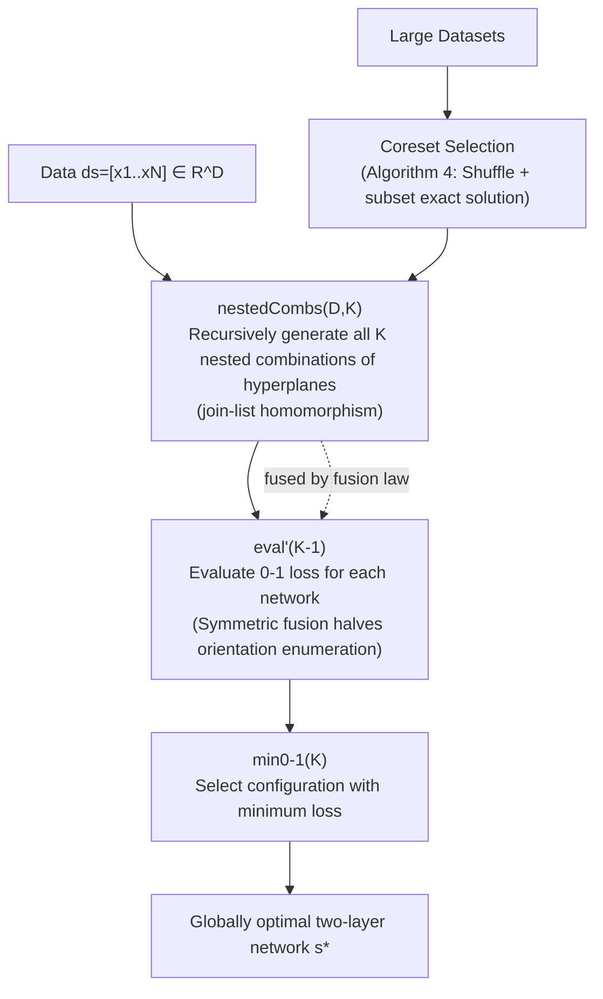

# Deep-ICE: The First Globally Optimal Algorithm for Minimizing 0–1 Loss in Two-Layer ReLU and Maxout Networks

**Conference**: ICLR 2026  
**OpenReview**: [https://openreview.net/forum?id=pP8XVJX3cI](https://openreview.net/forum?id=pP8XVJX3cI)  
**Code**: [https://github.com/XiHegrt/DeepICE-algorithm-artifacts](https://github.com/XiHegrt/DeepICE-algorithm-artifacts)  
**Area**: Learning Theory / Combinatorial Optimization / Exact Algorithms  
**Keywords**: Global Optimal ERM, 0-1 Loss, Two-layer Networks, ReLU/Maxout, Constructive Algorithmics, fusion law, Exact Training  

## TL;DR
This paper employs constructive algorithmics (list homomorphism + fusion law) to derive **Deep-ICE**, the first globally optimal algorithm for Empirical Risk Minimization (ERM) of two-layer ReLU/Maxout networks under **0-1 loss**. With a worst-case complexity of approximately $O(N D^{K+1})$, it achieves superior training and test accuracy compared to SVMs and gradient-descent-trained MLPs across 11 UCI datasets using an accompanying coreset heuristic.

## Background & Motivation
- **Background**: Two-layer networks (ReLU/Maxout) are ideal hypothesis classes for high-stakes decision-making (e.g., judicial, medical, environmental) because they are both expressive and interpretable, as outputs are linear combinations of hidden units. Finding the "best interpretable model" within this class essentially requires a **globally optimal (exact) algorithm**.
- **Limitations of Prior Work**: Directly solving ERM for neural networks is extremely difficult. Goel et al. (2020) proved that minimizing training error for two-layer ReLU networks under squared loss is NP-hard, which later expanded to $L_p$ losses. However, classification truly concerns **0-1 loss** (misclassification count), whose discrete nature is harder to optimize than continuous surrogate losses. Even for the simplest linear classifiers, optimal 0-1 loss algorithms require $O(N^{D+1})$.
- **Key Challenge**: Theoretically, neural networks have finite VC dimensions and should be trainable exactly in polynomial time (Mohri 2012). The closest works, Arora et al. (2016) and Hertrich (2022), proposed "exhaustive enumeration" strategies, but provided only pseudocode with ambiguous complexity analysis and no public implementation for eight years. Furthermore, they were limited to convex losses, assumed hyperplane partitions were "given," and had impractical constant factors ($2^K \times C_1$) and exponents ($D \times K + C_2$).
- **Goal**: Provide a **clearly defined (single equation), complexity-explicit, GPU-runnable** globally optimal ERM algorithm that supports any computable loss, specifically 0-1 loss.
- **Key Insight**: **Formulate ERM as a "provably correct specification for exhaustive search," then mechanically transform it into an efficient recursive generator using the fusion law of constructive algorithmics.** The core contribution is designing the first recursive generator for "nested combinations," allowing the entire pipeline to be fused, vectorized, and parallelized.

## Method

### Overall Architecture
Deep-ICE reframes training a two-layer network as a combinatorial enumeration problem: each hidden neuron corresponds to a hyperplane in the input space, making $K$ hidden neurons a combination of $K$ hyperplanes. Combined with $2^K$ sign orientations, this forms the search space $S(N,K,D)$. The algorithm writes the specification "exhaust all configurations and select the one with minimal 0-1 loss" (Eq. 10) and applies the fusion law to merge the "generation-evaluation-minimization" steps into a **recursive nested combination generator** `nestedCombs`. This avoids materializing all intermediate combinations while supporting on-the-fly candidate generation and communication-free parallelism.

### Key Designs

**1. Writing ERM as a "provably correct exhaustive specification" for the fusion law:** Following constructive algorithmics (Bird & De Moor), the program is first written as a correct but inefficient specification, then transformed via algebraic laws. The authors define the two-layer ERM as $\text{DeepICE}(D,K)=\text{min}_{0\text{-}1}(K)\circ\text{eval}(K)\circ\text{cp}(\text{basgns}(K))\circ\text{nestedCombs}(D,K)$ (Eq. 10). Efficiency is achieved through subsequent fusion transformations. Unlike the non-recursive approach of Arora/Hertrich, all operators here are built on list homomorphisms, enabling mechanical fusion and parallelization.

**2. Efficient `nestedCombs` generator (Core Idea):** The bottleneck is recursively enumerating "nested combinations of $K$ hyperplanes." Based on He & Little (2024), the authors extend the `kcombs` generator to `nestedCombs`. A naive approach $\text{nestedCombs}(D,K)=\langle\text{setEmpty}(D),\text{kcombs}(K)\circ!!(D)\rangle\circ\text{kcombs}(D)$ requires materializing all $\binom{N}{D}$ combinations, creating massive memory overhead. The key is verifying a **fusion condition** $f\circ\text{kcombsAlg}(D)=\text{nestedCombsAlg}(D,K)\circ f\times f$ (Eq. 12), which merges the outer mapping into the generator. This creates a **single recursive process** that builds $K$-nested combinations while generating $D$-combinations, reducing memory requirements to $O\!\big(\binom{N}{D-1}N + \binom{N}{D}^{K-1}K\big)$.

**3. Maxout Symmetric Fusion:** For Maxout networks, the authors prove a **symmetric fusion theorem** (Theorem 3): given predictions for a set of $K$ hyperplanes, the predictions for a configuration with inverted normal vectors can be derived without recalculation. This reduces the search over $2^K$ orientations to $2^{K-1}$. The final time complexity of Deep-ICE is $O\!\Big(K N 2^{K-1}\binom{N}{D}^{K} + N D^3\binom{N}{D}\Big)$, which is strictly superior to the $O(2^K C_1 N D^{K+C_2})$ bound in Arora et al.

**4. Implementation and Coreset Expansion:** Two versions are provided: **sequential** (Algorithm 2, using memoization to reuse predictions) and **divide-and-conquer** (Algorithm 3, supporting embarrassingly parallel execution). For datasets exceeding exact solvable scales, a **coreset selection** strategy (Algorithm 4) is used: data is shuffled to avoid pathological orderings, and exact solutions are found for representative subsets to explore thousands of candidate configurations.

## Key Experimental Results

### Main Results
Five-fold cross-validation on 11 UCI datasets (Training Accuracy / Test Accuracy in %, `*` denotes exact Deep-ICE solution, others use coreset; bold indicates best in row):

| Dataset | N | D | Deep-ICE (K=2) | SVM | MLP (K=2, Grad. Descent) |
|---|---|---|---|---|---|
| Caesr | 72 | 5 | **89.45 / 88.00** | 72.00 / 57.33 | 76.36 / 56.00 |
| VP | 704 | 2 | **97.76 / 97.59** | 96.77 / 97.02 | 96.77 / 97.02 |
| Spesis | 975 | 3 | **96.43 / 95.26** | 94.46 / 92.43 | 94.46 / 92.55 |
| HB | 283 | 3 | **80.11 / 77.19** | 72.40 / 71.23 | 75.34 / 75.26 |
| BT | 502 | 4 | **79.59 / 77.98** | 75.09 / 70.14 | 76.11 / 73.54 |
| DB | 1146 | 9 | **83.60 / 81.37** | 69.72 / 67.62 | 77.64 / 76.19 |
| SS | 51433 | 3 | **86.60 / 86.72** | 82.77 / 82.75 | 79.65 / 79.65 |

Under the same two-layer architecture, Deep-ICE leads in both training and test accuracy across nearly all datasets.

### Ablation Study
Exact solution vs. Gradient Descent (rank-2 Maxout neuron, VP dataset $N=704, D=2$, 0-1 loss as misclassification count, lower is better):

| Method | 0-1 Loss (Misclassifications) |
|---|---|
| Global Optimal Linear (He & Little 2023) | 19 |
| SVM | 23 |
| Gradient Descent (Maxout) | 25 |
| **Deep-ICE (Exact Solution)** | **16** |

Gradient descent fails to utilize model capacity; the second hyperplane often falls outside the data region. Deep-ICE fully exploits the model capacity.

### Key Findings
- **Complexity Consistency**: Empirical wall-clock times match the worst-case complexity analysis. The CUDA implementation handles problems with approximately $1.2\times10^{11}$ configurations within minutes.
- **Optimality vs. Overfitting**: Despite higher training accuracy, Deep-ICE maintains superior out-of-sample performance, **challenging the assumption that optimal algorithms must overfit.**
- **Margin vs. Optimality**: Max-margin classifiers like SVM do not demonstrate a consistent advantage in out-of-sample performance compared to exact 0-1 ERM.

## Highlights & Insights
- **Methodological Novelty**: Treating neural network training as a program transformation problem solvable by the fusion law is a rare and successful application of constructive algorithmics to deep learning.
- **Filling a Research Gap**: This work provides the first functional CUDA implementation for concepts introduced in 2016 and extends them to non-convex 0-1 loss.
- **Efficiency**: The `nestedCombs` generator is a reusable component designed for vectorization and communication-free parallelism.

## Limitations & Future Work
- **Curse of Dimensionality**: Complexity is exponential relative to $D$ and $K$ ($\binom{N}{D}^K$), making the algorithm suitable only for small $D$ and $K$ architectures.
- **Greedy Deep Networks**: Exact solutions for three-layer networks require $O\!\big(\binom{N}{D}^{K_1 K_2}\big)$ complexity. Deep networks currently require greedy layer-wise training.
- **Coreset Dependence**: For large-scale data, the global optimality is restricted to the coreset portion; theoretical gaps remain in the representative selection of coresets.
- **Future Direction**: Integrating branch-and-bound techniques to prune the search space and expand the solvable problem scale.

## Related Work & Insights
- **Exact 0-1 Training**: Extends He & Little (2023)’s linear exact algorithm from a single hyperplane to $K$-hyperplane nested combinations.
- **Comparison with Arora/Hertrich**: Provides a concrete, parallelized implementation for 0-1 loss, whereas prior works were limited to convex losses and lacked implementations.
- **Mechanism Insight**: By viewing loss function discreteness as a "combinatorial enumeration" task rather than a "continuous optimization obstacle," the paper provides a path to optimal training for other interpretable models like decision trees and rule sets.

## Rating
- **Novelty**: ⭐⭐⭐⭐⭐ First 0-1 loss global optimal algorithm for two-layer NNs using a unique algebraic derivation.
- **Experimental Thoroughness**: ⭐⭐⭐⭐ Comprehensive UCI benchmarks and complexity validation; however, limited to small-scale settings by nature.
- **Writing Quality**: ⭐⭐⭐⭐ High technical rigor, though the notation of constructive algorithmics (point-free style) presents a steep learning curve.
- **Value**: ⭐⭐⭐⭐ Provides a "provably optimal" tool for high-stakes interpretability and challenges the "optimality entails overfitting" dogma.

<!-- RELATED:START -->

## Related Papers

- [\[ICML 2026\] Sharp Description of Local Minima in the Loss Landscape of High-Dimensional Two-Layer ReLU Networks](../../ICML2026/optimization/sharp_description_of_local_minima_in_the_loss_landscape_of_high-dimensional_two-.md)
- [\[ICLR 2026\] Directional Convergence, Benign Overfitting of Gradient Descent in leaky ReLU two-layer Neural Networks](directional_convergence_benign_overfitting_of_gradient_descent_in_leaky_relu_two.md)
- [\[ICLR 2026\] Convex Dominance in Deep Learning I: A Scaling Law of Loss and Learning Rate](convex_dominance_in_deep_learning_i_a_scaling_law_of_loss_and_learning_rate.md)
- [\[ICLR 2026\] A Memory-Efficient Hierarchical Algorithm for Large-scale Optimal Transport Problems](a_memory-efficient_hierarchical_algorithm_for_large-scale_optimal_transport_prob.md)
- [\[ICLR 2026\] Globally Aware Optimization with Resurgence](globally_aware_optimization_with_resurgence.md)

<!-- RELATED:END -->
