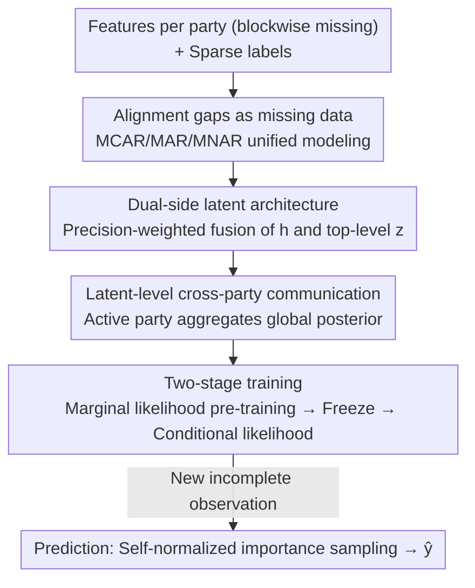

# Deep Latent Variable Model based Vertical Federated Learning with Flexible Alignment and Labeling Scenarios

**Conference**: ICLR2026  
**OpenReview**: [https://openreview.net/forum?id=qCM2vo896B](https://openreview.net/forum?id=qCM2vo896B)  
**Code**: TBD  
**Area**: Federated Learning / Probabilistic Methods / Variational Inference  
**Keywords**: Vertical Federated Learning, Deep Latent Variable Models, Missing Data Mechanisms, Semi-supervised, Variational Inference

## TL;DR
The problem of "misaligned users" in Vertical Federated Learning (VFL) is reinterpreted as a classic "blockwise missing data" problem. By employing a deep latent variable model with a two-stage training approach (unsupervised pre-training followed by supervised fine-tuning), this work simultaneously handles misaligned, unlabeled, and data under arbitrary missing mechanisms (MCAR/MAR/MNAR) in multi-party scenarios. It outperforms the strongest baselines in 160 out of 168 configurations, with an average lead of 9.6 percentage points.

## Background & Motivation
**Background**: Vertical Federated Learning (VFL) target scenarios where "features are split"—multiple institutions (e.g., banks + e-commerce, hospitals + pharmaceutical companies) hold complementary features of the same set of users and aim to jointly train a model without exchanging raw data. To perform joint training, traditional VFL requires samples to be "aligned," meaning features from different parties for the same user must be matched together.

**Limitations of Prior Work**: In reality, user sets rarely overlap perfectly. A VFL survey indicates that **only 0.2% of potential VFL pairs are fully alignable**. Consequently, substantial amounts of data are either "misaligned" (samples not present across all parties) or lack labels due to privacy regulations. Existing methods rely on restrictive assumptions: some only support two parties (VFed-SSD, FedCVT), others fail to fully utilize partially aligned data (VFLFS, VFedTrans), some only perform inference on fully aligned data (FedHSSL, PlugVFL), and others (MAGS) handle misalignment only during inference but not during training. The most relevant method, LASER-VFL, handles both aligned and misaligned samples but ignores unlabeled data and assumes a single batch shares a single missingness pattern.

**Key Challenge**: In VFL, "alignment" is fundamentally equivalent to **blockwise missingness** in classic missing data theory—if a user has no record at a certain party, it is equivalent to that entire block of features being "missing." However, past VFL works did not systematically treat this as missing data, resulting in a series of "patches" for each functionality (multi-party, unlabeled, arbitrary missingness) rather than a unified framework.

**Goal**: To build a unified framework allowing VFL to handle arbitrary degrees of alignment, label availability, and missingness mechanisms during both **training and inference**, while naturally supporting multi-party scenarios.

**Key Insight**: The authors borrow three types of mechanisms from missing data literature—MCAR (Missing Completely at Random), MAR (Missing at Random, where missingness depends only on observed values), and MNAR (Missing Not at Random, where missingness depends on unobserved values)—to translate "misalignment" into missingness, then model it using Deep Latent Variable Models (DLVMs) which are naturally suited for missing data.

**Core Idea**: Reframe alignment gaps as missing data. Under the MAR assumption, a deep latent variable model $p_{\Theta,\psi}(y\mid x^{obs},m)$ reduces to $p_\Theta(y\mid x^{obs})$. By using a two-stage training process—maximizing marginal likelihood via unsupervised pre-training followed by maximizing conditional likelihood via supervised fine-tuning—all unlabeled and misaligned data are utilized. The method is named **FALSE-VFL** (Flexible Alignment and Labeling Scenarios Enabled VFL).

## Method

### Overall Architecture
The setup for FALSE-VFL includes one **active party** (holding labels) and $K-1$ **passive parties** (holding features only). The complete observation for each sample $i$, $x_i=[x_i^1,\dots,x_i^K]$, is split across parties. A mask $m_i^k\in\{0,1\}$ indicates if the $k$-th party is missing (where $m_i^k=1$ denotes missingness), and $u_i\in\{0,1\}$ indicates if the label is missing. Thus, "fully aligned, partially aligned, misaligned, labeled, or unlabeled" are unified into values of $(m_i, u_i)$. The entire database is treated as a table with blockwise missingness.

The pipeline is as follows: each party uses a local encoder to encode its feature block into a local latent variable distribution. The active party aggregates these local distributions into a global latent variable $h$ using **precision-weighting**, which is then used to encode a top-level latent variable $z$, forming a chain $z\to h\to x$. Training consists of two stages: first, maximizing the marginal likelihood $p_{\Theta_g}(x^{obs})$ of observed features using **all** samples (including unlabeled and misaligned) for pre-training. After freezing the generative parameters $\Theta_g$, the discriminator $\phi$ is trained using labeled samples by maximizing conditional likelihood. During inference, self-normalized importance sampling is applied to new (incomplete) observations to obtain $p_\Theta(y\mid x^{obs})$. Throughout the process, parties exchange only distribution parameters and scalar values, never raw features.

### Key Designs

**1. Alignment Gap as Missing Data: Unifying VFL Variants via Missingness Mechanisms**

This is the conceptual foundation. Previously, VFL treated "user misalignment" as an engineering challenge, designing separate methods for different alignment or labeling scenarios. This paper argues that if the $k$-th party has no record for a user, it is equivalent to the feature block $x_i^k$ being missing ($m_i^k=1$). Samples are decomposed into $x_i=[x_i^{obs},x_i^{mis}]$, where only $x_i^{obs}$ is available. Full alignment means $\sum_k m_i^k=0$, complete misalignment means $\sum_k m_i^k=K-1$, and partial alignment lies in between. Label missingness is denoted by $u_i=1$. After translating multi-party, partial alignment, and lack of labels into the language of missing data, the authors distinguish between two types of misalignment: (a) temporary gaps due to imperfect identifiers that can be fixed via Record Linkage, and (b) intrinsic gaps where no record exists. This paper focuses on the latter, corresponding to blockwise missingness, allowing the use of MCAR/MAR/MNAR mechanisms. A key theoretical convenience: under MAR, $p_{\Theta,\psi}(y\mid x^{obs},m)=p_\Theta(y\mid x^{obs})$ (Appendix A.1), meaning the missingness pattern $m$ does not need to be explicitly modeled for prediction. This allows FALSE-VFL-I (the MAR version) to bypass mask distribution modeling, while FALSE-VFL-II (Appendix A.2) relaxes this to MNAR.

**2. Dual-side Deep Latent Variable Architecture and Precision-Weighted Fusion**

The model consists of **feature-side** and **label-side** modules. Each party $k$ has its own encoder $\gamma_c^k$ and decoder $\theta_c^k$ (feature-side). The active party additionally has a global encoder $\gamma_s$, global decoder $\theta_s$, and discriminator $\phi$ (label-side). The generative process is a stochastic chain $p_{\Theta_g}(x)=\int p_{\Theta_g}(h_L)p_{\Theta_g}(h_{L-1}\mid h_L)\cdots p_{\Theta_g}(x\mid h_1)\,dh$ (the paper uses $L=2$, denoted by $h:=h_1, z:=h_L$). Amortized variational inference is used. The challenge is aggregating local posteriors into a global posterior when **only a subset of parties has observations**. The paper provides a precision-weighted Gaussian fusion:

$$q_{\gamma_c}(h\mid x^{obs})=\mathcal{N}\!\left(\frac{1}{|obs|}\sum_{k\in obs}\mu_{\gamma_c^k}(x^k),\ \Big(\sum_{k\in obs}\Sigma_{\gamma_c^k}^{-1}(x^k)\Big)^{-1}\right).$$

The intuition: each present party contributes a local Gaussian posterior $\mathcal{N}(\mu_{\gamma_c^k},\Sigma_{\gamma_c^k})$, weighted by the precision (inverse of the covariance)—more certain parties receive higher weights. Absent parties are simply excluded from the summation, allowing the **global $h$ to be computed for any subset of parties**. This is the key to tolerating arbitrary alignment patterns. The top-level $q_{\gamma_s}(z\mid h)$ is also Gaussian. The discriminator $p_\phi(y\mid h)$ uses a Gaussian for regression or a categorical distribution for classification. The design is modular and independent of the number of parties; adding a party simply requires adding another pair of encoders/decoders.

**3. Latent-level Cross-party Communication: Collaboration Without Raw Feature Leakage**

Since raw $x^{obs}$ cannot be shared, all information flows through latent variables. During training/pre-training: each party calculates the mean and variance of its local posterior and sends them to the active party. The active party aggregates these into a global latent distribution, samples $h$, and broadcasts it back. Parties calculate $p_{\theta_c}(x^{obs}\mid h)$ using local decoders and send back **scalar probabilities**. The active party calculates the loss and sends gradients back to local parameters. Compared to standard VFL (passive parties send representations, active party sends gradients), FALSE-VFL adds two steps: the active party sends sampled global latent variables, and passive parties return scalar probabilities. The same forward communication occurs during inference without gradient exchange. This protocol enables privacy-preserving aggregation and inference with arbitrary subsets of parties.

**4. Two-Stage Training: Pre-training via Marginal Likelihood followed by Conditional Likelihood**

The ultimate goal is to maximize the conditional likelihood $\sum_{u_i=0}\log p_\Theta(y_i\mid x_i^{obs})$, which is intractable even with variational approximations. The authors maximize the joint likelihood instead, based on the identity:

$$\log p_\Theta(y,x^{obs})=\log p_\Theta(y\mid x^{obs})+\log p_{\Theta_g}(x^{obs}).$$

A problem arises because $x^{obs}$ is high-dimensional ($d_{obs}\gg 1$), causing the marginal term $\log p_{\Theta_g}(x^{obs})$ to **overwhelm** the conditional term, leading the model to fit the feature distribution while ignoring the prediction (implicit modeling bias). The two-stage training addresses this: **Stage 1 (Pre-training)** maximizes the dominant marginal likelihood using the $\kappa$-sample Importance Weighted Autoencoder (IWAE) lower bound $L_\kappa(\Theta_g)$. This stage **does not require labels**, allowing all unlabeled and misaligned samples to be used. **Stage 2 (Training)** freezes $\Theta_g$ and maximizes the joint likelihood $L'_\kappa(\phi)$ using only labeled samples to train the discriminator $\phi$. Once $\Theta_g$ is frozen, maximizing joint likelihood is equivalent to maximizing conditional likelihood, eliminating modeling bias while targeting the prediction goal. Theorem 3.1 guarantees that $L_\kappa, L'_\kappa$ increase monotonically with $\kappa$ and converge to the true log-likelihood. Prediction uses self-normalized importance sampling: $p_\Theta(y\mid x^{obs})\approx\sum_l w_l\,p_\phi(y\mid h_l)$, where weights $w_l=r_l/\sum_j r_j$ are determined by the importance ratios $r_l$.

### Loss & Training
- **Stage 1 (Unsupervised, including unlabeled/misaligned)**: Maximize the IWAE bound of the marginal likelihood $L_\kappa(\Theta_g)=\sum_i \mathbb{E}[\log R_\kappa(x_i^{obs})]$, where $R_\kappa$ is the importance-weighted average of $\kappa$ samples.
- **Stage 2 (Supervised, $\Theta_g$ frozen)**: Maximize $L'_\kappa(\phi)=\sum_{u_i=0}\mathbb{E}[\log R'_\kappa(y_i,x_i^{obs})]$, updating only the discriminator $\phi$.
- Key hyperparameters include the number of importance samples $\kappa$ (larger $\kappa$ provides a tighter bound) and the number of latent layers $L\ge 2$ (implemented with $L=2$).

## Key Experimental Results

### Main Results
Evaluations were performed on four datasets (Isolet, HAPT tabular data; FashionMNIST, ModelNet10 image data) across **6 training missingness settings × 7 test missingness settings = 168 configurations**, compared against Vanilla VFL, LASER-VFL, PlugVFL, and FedHSSL. Tabular data was split into 8 parties, and ModelNet10 into 6. 500 labels were provided for tabular data and 1000 for image data, with the rest treated as unlabeled.

| Dimension | Setting | FALSE-VFL Avg. Accuracy Gain over Strongest Baseline (%) |
|--------|------|------|
| Overall | 168 Configs (leads in 160) | **9.6** (across 160 cases; 9.1 across all 168) |
| By Dataset | Isolet | 15.7 |
| By Dataset | HAPT | 7.3 |
| By Dataset | FashionMNIST | 4.5 |
| By Dataset | ModelNet10 | 9.1 |
| By Test Missing Rate | MCAR 0 → MCAR 5 → MAR 2 | 1.8 → 9.6 → 12.3 (Gain increases with missingness) |

### Ablation Study

| Configuration | Key Finding | Description |
|------|---------|------|
| MCAR 5 vs MCAR 2 Training | 23 of 28 cases show minimal drop; some show gain | Most robust to severe missingness |
| Parties $K$ (4 to 12) | Consistent lead; LASER-VFL degrades as $K$ increases | As $K$ grows, finding batches with identical masks is harder; LASER's efficiency collapses |
| Heterogeneity $\alpha\in\{\infty,10,1,0.1\}$ | FALSE-VFL remains highest and stable | Vanilla/FedHSSL drop as heterogeneity grows; LASER improves slightly |

### Key Findings
- **Higher Missingness, Greater Advantage**: From MCAR 0 to MAR 2 in test settings, the lead increases from 1.8 to 12.3 percentage points, showing that the model genuinely benefits from inference on incomplete data rather than relying solely on aligned samples.
- **MAR and MNAR versions perform similarly**: FALSE-VFL-I (no mask modeling) and FALSE-VFL-II (MNAR modeling) show close performance, confirming the theoretical finding that modeling mask distribution is unnecessary under the MAR assumption in practice.
- **Robustness to $K$**: Vanilla VFL and FedHSSL rely on fully aligned labeled samples, which become rare as $K$ increases. FALSE-VFL utilizes misaligned labeled samples, benefiting from the fact that the probability of all features being missing simultaneously is lower.

## Highlights & Insights
- **Unified Framework through Redefinition**: Reinterpreting "alignment" as "missingness" is a natural yet powerful shift. It unifies multi-party, unlabeled, and arbitrary missingness under one missing data mechanism, avoiding the need for individual patches.
- **Precision-Weighted Fusion for Fault Tolerance**: Using the precision of local posteriors to construct the global posterior naturally allows for inference with any subset of parties. This is the structural foundation for "inference with arbitrary alignment."
- **Dual-Purpose Two-Stage Training**: Pre-training the marginal likelihood mitigates bias from high-dimensional features while leveraging unlabeled data. Freezing $\Theta_g$ transforms the joint likelihood maximization into conditional likelihood maximization, a clean "indirect optimization" trick.

## Limitations & Future Work
- **Privacy Constraints**: While raw features are not exchanged, the framework does not provide formal privacy guarantees (e.g., Differential Privacy) against potential latent variable reconstruction or leakage attacks.
- **MAR Assumption Dependency**: FALSE-VFL-I relies on MAR to avoid mask modeling. If missingness strongly depends on unobserved values (MNAR), one must switch to the more complex II version.
- **Scale and Complexity**: Experiments used 8 parties and $500 \sim 1000$ labels on classic benchmarks. The framework hasn't been tested on hundreds of parties or industrial-scale high-dimensional data, and communication overhead relative to $\kappa$ requires further evaluation.
- **Combination with Record Linkage**: Future work could integrate Record Linkage (for technical misalignment) with this framework (for intrinsic misalignment) in an end-to-end manner.

## Related Work & Insights
- **vs LASER-VFL**: Both use misaligned samples, but LASER assumes a shared mask per batch. As $K$ grows, mask pattern diversity explodes, causing batch utilization to drop. FALSE-VFL uses precision-weighting, removing the batch-mask constraint and utilizing unlabeled data.
- **vs FedHSSL / PlugVFL / Vanilla VFL**: These rely on fully aligned labeled samples during training. Performance drops as $K$ increases due to the scarcity of such samples, whereas FALSE-VFL trains on misaligned labeled samples directly.
- **vs supMIWAE / not-MIWAE**: Inspired by supMIWAE, this work brings DLVM-based supervised missing data modeling to VFL. It adds a multi-party privacy-preserving aggregation protocol and two-stage training, making it a successful translation of single-machine missing data modeling to distributed privacy settings.

## Rating
- Novelty: ⭐⭐⭐⭐⭐ The "alignment as missingness" shift is powerful; it's the first VFL framework unifying multi-party, unlabeled, and arbitrary missingness.
- Experimental Thoroughness: ⭐⭐⭐⭐ 168 configurations plus ablations on $K$, missingness, and heterogeneity are comprehensive, though benchmarks are somewhat small-scale.
- Writing Quality: ⭐⭐⭐⭐ Motivations for missingness mechanisms and training stages are clear; theory and method are well-linked.
- Value: ⭐⭐⭐⭐ Directly addresses the reality that only 0.2% of VFL data is alignable; highly practical for label-scarce and poorly aligned real-world scenarios.

<!-- RELATED:START -->

## Related Papers

- [\[ICLR 2026\] DeepAFL: Deep Analytic Federated Learning](deepafl_deep_analytic_federated_learning.md)
- [\[ICLR 2026\] Learning to Solve Orienteering Problem with Time Windows and Variable Profits](learning_to_solve_orienteering_problem_with_time_windows_and_variable_profits.md)
- [\[ICML 2026\] Distribution Alignment for One-Shot Federated Learning via Optimal Transport](../../ICML2026/optimization/distribution_alignment_for_one-shot_federated_learning_via_optimal_transport.md)
- [\[ICLR 2026\] Compositional Generalization through Gradient Search in Nonparametric Latent Space](compositional_generalization_through_gradient_search_in_nonparametric_latent_spa.md)
- [\[ICLR 2026\] LCA: Local Classifier Alignment for Continual Learning](lca_local_classifier_alignment_for_continual_learning.md)

<!-- RELATED:END -->
