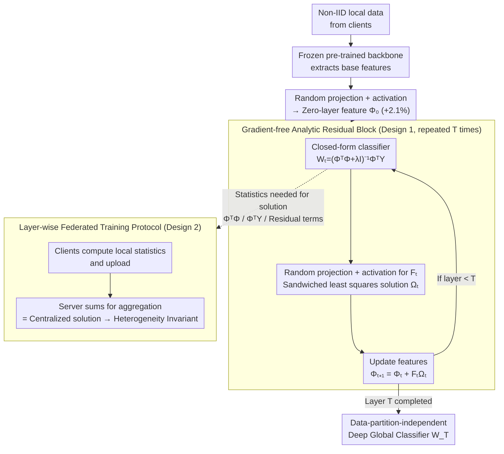

# DeepAFL: Deep Analytic Federated Learning

**Conference**: ICLR 2026  
**arXiv**: [2603.00579](https://arxiv.org/abs/2603.00579)  
**Code**: [github.com/tangent-heng/DeepAFL](https://github.com/tangent-heng/DeepAFL)  
**Area**: Optimization / Federated Learning  
**Keywords**: Federated Learning, Analytic Learning, Gradient-free Training, Residual Blocks, Data Heterogeneity

## TL;DR

Ours proposes DeepAFL, which achieves the first deep analytic federated learning model with representation learning capabilities by designing gradient-free analytic residual blocks and introducing a layer-wise federated training protocol. It maintains ideal invariance to data heterogeneity while breaking the limitations of existing analytic methods restricted to single-layer linear models, outperforming SOTA by 5.68%-8.42% on three benchmark datasets.

## Background & Motivation

**Federated Learning (FL)** is the mainstream distributed learning paradigm for breaking data silos. However, traditional gradient-based FL methods (e.g., FedAvg, FedProx, SCAFFOLD) face four core issues: (1) **Data Heterogeneity**—differences in data distributions across clients lead to performance degradation after model aggregation (especially in Non-IID scenarios); (2) **Convergence**—heterogeneous data causes client models to diverge, potentially deviating from the global optimum after aggregation; (3) **Scalability**—communication and computation overheads increase significantly with many participants; (4) **Communication Overhead**—multiple rounds of gradient exchange require substantial bandwidth.

Recently, **Analytic Learning (AL)** has provided a new perspective. The core idea is to replace iterative gradient updates with closed-form solutions, fundamentally eliminating the instability of gradient training. Some works have introduced analytic learning into the federated setting (e.g., FedAnalytic), showing excellent invariance to data heterogeneity because closed-form solutions do not depend on learning rates or iterations, thus remaining unaffected by Non-IID distributions.

However, existing analytic FL methods face a **fundamental bottleneck**: they are limited to training **single-layer linear models** (such as Ridge Regression/Least Squares classifiers) on frozen, pre-trained backbones. Without representation learning capabilities, these models rely entirely on the quality of pre-trained features, performing suboptimally on tasks requiring feature adaptation.

The **Key Challenge** addressed in this paper is: **How to endow analytic models with deep representation learning capabilities while maintaining invariance to data heterogeneity?** The **Core Idea** is to leverage the success of ResNet by designing gradient-free analytic residual blocks—where each layer has a closed-form solution—enabling deep representation learning through layer-wise stacking.

## Method

### Overall Architecture

DeepAFL aims to solve the problem where analytic federated learning can only train a single-layer linear classifier on frozen features without representation learning. The **Mechanism** involves incorporating ResNet-style skip connections into analytic learning: all clients share a frozen pre-trained backbone to extract base features, followed by a random projection and activation to obtain zero-layer features $\Phi_0$ (providing a ~2.1% gain). On top of this, **gradient-free analytic residual blocks are stacked layer by layer**, refining features at each step.

The key lies in the training of each layer: instead of backpropagation, a closed-form classifier is first solved for the current features, followed by solving a residual mapping to fine-tune the features and minimize classification residuals. These two least-squares solutions rely only on a set of additive statistics (covariance-like matrices). This naturally decomposes into a federated protocol where "clients calculate statistics locally and the server performs a single summation." By stacking $T$ layers from bottom to top, a deep global classifier $W_T$ is obtained that is independent of how data is partitioned. The input consists of Non-IID local data from clients, and the output is a deep classification model obtained through a purely forward, gradient-free process.

### Key Designs

**1. Gradient-free Analytic Residual Blocks: Making Closed-form Solutions "Deep"**

Existing analytic federated methods only train a single-layer classifier on frozen features. DeepAFL borrows skip connections from ResNet, expressing the $(t+1)$-th layer features as $\Phi_{t+1} = \Phi_t + g_t(\Phi_t)$. However, the residual mapping $g_t$ must be solved via closed-form solutions rather than gradient descent. This addresses two questions: what to use as the mapping and how to solve its parameters.

First, each layer assigns a classifier $W_t$ to the current features $\Phi_t$, fitting labels using standard Ridge Regression: $W_t = \arg\min_W \|Y - \Phi_t W\|_F^2 + \lambda\|W\|_F^2$. This yields a unique closed-form solution $W_t = (\Phi_t^\top \Phi_t + \lambda I)^{-1}\Phi_t^\top Y$ (MSE is used instead of Cross-Entropy because only the former provides a closed-form solution and offers comparable accuracy in analytic learning). Second, the residual mapping is defined as $g_t(\Phi_t) = \sigma(\Phi_t B_t)\,\Omega_{t+1} = F_t\,\Omega_{t+1}$, where the random projection matrix $B_t$ provides stochasticity (playing the role of SGD), activation $\sigma$ provides non-linearity, and $F_t$ represents hidden random features. Only the trainable $\Omega_{t+1}$ is solved. This introduces the randomness and non-linearity required for deep representations while restricting the parameters to a linear problem that remains analytically solvable.

When solving for $\Omega_{t+1}$, the previous classifier $W_t$ is fixed. The goal is to make updated features more accurate under $W_t$:

$$\Omega_{t+1} = \arg\min_{\Omega}\ \|\,R_t - F_t\,\Omega\,W_t\,\|_F^2 + \gamma\|\Omega\|_F^2,\quad R_t = Y - \Phi_t W_t$$

The fitting target is the **classification residual** $R_t$. The unknown $\Omega$ is "sandwiched" between known $F_t$ and $W_t$—a special case of the generalized Sylvester matrix equation, which the authors term **sandwiched least squares**. It is solved via spectral decomposition of $F_t^\top F_t$ and $W_t W_t^\top$. Skip connections ensure that even if a layer mapping is suboptimal, input information flows losslessly. Layer-wise stacking thus transforms "single-step linear fitting" into "progressive feature refinement." Additionally, zero-layer features use activated random projection $\Phi_0 = \sigma(\tilde{X}A)$ to increase dimensionality, yielding a ~2.1% performance gain by improving linear separability.

**2. Layer-wise Federated Training Protocol: Heterogeneity Invariance via Associative Summation**

Gradient-based FL requires repeated communication of the entire model; Non-IID data causes client models to diverge. DeepAFL observes that both least-squares problems ($W_t$ and $\Omega_{t+1}$) rely only on **additive statistics**—essentially various covariance/cross-covariance matrices (e.g., $\Phi_t^\top\Phi_t$, $\Phi_t^\top Y$, and $F_t^\top R_t$). Training is therefore split by layer into a "statistics aggregation" protocol: for layer $t$, client $k$ computes its local statistics via a forward pass and uploads them. The server sums these (e.g., $\Phi^\top\Phi = \sum_k \Phi_k^\top\Phi_k$), solves for $W_t$ and $\Omega_{t+1}$, and broadcasts them to all clients.

Because summation is associative, the aggregated result is **bit-by-bit identical** to a centralized solution where all data is kept together, regardless of how data is partitioned. This is the source of its data heterogeneity invariance. Furthermore, each layer requires only one round of communication to converge. The total communication rounds equal the number of layers (typically 3–5) rather than the hundreds or thousands required by gradient-based methods. Transmitting aggregated statistics is also more privacy-friendly than sharing raw data or gradients.

### Loss & Training

Each layer has two least-squares objectives: the Ridge Regression $\|Y-\Phi_t W\|_F^2 + \lambda\|W\|_F^2$ for classifier $W_t$, and the sandwiched least squares $\|R_t - F_t\Omega W_t\|_F^2 + \gamma\|\Omega\|_F^2$ for residual mapping $\Omega_{t+1}$. Both are convex with unique global optimal closed-form solutions. Training is purely forward and layer-wise. Aside from regularization coefficients $\lambda$ and $\gamma$, there are no hyperparameters like learning rate or momentum to tune.

## Key Experimental Results

### Main Results

Comparison on three benchmark datasets (Non-IID Federated Setting):

| Method | Dataset 1 | Dataset 2 | Dataset 3 | Training Type |
|------|---------|---------|---------|---------|
| FedAvg | Baseline | Baseline | Baseline | Multi-round Gradient |
| FedProx | ~FedAvg | ~FedAvg | ~FedAvg | Multi-round + Reg |
| SCAFFOLD | > FedAvg | > FedAvg | > FedAvg | Variance Reduction |
| FedAnalytic (Single) | Limited by Linear | Limited by Linear | Limited by Linear | Single-layer Analytic |
| **DeepAFL** | **SOTA (+5.68%~8.42%)** | **SOTA** | **SOTA** | Deep Analytic |

DeepAFL improves upon previous SOTA methods by 5.68%-8.42% across three benchmarks.

### Ablation Study

| Configuration | Key Metric | Description |
|------|---------|------|
| 1 Layer vs. Multi-layer | Multi-layer significantly better | Proves need for deep representation learning |
| With vs. Without Residual | Residual is more stable | Residuals ensure information flow |
| Number of Layers | Diminishing returns | Improvement slows after 3-5 layers |
| IID vs. Non-IID | Minimal performance gap | Proves data heterogeneity invariance |
| Client Count | Stable | Good scalability |

### Key Findings

- **Deep + Analytic = Win-Win**: DeepAFL proves for the first time that analytic learning can go "deep," and depth provides significant performance gains over single-layer and gradient-based methods.
- **Invariance Verified**: Both theoretically and experimentally, DeepAFL results remain identical to centralized training regardless of Non-IID partitioning—a feat gradient-based FL cannot achieve.
- **High Communication Efficiency**: Total communication rounds equal the number of layers (typically 3-5), far fewer than the hundreds of rounds in gradient methods.
- **No Hyperparameter Burden**: Eliminates the need to tune learning rates or momentum; $\lambda$ is the only main hyperparameter.

## Highlights & Insights

- **Breaking the "Analytic = Shallow" Perception**: Through analytic residual blocks, this work demonstrates that gradient-free methods can build deep networks, representing a methodological breakthrough.
- **Elegant Transfer of ResNet Principles**: Migrating the most successful architecture design in deep learning (Skip Connections) to analytic learning reflects a profound fusion of paradigms.
- **Paradigm Shift for Federated Learning**: Instead of using heuristics to mitigate data heterogeneity, DeepAFL fundamentally eliminates its impact, representing a qualitative rather than quantitative improvement.
- **Minimalist Design**: The entire method involves only matrix multiplication, inversion, and summation, offering simplicity and theoretical clarity.
- **Solid Theoretical Guarantees**: Heterogeneity invariance is backed by rigorous mathematical proof, not just empirical observation.

## Limitations & Future Work

- **Dependence on Backbone Quality**: While DeepAFL adds representation learning, it still operates on frozen pre-trained features. Poor backbone quality limits the effectiveness of deep analytic blocks.
- **Matrix Inversion Bottleneck**: Each layer requires inverting a $d \times d$ matrix (where $d$ is feature dimension). For high-dimensional features (e.g., 1024 for ViT-Large), the computational cost is significant.
- **Random Feature Limitations**: While efficient, random features approximate kernel mappings and may still lag behind hierarchical features learned end-to-end via gradients.
- **Task Constraints**: Currently validated only on classification. Applicability to generative tasks (e.g., Federated LLM training) remains unclear.
- **Privacy Risks of Transmitting Matrices**: Although statistics are aggregated, covariance matrices might leak statistical properties of client data, necessitating differential privacy analysis.
- **Future Directions**: Integration with Differential Privacy; end-to-end analytic feature learning (unfreezing the backbone); more efficient matrix operations (e.g., Woodbury identity).

## Related Work & Insights

- **FedAvg** (McMahan et al., 2017): The foundational FL algorithm using multi-round averaging. DeepAFL replaces approximate averaging with single-round exact summation.
- **Analytic Federated Learning** (e.g., FedCR, ACIL-FL): Direct predecessors of DeepAFL but restricted to single-layer models. DeepAFL breaks this fundamental limit.
- **Extreme Learning Machine (ELM)**: A classic method using random features and least-squares, which can be viewed as a single-layer special case of DeepAFL.
- **Deep Unfolding**: The concept of unfolding iterative steps into layers, sharing conceptual similarities with DeepAFL's layer-wise solving.
- **Insight**: As an alternative to gradient-based learning, analytic learning shows unique advantages in scenarios like FL where convergence stability is critical.

## Rating

- Novelty: ⭐⭐⭐⭐
- Experimental Thoroughness: ⭐⭐⭐⭐
- Writing Quality: ⭐⭐⭐⭐
- Value: ⭐⭐⭐⭐

<!-- RELATED:START -->

## Related Papers

- [\[ICLR 2026\] Byzantine-Robust Federated Learning with Learnable Aggregation Weights](byzantine-robust_federated_learning_with_learnable_aggregation_weights.md)
- [\[ICLR 2026\] Incentives in Federated Learning with Heterogeneous Agents](incentives_in_federated_learning_with_heterogeneous_agents.md)
- [\[ICLR 2026\] LEGACY: A Lightweight Dynamic Gradient Compression Strategy for Distributed Deep Learning](legacy_a_lightweight_dynamic_gradient_compression_strategy_for_distributed_deep_.md)
- [\[ICLR 2026\] Deep Latent Variable Model based Vertical Federated Learning with Flexible Alignment and Labeling Scenarios](deep_latent_variable_model_based_vertical_federated_learning_with_flexible_align.md)
- [\[ICLR 2026\] Convex Dominance in Deep Learning I: A Scaling Law of Loss and Learning Rate](convex_dominance_in_deep_learning_i_a_scaling_law_of_loss_and_learning_rate.md)

<!-- RELATED:END -->
