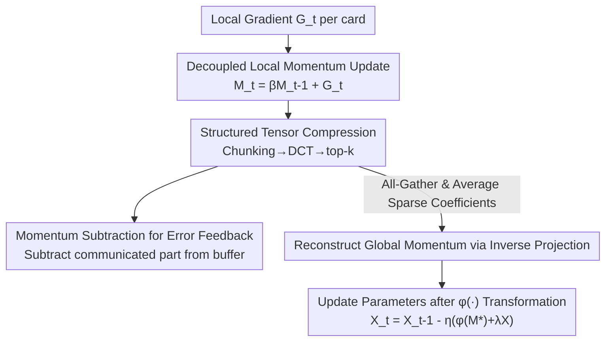

# DeMo: Decoupled Momentum Optimization

**Conference**: ICLR2026  
**OpenReview**: [https://openreview.net/forum?id=U9oewpa7cn](https://openreview.net/forum?id=U9oewpa7cn)  
**Code**: https://github.com/bloc97/DeMo  
**Area**: optimization  
**Keywords**: Distributed Training, Communication Compression, Momentum Optimization, Error Feedback, top-k Sparsification

## TL;DR
DeMo replaces the "sync full-precision gradients every step" approach in distributed data parallelism with "syncing only compressed local momentum." By decoupling momentum updates across workers, compressing momentum via DCT orthogonal transformation + top-k sparsification, and utilizing the momentum buffer itself as error feedback, DeMo achieves up to an 85× reduction in communication volume per step compared to AdamW-DDP, while maintaining comparable downstream accuracy and convergence.

## Background & Motivation
**Background**: Training large models with billions or even hundreds of billions of parameters primarily relies on Distributed Data Parallelism (DDP) to distribute computation across a large number of accelerators. The standard DDP practice is for each worker to compute local gradients and perform an All-Reduce to synchronize them into a global gradient before each optimization step.

**Limitations of Prior Work**: The communication volume of this All-Reduce is proportional to the model size, reaching TB-levels per step for SOTA models. This necessitates expensive high-bandwidth interconnects (NVLink, InfiniBand) and physical co-location of clusters, resulting in high costs, poor scalability, and an inability to train across data centers or over Ethernet.

**Key Challenge**: The communication bottleneck stems from the "wrong choice of synchronization object"—sending raw dense gradients is both expensive and redundant. Existing gradient sparsification methods (sending only the largest magnitude gradients) reduce volume but create sparse update patterns that often hurt convergence. To compensate for the information loss of biased compression, traditional error feedback (like EF-SGD) requires additional memory equal to the parameter size to accumulate errors. Thus, a trade-off exists between "saving communication" and "preserving accuracy + saving memory."

**Goal**: To find a solution that can directly replace any momentum-based optimizer, minimize changes to training code, reduce communication per step by two to three orders of magnitude, avoid extra memory overhead, and maintain convergence.

**Key Insight**: The authors observe that the gradient information exchanged in distributed training is highly redundant, and **momentum** is more suitable for compressed communication than raw gradients. Momentum is an exponentially smoothed version of historical gradients, making it "richer" and smoother. Crucially, the momentum buffer can naturally double as an error accumulator, eliminating the need for extra error feedback memory.

**Core Idea**: Instead of transmitting dense gradients, DeMo transmits "local momentum after top-k sparsification in the transform domain" and subtracts the communicated portion from the momentum buffer to serve as implicit error feedback—replacing full gradient synchronization with compressed momentum communication.

## Method

### Overall Architecture
DeMo is a distributed optimization framework that can be applied to momentum-based optimizers like SGD-momentum, Signum, and Muon. It modifies the standard DDP pipeline in three ways: (1) **Decoupled local momentum updates**—the global All-Reduce of micro-batch gradients is removed, allowing each worker's momentum buffer to evolve independently; (2) **Structured tensor compression**—momentum is chunked, subjected to blockwise orthogonal linear projection (defaulting to DCT), and then top-k sparsified to send only a small number of large coefficients; (3) **Momentum subtraction for error feedback**—the decoded update from the communicated portion is subtracted from the local momentum buffer, allowing the buffer to automatically accumulate "not yet communicated" information.

The complete data flow for one step is: compute local stochastic gradients per card → accumulate into local momentum buffer → chunk momentum, apply DCT, and perform top-k to get sparse coefficients → subtract the decoded portion from the buffer (leaving the residual) → All-Gather sparse coefficients across cards and average them → reconstruct global momentum via inverse projection → update parameters after applying the transformation $\phi(\cdot)$ corresponding to the base optimizer. Communication only occurs during the "send sparse coefficients" step, where the coefficient volume is much smaller than dense gradients.

### Key Designs

**1. Decoupled local momentum updates: Replacing "syncing gradients" with "syncing momentum"**

Standard DDP synchronizes globally immediately after calculating gradients, which is the communication bottleneck. DeMo removes the global All-Reduce for micro-batch gradients $G_t^i$, allowing each card's momentum buffer to evolve independently:

$$M_t^i = \beta M_{t-1}^i + (1-\beta) G_t^i$$

The reason momentum can be transmitted instead of gradients is that aggregated gradients and aggregated momentum are theoretically equivalent (momentum is linear with respect to gradients). However, directly synchronizing dense momentum tensors is still expensive. This step merely "changes the synchronization object"; the actual reduction comes from the subsequent compression. This change uncouples the requirement to wait for global gradients every step, allowing each card to run its own momentum first and only communicate after compression, which also allows the buffer to be reused for error feedback.

**2. Structured tensor compression: Chunking + DCT Orthogonal Projection + top-k Sparsification**

This is the primary driver for communication reduction, consisting of three steps. **Tensor Chunking**: The momentum tensor $M\in\mathbb{R}^{n_0\times\cdots\times n_{d-1}}$ is split along each dimension into $c_i$ blocks of size $s_i$ (defaulting to $64\times64$ blocks for matrices). Chunking is not just for compression—complexity analysis shows that projecting an $N\times N$ momentum without chunking costs $O(N^3)$ computation and $O(N^2)$ storage, while $C^2$ blocks reduce computation to $O(N^3/C)$ and memory to $O(N^2/C^2)$. **Blockwise Linear Projection**: Each block $B_k$ undergoes a separable multilinear transformation $Q_k=T(B_k;P_0,\dots,P_{d-1})$, which in the 2D case is $Q_k=P_0 B_k P_1^\top$. Two types of projection bases are considered: random orthogonal matrices resampled every step, and the Discrete Cosine Transform (DCT). **top-k Sparsification**: After projection, only the $k$ coefficients with the largest magnitudes are kept $\hat Q_k=\text{Top-}k(Q_k,k)$, reducing upload bandwidth by a factor of $(\prod_i s_i)/k$.

Why project before sparsifying instead of applying top-k directly to gradients? Direct sparse updates in the original space cause parameters to be updated in only a few dimensions, leading to "spiky" patterns that hurt convergence. After orthogonal projection, each parameter update becomes a linear combination of many non-sparse vectors, ensuring parameters are updated more "uniformly," which is particularly critical when $k$ is small. Ablations show DCT is significantly better than no projection ($P_i=I$). While random projection is slightly better, DCT is chosen as the default due to its efficient FFT implementation and the fact that bases only need to be computed once before training.

**3. Momentum subtraction for error feedback: Reusing the momentum buffer as an error accumulator**

As top-k is a biased compression, discarding small coefficients without correction leads to bias accumulation. Traditional error feedback (EF-SGD) requires extra memory to store accumulated errors. DeMo's cleverness lies in reusing the momentum buffer: the communicated and decoded portion is subtracted from the local buffer in-place:

$$M_t^i \leftarrow M_t^i - \alpha\, B^{-1}\!\left(T^{-1}(Q_k; P_0^{-1},\dots,P_{d-1}^{-1})\right)$$

where $\alpha\in(0,1]$ is the momentum subtraction coefficient. Consequently, the residual information "not yet transmitted" remains in the buffer and will be compressed and communicated in the next step along with new gradients. This ensures that every communication carries fresh information and that omitted updates are gradually compensated in subsequent steps. Compared to $\alpha=0$ (no subtraction) with a fixed basis—which causes top-k to repeatedly select the same elements, leading to nearly identical updates and degradation—subtraction is necessary. However, ablations show that $\alpha=1$ (full subtraction) is not optimal; a smaller $\alpha=0.2$ allows top-k elements to evolve slowly and communicated values to partially decay over time, yielding better results. The decay of historical gradient information is controlled by both $\alpha$ and $\beta$.

### Loss & Training
DeMo does not change the training objective, only the optimizer. After reconstructing the global momentum $M_t^*$, a transformation $\phi(\cdot)$ is applied based on the base optimizer: $\phi(M)=M$ for SGD, $\phi(M)=\text{sign}(M)$ for Signum, and $\phi(M)=M(M^\top M+\epsilon I)^{-1/2}$ for Muon. Updates are then performed with weight decay: $X_{t+1}=X_t-\eta_t(\phi(M_t^*)+\lambda X_t)$. Theoretically, under standard assumptions of bounded variance, $L$-smoothness, and bounded gradients, with step size $\eta=\Theta(1/\sqrt T)$ and momentum $\beta=O(1/\sqrt T)$, DeMo achieves a convergence rate of $O(1/\sqrt T)+O(1/\sqrt N)$ (where $T$ is the number of steps and $N$ is the number of workers), matching standard stochastic optimization. In experiments, default values are chunk size $s=64$, $\beta=0.999$ (larger $\beta$ is significantly better with momentum subtraction), and $\alpha$ tuned within $\{0.2, 0.5, 1.0\}$.

## Key Experimental Results

### Main Results
Using the OLMo framework with 64 H100s, a global batch of 2048, and a sequence length of 2048, the authors trained OLMo-300M (320M non-embedding parameters) and OLMo-1B (1.18B) for 100B tokens, comparing against standard AdamW-DDP. Core metrics include zero-shot accuracy on HellaSwag / ARC-Easy / PIQA and per-card per-step communication (MB/step).

| Model | Optimizer | Hella↑ | ARC↑ | PIQA↑ | Comm MB/step↓ |
|-------|-----------|--------|------|-------|----------------|
| 300M  | AdamW-DDP | 0.35   | 0.46 | 0.65  | 636.9          |
| 300M  | DeMo k=8  | 0.38   | 0.47 | 0.67  | 7.49           |
| 300M  | DeMo k=1  | 0.35   | 0.45 | 0.65  | 0.93           |
| 1B    | AdamW-DDP | 0.43   | 0.51 | 0.68  | 2416.6         |
| 1B    | DeMo k=16 | 0.47   | 0.53 | 0.70  | 55.16          |
| 1B    | DeMo k=2  | 0.44   | 0.51 | 0.69  | 6.89           |

On 300M, $k=8$ reduces per-card communication from 637 MB to 7.5 MB (85×) without loss of accuracy. On 1B, $k=16$ outperforms AdamW on HellaSwag and PIQA while requiring only 55 MB (44×) communication. Training loss curves indicate that $k=2$ is sufficient to match or slightly exceed AdamW performance, with larger $k$ providing diminishing returns.

### Ablation Study

| Configuration | Phenomenon | Explanation |
|---------------|------------|-------------|
| Momentum subtraction $\alpha=0$ | Significant degradation | top-k repeatedly selects the same elements; updates become redundant |
| Momentum subtraction $\alpha=0.2$ | Optimal | Allows top-k elements to evolve slowly while partially decaying history |
| Projection $P_i=I$ (No projection) | Worst performance | Sparse update patterns damage convergence, especially with small $k$ |
| DCT Projection | Significantly better | Parameters are updated more uniformly; bases are computed once |
| Random Orthogonal Projection | Slightly better than DCT | Requires recomputing bases every step, which is less efficient |
| Momentum $\beta$ sweep 0.95→0.999 | 0.995/0.999 are better | Optimal $\beta=0.995$ |

### Key Findings
- **Momentum subtraction (error feedback) and orthogonal projection** are the most critical components for accuracy. Removing either leads to significant degradation, yet neither adds significant memory or computation overhead.
- **DCT vs. Random Projection**: While random projection theoretically rotates the momentum subspace continuously, fixed DCT bases perform comparably and avoid recomputation, making them the engineering "sweet spot."
- **Cross-method comparison**: At the same compression ratio, DeMo's validation perplexity is consistently lower than DiLoCo. PowerSGD (low-rank compression) achieves performance close to DiLoCo but remains slightly lower than DeMo. While DeMo may slightly trail a finely-tuned AdamW in pure step-to-step comparisons (ignoring communication costs), its selling point is achieving nearly identical quality with two to three orders of magnitude lower communication.

## Highlights & Insights
- **Clever shift in synchronization object**: Aggregated momentum is theoretically equivalent to aggregated gradients, but momentum is smoother and more compressible. Building the framework around compressed momentum is the pivot point of the method.
- **Dual-purpose momentum buffer**: By making the momentum buffer double as an error accumulator, the method avoids the traditional error feedback memory overhead. This is the key to achieving "communication reduction without memory increase."
- **Transferable transform-domain sparsification**: Performing orthogonal transformation before top-k avoids the sparse, "spiky" update patterns in original space. This insight is applicable to any scenario where sparsification is desired without damaging convergence.
- **Topology-agnostic and drop-in implementation**: Implementation only requires a custom optimizer class and disabling PyTorch DDP's default gradient sync, making it easy to deploy for cross-data center or Ethernet training with low engineering barriers.

## Limitations & Future Work
- **Slower than AdamW per step**: In scenarios where communication is not a bottleneck and update steps are equal, DeMo converges slightly slower than finely-tuned AdamW. Its advantage is manifested in communication-constrained environments.
- **Limited experimental scale**: The method has been validated up to 1B parameters and 100B tokens. Whether compression errors become significant at larger scales or how $k$ should scale remains an open question.
- **New hyperparameter dimensions**: $chunk\_size$, $k$, $\alpha$, and $\beta$ all require tuning. Specifically, the coupling of $\alpha$ and $\beta$ (both controlling history decay) lacks automated guidance.
- **Base optimizer adaptation**: $\phi(\cdot)$ is currently manually specified for SGD/Signum/Muon. How to compress communication for more complex adaptive optimizers (like the full second-order moments in Adam) remains an open problem.

## Related Work & Insights
- **vs. Gradient Sparsification (Deep Gradient Compression, etc.)**: These methods apply top-k directly to raw gradients, hurting convergence with sparse patterns and requiring explicit memory for error feedback. DeMo sparsifies momentum in the transform domain and uses the buffer for implicit error feedback, improving stability and saving memory.
- **vs. Error Feedback (EF-SGD / Karimireddy 2019)**: Traditional EF requires an extra accumulator memory; DeMo reuses the momentum buffer for zero additional memory.
- **vs. DiLoCo / Local SGD / FedAvg**: These methods reduce **communication frequency** (syncing parameters after multiple local steps), which can suffer from client drift. DeMo maintains **high-frequency but highly compressed** optimizer state synchronization, achieving lower perplexity for the same compression ratio.
- **vs. PowerSGD**: PowerSGD uses low-rank projection on gradients, which can degrade significantly if $rank < 16$ and requires warmup. DeMo's combination of chunking, orthogonal transform, and top-k achieves slightly better final performance.

## Rating
- Novelty: ⭐⭐⭐⭐⭐ The combination of "compressed momentum sync + momentum buffer as error feedback" is elegant, simple, and drop-in.
- Experimental Thoroughness: ⭐⭐⭐⭐ Comprehensive comparison across two scales vs. AdamW/Muon/DiLoCo/PowerSGD, though limited to 1B parameters.
- Writing Quality: ⭐⭐⭐⭐ Clear explanations of the algorithm, complexity, convergence theory, and ablations.
- Value: ⭐⭐⭐⭐⭐ Makes training large models across data centers or over Ethernet realistic; high potential engineering impact.

<!-- RELATED:START -->

## Related Papers

- [\[ICLR 2026\] High Probability Bounds for Non-Convex Stochastic Optimization with Momentum](high_probability_bounds_for_non-convex_stochastic_optimization_with_momentum.md)
- [\[ICML 2026\] On the Provable Suboptimality of Momentum SGD in Nonstationary Stochastic Optimization](../../ICML2026/optimization/on_the_provable_suboptimality_of_momentum_sgd_in_nonstationary_stochastic_optimi.md)
- [\[ICML 2026\] RMNP: Row-Momentum Normalized Preconditioning for Scalable Matrix-Based Optimization](../../ICML2026/optimization/rmnp_row-momentum_normalized_preconditioning_for_scalable_matrix-based_optimizat.md)
- [\[ICLR 2026\] DNT: a Deeply Normalized Transformer that can be trained by Momentum SGD](dnt_a_deeply_normalized_transformer_that_can_be_trained_by_momentum_sgd.md)
- [\[ICML 2026\] Follow-the-Perturbed-Leader for Decoupled Bandits: Best-of-Both-Worlds and Practicality](../../ICML2026/optimization/follow-the-perturbed-leader_for_decoupled_bandits_best-of-both-worlds_and_practi.md)

<!-- RELATED:END -->
