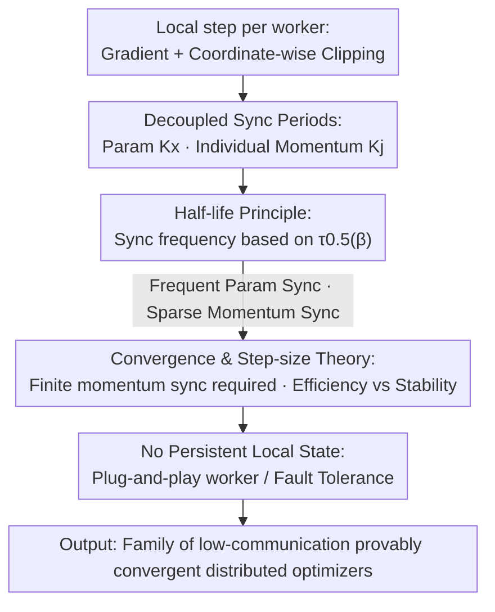

# DES-LOC: Desynced Low Communication Adaptive Optimizers for Foundation Models

**Conference**: ICLR2026  
**OpenReview**: [https://openreview.net/forum?id=6N2qFixxYZ](https://openreview.net/forum?id=6N2qFixxYZ)  
**Code**: TBD  
**Area**: LLM Efficiency / Distributed Optimization  
**Keywords**: Distributed Training, Communication Efficiency, Adaptive Optimizers, Local Adam, Fault-tolerant Training

## TL;DR
DES-LOC assigns **independent synchronization periods** to parameters and various momentum states of adaptive optimizers—parameters are synchronized frequently, while momenta are synchronized sparsely according to their "half-lives." While maintaining provable convergence, it reduces communication volume by 170× compared to DDP and 2× compared to the previous SOTA, Local Adam, achieving 1.3–2.1× end-to-end acceleration on 1–13B models.

## Background & Motivation

**Background**: Training foundation models requires distributing optimization across multiple workers. Standard practice uses Distributed Data Parallel (DDP), which performs full gradient communication at every step. To save bandwidth, "low-frequency communication" methods like Local SGD / FedAvg allow each worker to run $K \gg 1$ local steps before averaging parameters, reducing communication rounds by a factor of $K$.

**Limitations of Prior Work**: Local SGD was originally designed to synchronize only **parameters**. Modern foundation models use adaptive optimizers like Adam, which involve additional optimizer states such as first-order momentum $u$ and second-order momentum $v$. Directly applying Local SGD to Adam leads to three dead ends: (1) Averaging only parameters while keeping momentum local (e.g., DiLoCo family) lacks convergence guarantees, causes local momentum to accumulate noise from small batches, and prevents new workers from initializing momentum; (2) Resetting momentum to zero after each synchronization repeatedly perturbs training and causes oscillations; (3) Local Adam synchronizes all states with a unified period, which is robust and **provably convergent**, but the communication cost is 3× that of Local SGD (parameters + both momenta must be transmitted).

**Key Challenge**: Convergence guarantees require momentum synchronization, but saving communication requires reducing momentum transmission—Local Adam treats these as an "all-or-nothing" trade-off without a middle ground.

**Key Insight**: The authors observe a neglected fact—**different optimizer states change at vastly different speeds**. In Adam, the second-order momentum $v$ uses a very large $\beta_2$ (e.g., 0.9999), making it extremely insensitive to new gradients and slow to change; the first-order momentum $u$ has a much smaller $\beta_1$ (e.g., 0.95) and changes much faster. Since states "age" at different rates, they should not share the same synchronization period.

**Core Idea**: **Decouple synchronization frequencies** for parameters and each momentum state—frequently synchronize fast-changing states and sparsely synchronize slow-changing ones, using the "half-life" of the state itself to determine its synchronization interval.

## Method

### Overall Architecture

DES-LOC (Desynced Low Communication Adaptive Optimizers) is a **family** of optimizers rather than a single algorithm: it wraps any adaptive optimizer $\mathrm{OPT}$ with $N$ internal states (e.g., for Adam $N=2$: $s^1=u, s^2=v$) into a low-communication distributed version. $M$ workers perform local training independently, with the only modification being: parameters $x$ are synchronized with period $K_x$, and the $j$-th optimizer state $s^j$ is synchronized with **its own** period $K_j$.

Each worker's per-step operations: Calculate stochastic gradient → Coordinate-wise clipping $\hat g = \mathrm{clip}(g,\rho)$ → For each state $s^j$, if $t \bmod K_j = 0$, first average the state across all workers ($\mathbb{E}_m[\cdot]$) then perform the local update, otherwise perform a purely local update → Parameters $x$ follow the same logic based on $K_x$. Synchronization uses the FedAvg outer optimizer (ensuring provable convergence), but the framework can also integrate FedOpt (e.g., Nesterov outer optimizer). The core of this design is the "half-life principle" below: theoretically characterize the rate of change for each state and assign synchronization periods accordingly.

### Key Designs

**1. Decoupled Synchronization Periods: Assigning independent communication cycles to parameters and momenta**

This is the foundation of the work. The constraint of Local Adam is that parameters $x$ and momenta $u,v$ share the same period $K$, so saving communication forces reduced momentum transmission, thus breaking convergence. DES-LOC uncouples them: parameters sync every $K_x$, and states $s^j$ sync every $K_j$ (for Adam, $K_x, K_u, K_v$ are three independent periods). In practice, $K_u = 3K_x$ and $K_v = 6K_x$ are recommended—parameters sync most frequently, first-order momentum 3× less, and second-order 6× less.

Why does this save communication without destabilizing? Communication cost is proportional to "number of states transmitted × frequency." Reducing the frequency of slow-changing second-order momentum to 1/6 significantly lowers total volume; the theory below proves that as long as momentum is synchronized within a **finite period**, convergence is as guaranteed as in Local Adam. Switching "communication saving" from "removing momentum sync" to "extending momentum sync periods" is the key to stability.

**2. Half-life Principle: Using decay rates to determine synchronization frequency**

Once periods are decoupled, how should each $K_j$ be set? The authors provide a calculable criterion. Define the steps required for a state to decay to weight $\psi$ as $\tau_\psi(\beta) = \frac{\ln \psi}{\ln \beta}$, using the half-life $\tau_{0.5}$ as the primary measure: $\tau_{0.5}(0.95)\approx 13.5$, $\tau_{0.5}(0.999)\approx 692.8$, $\tau_{0.5}(0.9999)\approx 6931$. A longer half-life implies the state is less sensitive to new gradients and "ages" slower.

Furthermore, under coordinate-wise clipping $|g_i|\le\rho$, expanding Adam recursion for $K$ steps proves that the maximum $\ell_\infty$ drift of both momenta is bounded:

$$\|u_{t+K}-u_t\|_\infty \le 2\rho\,(1-\beta_1^{K}), \qquad \|v_{t+K}-v_t\|_\infty \le 2\rho^2\,(1-\beta_2^{K}).$$

With large $\beta$ and small clipping radii $\rho$ (typical configurations for foundation models), the absolute change of momentum over $K$ steps is strictly controlled. Conclusion: Half-life should directly determine sync frequency—if the half-life is much larger than local steps $K$, sync only affects the first few steps, and then the influence decays to zero, allowing sparse synchronization. Experiments (RQ1/RQ2) confirm that second-order momentum changes ~100× slower than first-order under high $\beta_2$, making it ideal for sparse sync.

**3. Convergence and Step-size Theory: Finite sync periods and the trade-off with step size**

Beyond saving communication, it must be proved that this does not break convergence. The authors equate "synchronizing every $K$ steps" to "synchronizing with probability $p=1/K$." For DES-LOC-SGDM, Theorem 1 proves: with step size $\eta=\min(\eta_0, 1/\sqrt T)$, the average gradient norm converges at the optimal rate $O(1/\sqrt T)$, and the **dominant term is unaffected by local steps**. Parameter sync probability $p_x$ and momentum sync probability $p_u$ only appear in higher-order $O(1/T)$ terms and a quantity $\psi$:

$$\psi \;=\; \frac{4(1-p_x)}{p_x^2}\cdot\frac{(1-\beta)(1-p_u)}{1-(1-p_u)\beta}.$$

Two insights emerge: (i) $\psi=O(1/p_x^2)$ is extremely sensitive to parameter synchronization—$p_x\to 0$ causes $\psi$ to explode and the rate to collapse, so **parameters must be synchronized frequently**; (ii) Turning off momentum sync ($p_u=0$) does not change the asymptotic rate, but $\psi$ also determines the step-size upper bound $\eta_0\propto 1/\sqrt\psi$—as $p_u\to0$, $\psi$ is maximized, reducing the permissible step size. In other words, **frequent momentum sync allows for larger stable step sizes and faster practical convergence**. Additionally, high-probability analysis for DES-LOC-Adam suggests that when $\beta_2<1.0$, the second-order momentum sync period must be **finite**—this is the theoretical floor: momentum can be synchronized less, but not never.

**4. No Persistent Local State: Natural support for work plug-and-play and fault tolerance**

Heuristic methods that keep momentum local have a fatal flaw: each worker's momentum is private and continuously accumulated. New workers have no valid initial momentum value, and crashed workers cannot recover easily, making them unsuitable for large-scale, failure-prone environments. Because DES-LOC **eventually synchronizes all states** (finite periods), it is equivalent to a Local Adam with $K=\max(K_x,K_u,K_v)$—any new worker will receive consistent parameters and momenta from the global average at the next sync point without needing persistent local state. Experiments show that when doubling worker counts at step 1536, DES-LOC and Local Adam maintain stable perplexity/gradient norms, whereas heuristic baselines show significant perturbations.

### Loss & Training
The objective is standard distributed empirical risk minimization $\min_x \frac1M\sum_m f_m(x)$. ADOPT (an Adam variant more stable under high $\beta_2=0.9999$) is used as the inner optimizer, with FedAvg or Nesterov as the outer optimizer. Learning rates follow a WSD schedule, and clipping $\rho$ controls momentum drift. Key hyperparameters are the three periods: $K_x$ is set based on bandwidth to ensure throughput, then $K_u, K_v$ are set as constant multiples (e.g., 3×, 6×) or based on their respective half-lives.

## Key Experimental Results

### Main Results

Validated on 135M GPT (6.4B tokens) and 1.7B (40B tokens). Key conclusion: DES-LOC matches Local Adam perplexity while halving communication, uses 170× less communication than DDP, and achieves 1.3–2.1× end-to-end acceleration.

ICL downstream performance for billion-scale models (Higher is better):

| Method | Arc Challenge | Arc Easy | PIQA | HellaSwag | Avg |
|--------|---------------|----------|------|-----------|-----|
| DES-LOC | 31.8 | 59.0 | 70.7 | 44.9 | 51.6 |
| Local Adam | 31.9 | 59.0 | 70.6 | 45.8 | 51.8 |
| FAVG+OPT (Persistent local) | 30.1 | 58.0 | 70.0 | 44.8 | 50.7 |
| DDP (Upper bound) | 33.8 | 62.5 | 71.1 | 47.8 | 53.8 |

DES-LOC nearly matches Local Adam (51.6 vs 51.8), significantly outperforms FAVG+OPT (which suffers from norm explosion and instability), and approaches the DDP upper bound—with only half the communication of Local Adam.

Wall-clock time at 1B–13B scales (Days, lower is better):

| Method | 1B (Kx=256) | 7B (Kx=256) | 13B (Kx=256) |
|--------|-------------|-------------|--------------|
| DDP | 1.41 | 38.74 | 175.50 |
| Local Adam | 0.64 | 24.18 | 83.34 |
| DES-LOC | 0.63 | 24.06 | 82.68 |

At 13B with $K_x=256$, DES-LOC saves 90+ days over DDP. At high-frequency $K_x=16$, it saves 13 days over Local Adam, approaching the throughput of persistent local state baselines (gap < 3%) while remaining far more stable.

### Ablation Study

| Configuration | Phenomenon | Explanation |
|---------------|------------|-------------|
| Change $K_x$ | Increasing it worsens perplexity significantly | Parameter sync is critical; corresponds to theory's dominant term |
| Change $K_v$ | Almost no impact on performance | Large half-life allows sparse sync to save communication |
| Change $K_u$ | Impact only when period approaches half-life | Perfectly matches the "half-life principle" |
| Nesterov Outer Optimizer | Further +0.5% gain at 700M | DES-LOC is compatible with the FedOpt framework |
| Muon Inner Optimizer | Matches Local Muon, >1.5× fewer bytes | Half-life principle generalizes beyond Adam-family |

### Key Findings
- **Asymmetric Importance**: Parameter synchronization ($K_x$) is the performance bottleneck ($\psi\propto 1/p_x^2$), while second-order momentum can be synced very sparsely—the primary source of 2× communication reduction.
- **Half-life as a Criterion**: The empirical change rate of $v$ is ~100× slower than $u$, aligning with the theoretical half-life ratio $\tau_{0.5}(\beta_2)/\tau_{0.5}(\beta_1)$, turning "how often to sync" into a calculable metric.
- **Optimizer Agnostic**: The principle holds from Adam/ADOPT to single-momentum Muon and different outer optimizers, making DES-LOC a general wrapper rather than a specific trick.

## Highlights & Insights
- **Communication Saving via Cycle Extension**: Redefining communication efficiency as "extending sync periods" rather than "removing sync" allows for both savings and provable convergence.
- **Theory-Phenomena Alignment**: The quantity $\psi$ simultaneously explains why parameters need frequent sync and why momentum sync frequency enables larger step sizes.
- **Generalizable Half-life Principle**: Any momentum-like state with weight $\beta$ can be analyzed—calculating $\tau_{0.5}(\beta)$ reveals how much sync can be relaxed, applicable to future optimizers.
- **Fault Tolerance**: Since "all states eventually sync," it naturally supports worker plug-and-play, crucial for large-scale, cross-datacenter training.

## Limitations & Future Work
- Convergence theory primarily covers SGDM and single-momentum simplified Adam; strict bounds for full dual-momentum Adam and Nesterov outer optimizers remain heuristic.
- Recommended $K_x, K_u, K_v$ ratios are empirical; optimal periods still depend on bandwidth or $\beta$ priors.
- Experiments focused on IID data up to 1.7B (13B is extrapolated); stability on truly 13B+ long-term training requires more validation.
- Future work: Layer-wise differential sync, adaptive frequencies, and combining with compression/quantization.

## Related Work & Insights
- **vs Local SGD / FedAvg**: These sync parameters for SGD; extending to adaptive optimizers often lacks guarantees or fails to handle momentum. DES-LOC includes momentum in a provable framework.
- **vs DiLoCo / Persistent Local Heuristics**: Keeping momentum local saves communication but accumulates noise and lacks fault tolerance. DES-LOC's "finite periods" provide both efficiency and stability.
- **vs Local Adam**: Local Adam binds parameters and both momenta to the same period, ensuring convergence but tripling communication. DES-LOC decouples periods via the half-life principle, halving communication with comparable performance.

## Rating
- Novelty: ⭐⭐⭐⭐⭐ Decoupling sync periods based on the half-life principle turns a neglected observation into a provable method.
- Experimental Thoroughness: ⭐⭐⭐⭐ Covers 16M–1.7B training, multiple optimizers, and fault tolerance; however, full-scale 13B+ training is largely extrapolated.
- Writing Quality: ⭐⭐⭐⭐⭐ Clear mapping between theory and phenomena; the $\psi$ formulation unifies motivation and design.
- Value: ⭐⭐⭐⭐⭐ Directly addresses bandwidth bottlenecks in foundation model training with a practical recipe compatible with existing ecosystems.

<!-- RELATED:START -->

## Related Papers

- [\[ICLR 2026\] MT-DAO: Multi-Timescale Distributed Adaptive Optimizers with Local Updates](mt-dao_multi-timescale_distributed_adaptive_optimizers_with_local_updates.md)
- [\[ICLR 2026\] GIT-BO: High-Dimensional Bayesian Optimization with Tabular Foundation Models](git-bo_high-dimensional_bayesian_optimization_with_tabular_foundation_models.md)
- [\[ICLR 2026\] A Tale of Two Geometries: Adaptive Optimizers and Non-Euclidean Descent](a_tale_of_two_geometries_adaptive_optimizers_and_non-euclidean_descent.md)
- [\[ICLR 2026\] A Convergence Analysis of Adaptive Optimizers under Floating-Point Quantization](a_convergence_analysis_of_adaptive_optimizers_under_floating-point_quantization.md)
- [\[ICML 2025\] The Panaceas for Improving Low-Rank Decomposition in Communication-Efficient Federated Learning](../../ICML2025/optimization/the_panaceas_for_improving_low-rank_decomposition_in_communication-efficient_fed.md)

<!-- RELATED:END -->
